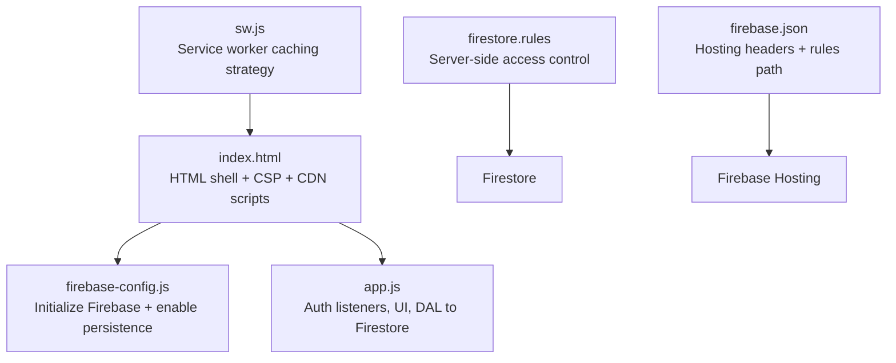
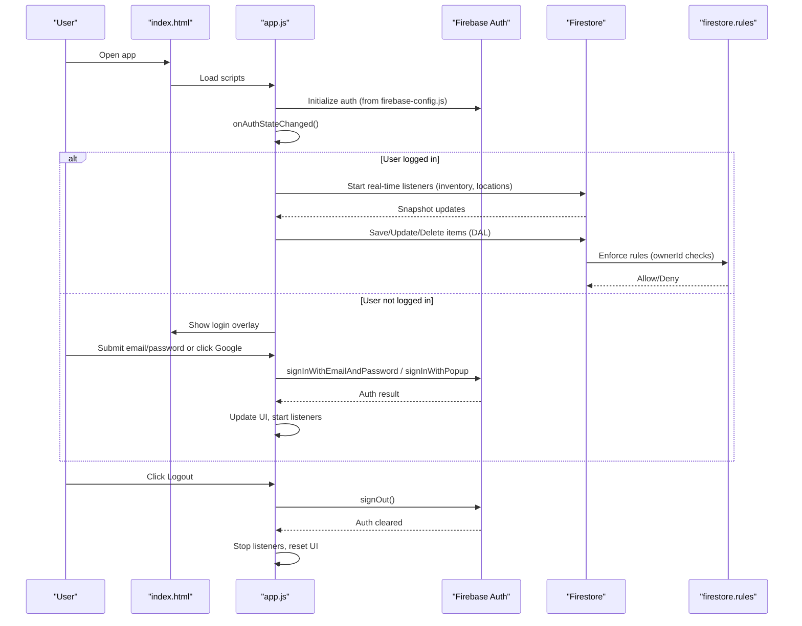
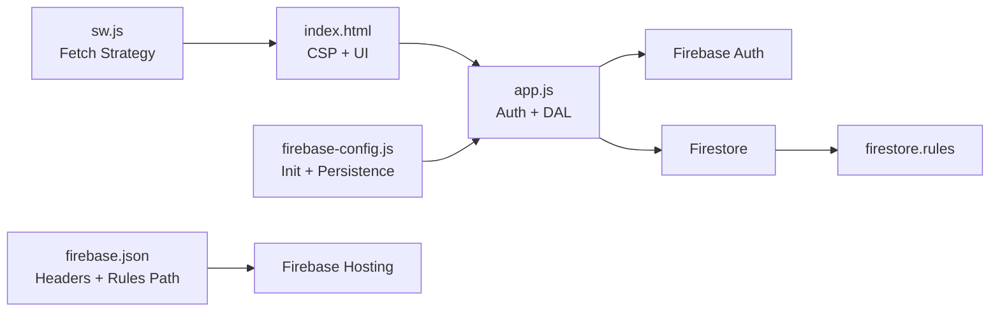

# Authentication and Security

<cite>
**Referenced Files in This Document**
- [index.html](file://index.html)
- [app.js](file://app.js)
- [firebase-config.js](file://firebase-config.js)
- [firestore.rules](file://firestore.rules)
- [firebase.json](file://firebase.json)
- [sw.js](file://sw.js)
</cite>

## Table of Contents
1. [Introduction](#introduction)
2. [Project Structure](#project-structure)
3. [Core Components](#core-components)
4. [Architecture Overview](#architecture-overview)
5. [Detailed Component Analysis](#detailed-component-analysis)
6. [Dependency Analysis](#dependency-analysis)
7. [Performance Considerations](#performance-considerations)
8. [Troubleshooting Guide](#troubleshooting-guide)
9. [Conclusion](#conclusion)
10. [Appendices](#appendices)

## Introduction
This document explains Shadow Ledger’s authentication and security implementation. It covers Firebase Authentication setup (email/password and Google Sign-In), user session management, permission handling, Firestore security rules for user-based data isolation, authentication state persistence, automatic login handling, logout functionality, and security best practices such as input validation, XSS prevention, and secure data transmission. It also provides guidance for extending authentication methods and addresses common security considerations for inventory management applications.

## Project Structure
The application is a client-side web app that uses Firebase SDKs loaded via CDN and initializes Firebase configuration at runtime. The main entry point loads the HTML shell, then initializes Firebase and the application logic.

**Diagram sources**
- [index.html:19-37](file://index.html#L19-L37)
- [firebase-config.js:14-28](file://firebase-config.js#L14-L28)
- [app.js:204-265](file://app.js#L204-L265)
- [firestore.rules:12-45](file://firestore.rules#L12-L45)
- [firebase.json:17-48](file://firebase.json#L17-L48)
- [sw.js:41-87](file://sw.js#L41-L87)

**Section sources**
- [index.html:19-37](file://index.html#L19-L37)
- [firebase-config.js:14-28](file://firebase-config.js#L14-L28)
- [app.js:204-265](file://app.js#L204-L265)
- [firestore.rules:12-45](file://firestore.rules#L12-L45)
- [firebase.json:17-48](file://firebase.json#L17-L48)
- [sw.js:41-87](file://sw.js#L41-L87)

## Core Components
- Firebase initialization and persistence: Initializes the Firebase app, exposes auth and firestore instances, and enables offline persistence with tab synchronization.
- Authentication flows: Email/password sign-in and Google Sign-In via popup; global auth state listener manages UI and data sync.
- Session management: Automatic login on page load via persisted session; logout clears UI and stops real-time listeners.
- Data permissions: Firestore security rules enforce per-user ownership and restrict operations based on authenticated user IDs.
- Security hardening: Content-Security-Policy, server response headers, and client-side XSS prevention utilities.

**Section sources**
- [firebase-config.js:14-28](file://firebase-config.js#L14-L28)
- [app.js:204-265](file://app.js#L204-L265)
- [app.js:267-305](file://app.js#L267-L305)
- [app.js:1951-1952](file://app.js#L1951-L1952)
- [firestore.rules:12-45](file://firestore.rules#L12-L45)
- [index.html:19-37](file://index.html#L19-L37)
- [firebase.json:17-48](file://firebase.json#L17-L48)

## Architecture Overview
Authentication and data access flow across client and server components:

**Diagram sources**
- [app.js:204-265](file://app.js#L204-L265)
- [app.js:267-305](file://app.js#L267-L305)
- [app.js:1951-1952](file://app.js#L1951-L1952)
- [firestore.rules:12-45](file://firestore.rules#L12-L45)

## Detailed Component Analysis

### Firebase Configuration and Persistence
- Initializes the Firebase app using project credentials.
- Exposes global references to Firestore and Auth used by the application.
- Enables Firestore offline persistence with tab synchronization to improve resilience and UX.

Security implications:
- Credentials are embedded in the client bundle; this is standard for Firebase but requires careful hosting and CSP configuration.
- Offline persistence improves availability but must be paired with strict Firestore rules to prevent unauthorized reads/writes when cached.

**Section sources**
- [firebase-config.js:14-28](file://firebase-config.js#L14-L28)

### Authentication State Management
- Global listener reacts to auth state changes:
  - On login: hides login overlay, shows user info, starts real-time listeners for inventory and locations, and seeds sample data if needed.
  - On logout: stops listeners, resets UI, and clears local state.
- Login form handles email/password submission with friendly error messages and button state management.
- Google Sign-In triggers a popup flow with custom parameters and displays user-friendly errors for common issues.

Session persistence:
- Firebase Auth persists sessions automatically; the onAuthStateChanged callback ensures automatic login handling on reload.

Logout:
- Logout button calls the auth sign-out method, which triggers the same state change handler to clean up UI and listeners.

**Section sources**
- [app.js:204-265](file://app.js#L204-L265)
- [app.js:267-305](file://app.js#L267-L305)
- [app.js:1951-1952](file://app.js#L1951-L1952)
- [app.js:2661-2677](file://app.js#L2661-L2677)

### Permission Handling and Data Isolation
- All writes to inventory include the current user’s ID as ownerId and a server timestamp.
- Firestore rules enforce:
  - Read access only for authenticated users whose uid matches the document’s ownerId.
  - Create requires ownerId to match the requesting user and enforces required fields.
  - Update/delete require the requester to be the owner.
- Transactions collection allows read/create for any authenticated user, but delete is restricted to the creator.

These rules ensure user-based data isolation and prevent cross-user access to inventory data.

**Section sources**
- [app.js:55-70](file://app.js#L55-L70)
- [app.js:82-90](file://app.js#L82-L90)
- [firestore.rules:12-45](file://firestore.rules#L12-L45)

### Input Validation and XSS Prevention
- Client-side numeric inputs use min attributes and type="number" to constrain values.
- A dedicated esc utility escapes text before inserting into DOM, preventing XSS when rendering dynamic content.
- URLs are rendered with rel="noopener noreferrer" to mitigate reverse tabnabbing risks.

Best practices implemented:
- Escape all dynamic text before insertion into innerHTML.
- Use safe link attributes for external URLs.
- Validate numeric fields on both client and server (server enforced via Firestore rules).

**Section sources**
- [app.js:2597-2601](file://app.js#L2597-L2601)
- [index.html:571-576](file://index.html#L571-L576)

### Secure Data Transmission and Headers
- Content-Security-Policy meta tag restricts allowed origins for scripts, styles, fonts, images, and connections to Firebase services.
- Hosting configuration adds security-related HTTP headers:
  - X-Content-Type-Options: nosniff
  - Referrer-Policy: strict-origin-when-cross-origin
- Service worker avoids caching sensitive network requests to Firebase endpoints, ensuring live auth and data integrity.

**Section sources**
- [index.html:19-37](file://index.html#L19-L37)
- [firebase.json:17-48](file://firebase.json#L17-L48)
- [sw.js:41-87](file://sw.js#L41-L87)

### Error Handling and User Feedback
- Auth errors map to user-friendly messages for common cases (e.g., invalid email, wrong password, too many requests).
- Firestore write errors handle permission-denied and unavailable states with clear toast notifications.
- Custom confirm dialog replaces native confirm to provide consistent UX and avoid blocking dialogs.

**Section sources**
- [app.js:267-294](file://app.js#L267-L294)
- [app.js:55-70](file://app.js#L55-L70)
- [app.js:2618-2659](file://app.js#L2618-L2659)

## Dependency Analysis
The following diagram maps key dependencies between authentication, data access, and security configurations:

**Diagram sources**
- [index.html:19-37](file://index.html#L19-L37)
- [app.js:204-265](file://app.js#L204-L265)
- [firebase-config.js:14-28](file://firebase-config.js#L14-L28)
- [firestore.rules:12-45](file://firestore.rules#L12-L45)
- [firebase.json:17-48](file://firebase.json#L17-L48)
- [sw.js:41-87](file://sw.js#L41-L87)

**Section sources**
- [index.html:19-37](file://index.html#L19-L37)
- [app.js:204-265](file://app.js#L204-L265)
- [firebase-config.js:14-28](file://firebase-config.js#L14-L28)
- [firestore.rules:12-45](file://firestore.rules#L12-L45)
- [firebase.json:17-48](file://firebase.json#L17-L48)
- [sw.js:41-87](file://sw.js#L41-L87)

## Performance Considerations
- Real-time listeners are started only after successful authentication and stopped on logout to reduce unnecessary network traffic.
- Firestore offline persistence reduces latency and improves resilience during brief connectivity loss.
- Service worker caches app shell assets while bypassing Firebase endpoints to maintain fresh auth tokens and data.

[No sources needed since this section provides general guidance]

## Troubleshooting Guide
Common issues and resolutions:
- Popup blocked for Google Sign-In: Ensure popups are allowed for the site domain.
- Unauthorized domain: Add the hosting domain to Firebase Console → Auth → Settings → Authorized domains.
- Operation not allowed: Enable Google Sign-In in Firebase Console → Auth → Sign-in method.
- Permission denied: Verify Firestore rules and that each item has an ownerId matching the signed-in user.
- Unavailable: Check internet connection and Firebase service status.

**Section sources**
- [app.js:2661-2677](file://app.js#L2661-L2677)
- [app.js:55-70](file://app.js#L55-L70)

## Conclusion
Shadow Ledger implements a robust authentication and security model using Firebase Authentication and Firestore security rules. User-based data isolation is enforced server-side, while client-side measures like CSP, secure headers, and XSS prevention further harden the application. The design supports automatic login, graceful logout, and resilient operation through offline persistence and a carefully tuned service worker. Extending authentication methods can follow the existing patterns established for Google Sign-In.

[No sources needed since this section summarizes without analyzing specific files]

## Appendices

### Extending Authentication Methods
To add additional providers (e.g., Apple, Microsoft):
- Configure the provider in Firebase Console.
- Implement a similar popup flow as Google Sign-In, mapping error codes to user-friendly messages.
- Ensure the same onAuthStateChanged handler applies to all providers.

[No sources needed since this section provides general guidance]

### Security Best Practices Checklist
- Keep Firestore rules minimal and explicit; default deny with allow only necessary paths.
- Always set ownerId on create and validate it on update/delete.
- Use CSP to restrict script and connection origins.
- Apply server headers (nosniff, referrer policy).
- Escape all dynamic content before DOM insertion.
- Avoid caching sensitive endpoints in the service worker.
- Provide clear error messages and logging for debugging.

[No sources needed since this section provides general guidance]