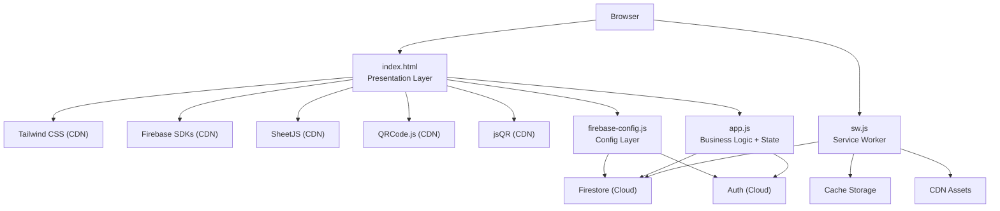
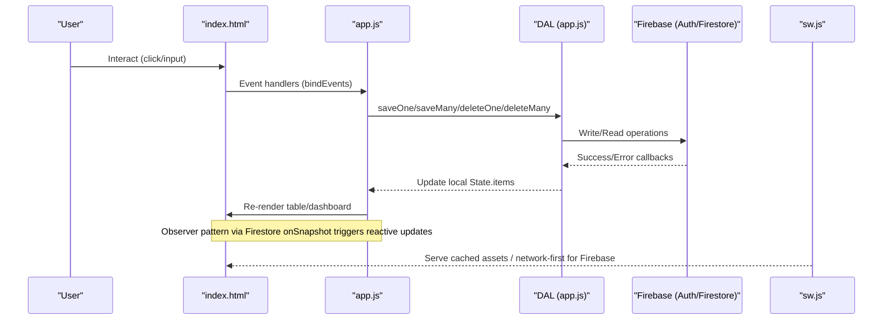
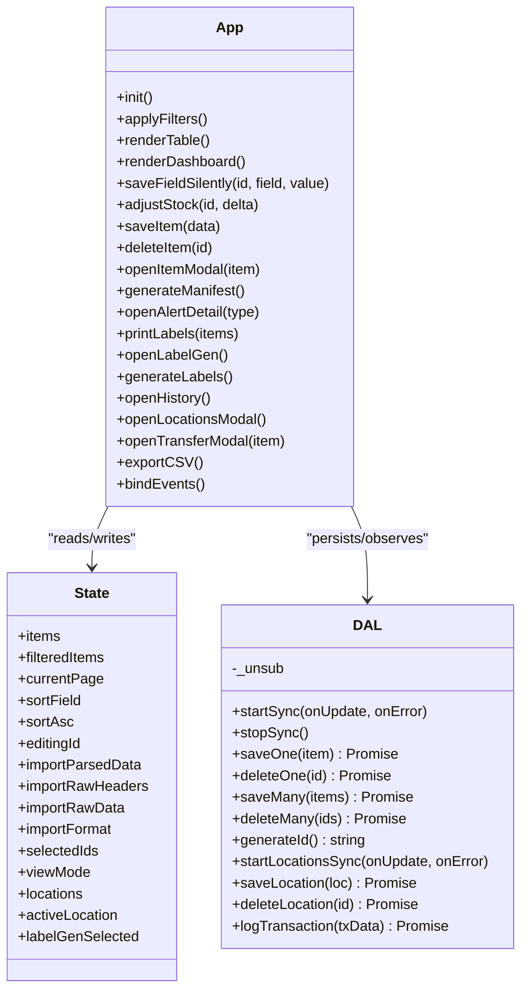
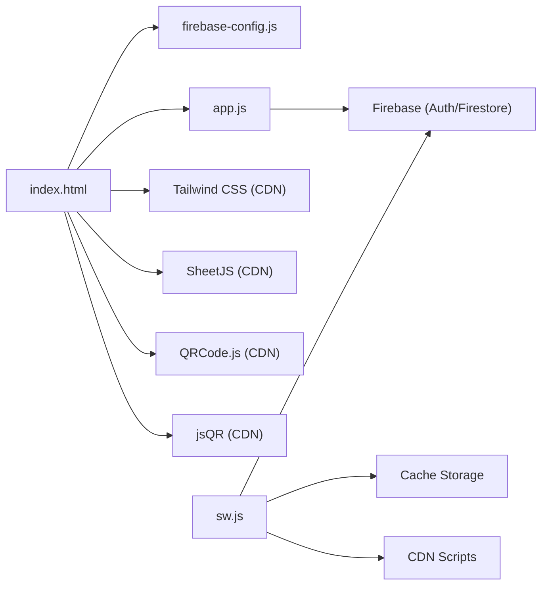

# Core Architecture

<cite>
**Referenced Files in This Document**
- [index.html](file://index.html)
- [app.js](file://app.js)
- [firebase-config.js](file://firebase-config.js)
- [manifest.json](file://manifest.json)
- [sw.js](file://sw.js)
- [README.md](file://README.md)
</cite>

## Table of Contents
1. [Introduction](#introduction)
2. [Project Structure](#project-structure)
3. [Core Components](#core-components)
4. [Architecture Overview](#architecture-overview)
5. [Detailed Component Analysis](#detailed-component-analysis)
6. [Dependency Analysis](#dependency-analysis)
7. [Performance Considerations](#performance-considerations)
8. [Troubleshooting Guide](#troubleshooting-guide)
9. [Conclusion](#conclusion)
10. [Appendices](#appendices)

## Introduction
Shadow Ledger is a modular single-page application for inventory tracking across two primary locations: Main Depot and Company Building. It emphasizes a clean separation between presentation (HTML templates), business logic (state management and UI orchestration in app.js), data access (Firebase abstraction via DAL), and configuration (Firebase initialization, PWA manifest, service worker). The system uses vanilla JavaScript to avoid framework overhead, Firebase for real-time synchronization with offline persistence, and Tailwind CSS for styling. External libraries are integrated for spreadsheet import/export (SheetJS), QR code generation (QRCode.js), and camera-based QR decoding (jsQR).

The core business rules include computing depot stock as the difference between total stock and building stock, triggering carrier alerts when building stock falls below a threshold, and procurement alerts when total stock drops below a reorder trigger.

**Section sources**
- [README.md:1-32](file://README.md#L1-L32)

## Project Structure
At runtime, the browser loads index.html which includes Tailwind CSS, Firebase SDKs, SheetJS, QRCode.js, and jsQR from CDNs. The application initializes firebase-config.js to bootstrap Firebase services and then runs app.js to mount the UI, bind events, and manage state. A service worker sw.js caches the app shell and CDN assets while ensuring live network access for Firebase endpoints. The manifest.json configures PWA behavior and shortcuts.

**Diagram sources**
- [index.html:45-92](file://index.html#L45-L92)
- [firebase-config.js:14-28](file://firebase-config.js#L14-L28)
- [sw.js:41-87](file://sw.js#L41-L87)
- [app.js:32-132](file://app.js#L32-L132)

**Section sources**
- [index.html:1-1220](file://index.html#L1-L1220)
- [firebase-config.js:1-29](file://firebase-config.js#L1-L29)
- [sw.js:1-88](file://sw.js#L1-L88)
- [manifest.json:1-50](file://manifest.json#L1-L50)

## Core Components
- Presentation Layer (index.html): Defines the DOM structure, modals, dashboard cards, table, filters, and print containers. Uses Tailwind utility classes and custom styles for responsive design and dark mode.
- Business Logic Layer (app.js): Encapsulates application state, event handling, filtering/sorting, rendering, import/export flows, label generation, scan-out workflow, transfer modal, transaction history, and location management. Implements an observer pattern by subscribing to Firestore snapshots and updating the UI reactively.
- Data Access Layer (DAL in app.js): Abstracts Firestore operations including real-time listeners, batch writes/deletes, and transaction logging. Provides helper methods for ID generation and location CRUD.
- Configuration Layer (firebase-config.js): Initializes Firebase app, exposes db and auth globals, and enables offline persistence with tab synchronization.
- Service Worker (sw.js): Caches app shell and CDN scripts; ensures network-first for Firebase endpoints; provides offline fallback for navigation.
- PWA Manifest (manifest.json): Configures app metadata, icons, shortcuts, and display modes.

Key technical decisions:
- Vanilla JavaScript over frameworks: Reduces bundle size, simplifies deployment, and allows direct DOM manipulation for performance-critical updates.
- Firebase backend: Real-time sync via onSnapshot, robust offline persistence, and scalable cloud storage without server maintenance.
- Tailwind CSS: Utility-first styling reduces custom CSS complexity and supports rapid iteration and consistent theming.

**Section sources**
- [index.html:94-304](file://index.html#L94-L304)
- [app.js:14-31](file://app.js#L14-L31)
- [app.js:32-132](file://app.js#L32-L132)
- [firebase-config.js:14-28](file://firebase-config.js#L14-L28)
- [sw.js:16-39](file://sw.js#L16-L39)
- [manifest.json:1-50](file://manifest.json#L1-L50)

## Architecture Overview
The application follows a layered architecture:
- Presentation: HTML templates render views based on state.
- Business Logic: Centralized state object and functions compute derived values, handle user interactions, and orchestrate data flow.
- Data Access: DAL encapsulates all Firestore calls and observers.
- Configuration: Firebase initialization and persistence settings.
- Offline & PWA: Service worker caches assets and manages fetch strategies.

**Diagram sources**
- [app.js:200-316](file://app.js#L200-L316)
- [app.js:32-132](file://app.js#L32-L132)
- [firebase-config.js:14-28](file://firebase-config.js#L14-L28)
- [sw.js:41-87](file://sw.js#L41-L87)

## Detailed Component Analysis

### Presentation Layer (index.html)
- Dashboard cards summarize inventory overview, carrier alerts, and procurement alerts.
- Search/filter bar supports SKU/name/category search, alert filtering, stock filters, and quick actions (Manifest, Scan Out, History, Locations).
- Inventory table renders sortable columns, inline editable fields, status badges, and action buttons per row.
- Modals provide Add/Edit Item, Import wizard, Carrier Manifest, Alert Details, Label Generator, Scan Out, Transaction History, Locations Manager, and Transfer Stock.
- Print container and CSS media queries support label printing and manifest printing.

Integration points:
- Tailwind CSS via CDN for styling and dark mode toggling.
- External libraries loaded via script tags: SheetJS for Excel import, QRCode.js for QR generation, jsQR for camera decoding.
- Firebase SDKs loaded before app.js to expose global db and auth.

**Section sources**
- [index.html:369-540](file://index.html#L369-L540)
- [index.html:543-854](file://index.html#L543-L854)
- [index.html:818-1220](file://index.html#L818-L1220)
- [index.html:45-92](file://index.html#L45-L92)

### Business Logic Layer (app.js)
State Management:
- Central State object holds items, filteredItems, pagination, sorting, editing context, import buffers, selection sets, viewMode, locations, activeLocation, and label generator selections.

Data Access Layer (DAL):
- startSync/onSnapshot subscribes to inventory collection and maps documents to State.items.
- saveOne/saveMany and deleteOne/deleteMany perform Firestore writes/deletes with error handling and toast notifications.
- Location CRUD: startLocationsSync, saveLocation, deleteLocation.
- Transaction logging: logTransaction adds audit entries with user info and timestamps.

Observer Pattern:
- Firestore onSnapshot drives reactive UI updates: whenever remote data changes, State.items is updated and UI re-renders accordingly.

Rendering and Interaction:
- applyFilters computes filtered/sorted results and updates pagination.
- renderTable builds rows with inline inputs, status badges, and action buttons.
- saveFieldSilently performs targeted field updates without full re-render, preserving focus and cursor.
- adjustStock increments/decrements building stock and persists changes.
- Modal workflows: openItemModal, generateManifest, openAlertDetail, openLabelGen, openTransferModal, openHistory.

Import/Export:
- Multi-format import (CSV, TSV, JSON, Excel) with column mapping UI and preview.
- CSV export serializes current State.items into downloadable file.

Scan-Out Workflow:
- Camera-based QR scanning using jsQR, manual SKU entry fallback, quantity confirmation, decrement building stock, persist change, log transaction, refresh UI.

Label Generation:
- Live preview and print of shelf labels with optional logo, customizable sizes, QR codes (SKU or datasheet URL), and bulk selection via searchable multi-select.

Event Binding:
- Comprehensive bindEvents function wires keyboard shortcuts, barcode scanner input buffering, Enter key navigation, and bulk actions.

**Section sources**
- [app.js:14-31](file://app.js#L14-L31)
- [app.js:32-132](file://app.js#L32-L132)
- [app.js:452-494](file://app.js#L452-L494)
- [app.js:499-617](file://app.js#L499-L617)
- [app.js:699-806](file://app.js#L699-L806)
- [app.js:808-871](file://app.js#L808-L871)
- [app.js:896-1002](file://app.js#L896-L1002)
- [app.js:1004-1073](file://app.js#L1004-L1073)
- [app.js:1079-1258](file://app.js#L1079-L1258)
- [app.js:1264-1434](file://app.js#L1264-L1434)
- [app.js:1440-1476](file://app.js#L1440-L1476)
- [app.js:1482-1545](file://app.js#L1482-L1545)
- [app.js:1551-1863](file://app.js#L1551-L1863)
- [app.js:1868-2699](file://app.js#L1868-L2699)

#### Class-like Structures and Relationships

**Diagram sources**
- [app.js:14-31](file://app.js#L14-L31)
- [app.js:32-132](file://app.js#L32-L132)
- [app.js:452-494](file://app.js#L452-L494)
- [app.js:499-617](file://app.js#L499-L617)
- [app.js:699-806](file://app.js#L699-L806)
- [app.js:808-871](file://app.js#L808-L871)
- [app.js:896-1002](file://app.js#L896-L1002)
- [app.js:1004-1073](file://app.js#L1004-L1073)
- [app.js:1079-1258](file://app.js#L1079-L1258)
- [app.js:1264-1434](file://app.js#L1264-L1434)
- [app.js:1440-1476](file://app.js#L1440-L1476)
- [app.js:1482-1545](file://app.js#L1482-L1545)
- [app.js:1551-1863](file://app.js#L1551-L1863)
- [app.js:1868-2699](file://app.js#L1868-L2699)

### Data Access Layer (DAL)
- Real-time listener: starts/stops onAuthStateChanged to ensure subscriptions align with user sessions.
- Batch operations: efficient writes/deletes for import replace and bulk actions.
- Error handling: permission-denied and unavailable errors surfaced via toast messages.
- Location management: seeded default locations and dynamic add/delete.
- Transaction logging: records user-driven stock movements for auditability.

**Section sources**
- [app.js:32-132](file://app.js#L32-L132)
- [app.js:200-316](file://app.js#L200-L316)

### Configuration Layer (firebase-config.js)
- Initializes Firebase app with project credentials.
- Exposes db and auth globals consumed by app.js.
- Enables Firestore offline persistence with synchronizeTabs to allow multi-tab consistency.

**Section sources**
- [firebase-config.js:14-28](file://firebase-config.js#L14-L28)

### Service Worker and PWA (sw.js, manifest.json)
- Install/activate lifecycle caches app shell and CDN assets.
- Fetch strategy: cache-first for app resources, stale-while-revalidate for CDN, network-only for Firebase endpoints.
- Offline fallback returns index.html for navigation requests.
- Manifest defines app name, icons, shortcuts, and standalone display.

**Section sources**
- [sw.js:16-39](file://sw.js#L16-L39)
- [sw.js:41-87](file://sw.js#L41-L87)
- [manifest.json:1-50](file://manifest.json#L1-L50)

## Dependency Analysis
External library integrations:
- Tailwind CSS: Styling engine loaded via CDN; configured for dark mode and custom theme extensions.
- Firebase SDKs: Authentication and Firestore used for real-time sync and persistence.
- SheetJS: Excel import parsing.
- QRCode.js: Generates QR codes for labels and manifests.
- jsQR: Decodes QR codes from camera stream.

Internal dependencies:
- index.html depends on firebase-config.js and app.js.
- app.js depends on Firebase globals (db, auth) exposed by firebase-config.js.
- sw.js serves static assets and intercepts fetches for caching strategies.

Potential circular dependencies: None observed. All modules load in a clear order: config first, then app logic.

Scalability considerations:
- Stateless UI driven by centralized State and DAL abstractions facilitates future migration to alternative backends.
- Batch operations reduce network round-trips during bulk imports and deletions.
- Pagination limits DOM nodes for large datasets.
- Debounced input handling minimizes excessive saves.

**Diagram sources**
- [index.html:45-92](file://index.html#L45-L92)
- [firebase-config.js:14-28](file://firebase-config.js#L14-L28)
- [app.js:32-132](file://app.js#L32-L132)
- [sw.js:41-87](file://sw.js#L41-L87)

**Section sources**
- [index.html:45-92](file://index.html#L45-L92)
- [app.js:32-132](file://app.js#L32-L132)
- [sw.js:41-87](file://sw.js#L41-L87)

## Performance Considerations
- Debounced input saves prevent excessive Firestore writes during typing.
- Targeted row updates preserve focus and minimize reflows.
- Pagination reduces DOM node count for large inventories.
- Service worker caches app shell and CDN assets for faster subsequent loads.
- Batch writes improve throughput for import replace and bulk operations.
- Offline persistence ensures responsiveness even with intermittent connectivity.

[No sources needed since this section provides general guidance]

## Troubleshooting Guide
Common issues and resolutions:
- Permission denied errors: Check Firestore security rules and ensure authenticated user has read/write access.
- Firebase unavailable: Verify internet connection and that Firebase services are reachable.
- Multiple tabs persistence warning: Firestore persistence may fail if multiple tabs are open; app handles gracefully but consider single-tab usage for strict consistency.
- Google sign-in domain not authorized: Add your domain to Firebase Console → Auth → Settings → Authorized domains.
- Popup blocked: Allow popups for the site to enable Google sign-in.

Operational tips:
- Use toast messages to confirm success or highlight errors.
- For import failures, validate headers and mappings; use preview to inspect parsed data.
- For scan-out issues, ensure camera permissions and try manual SKU entry fallback.

**Section sources**
- [app.js:200-316](file://app.js#L200-L316)
- [app.js:2661-2677](file://app.js#L2661-L2677)
- [firebase-config.js:21-28](file://firebase-config.js#L21-L28)

## Conclusion
Shadow Ledger’s architecture cleanly separates concerns across presentation, business logic, data access, and configuration layers. The observer pattern powered by Firestore onSnapshot delivers real-time updates, while the DAL abstracts persistence details for future scalability. Vanilla JavaScript, Firebase, and Tailwind CSS form a pragmatic stack optimized for simplicity, performance, and maintainability. Integrations with SheetJS, QRCode.js, and jsQR extend functionality for import/export and QR workflows. The service worker and PWA manifest enhance reliability and offline capabilities.

[No sources needed since this section summarizes without analyzing specific files]

## Appendices

### System Boundaries
- Internal boundaries:
  - Presentation: index.html DOM and Tailwind styles.
  - Business Logic: app.js state and functions.
  - Data Access: DAL methods interacting with Firebase.
  - Configuration: firebase-config.js initialization.
- External boundaries:
  - Firebase Cloud (Auth/Firestore).
  - CDNs (Tailwind, Firebase SDKs, SheetJS, QRCode.js, jsQR).
  - Browser APIs (MediaDevices for camera, Clipboard API, Service Worker).

**Section sources**
- [index.html:45-92](file://index.html#L45-L92)
- [app.js:32-132](file://app.js#L32-L132)
- [firebase-config.js:14-28](file://firebase-config.js#L14-L28)

### Integration Patterns
- Observer pattern: Firestore onSnapshot callbacks update State and trigger UI re-renders.
- Event delegation: Table body listens for input/change/click events to handle inline edits and actions efficiently.
- Promise-based flows: Save operations return promises to surface errors and guide user feedback.
- Offline-first: Service worker caches assets and defers Firebase requests to network.

**Section sources**
- [app.js:200-316](file://app.js#L200-L316)
- [app.js:1868-2699](file://app.js#L1868-L2699)
- [sw.js:41-87](file://sw.js#L41-L87)