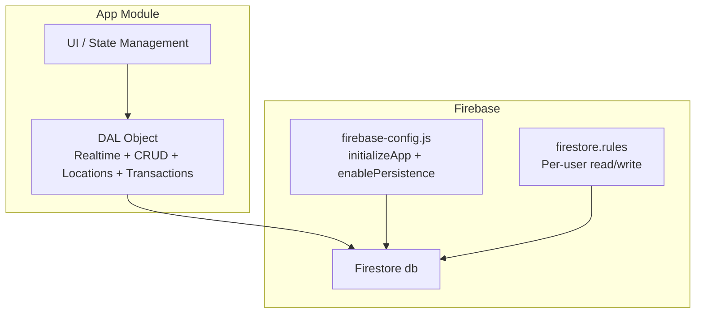
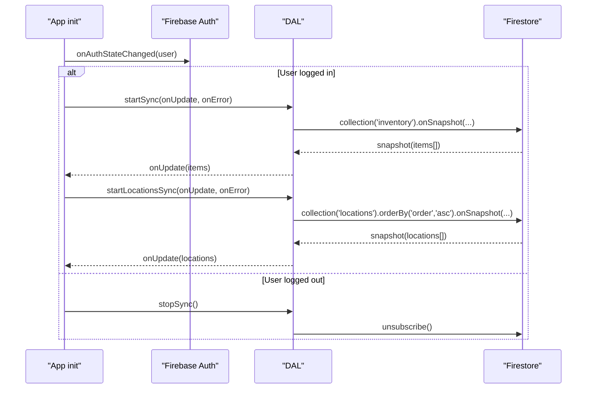
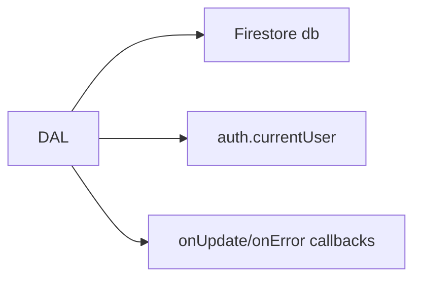
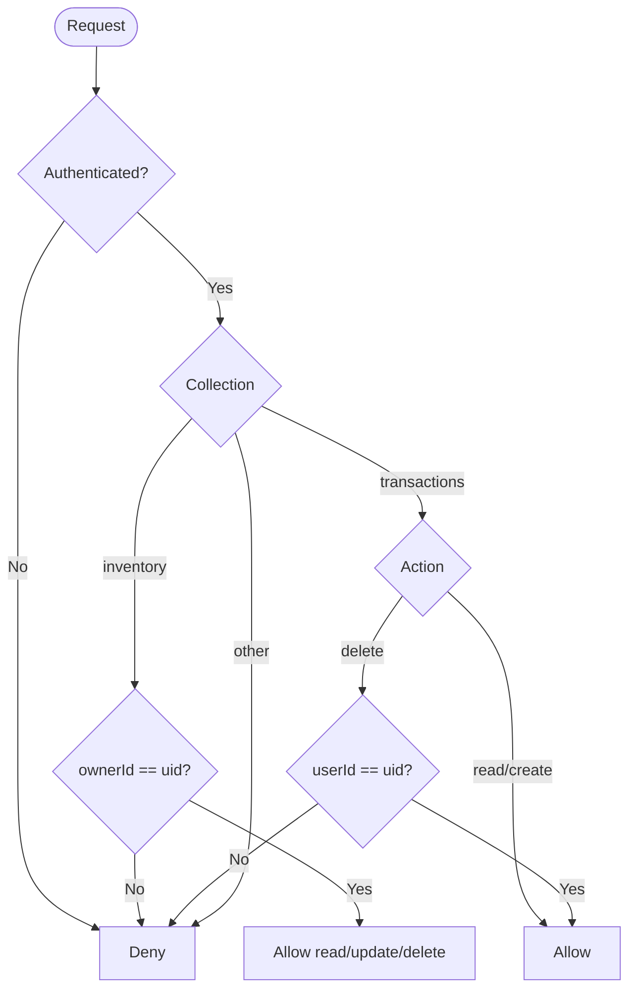

# Data Access Layer (DAL)

<cite>
**Referenced Files in This Document**
- [app.js](file://app.js)
- [firebase-config.js](file://firebase-config.js)
- [firestore.rules](file://firestore.rules)
</cite>

## Table of Contents
1. [Introduction](#introduction)
2. [Project Structure](#project-structure)
3. [Core Components](#core-components)
4. [Architecture Overview](#architecture-overview)
5. [Detailed Component Analysis](#detailed-component-analysis)
6. [Dependency Analysis](#dependency-analysis)
7. [Performance Considerations](#performance-considerations)
8. [Troubleshooting Guide](#troubleshooting-guide)
9. [Conclusion](#conclusion)
10. [Appendices](#appendices)

## Introduction
This document explains the Data Access Layer (DAL) abstraction that provides a clean interface to Firebase Firestore for inventory and location management. It covers real-time synchronization using onSnapshot, write operations via saveOne/saveMany, deletions via deleteOne/deleteMany, location management helpers, transaction logging, error handling strategies, batch optimization, migration helpers for schema evolution, and security considerations enforced by Firestore rules.

## Project Structure
The DAL is implemented as an object within the application module and interacts with Firestore through a globally initialized database instance. Security rules define per-user access control for inventory and transactions.

**Diagram sources**
- [app.js:32-132](file://app.js#L32-L132)
- [firebase-config.js:14-28](file://firebase-config.js#L14-L28)
- [firestore.rules:12-45](file://firestore.rules#L12-L45)

**Section sources**
- [app.js:32-132](file://app.js#L32-L132)
- [firebase-config.js:14-28](file://firebase-config.js#L14-L28)
- [firestore.rules:12-45](file://firestore.rules#L12-L45)

## Core Components
The DAL exposes a cohesive API for:
- Real-time listeners: startSync, stopSync, startLocationsSync
- Writes: saveOne, saveMany
- Deletions: deleteOne, deleteMany
- IDs: generateId
- Locations: startLocationsSync, saveLocation, deleteLocation
- Audit: logTransaction

Key responsibilities:
- Normalize writes with ownerId and serverTimestamp
- Provide user-friendly error feedback and rethrow errors
- Batch operations for efficiency
- Maintain real-time state via onSnapshot callbacks

**Section sources**
- [app.js:32-132](file://app.js#L32-L132)

## Architecture Overview
The DAL encapsulates all Firestore interactions behind a simple interface. The app initializes Firebase, enables offline persistence, and starts real-time listeners upon authentication.

**Diagram sources**
- [app.js:204-265](file://app.js#L204-L265)
- [app.js:32-52](file://app.js#L32-L52)
- [app.js:104-111](file://app.js#L104-L111)
- [firebase-config.js:14-28](file://firebase-config.js#L14-L28)

## Detailed Component Analysis

### Real-time Synchronization (Observer Pattern)
- startSync(collection='inventory')
  - Subscribes to changes; transforms snapshots into plain objects including id
  - Calls provided onUpdate(items) with each change
  - Catches errors and forwards them to onError(err)
- stopSync()
  - Unsubscribes from previous listener if present
- startLocationsSync(collection='locations', orderBy order asc)
  - Similar pattern for locations; updates UI state accordingly

Implementation notes:
- Uses onSnapshot for live updates
- Normalizes documents to { id, ...data }
- Centralized error forwarding to UI layer

**Section sources**
- [app.js:36-52](file://app.js#L36-L52)
- [app.js:104-111](file://app.js#L104-L111)

### Write Operations
- saveOne(item)
  - Extracts id, merges rest with ownerId and updatedAt server timestamp
  - Performs set with merge option to avoid overwriting unrelated fields
  - Returns Promise; catches permission-denied/unavailable and shows toast before rethrowing
- saveMany(items)
  - Builds a batch and sets each item with merge
  - Commits once for atomicity and reduced network overhead

Error handling:
- Permission denied: informs user to check database rules
- Unavailable: prompts to check connection
- Other errors: displays message derived from err.message or err.code

**Section sources**
- [app.js:54-90](file://app.js#L54-L90)

### Delete Operations
- deleteOne(id)
  - Deletes a single document; logs non-permission errors
  - Rethrows error for caller handling
- deleteMany(ids)
  - Batches deletes for performance

**Section sources**
- [app.js:72-97](file://app.js#L72-L97)

### ID Generation
- generateId()
  - Produces short unique ids prefixed with sl_

**Section sources**
- [app.js:99-101](file://app.js#L99-L101)

### Location Management
- startLocationsSync(onUpdate, onError)
  - Real-time subscription to locations ordered by order field
- saveLocation(loc)
  - If loc has id: set with merge
  - Else add new location with order set to Date.now()
- deleteLocation(id)
  - Deletes a location document

Usage patterns:
- Seeding default locations when none exist
- Populating filter dropdowns based on current locations

**Section sources**
- [app.js:104-121](file://app.js#L104-L121)
- [app.js:377-380](file://app.js#L377-L380)
- [app.js:383-402](file://app.js#L383-L402)

### Transaction Logging
- logTransaction(txData)
  - Adds a transaction record with user info and server timestamp
  - Silently warns on failure without blocking flow

Additional direct usage:
- Scan-out flow writes a transaction directly to transactions collection after updating stock

**Section sources**
- [app.js:124-131](file://app.js#L124-L131)
- [app.js:1390-1402](file://app.js#L1390-L1402)

### Migration Helpers and Schema Evolution
- migrateItemLocations(item)
  - Converts legacy items (totalStock/buildingStock only) to a locationStock map
  - Derives buildingStock and totalStock for backward compatibility
- locStock(item, locId)
  - Reads stock at a specific location safely
- totalStockFromLocs(item)
  - Computes sum across all locations

Seeding:
- seedDefaultLocations() creates core locations if none exist

These helpers ensure smooth schema evolution without breaking existing data.

**Section sources**
- [app.js:344-368](file://app.js#L344-L368)
- [app.js:377-380](file://app.js#L377-L380)

### Example Workflows

#### CRUD Operations
- Create/Update item: build item object, call DAL.saveOne(item)
- Delete item: call DAL.deleteOne(id)
- Bulk import: prepare array of items, call DAL.saveMany(items)
- Bulk archive/restore: update local state flags, then call DAL.saveMany(array)
- Bulk delete: collect ids, call DAL.deleteMany(ids)

**Section sources**
- [app.js:824-854](file://app.js#L824-L854)
- [app.js:856-871](file://app.js#L856-L871)
- [app.js:1780-1826](file://app.js#L1780-L1826)
- [app.js:1901-1949](file://app.js#L1901-L1949)

#### Real-time Subscription Setup
- On auth success:
  - DAL.startSync(onUpdateItems, onError)
  - DAL.startLocationsSync(onUpdateLocations, onError)
- On auth failure:
  - DAL.stopSync()

**Section sources**
- [app.js:204-265](file://app.js#L204-L265)

#### Transfer Between Locations
- Update locationStock map for source and destination
- Persist via DAL.saveOne(item)
- Log movement via DAL.logTransaction({ type: 'transfer', ... })

**Section sources**
- [app.js:2400-2430](file://app.js#L2400-L2430)

#### Scan Out Flow
- Decrement building stock
- Persist via DAL.saveOne(item)
- Directly add a transaction record to transactions collection

**Section sources**
- [app.js:1367-1420](file://app.js#L1367-L1420)

## Dependency Analysis
The DAL depends on:
- Global Firestore db instance
- Firebase Auth currentUser for ownership and audit metadata
- Application UI callbacks for real-time updates and error display

**Diagram sources**
- [app.js:32-132](file://app.js#L32-L132)
- [firebase-config.js:17-18](file://firebase-config.js#L17-L18)

**Section sources**
- [app.js:32-132](file://app.js#L32-L132)
- [firebase-config.js:17-18](file://firebase-config.js#L17-L18)

## Performance Considerations
- Batch writes: saveMany and deleteMany reduce round trips and improve consistency
- Server timestamps: FieldValue.serverTimestamp ensures consistent time values
- Offline persistence: enabled to keep app responsive during brief connectivity loss
- Real-time subscriptions: onSnapshot minimizes polling and keeps UI in sync efficiently
- Merge writes: set(..., { merge: true }) avoids overwriting unrelated fields and reduces payload size

[No sources needed since this section provides general guidance]

## Troubleshooting Guide
Common issues and resolutions:
- Permission denied
  - Cause: Firestore rules deny access
  - Action: Verify rules and ensure ownerId matches current user
  - UI: Toast displayed; detailed messages shown for inventory and sync errors
- Firebase unavailable
  - Cause: Network or service issue
  - Action: Check internet connection and retry
  - UI: Toast displayed
- Multiple tabs persistence warning
  - Cause: Browser limitation with multiple open tabs
  - Action: Accept fallback behavior or close other tabs
- History load failures
  - Cause: Missing permissions for transactions collection
  - Action: Ensure authenticated users can read transactions

Operational tips:
- Always handle Promise rejections from DAL methods
- Use onError callback to surface user-facing messages
- For bulk operations, validate inputs before batching

**Section sources**
- [app.js:54-90](file://app.js#L54-L90)
- [app.js:229-239](file://app.js#L229-L239)
- [app.js:1440-1476](file://app.js#L1440-L1476)
- [firebase-config.js:21-28](file://firebase-config.js#L21-L28)

## Conclusion
The DAL provides a focused, secure, and efficient interface to Firestore. It centralizes real-time synchronization, write/delete operations, location management, and transaction logging while enforcing per-user security via Firestore rules. Its design supports schema evolution through migration helpers and offers robust error handling and performance optimizations suitable for production use.

[No sources needed since this section summarizes without analyzing specific files]

## Appendices

### Security and Permissions
- Inventory collection
  - Read: requires authenticated user and matching ownerId
  - Create: requires authenticated user, matching ownerId, and required fields
  - Update/Delete: requires authenticated user and matching ownerId
- Transactions collection
  - Read: any authenticated user
  - Create: any authenticated user
  - Delete: only the creator (userId matches request.auth.uid)
- Catch-all denies all other collections

**Diagram sources**
- [firestore.rules:16-29](file://firestore.rules#L16-L29)
- [firestore.rules:33-38](file://firestore.rules#L33-L38)
- [firestore.rules:41-43](file://firestore.rules#L41-L43)

**Section sources**
- [firestore.rules:12-45](file://firestore.rules#L12-L45)