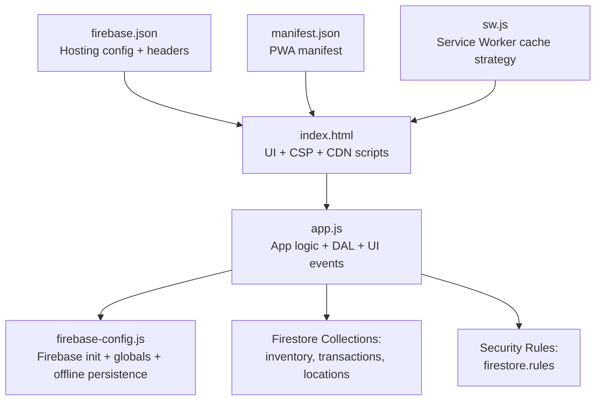
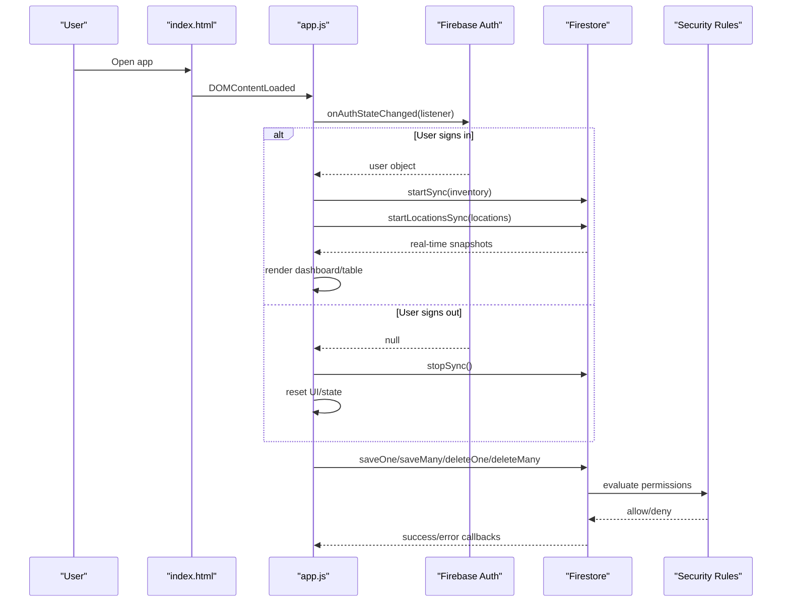
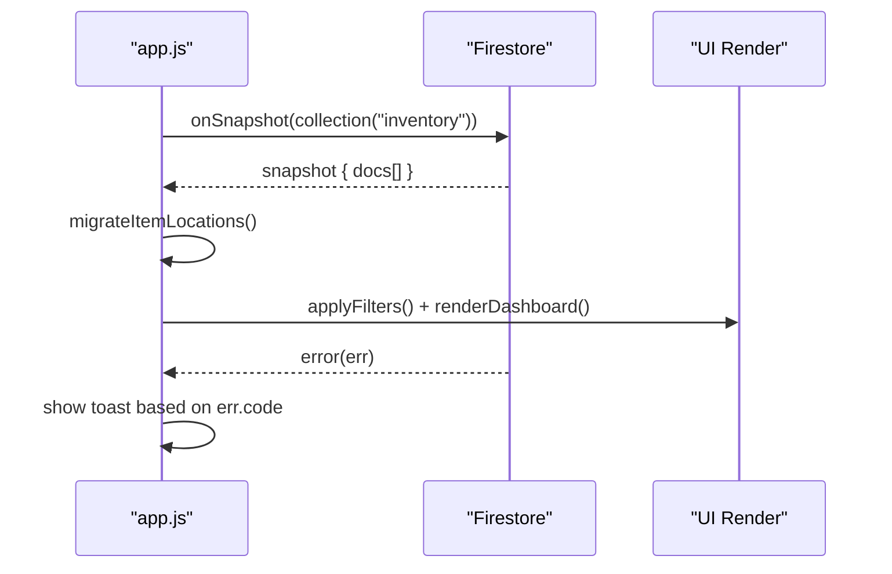
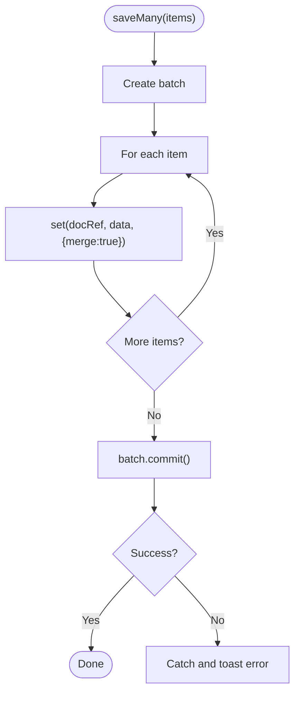
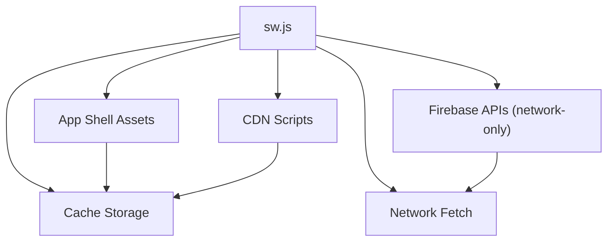
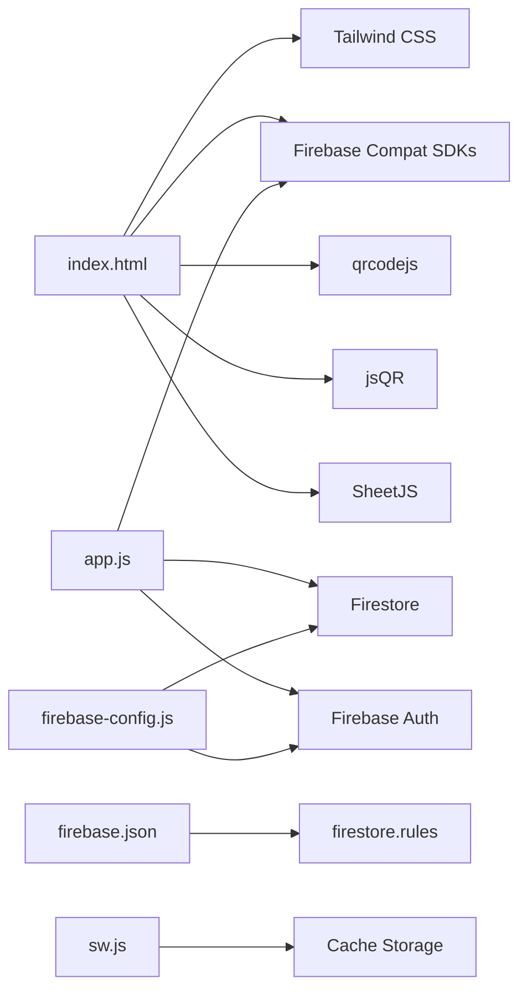

# Firebase Integration Layer

<cite>
**Referenced Files in This Document**
- [README.md](file://README.md)
- [index.html](file://index.html)
- [app.js](file://app.js)
- [firebase-config.js](file://firebase-config.js)
- [firestore.rules](file://firestore.rules)
- [firebase.json](file://firebase.json)
- [manifest.json](file://manifest.json)
- [sw.js](file://sw.js)
</cite>

## Table of Contents
1. [Introduction](#introduction)
2. [Project Structure](#project-structure)
3. [Core Components](#core-components)
4. [Architecture Overview](#architecture-overview)
5. [Detailed Component Analysis](#detailed-component-analysis)
6. [Dependency Analysis](#dependency-analysis)
7. [Performance Considerations](#performance-considerations)
8. [Troubleshooting Guide](#troubleshooting-guide)
9. [Conclusion](#conclusion)
10. [Appendices](#appendices)

## Introduction
This document describes the Firebase integration layer for a lightweight inventory tracking web application. It covers:
- Firebase initialization and configuration
- Authentication state management with onAuthStateChanged listeners and session persistence
- Firestore database schema, collections, and real-time synchronization patterns
- Security rules enforcing user-based data isolation and permission controls
- Examples of authentication flows, database queries, batch operations, and error handling strategies
- Offline capabilities, data caching, and performance optimization techniques for mobile environments

The app is designed to track stock across two primary locations (Main Depot and Company Building), support carrier and procurement alerts, and provide import/export, label generation, and transaction history features.

## Project Structure
At a high level, the project consists of:
- Frontend entry point and UI markup
- Application logic integrating Firebase Auth and Firestore
- Firebase configuration and security rules
- Hosting configuration and PWA assets



**Diagram sources**
- [index.html:1-120](file://index.html#L1-L120)
- [app.js:1-120](file://app.js#L1-L120)
- [firebase-config.js:1-29](file://firebase-config.js#L1-L29)
- [firestore.rules:1-46](file://firestore.rules#L1-L46)
- [firebase.json:1-55](file://firebase.json#L1-L55)
- [manifest.json:1-50](file://manifest.json#L1-L50)
- [sw.js:1-88](file://sw.js#L1-L88)

**Section sources**
- [README.md:1-32](file://README.md#L1-L32)
- [index.html:1-120](file://index.html#L1-L120)
- [app.js:1-120](file://app.js#L1-L120)
- [firebase-config.js:1-29](file://firebase-config.js#L1-L29)
- [firestore.rules:1-46](file://firestore.rules#L1-L46)
- [firebase.json:1-55](file://firebase.json#L1-L55)
- [manifest.json:1-50](file://manifest.json#L1-L50)
- [sw.js:1-88](file://sw.js#L1-L88)

## Core Components
- Firebase Initialization and Globals
  - The app initializes Firebase using compat SDKs and exposes global references to Firestore and Auth.
  - Offline persistence is enabled for Firestore with tab synchronization.
- Data Access Layer (DAL)
  - Encapsulates all Firestore interactions: real-time listeners, single/batch writes, deletes, and transaction logging.
  - Manages location metadata and default seeding.
- Authentication State Management
  - Uses onAuthStateChanged to control UI visibility, start/stop real-time listeners, and seed sample data when needed.
  - Supports email/password and Google sign-in via popup.
- Real-Time Synchronization
  - Inventory and locations are synced via onSnapshot listeners; changes propagate automatically to the UI.
- Security Rules
  - Enforces per-user ownership for inventory items and restricts access based on authenticated user IDs.
  - Allows authenticated users to read/create transaction logs and delete only their own entries.

**Section sources**
- [firebase-config.js:1-29](file://firebase-config.js#L1-L29)
- [app.js:32-132](file://app.js#L32-L132)
- [app.js:200-316](file://app.js#L200-L316)
- [firestore.rules:1-46](file://firestore.rules#L1-L46)

## Architecture Overview
The architecture follows a client-side SPA pattern with Firebase as backend services:
- Client loads index.html, which includes Tailwind CSS, Firebase compat SDKs, and other libraries.
- App logic initializes Firebase, registers service worker, and sets up auth listeners.
- On successful authentication, the app starts real-time listeners for inventory and locations.
- All write operations go through the DAL, which attaches owner metadata and server timestamps.
- Security rules enforce data isolation at the database layer.



**Diagram sources**
- [index.html:48-52](file://index.html#L48-L52)
- [app.js:200-316](file://app.js#L200-L316)
- [app.js:32-132](file://app.js#L32-L132)
- [firestore.rules:1-46](file://firestore.rules#L1-L46)

## Detailed Component Analysis

### Firebase Initialization and Configuration
- Initializes Firebase with compat SDKs and exposes db and auth globals.
- Enables Firestore offline persistence with synchronizeTabs to keep multiple tabs consistent.
- Handles common persistence errors gracefully (e.g., multi-tab precondition failures).

Key behaviors:
- Global references: db = firebase.firestore(), auth = firebase.auth()
- Persistence: db.enablePersistence({ synchronizeTabs: true })

**Section sources**
- [firebase-config.js:1-29](file://firebase-config.js#L1-L29)

### Authentication Flows and Session Management
- Email/password login form triggers signInWithEmailAndPassword.
- Google sign-in uses signInWithPopup with GoogleAuthProvider.
- onAuthStateChanged listener:
  - When user exists: hides login overlay, shows user info, starts real-time sync for inventory and locations, seeds sample data if empty.
  - When user is null: stops sync, resets UI and state.
- Logout calls auth.signOut().

Error handling:
- Maps specific auth error codes to user-friendly messages.
- Displays toast notifications for permission-denied or unavailable states during DB operations.

**Section sources**
- [app.js:200-316](file://app.js#L200-L316)
- [app.js:267-305](file://app.js#L267-L305)
- [app.js:2661-2677](file://app.js#L2661-L2677)

### Firestore Schema Design and Collections
Collections used:
- inventory: Stores item documents with fields such as SKU, name, category, stock levels, triggers, capacity, and an ownerId for per-user isolation.
- locations: Stores location metadata including id, name, order.
- transactions: Logs scan-out and transfer actions with user context and timestamps.

Data model highlights:
- Each inventory item includes an ownerId field set from the current user’s UID.
- Stock is represented both as aggregated totals and a per-location map (locationStock) supporting multiple warehouses.
- Transactions include userId, user email, timestamp, and details about quantity moved and remaining stock.

Real-time synchronization:
- Inventory: onSnapshot over collection('inventory') updates local state and re-renders UI.
- Locations: onSnapshot over collection('locations').orderBy('order', 'asc') keeps location list in sync.

Example operations:
- Single write: saveOne(item) merges data and sets updatedAt server timestamp.
- Batch write: saveMany(items) builds a batch and commits atomically.
- Delete: deleteOne(id) and deleteMany(ids) remove documents.
- Transaction log: logTransaction(txData) adds a new transaction record.

**Section sources**
- [app.js:32-132](file://app.js#L32-L132)
- [app.js:1390-1402](file://app.js#L1390-L1402)
- [app.js:1440-1476](file://app.js#L1440-L1476)

### Security Rules Implementation
Rules enforce:
- Read/write access to inventory requires authentication and ownership by matching resource.data.ownerId with request.auth.uid.
- Create operations require core fields (sku, name, category) and must set ownerId to the requesting user.
- Update/delete operations require ownership.
- Transactions:
  - Any authenticated user can read and create transaction logs.
  - Only the creator (userId matches request.auth.uid) can delete their own logs.
- Catch-all denies access to any other paths.

```mermaid
flowchart TD
Start(["Request"]) --> CheckAuth{"request.auth != null?"}
CheckAuth --> |No| Deny["Deny access"]
CheckAuth --> |Yes| Path{"Path"}
Path --> |inventory/{itemId}| OwnerCheck{"resource.data.ownerId == request.auth.uid?"}
OwnerCheck --> |Yes| AllowInventory["Allow read/update/delete"]
OwnerCheck --> |No| Deny
Path --> |transactions/{txId}| TxCreate{"Operation type"}
TxCreate --> |read| AllowTxRead["Allow read"]
TxCreate --> |create| AllowTxCreate["Allow create"]
TxCreate --> |delete| TxOwner{"resource.data.userId == request.auth.uid?"}
TxOwner --> |Yes| AllowTxDelete["Allow delete"]
TxOwner --> |No| Deny
Path --> |other| Deny
```

**Diagram sources**
- [firestore.rules:1-46](file://firestore.rules#L1-L46)

**Section sources**
- [firestore.rules:1-46](file://firestore.rules#L1-L46)

### Real-Time Synchronization Patterns
- Inventory Listener:
  - Starts after authentication succeeds.
  - Converts incoming snapshots into local items, migrates legacy fields to locationStock, and updates UI.
  - Error callback handles permission-denied and unavailable errors with user-facing toasts.
- Locations Listener:
  - Orders locations by order field.
  - Seeds default locations if none exist.
  - Populates filter dropdowns dynamically.



**Diagram sources**
- [app.js:200-316](file://app.js#L200-L316)
- [app.js:34-48](file://app.js#L34-L48)
- [app.js:104-111](file://app.js#L104-L111)

**Section sources**
- [app.js:200-316](file://app.js#L200-L316)
- [app.js:34-48](file://app.js#L34-L48)
- [app.js:104-111](file://app.js#L104-L111)

### Batch Operations and Error Handling Strategies
- Batch Writes:
  - saveMany(items) constructs a batch with merge semantics and server timestamps.
  - Used for bulk imports and replacing datasets.
- Batch Deletes:
  - deleteMany(ids) removes multiple documents efficiently.
- Error Handling:
  - Write operations catch and classify errors (permission-denied, unavailable) and display contextual toasts.
  - History loading catches rule-related errors and prompts users to check Firestore rules.



**Diagram sources**
- [app.js:82-97](file://app.js#L82-L97)
- [app.js:55-70](file://app.js#L55-L70)

**Section sources**
- [app.js:82-97](file://app.js#L82-L97)
- [app.js:55-70](file://app.js#L55-L70)
- [app.js:1440-1476](file://app.js#L1440-L1476)

### Offline Capabilities, Data Caching, and Performance Optimization
- Firestore Offline Persistence:
  - Enabled with synchronizeTabs to maintain consistency across open tabs.
  - Gracefully handles browser limitations and multi-tab preconditions.
- Service Worker Strategy:
  - Cache-first for app shell assets.
  - Stale-while-revalidate for CDN scripts.
  - Network-only for Firebase API requests to ensure fresh auth and data.
  - Offline fallback returns cached index.html for navigation.
- Hosting Headers:
  - Sets Cache-Control for static assets and security headers (X-Content-Type-Options, Referrer-Policy).
- Mobile Optimization:
  - PWA manifest provides shortcuts and standalone mode.
  - Content-Security-Policy allows necessary Firebase domains and CDNs.



**Diagram sources**
- [sw.js:1-88](file://sw.js#L1-L88)
- [firebase.json:17-48](file://firebase.json#L17-L48)
- [index.html:19-37](file://index.html#L19-L37)

**Section sources**
- [firebase-config.js:20-28](file://firebase-config.js#L20-L28)
- [sw.js:1-88](file://sw.js#L1-L88)
- [firebase.json:17-48](file://firebase.json#L17-L48)
- [index.html:19-37](file://index.html#L19-L37)
- [manifest.json:1-50](file://manifest.json#L1-L50)

## Dependency Analysis
High-level dependencies:
- index.html depends on Tailwind CSS, Firebase compat SDKs, QR code library, jsQR, SheetJS, and fonts.
- app.js depends on Firebase Auth and Firestore globals exposed by firebase-config.js.
- firebase.json configures hosting behavior and maps Firestore rules file.
- sw.js defines caching strategies and excludes Firebase API hosts from caching.



**Diagram sources**
- [index.html:45-92](file://index.html#L45-L92)
- [app.js:1-120](file://app.js#L1-L120)
- [firebase-config.js:1-29](file://firebase-config.js#L1-L29)
- [firebase.json:51-54](file://firebase.json#L51-L54)
- [sw.js:1-88](file://sw.js#L1-L88)

**Section sources**
- [index.html:45-92](file://index.html#L45-L92)
- [app.js:1-120](file://app.js#L1-L120)
- [firebase-config.js:1-29](file://firebase-config.js#L1-L29)
- [firebase.json:51-54](file://firebase.json#L51-L54)
- [sw.js:1-88](file://sw.js#L1-L88)

## Performance Considerations
- Real-time listeners:
  - Use targeted collections and ordering to minimize payload size.
  - Avoid unnecessary re-renders by diffing state and updating only affected rows.
- Batch operations:
  - Prefer saveMany and deleteMany for bulk updates to reduce network round-trips.
- Offline persistence:
  - Leverage Firestore’s built-in persistence for resilience; be mindful of storage limits and multi-tab constraints.
- Caching strategy:
  - Cache app shell and CDN assets aggressively; keep Firebase API responses fresh.
- UI responsiveness:
  - Debounce input handlers and inline edits to prevent excessive writes.
  - Use pagination and virtualization-like slicing for large datasets.

[No sources needed since this section provides general guidance]

## Troubleshooting Guide
Common issues and resolutions:
- Permission denied errors:
  - Ensure inventory documents have ownerId matching the signed-in user’s uid.
  - Verify security rules allow reads/writes for the current path and operation.
- Firebase unavailable:
  - Check internet connectivity and CORS policies.
  - Confirm hosting headers and CSP allow Firebase endpoints.
- Multiple tabs persistence conflicts:
  - enablePersistence may fail with failed-precondition when multiple tabs are open; handle gracefully and continue without persistence.
- Browser not supporting persistence:
  - unimplemented error indicates unsupported environment; app should degrade gracefully.
- Google sign-in domain authorization:
  - Add authorized domains in Firebase Console if unauthorized-domain errors occur.

**Section sources**
- [app.js:55-70](file://app.js#L55-L70)
- [app.js:200-316](file://app.js#L200-L316)
- [firebase-config.js:20-28](file://firebase-config.js#L20-L28)
- [index.html:19-37](file://index.html#L19-L37)
- [app.js:2661-2677](file://app.js#L2661-L2677)

## Conclusion
The Firebase integration layer provides a robust foundation for secure, real-time inventory management with strong user isolation and offline resilience. By combining Firestore’s real-time capabilities, strict security rules, and a thoughtful caching strategy, the application delivers a responsive experience suitable for mobile environments while maintaining data integrity and performance.

[No sources needed since this section summarizes without analyzing specific files]

## Appendices

### Example Authentication Flow
- User submits email/password → signInWithEmailAndPassword → onAuthStateChanged updates UI and starts sync.
- User clicks Google sign-in → signInWithPopup → same state update flow.

**Section sources**
- [app.js:267-305](file://app.js#L267-L305)
- [app.js:2661-2677](file://app.js#L2661-L2677)
- [app.js:200-316](file://app.js#L200-L316)

### Example Database Queries and Batch Operations
- Real-time inventory sync: onSnapshot over inventory collection.
- Batch write: saveMany(items) with merge and server timestamps.
- Batch delete: deleteMany(ids).
- Transaction log: add transaction with user context and timestamp.

**Section sources**
- [app.js:34-48](file://app.js#L34-L48)
- [app.js:82-97](file://app.js#L82-L97)
- [app.js:1390-1402](file://app.js#L1390-L1402)

### Security Rules Summary
- Inventory: read/update/delete restricted to owner.
- Transactions: read/create allowed for authenticated users; delete restricted to creator.
- Catch-all deny for unknown paths.

**Section sources**
- [firestore.rules:1-46](file://firestore.rules#L1-L46)