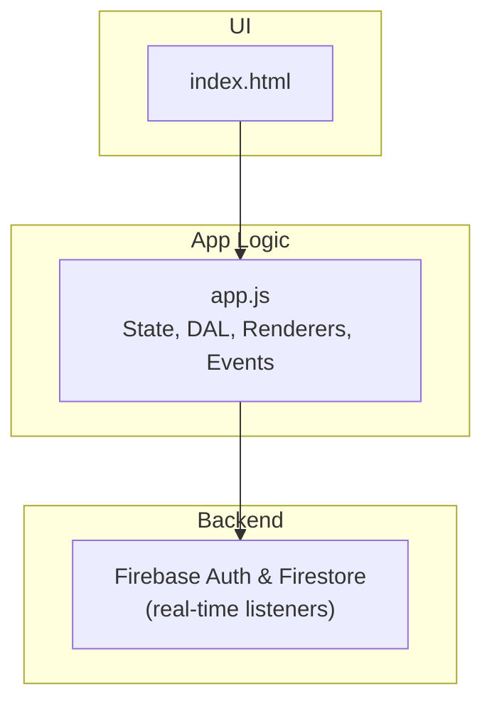
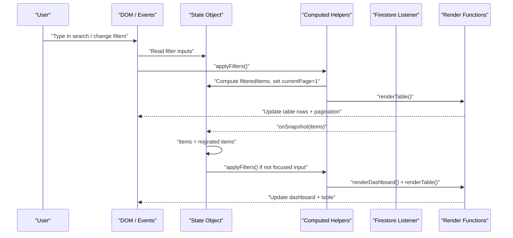
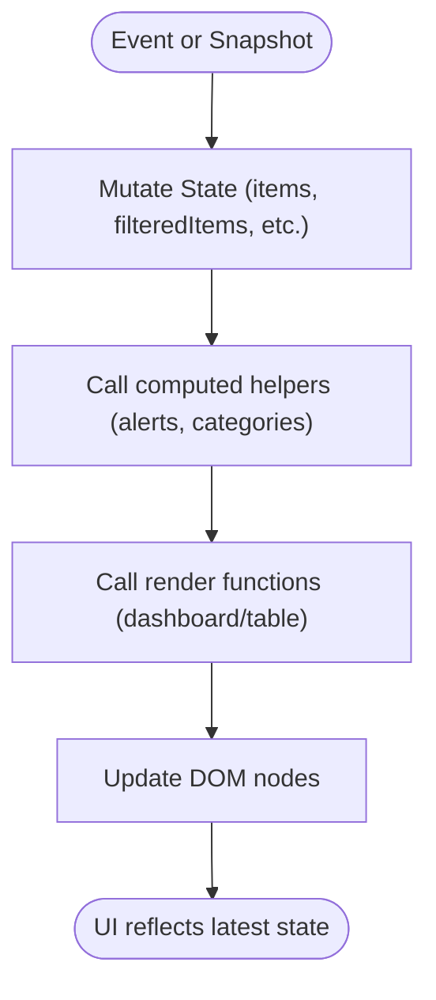
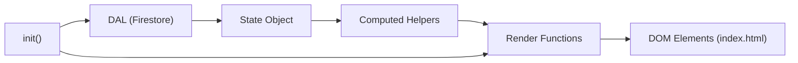

# State Management System

<cite>
**Referenced Files in This Document**
- [app.js](file://app.js)
- [index.html](file://index.html)
- [firebase-config.js](file://firebase-config.js)
- [README.md](file://README.md)
</cite>

## Table of Contents
1. [Introduction](#introduction)
2. [Project Structure](#project-structure)
3. [Core Components](#core-components)
4. [Architecture Overview](#architecture-overview)
5. [Detailed Component Analysis](#detailed-component-analysis)
6. [Dependency Analysis](#dependency-analysis)
7. [Performance Considerations](#performance-considerations)
8. [Troubleshooting Guide](#troubleshooting-guide)
9. [Conclusion](#conclusion)

## Introduction
This document explains Shadow Ledger’s centralized state management system with a focus on the State object, computed helpers, observer-driven UI updates, and pagination handling. It clarifies how state mutations propagate to the DOM, how derived values are calculated, and how performance is maintained for large datasets.

## Project Structure
Shadow Ledger is a single-page application with:
- A central JavaScript module that owns State, Data Access Layer (DAL), rendering logic, and event bindings.
- An HTML shell providing the UI elements referenced by the app.
- Firebase configuration for real-time data sync and authentication.

**Diagram sources**
- [index.html:1-120](file://index.html#L1-L120)
- [app.js:1-120](file://app.js#L1-L120)
- [firebase-config.js:1-29](file://firebase-config.js#L1-L29)

**Section sources**
- [index.html:1-120](file://index.html#L1-L120)
- [app.js:1-120](file://app.js#L1-L120)
- [firebase-config.js:1-29](file://firebase-config.js#L1-L29)

## Core Components
At the heart of the application is a centralized State object that holds all application-level data and UI-related flags. The State object includes:
- items: array of inventory items
- filteredItems: current filtered/sorted view
- currentPage: active page index for pagination
- sortField: field used for sorting
- sortAsc: boolean indicating sort direction
- editingId: id of item currently being edited
- importParsedData, importRawHeaders, importRawData, importFormat: import workflow state
- selectedIds: Set of selected item ids for bulk actions
- viewMode: 'active' or 'archive'
- locations: list of stock locations
- activeLocation: current location filter
- labelGenSelected: SKUs selected for bulk label generation

Computed helpers derive values from State without storing them directly:
- depotStock(item): returns building-stock at the “Main Depot” location
- needsCarrier(item): true when building stock is at or below carrier trigger
- needsProcurement(item): true when total stock across locations is at or below purchasing trigger
- carrierQty(item): recommended quantity to bring from depot to building
- getCarrierAlerts(), getProcureAlerts(): lists of items requiring action
- getCategories(): unique categories present in items

These helpers are invoked during filtering, dashboard rendering, and row rendering to compute derived values on demand.

**Section sources**
- [app.js:14-30](file://app.js#L14-L30)
- [app.js:421-447](file://app.js#L421-L447)

## Architecture Overview
The state management follows an observer-like pattern:
- Central State holds source-of-truth data.
- Computed helpers calculate derived values from State.
- Event handlers mutate State and then call render functions to update the DOM.
- Real-time Firestore listeners update State.items, which triggers re-filtering and re-rendering.

**Diagram sources**
- [app.js:200-265](file://app.js#L200-L265)
- [app.js:452-494](file://app.js#L452-L494)
- [app.js:499-527](file://app.js#L499-L527)
- [app.js:622-661](file://app.js#L622-L661)

## Detailed Component Analysis

### State Object Structure
The State object is defined once and mutated throughout the app. Key properties:
- items: primary dataset; updated via Firestore listener and local edits
- filteredItems: result of applyFilters; used by pagination and table rendering
- currentPage: controls which slice of filteredItems is displayed
- sortField, sortAsc: control sorting behavior
- editingId: tracks which item is open in the modal
- import* fields: manage multi-format import flow
- selectedIds: Set for bulk operations
- viewMode: toggles between active and archived items
- locations: synced from Firestore; used for per-location stock calculations
- activeLocation: used to filter items by location
- labelGenSelected: Set of SKUs chosen for label generation

Example mutation patterns:
- Adding/editing items: saveItem mutates State.items and persists via DAL.saveOne
- Deleting items: deleteItem removes from State.items and persists via DAL.deleteOne
- Bulk archive/restore/delete: mutates multiple items and persists via DAL.saveMany/DAL.deleteMany
- Inline edits: saveFieldSilently updates locationStock and totals, persists one item, and patches the row

**Section sources**
- [app.js:14-30](file://app.js#L14-L30)
- [app.js:824-854](file://app.js#L824-L854)
- [app.js:856-871](file://app.js#L856-L871)
- [app.js:699-771](file://app.js#L699-L771)
- [app.js:1902-1949](file://app.js#L1902-L1949)

### Computed Properties Pattern
Shadow Ledger uses pure helper functions to compute derived values:
- depotStock(item): reads locationStock map for the depot location
- needsCarrier(item): compares building stock to carrierTrigger
- needsProcurement(item): compares total stock to purchasingTrigger
- carrierQty(item): calculates needed units to reach maxCapacity
- getCarrierAlerts(), getProcureAlerts(): filter items based on computed conditions
- getCategories(): extracts unique categories

These helpers are called inside:
- Filtering pipeline (applyFilters)
- Dashboard rendering (renderDashboard)
- Row rendering (renderRow)

Complexity considerations:
- Each helper runs O(1) per item
- Alert getters run O(n) over items
- Categories getter runs O(n) to collect and deduplicate categories

Optimization opportunities:
- Cache alert sets and category lists when items do not change
- Memoize expensive computations if dataset grows significantly

**Section sources**
- [app.js:421-447](file://app.js#L421-L447)
- [app.js:452-494](file://app.js#L452-L494)
- [app.js:546-617](file://app.js#L546-L617)
- [app.js:622-661](file://app.js#L622-L661)

### Observer Pattern Implementation
Although there is no reactive framework, the app implements an observer-like flow:
- Firestore onSnapshot callbacks update State.items and trigger re-renders
- Event handlers mutate State and explicitly call render functions
- Debounced input events reduce re-render frequency during typing

Key flows:
- Real-time sync: DAL.startSync calls onUpdate(items); init maps items through migration and then applies filters and renders
- Inline editing: debounced input triggers saveFieldSilently, which persists changes and patches the row and dashboard
- Filter/search: input events debounce applyFilters, which recomputes filteredItems and re-renders the table

**Diagram sources**
- [app.js:200-265](file://app.js#L200-L265)
- [app.js:452-494](file://app.js#L452-L494)
- [app.js:699-771](file://app.js#L699-L771)

**Section sources**
- [app.js:200-265](file://app.js#L200-L265)
- [app.js:452-494](file://app.js#L452-L494)
- [app.js:699-771](file://app.js#L699-L771)

### State Mutations and UI Updates
Common mutation paths:
- Adjust stock (+/-1): adjustStock updates locationStock and buildingStock, persists, and re-renders the row and dashboard
- Save item (add/edit): saveItem merges locationStock, persists, resets editingId, applies filters, and re-renders
- Delete item: deleteItem removes from State.items, persists deletion, clears selection, applies filters, and re-renders
- Bulk operations: bulk archive/restore/delete mutate multiple items and persist via batch writes, then re-render

Inline editing preserves focus by patching only affected cells and gauge bars rather than full row replacement.

**Section sources**
- [app.js:808-822](file://app.js#L808-L822)
- [app.js:824-854](file://app.js#L824-L854)
- [app.js:856-871](file://app.js#L856-L871)
- [app.js:699-771](file://app.js#L699-L771)

### Pagination Handling Within the State Layer
Pagination is implemented using:
- PAGE_SIZE constant controlling items per page
- State.currentPage tracking the active page
- renderTable slicing filteredItems into the current page range
- Prev/Next buttons updating State.currentPage and calling renderTable

Edge cases handled:
- Resetting currentPage to 1 after filtering
- Clamping currentPage to valid range when filteredItems length changes
- Updating pagination indicators and disabling buttons appropriately

**Section sources**
- [app.js:12](file://app.js#L12)
- [app.js:499-527](file://app.js#L499-L527)
- [app.js:1964-1966](file://app.js#L1964-L1966)

### Relationship Between State Changes and DOM Updates
- Dashboard metrics depend on computed alerts and totals; renderDashboard updates stat elements and quicklists
- Table rows depend on computed status badges and gauges; renderRow generates HTML strings for each visible row
- Inline edits patch specific DOM nodes to avoid losing focus while still reflecting new computed values

**Section sources**
- [app.js:622-661](file://app.js#L622-L661)
- [app.js:546-617](file://app.js#L546-L617)
- [app.js:699-771](file://app.js#L699-L771)

## Dependency Analysis
High-level dependencies:
- app.js depends on DOM elements defined in index.html
- app.js depends on Firebase services initialized in firebase-config.js
- Computed helpers depend on State and location mappings
- Rendering functions depend on both State and computed helpers

**Diagram sources**
- [app.js:14-30](file://app.js#L14-L30)
- [app.js:421-447](file://app.js#L421-L447)
- [app.js:499-527](file://app.js#L499-L527)
- [app.js:200-265](file://app.js#L200-L265)

**Section sources**
- [app.js:14-30](file://app.js#L14-L30)
- [app.js:421-447](file://app.js#L421-L447)
- [app.js:499-527](file://app.js#L499-L527)
- [app.js:200-265](file://app.js#L200-L265)

## Performance Considerations
- Debouncing: Search and inline edits use debounced handlers to limit frequent re-renders during typing.
- Selective DOM updates: Inline edits patch only changed cells and gauge bars instead of replacing entire rows.
- Pagination: Only a subset of items is rendered per page, reducing DOM size.
- Computation scope: Alerts and categories iterate over items; consider caching results if dataset grows significantly.
- Batch writes: Bulk operations use batch commits to minimize network overhead.

Recommendations for large datasets:
- Introduce memoization for getCarrierAlerts, getProcureAlerts, and getCategories to avoid recomputation on every render.
- Virtualize the table if items exceed thousands to further reduce DOM cost.
- Keep PAGE_SIZE tuned to balance responsiveness and memory usage.

[No sources needed since this section provides general guidance]

## Troubleshooting Guide
Common issues and resolutions:
- Firestore permission denied: The app shows a toast and logs errors; verify Firestore rules allow read/write access for authenticated users.
- Firebase unavailable: Network or service outage; the app displays a toast and continues working offline due to persistence.
- Import mapping failures: Ensure required columns (SKU or Name) are mapped; otherwise, the app prompts to fix mapping.
- Scan-out exceeds stock: The app warns and requires confirmation before allowing negative stock.

**Section sources**
- [app.js:229-239](file://app.js#L229-L239)
- [app.js:1780-1826](file://app.js#L1780-L1826)
- [app.js:1367-1420](file://app.js#L1367-L1420)

## Conclusion
Shadow Ledger’s state management centers around a single State object, pure computed helpers, and explicit render calls triggered by user interactions and real-time data updates. This approach yields predictable data flow, clear separation of concerns, and efficient UI updates. With careful attention to debouncing, selective DOM updates, and pagination, the system remains responsive even with moderately large datasets. For very large inventories, adding memoization and virtualization can further improve performance.