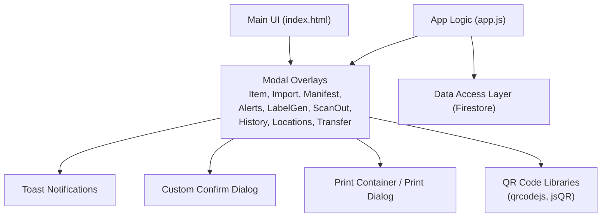
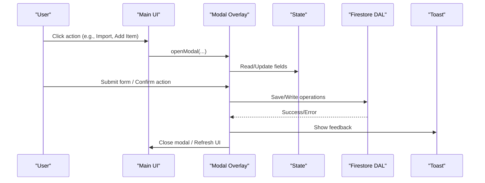
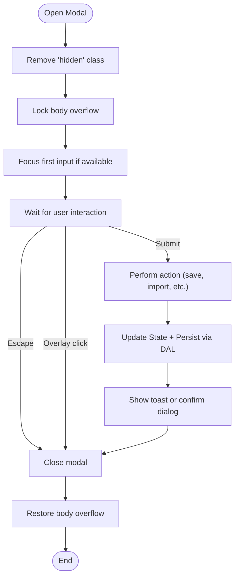
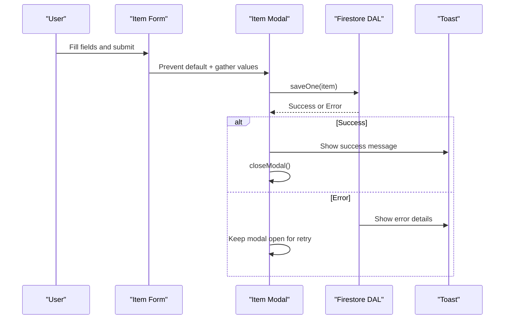
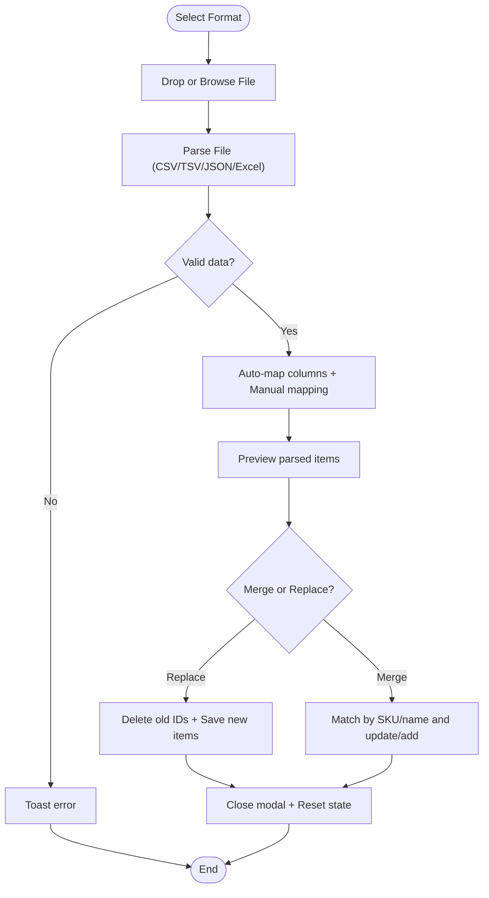
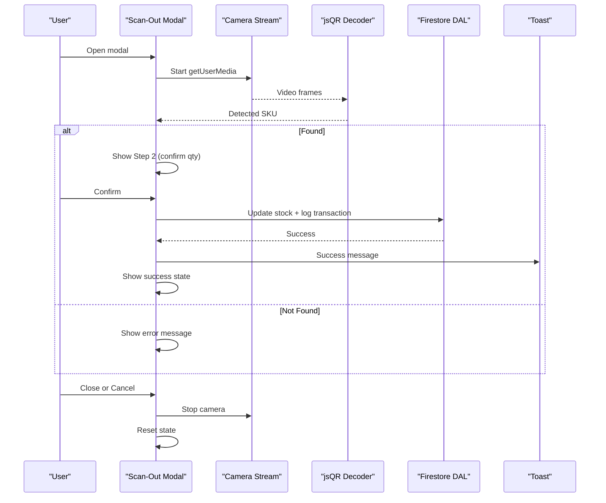
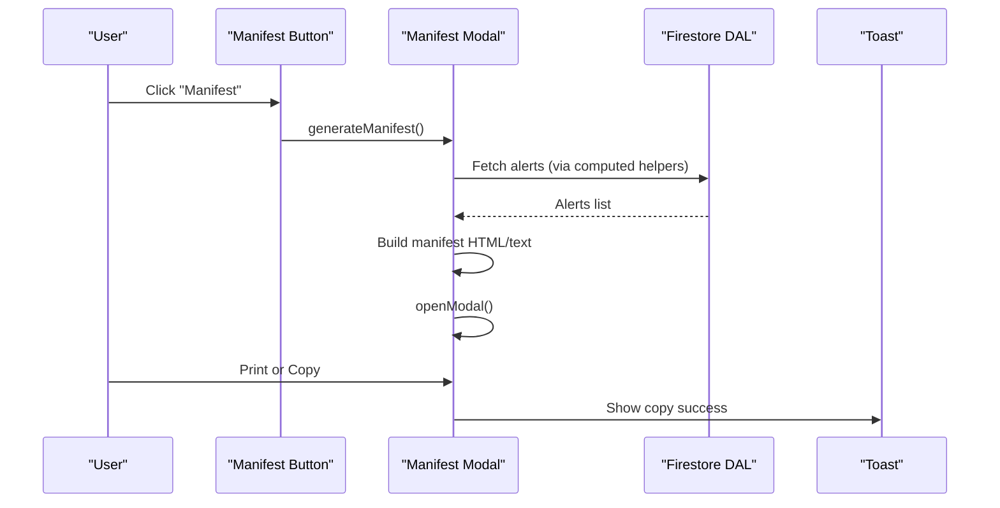
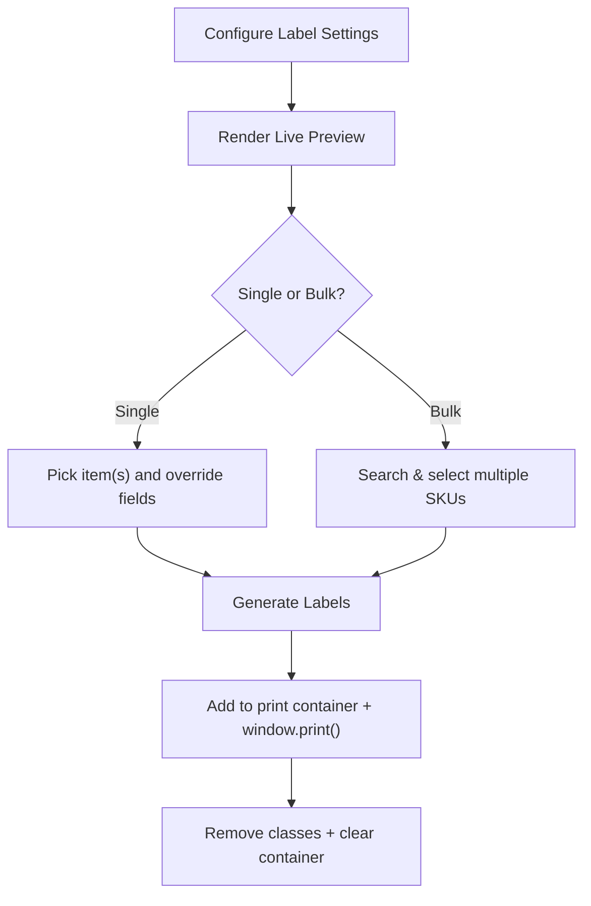
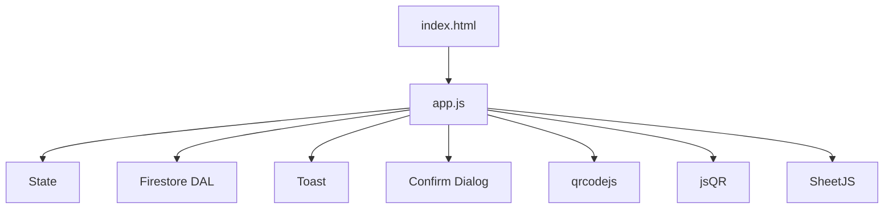

# Modal and Dialog System

<cite>
**Referenced Files in This Document**
- [index.html](file://index.html)
- [app.js](file://app.js)
- [README.md](file://README.md)
</cite>

## Table of Contents
1. [Introduction](#introduction)
2. [Project Structure](#project-structure)
3. [Core Components](#core-components)
4. [Architecture Overview](#architecture-overview)
5. [Detailed Component Analysis](#detailed-component-analysis)
6. [Dependency Analysis](#dependency-analysis)
7. [Performance Considerations](#performance-considerations)
8. [Troubleshooting Guide](#troubleshooting-guide)
9. [Conclusion](#conclusion)

## Introduction
This document describes the modal and dialog system used by the application to manage import wizards, item editing forms, label generation interfaces, confirmation dialogs, manifest generation, alert displays, and user feedback. It covers modal lifecycle management, keyboard navigation support, form validation, file upload handling for imports, QR code scanning integration within modals, data flow between parent and child components, and responsive behavior across devices.

## Project Structure
The modal system is implemented as a set of overlay-based dialogs defined in the HTML and controlled via JavaScript functions that open/close them, handle focus, and coordinate with state and Firebase.

**Diagram sources**
- [index.html:187-201](file://index.html#L187-L201)
- [index.html:571-706](file://index.html#L571-L706)
- [index.html:708-848](file://index.html#L708-L848)
- [index.html:850-872](file://index.html#L850-L872)
- [index.html:874-886](file://index.html#L874-L886)
- [index.html:976-1100](file://index.html#L976-L1100)
- [index.html:1102-1167](file://index.html#L1102-L1167)
- [index.html:1169-1182](file://index.html#L1169-L1182)
- [index.html:1184-1205](file://index.html#L1184-L1205)
- [index.html:1207-1250](file://index.html#L1207-L1250)
- [app.js:877-879](file://app.js#L877-L879)
- [app.js:2637-2645](file://app.js#L2637-L2645)
- [app.js:2647-2688](file://app.js#L2647-L2688)

**Section sources**
- [index.html:187-201](file://index.html#L187-L201)
- [app.js:877-879](file://app.js#L877-L879)

## Core Components
- Modal overlays: Each modal is a fixed overlay with a content container and close button. They use ARIA attributes for accessibility.
- Lifecycle utilities: openModal and closeModal toggle visibility and body scroll lock.
- Keyboard interactions: Escape closes active modals; Enter/Tab are supported where applicable.
- Focus management: Modals set focus on first input after opening; some modals reset camera or state on close.
- Toast notifications: Non-blocking user feedback for success/error/info.
- Custom confirm dialog: Promise-based confirmation replacing native confirm().
- Data binding: Parent state drives modal content; modal actions update state and persist via Firestore.

Key responsibilities:
- Item editing modal: Add/Edit items with validation and save.
- Import wizard: Multi-format import with mapping, preview, merge/replace modes.
- Manifest modal: Generate carrier transfer manifest with print/copy.
- Alert detail modal: Show detailed lists of alerts.
- Label generator modal: Configure labels, preview, generate, and print.
- Scan-out modal: Camera-based QR scan or manual SKU entry to remove stock.
- History modal: View recent transactions.
- Locations manager modal: Manage stock locations.
- Transfer modal: Move stock between locations.

**Section sources**
- [index.html:571-706](file://index.html#L571-L706)
- [index.html:708-848](file://index.html#L708-L848)
- [index.html:850-872](file://index.html#L850-L872)
- [index.html:874-886](file://index.html#L874-L886)
- [index.html:976-1100](file://index.html#L976-L1100)
- [index.html:1102-1167](file://index.html#L1102-L1167)
- [index.html:1169-1182](file://index.html#L1169-L1182)
- [index.html:1184-1205](file://index.html#L1184-L1205)
- [index.html:1207-1250](file://index.html#L1207-L1250)
- [app.js:877-879](file://app.js#L877-L879)
- [app.js:2077-2112](file://app.js#L2077-L2112)
- [app.js:2637-2645](file://app.js#L2637-L2645)
- [app.js:2647-2688](file://app.js#L2647-L2688)

## Architecture Overview
The modal system follows a simple overlay pattern with centralized control logic. The main UI triggers modals, which render content based on current state. Actions inside modals update state and persist changes through the Data Access Layer (DAL). Feedback is provided via toasts and custom confirm dialogs.

**Diagram sources**
- [app.js:877-879](file://app.js#L877-L879)
- [app.js:2054-2075](file://app.js#L2054-L2075)
- [app.js:2077-2112](file://app.js#L2077-L2112)
- [app.js:2637-2645](file://app.js#L2637-L2645)

## Detailed Component Analysis

### Modal Lifecycle Management
- Open/close: openModal removes hidden class and locks body scroll; closeModal restores scroll.
- Overlay click: Clicking outside content closes the modal; special cleanup runs for scan-out modal.
- Escape key: Global listener closes any visible modal and cleans up resources (e.g., camera).
- Focus management: After opening, focus is moved to the first relevant input (e.g., SKU field in item modal).

**Diagram sources**
- [app.js:877-879](file://app.js#L877-L879)
- [app.js:2090-2112](file://app.js#L2090-L2112)
- [app.js:2077-2079](file://app.js#L2077-L2079)

**Section sources**
- [app.js:877-879](file://app.js#L877-L879)
- [app.js:2090-2112](file://app.js#L2090-L2112)
- [app.js:2077-2079](file://app.js#L2077-L2079)

### Accessibility and Keyboard Navigation
- ARIA attributes: All modals include role="dialog" and aria-modal="true".
- Escape key: Closes any open modal and stops camera when applicable.
- Tab order: Inputs inside modals follow natural tab order; Enter moves focus within inline inputs in table rows.
- Focus trapping: No explicit trap is implemented; focus remains within the modal’s interactive elements due to overlay blocking background interaction.

**Section sources**
- [index.html:572-572](file://index.html#L572-L572)
- [index.html:709-709](file://index.html#L709-L709)
- [index.html:851-851](file://index.html#L851-L851)
- [index.html:875-875](file://index.html#L875-L875)
- [index.html:977-977](file://index.html#L977-L977)
- [index.html:1103-1103](file://index.html#L1103-L1103)
- [index.html:1170-1170](file://index.html#L1170-L1170)
- [index.html:1185-1185](file://index.html#L1185-L1185)
- [index.html:1208-1208](file://index.html#L1208-L1208)
- [app.js:2102-2112](file://app.js#L2102-L2112)
- [app.js:2000-2022](file://app.js#L2000-L2022)

### Form Validation System (Item Editing Modal)
- Required fields: SKU and Name are marked required in the form markup.
- Numeric fields: Min values enforced via type="number" and min attributes.
- Submission handler: Prevents default, gathers values, persists via DAL, shows toast, and closes modal on success. Errors from DAL are surfaced via toasts without closing the modal to allow retry.

**Diagram sources**
- [index.html:580-704](file://index.html#L580-L704)
- [app.js:2054-2075](file://app.js#L2054-L2075)
- [app.js:55-70](file://app.js#L55-L70)

**Section sources**
- [index.html:580-704](file://index.html#L580-L704)
- [app.js:2054-2075](file://app.js#L2054-L2075)
- [app.js:55-70](file://app.js#L55-L70)

### File Upload Handling for Imports (Import Wizard)
- Format selection: Tabs switch between CSV, Excel, JSON, TSV; help text updates accordingly.
- Drag-and-drop and file input: Accepts appropriate extensions per format.
- Parsing:
  - CSV/TSV: Delimited parser handles quoted fields and auto-detects delimiter.
  - JSON: Parses array or object containing an array.
  - Excel: Reads first sheet using SheetJS and converts to rows.
- Column mapping: Auto-maps common headers; allows manual mapping; requires at least SKU or Name.
- Preview: Shows first 10 mapped rows; enables import confirmation.
- Modes: Merge (update existing by SKU/name) or Replace all.
- Persistence: Uses batch writes for efficiency; resets modal state after completion.

**Diagram sources**
- [index.html:708-848](file://index.html#L708-L848)
- [app.js:1669-1720](file://app.js#L1669-L1720)
- [app.js:1734-1790](file://app.js#L1734-L1790)
- [app.js:1792-1838](file://app.js#L1792-L1838)

**Section sources**
- [index.html:708-848](file://index.html#L708-L848)
- [app.js:1669-1720](file://app.js#L1669-L1720)
- [app.js:1734-1790](file://app.js#L1734-L1790)
- [app.js:1792-1838](file://app.js#L1792-L1838)

### QR Code Scanning Integration (Scan-Out Modal)
- Camera access: Starts rear-facing camera stream; decodes frames using jsQR.
- Manual fallback: Allows typing SKU and pressing Enter to find item.
- Step flow: Step 1 (scan/enter), Step 2 (confirm quantity), Success state.
- Stock update: Decrements building stock, recalculates totals, logs transaction, refreshes UI.
- Error handling: Displays errors if camera unavailable or SKU not found; confirms if quantity exceeds stock.

**Diagram sources**
- [index.html:1102-1167](file://index.html#L1102-L1167)
- [app.js:1274-1354](file://app.js#L1274-L1354)
- [app.js:1377-1430](file://app.js#L1377-L1430)

**Section sources**
- [index.html:1102-1167](file://index.html#L1102-L1167)
- [app.js:1274-1354](file://app.js#L1274-L1354)
- [app.js:1377-1430](file://app.js#L1377-L1430)

### Manifest Generation Modal
- Trigger: Button opens modal and generates manifest content based on carrier alerts.
- Content: Header with date/time, list of items needing transfer, quantities, current stock, depot availability, warnings if insufficient depot stock.
- Actions: Print (opens new window with styled content and prints), Copy to clipboard (text version).

**Diagram sources**
- [index.html:850-872](file://index.html#L850-L872)
- [app.js:899-974](file://app.js#L899-L974)
- [app.js:2137-2151](file://app.js#L2137-L2151)

**Section sources**
- [index.html:850-872](file://index.html#L850-L872)
- [app.js:899-974](file://app.js#L899-L974)
- [app.js:2137-2151](file://app.js#L2137-L2151)

### Alert Display Modal
- Trigger: Dashboard cards for carrier and procurement alerts open this modal.
- Content: Lists items with reasons and badges indicating low stock or reorder needs.
- Behavior: Updates title based on alert type; renders empty state if no alerts.

**Section sources**
- [index.html:874-886](file://index.html#L874-L886)
- [app.js:976-1005](file://app.js#L976-L1005)
- [app.js:2153-2168](file://app.js#L2153-L2168)

### Label Generator Modal
- Configuration: Logo upload (saved to localStorage), size presets, custom dimensions, source selection (single or multi-select), copies per label, custom text overrides, QR code source options.
- Preview: Live preview updates on configuration changes; supports single-item preview and bulk mode preview.
- Generation: Builds label elements into a print container, applies grid classes for A4 landscape mode, triggers browser print, then cleans up.
- QR codes: Uses qrcodejs to render SKU and optional datasheet URL QR codes.

**Diagram sources**
- [index.html:976-1100](file://index.html#L976-L1100)
- [app.js:1198-1268](file://app.js#L1198-L1268)
- [app.js:2224-2292](file://app.js#L2224-L2292)
- [app.js:2446-2621](file://app.js#L2446-L2621)

**Section sources**
- [index.html:976-1100](file://index.html#L976-L1100)
- [app.js:1198-1268](file://app.js#L1198-L1268)
- [app.js:2224-2292](file://app.js#L2224-L2292)
- [app.js:2446-2621](file://app.js#L2446-L2621)

### Confirmation Dialogs
- Custom confirmDialog returns a Promise and renders a modal overlay with danger styling option.
- Used for destructive actions like bulk delete and scan-out quantity exceeding stock.
- Keyboard support: Escape cancels; Enter confirms; focus starts on cancel button.

**Section sources**
- [app.js:2647-2688](file://app.js#L2647-L2688)
- [app.js:1944-1961](file://app.js#L1944-L1961)
- [app.js:1377-1390](file://app.js#L1377-L1390)

### Toast Notification System
- Non-blocking messages appear bottom-right with fade-in animation.
- Types: success, error, info.
- Auto-dismiss after a few seconds.

**Section sources**
- [index.html:888-889](file://index.html#L888-L889)
- [app.js:2637-2645](file://app.js#L2637-L2645)

### Responsive Modal Behavior
- Modals use full-width containers with max widths and internal scrolling for long content.
- Mobile-friendly layouts: Grids collapse to single column; buttons remain accessible.
- Print styles: Specialized CSS hides non-printable elements and formats labels for A4 landscape grids.

**Section sources**
- [index.html:187-201](file://index.html#L187-L201)
- [index.html:246-331](file://index.html#L246-L331)

## Dependency Analysis
- External libraries:
  - qrcodejs: Generates QR codes for labels and print outputs.
  - jsQR: Decodes QR codes from camera frames.
  - SheetJS (XLSX): Parses Excel files for import.
- Internal dependencies:
  - State: Centralized inventory and UI state drives modal content.
  - DAL: Firestore integration for persistence and real-time sync.
  - Toast and confirmDialog: Shared feedback mechanisms used across modals.

**Diagram sources**
- [app.js:14-30](file://app.js#L14-L30)
- [app.js:32-132](file://app.js#L32-L132)
- [app.js:2637-2645](file://app.js#L2637-L2645)
- [app.js:2647-2688](file://app.js#L2647-L2688)
- [index.html:54-56](file://index.html#L54-L56)
- [index.html:92-92](file://index.html#L92-L92)

**Section sources**
- [app.js:14-30](file://app.js#L14-L30)
- [app.js:32-132](file://app.js#L32-L132)
- [app.js:2637-2645](file://app.js#L2637-L2645)
- [app.js:2647-2688](file://app.js#L2647-L2688)
- [index.html:54-56](file://index.html#L54-L56)
- [index.html:92-92](file://index.html#L92-L92)

## Performance Considerations
- Batch writes: Import uses batch commits for large datasets to reduce Firestore round-trips.
- Debounced saves: Inline edits debounce to avoid excessive writes while preserving focus.
- Efficient rendering: Only updated cells and gauges are refreshed after silent saves.
- QR generation timing: Short delays ensure QR canvases are rasterized before printing.

[No sources needed since this section provides general guidance]

## Troubleshooting Guide
- Permission denied errors: Firestore rules may block writes; check console and toast messages.
- Unavailable service: Network issues cause Firebase unavailability; offline indicator appears.
- Camera permissions: If camera fails, manual SKU entry remains available.
- Import parsing failures: Ensure correct headers and format; mapping step helps align columns.
- Print output missing QR codes: Allow extra time for canvas rendering; use browser print dialog to verify.

**Section sources**
- [app.js:55-70](file://app.js#L55-L70)
- [app.js:230-238](file://app.js#L230-L238)
- [app.js:1293-1297](file://app.js#L1293-L1297)
- [app.js:1711-1714](file://app.js#L1711-L1714)
- [app.js:1064-1076](file://app.js#L1064-L1076)

## Conclusion
The modal and dialog system provides a cohesive, accessible, and responsive interface for managing inventory workflows. It integrates robust form validation, flexible import handling, QR scanning, and clear user feedback. The architecture separates concerns cleanly between UI overlays, state management, and data persistence, enabling maintainability and extensibility.

[No sources needed since this section summarizes without analyzing specific files]