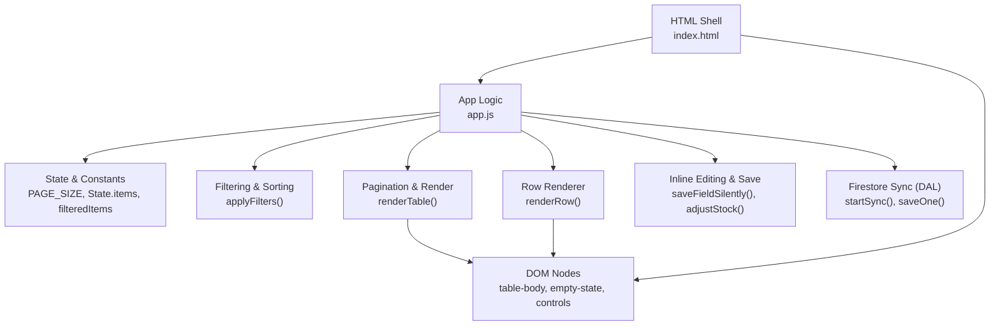
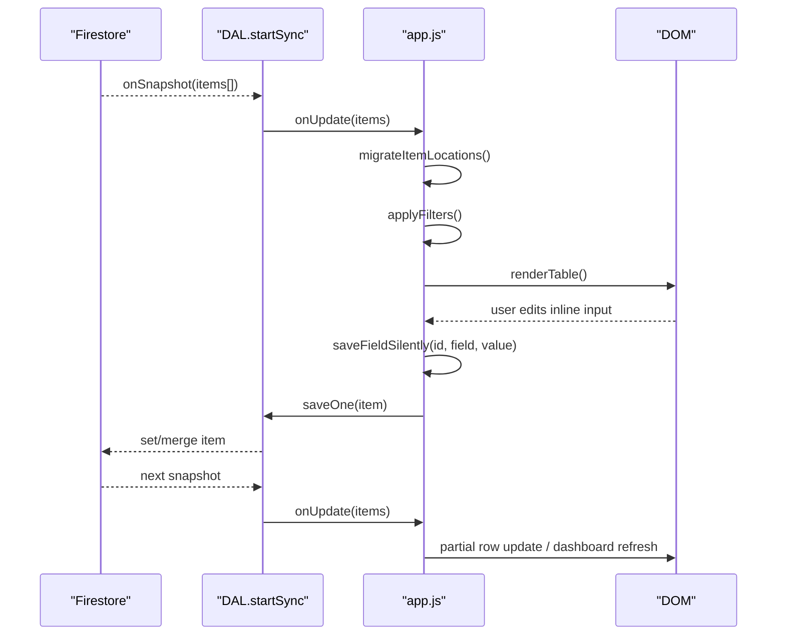
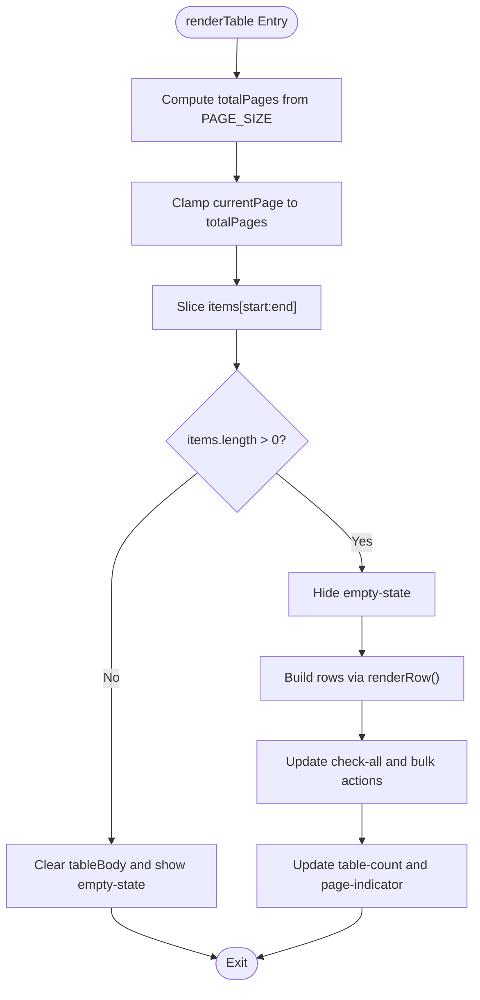
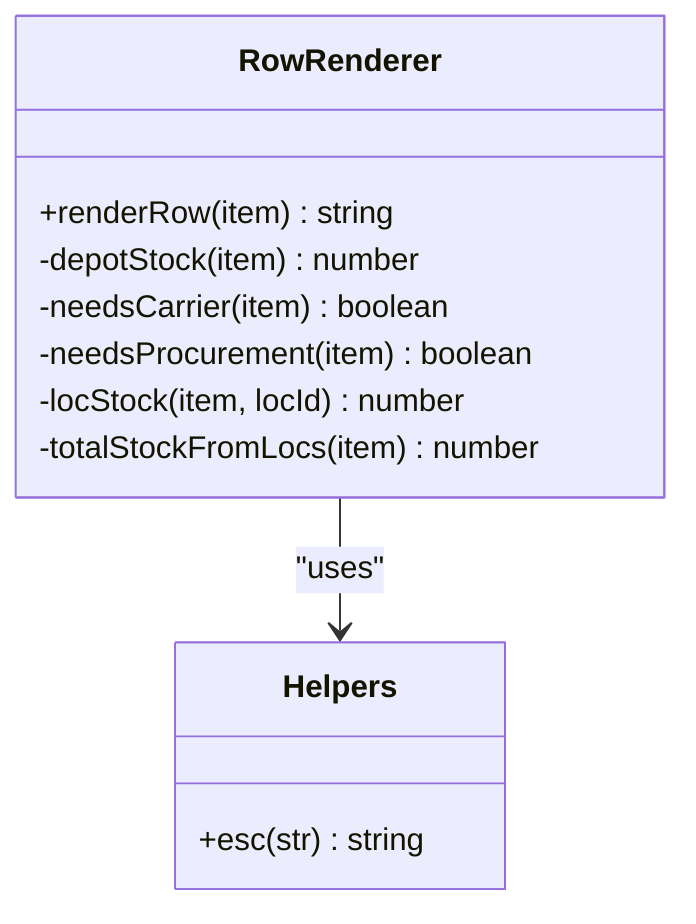
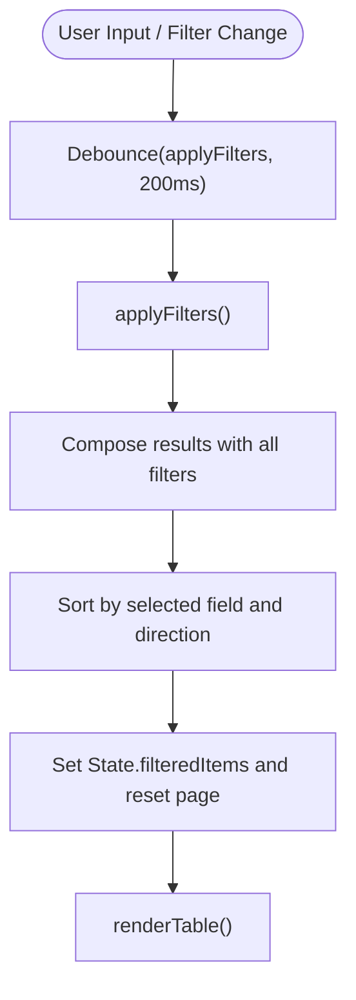
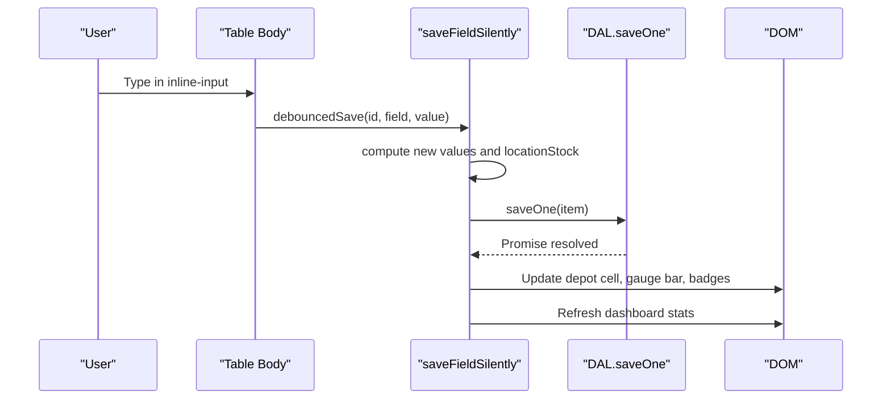
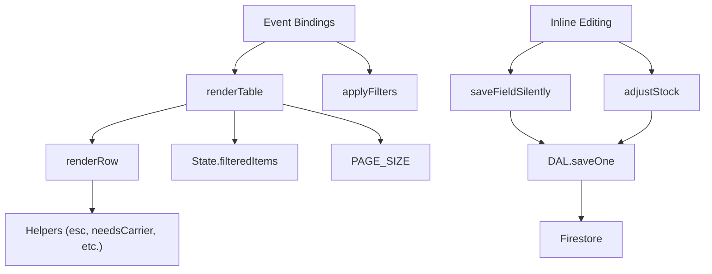

# Table Rendering Engine

<cite>
**Referenced Files in This Document**
- [app.js](file://app.js)
- [index.html](file://index.html)
</cite>

## Table of Contents
1. [Introduction](#introduction)
2. [Project Structure](#project-structure)
3. [Core Components](#core-components)
4. [Architecture Overview](#architecture-overview)
5. [Detailed Component Analysis](#detailed-component-analysis)
6. [Dependency Analysis](#dependency-analysis)
7. [Performance Considerations](#performance-considerations)
8. [Troubleshooting Guide](#troubleshooting-guide)
9. [Conclusion](#conclusion)
10. [Appendices](#appendices)

## Introduction
This document explains the high-performance table rendering engine used by the inventory application. It focuses on:
- The renderTable function implementing server-side pagination with a PAGE_SIZE constant
- Efficient DOM manipulation and real-time updates without full re-renders
- The renderRow function that generates interactive rows with inline editing, status badges, and action buttons
- Filtering and sorting mechanisms, multi-field search, and live updates
- Custom column rendering patterns, conditional styling based on stock levels, and accessibility features for screen readers

The system is designed to remain responsive even as datasets grow, leveraging client-side pagination, targeted DOM updates, and debounced input handling.

## Project Structure
At runtime, the UI is defined in the HTML shell and the logic lives in the main script. The table rendering pipeline connects state, filtering/sorting, and DOM updates.

**Diagram sources**
- [app.js:452-494](file://app.js#L452-L494)
- [app.js:499-527](file://app.js#L499-L527)
- [app.js:546-617](file://app.js#L546-L617)
- [app.js:699-771](file://app.js#L699-L771)
- [app.js:809-823](file://app.js#L809-L823)
- [app.js:33-48](file://app.js#L33-L48)
- [index.html:527-568](file://index.html#L527-L568)

**Section sources**
- [app.js:9-30](file://app.js#L9-L30)
- [index.html:527-568](file://index.html#L527-L568)

## Core Components
- Pagination and rendering:
  - renderTable slices filtered items into pages using PAGE_SIZE and updates only the visible rows.
  - Empty state toggling and pagination controls are updated atomically.
- Row generation:
  - renderRow builds each row’s HTML including status badges, inline inputs, and action buttons.
- Real-time updates:
  - Firestore listeners update State.items; applyFilters recomputes filtered results and triggers renderTable.
- Inline editing:
  - Debounced input events call saveFieldSilently to persist changes and update only affected cells.

Key responsibilities:
- State management: items, filteredItems, currentPage, sortField, sortAsc
- Data access layer: startSync, saveOne, deleteOne, saveMany
- UI helpers: esc, debounce, toast, confirmDialog

**Section sources**
- [app.js:9-30](file://app.js#L9-L30)
- [app.js:452-494](file://app.js#L452-L494)
- [app.js:499-527](file://app.js#L499-L527)
- [app.js:546-617](file://app.js#L546-L617)
- [app.js:699-771](file://app.js#L699-L771)
- [app.js:2609-2618](file://app.js#L2609-L2618)

## Architecture Overview
The rendering engine follows a unidirectional data flow:
- Firestore sync updates State.items
- applyFilters computes State.filteredItems and resets page
- renderTable renders only the current page
- User interactions trigger partial updates via saveFieldSilently or adjustStock

**Diagram sources**
- [app.js:33-48](file://app.js#L33-L48)
- [app.js:214-239](file://app.js#L214-L239)
- [app.js:452-494](file://app.js#L452-L494)
- [app.js:499-527](file://app.js#L499-L527)
- [app.js:699-771](file://app.js#L699-L771)

## Detailed Component Analysis

### renderTable: Pagination and Efficient DOM Updates
- Computes total pages from PAGE_SIZE and clamps current page
- Slices filtered items into the current page
- If no items, clears table body and shows empty state; otherwise replaces innerHTML with mapped rows
- Updates bulk selection state and pagination indicators

Optimizations:
- Only the current page is rendered
- Empty state toggled via classList rather than full re-render
- Pagination info updated directly on textContent

**Diagram sources**
- [app.js:499-527](file://app.js#L499-L527)

**Section sources**
- [app.js:499-527](file://app.js#L499-L527)

### renderRow: Interactive Rows, Badges, and Actions
- Builds a single row string with:
  - Checkbox for selection
  - Status badge computed from carrier and procurement alerts
  - SKU, name, category, datasheet link
  - Inline editable fields for total stock, building stock, and thresholds
  - Building stock gauge bar colored by percentage of max capacity
  - Depot stock display with conditional color when zero
  - Action buttons: print label, transfer, edit, delete
- Uses esc() to safely escape values before insertion

Conditional styling:
- Row classes row-carrier and row-procure applied based on alert conditions
- Gauge bar color transitions between red, amber, and emerald depending on percentage

Accessibility:
- Inputs include title attributes describing behavior
- Buttons have titles for tooltips and semantic roles where applicable

**Diagram sources**
- [app.js:546-617](file://app.js#L546-L617)
- [app.js:421-447](file://app.js#L421-L447)
- [app.js:2609-2613](file://app.js#L2609-L2613)

**Section sources**
- [app.js:546-617](file://app.js#L546-L617)

### Filtering, Sorting, and Search
- applyFilters composes multiple filters:
  - Archive view toggle
  - Multi-field search across SKU, name, category, datasheet URL
  - Category dropdown filter
  - Alert filter (carrier, procure, ok)
  - Stock presence filters (in_stock, in_building)
- Sort supports dynamic fields including depotStock derived value
- After filtering, resets currentPage to 1 and calls renderTable

Real-time updates:
- Debounced search input ensures smooth typing without excessive re-renders
- Filter changes immediately recompute and re-render

**Diagram sources**
- [app.js:452-494](file://app.js#L452-L494)
- [app.js:1884-1887](file://app.js#L1884-L1887)

**Section sources**
- [app.js:452-494](file://app.js#L452-L494)
- [app.js:1884-1887](file://app.js#L1884-L1887)

### Inline Editing and Real-Time Partial Updates
- Debounced input handler saves edited fields without full row re-render
- saveFieldSilently:
  - Validates numeric input
  - For buildingStock: updates locationStock map and recalculates totals
  - For totalStock: adjusts depot stock while preserving other locations
  - Persists via DAL.saveOne and updates only affected cells (depot count, gauge bar, badges)
- adjustStock increments/decrements building stock and re-renders the row via replaceWith

Keyboard-friendly:
- Enter moves focus to next inline input in the same row
- Focus selects existing content for quick overwrite
- Global keyboard shortcuts support barcode scanners and numpad +/- adjustments

**Diagram sources**
- [app.js:1975-2014](file://app.js#L1975-L2014)
- [app.js:699-771](file://app.js#L699-L771)
- [app.js:809-823](file://app.js#L809-L823)

**Section sources**
- [app.js:1975-2014](file://app.js#L1975-L2014)
- [app.js:699-771](file://app.js#L699-L771)
- [app.js:809-823](file://app.js#L809-L823)

### Conditional Styling Based on Stock Levels
- Carrier alerts: triggered when building stock <= carrierTrigger
- Procurement alerts: triggered when total stock <= purchasingTrigger
- Visual cues:
  - Row left border and gradient background for alerts
  - Badge labels “CARRIER” and “ORDER” with distinct colors
  - Gauge bar color transitions based on percentage of max capacity

Customization points:
- Thresholds are per-item fields (carrierTrigger, purchasingTrigger, maxCapacity)
- Colors and animations are CSS-driven and can be extended

**Section sources**
- [app.js:425-443](file://app.js#L425-L443)
- [app.js:546-617](file://app.js#L546-L617)
- [index.html:204-224](file://index.html#L204-L224)

### Accessibility Features for Screen Readers
- Semantic roles and attributes:
  - Modal overlays use role="dialog" and aria-modal="true"
  - Dashboard cards use role="button" and tabindex for keyboard activation
- Keyboard navigation:
  - Cards respond to Enter and Space keys
  - Inline inputs navigate with Tab and Enter within rows
  - Escape closes modals
- Descriptive labels:
  - Inputs and buttons include title attributes for context
  - Status badges and gauge bars provide visual and textual cues

**Section sources**
- [index.html:572-578](file://index.html#L572-L578)
- [index.html:709-715](file://index.html#L709-L715)
- [app.js:2154-2167](file://app.js#L2154-L2167)
- [app.js:2102-2111](file://app.js#L2102-L2111)

### Examples of Custom Column Rendering
- Datasheet column:
  - Renders an external link icon if datasheetUrl exists; otherwise shows placeholder
- Bin/shelf code:
  - Optional column displayed conditionally; can be included in label printing
- Gauge visualization:
  - Building stock gauge bar reflects percentage of max capacity with color-coded feedback

Implementation references:
- Datasheet link rendering in row template
- Gauge bar width and color computation
- Conditional visibility via Tailwind responsive classes

**Section sources**
- [app.js:546-617](file://app.js#L546-L617)
- [index.html:534](file://index.html#L534)

## Dependency Analysis
The table rendering engine depends on several modules and utilities:

**Diagram sources**
- [app.js:499-527](file://app.js#L499-L527)
- [app.js:546-617](file://app.js#L546-L617)
- [app.js:452-494](file://app.js#L452-L494)
- [app.js:699-771](file://app.js#L699-L771)
- [app.js:809-823](file://app.js#L809-L823)
- [app.js:33-48](file://app.js#L33-L48)

**Section sources**
- [app.js:499-527](file://app.js#L499-L527)
- [app.js:546-617](file://app.js#L546-L617)
- [app.js:452-494](file://app.js#L452-L494)
- [app.js:699-771](file://app.js#L699-L771)
- [app.js:809-823](file://app.js#L809-L823)
- [app.js:33-48](file://app.js#L33-L48)

## Performance Considerations
- Client-side pagination:
  - PAGE_SIZE limits DOM nodes to a manageable subset
  - Slicing arrays avoids rendering entire dataset
- Targeted DOM updates:
  - saveFieldSilently updates only changed cells and gauge bars
  - replaceWith used sparingly for row-level updates after critical changes
- Debouncing:
  - Search and inline edits are debounced to reduce re-renders during rapid input
- Minimal reflows:
  - Class toggles and textContent updates avoid heavy layout thrashing
- Virtual scrolling considerations:
  - Current implementation uses pagination instead of virtual scrolling
  - To scale further, consider virtualized lists (e.g., windowing) to render only visible rows while maintaining scroll position and performance

[No sources needed since this section provides general guidance]

## Troubleshooting Guide
Common issues and resolutions:
- Firestore permission denied:
  - Check database rules and ensure authenticated user has read/write access
- Firebase unavailable:
  - Verify network connectivity and service availability
- Inline edits not saving:
  - Ensure input elements have data-id and data-field attributes
  - Confirm debounced save is firing and DAL.saveOne resolves
- Sorting anomalies:
  - Validate sortField mapping and case-insensitive comparisons for strings
- Empty state persists:
  - Confirm applyFilters sets State.filteredItems correctly and renderTable toggles empty-state class

Operational references:
- Error handling in DAL callbacks
- Toast notifications for user feedback
- Confirm dialogs for destructive actions

**Section sources**
- [app.js:33-48](file://app.js#L33-L48)
- [app.js:214-239](file://app.js#L214-L239)
- [app.js:2620-2628](file://app.js#L2620-L2628)
- [app.js:2631-2671](file://app.js#L2631-L2671)

## Conclusion
The table rendering engine balances responsiveness and functionality through:
- Efficient pagination with PAGE_SIZE
- Targeted DOM updates for inline editing
- Robust filtering and sorting with real-time synchronization
- Accessible UI patterns and clear visual feedback

For very large datasets, adopting virtual scrolling would further improve performance by minimizing DOM nodes while preserving interactivity.

[No sources needed since this section summarizes without analyzing specific files]

## Appendices

### API Definitions: Table Controls and Events
- Search input: debounced applyFilters
- Category select: change triggers applyFilters
- Alert select: change triggers applyFilters
- Stock filter: change triggers applyFilters
- Sort headers: click toggles sortField and sortAsc
- Pagination buttons: prev/next update currentPage and renderTable
- Inline inputs: input/focusout trigger saveFieldSilently
- Row actions: inc/dec/edit/print/transfer/delete handled via delegation

**Section sources**
- [app.js:1884-1887](file://app.js#L1884-L1887)
- [app.js:1966-1977](file://app.js#L1966-L1977)
- [app.js:1975-2014](file://app.js#L1975-L2014)
- [app.js:2023-2047](file://app.js#L2023-L2047)