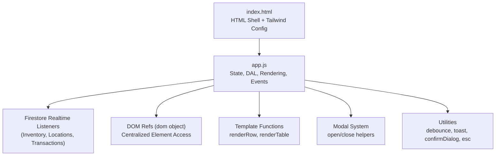
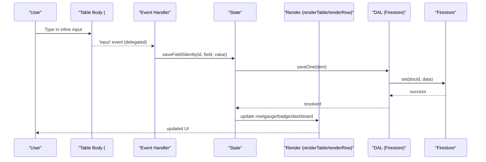
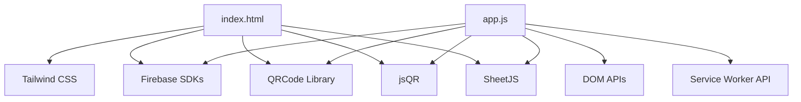

# UI Component System

<cite>
**Referenced Files in This Document**
- [index.html](file://index.html)
- [app.js](file://app.js)
- [README.md](file://README.md)
</cite>

## Table of Contents
1. [Introduction](#introduction)
2. [Project Structure](#project-structure)
3. [Core Components](#core-components)
4. [Architecture Overview](#architecture-overview)
5. [Detailed Component Analysis](#detailed-component-analysis)
6. [Dependency Analysis](#dependency-analysis)
7. [Performance Considerations](#performance-considerations)
8. [Troubleshooting Guide](#troubleshooting-guide)
9. [Conclusion](#conclusion)
10. [Appendices](#appendices)

## Introduction
This document explains the modular UI component architecture built with vanilla JavaScript and Tailwind CSS for an inventory tracking application. It focuses on:
- DOM reference system via a centralized dom object
- Template rendering functions (renderRow, renderTable)
- Event delegation patterns for dynamic content
- Responsive design implementation using Tailwind utilities
- Theme switching mechanism
- Modal system architecture
- Inline editing system with keyboard navigation support
- Bulk selection handling and real-time validation
- Examples of component composition and event binding patterns
- Accessibility features
- Performance optimizations for large tables and mobile-first considerations

The system is designed to be lightweight, maintainable, and extensible without frameworks.

## Project Structure
At runtime, the application consists of:
- index.html: The single-page HTML shell containing all modals, forms, table structure, and Tailwind configuration
- app.js: Application logic including state management, data access layer (Firestore), rendering, event bindings, and utilities

**Diagram sources**
- [index.html:1-1220](file://index.html#L1-L1220)
- [app.js:1-2699](file://app.js#L1-L2699)

**Section sources**
- [index.html:1-1220](file://index.html#L1-L1220)
- [app.js:1-2699](file://app.js#L1-L2699)
- [README.md:1-32](file://README.md#L1-L32)

## Core Components
- Centralized DOM references: A dom object holds stable references to frequently used elements, reducing repeated queries and improving performance.
- State management: A single State object tracks items, filtered results, pagination, sort, selections, view mode, locations, and label generator selections.
- Data Access Layer (DAL): Firestore-backed operations for inventory, locations, transactions, with batch writes and error handling.
- Rendering pipeline:
  - renderTable slices filtered items by page size and calls renderRow per row
  - renderRow builds a row template string with inline-edit inputs, status badges, gauge bars, and action buttons
- Event delegation: Single listeners on #table-body handle input changes, focusout, keydown, and clicks for checkboxes and action buttons.
- Modals: Generic openModal/closeModal helpers manage overlay visibility and body scroll lock; multiple modals share consistent behavior.
- Utilities: debounce, toast notifications, custom confirm dialog, and safe text escaping.

**Section sources**
- [app.js:134-195](file://app.js#L134-L195)
- [app.js:14-30](file://app.js#L14-L30)
- [app.js:32-132](file://app.js#L32-L132)
- [app.js:499-527](file://app.js#L499-L527)
- [app.js:546-617](file://app.js#L546-L617)
- [app.js:1868-2036](file://app.js#L1868-L2036)
- [app.js:876-877](file://app.js#L876-L877)
- [app.js:2597-2659](file://app.js#L2597-L2659)

## Architecture Overview
The UI architecture follows a unidirectional flow:
- User interactions trigger events bound at container level
- Handlers update State and call DAL methods
- DAL persists changes to Firestore and emits real-time updates
- On data change, the UI re-renders affected parts (dashboard, table rows)

**Diagram sources**
- [app.js:1968-2003](file://app.js#L1968-L2003)
- [app.js:698-771](file://app.js#L698-L771)
- [app.js:54-70](file://app.js#L54-L70)
- [app.js:499-527](file://app.js#L499-L527)

## Detailed Component Analysis

### DOM Reference System (dom object)
- Purpose: Provide fast, centralized access to DOM nodes used across the app
- Benefits: Avoids repeated querySelector calls, simplifies refactoring, improves readability
- Key refs include table body, empty state, search input, category select, alert select, stats, bulk actions bar, modal overlays, form fields, import UI, and user info elements

Implementation highlights:
- Uses helper $ and $$ for convenience
- Stores both single and collection references where needed
- Used throughout initialization, rendering, and event handlers

**Section sources**
- [app.js:134-195](file://app.js#L134-L195)

### Template Rendering Functions
- renderTable:
  - Computes total pages based on PAGE_SIZE
  - Slices filteredItems into current page
  - Renders rows or shows empty state
  - Updates pagination controls and check-all state
- renderRow:
  - Builds a complete row template string
  - Includes inline-edit inputs with data attributes for delegation
  - Adds status badge, stock gauges, and action buttons
  - Applies row-level classes for alerts and hover states

Optimization notes:
- Uses innerHTML with mapped strings for efficient batch insertion
- Replaces only the changed row when updating fields to preserve focus and cursor

**Section sources**
- [app.js:499-527](file://app.js#L499-L527)
- [app.js:546-617](file://app.js#L546-L617)
- [app.js:773-806](file://app.js#L773-L806)

### Event Delegation Patterns
- Table body listener handles:
  - Input changes for inline edits (debounced)
  - Focusout to commit final values
  - Enter key to navigate between inline inputs within a row
  - Clicks for checkboxes and action buttons (+/-, edit, print, transfer, delete)
- Global listeners:
  - Search and filter inputs
  - Sort headers
  - Pagination buttons
  - Modal close behaviors (overlay click and Escape)
  - Import tabs and file drop zone
  - Label generator controls
  - Scan-out camera and manual SKU entry
  - History and locations manager
  - Transfer modal controls

Keyboard accessibility:
- Dashboard cards are keyboard-activatable
- Inline inputs auto-select on focus for quick overwrite
- Barcode scanner integration supports numpad +/- shortcuts

**Section sources**
- [app.js:1868-2036](file://app.js#L1868-L2036)
- [app.js:2090-2100](file://app.js#L2090-L2100)
- [app.js:2157-2206](file://app.js#L2157-L2206)

### Responsive Design Implementation
- Tailwind utility classes provide responsive layouts:
  - Grid columns adapt from 1 to 3 across breakpoints
  - Hidden/sm:table-cell and hidden/lg:table-cell toggle column visibility
  - Mobile-first padding and spacing
  - Action buttons always visible on small screens via media query override
- Print styles hide non-printable UI and format labels and manifests for paper output

Examples:
- Header and main layout use responsive padding and grid
- Table columns hide less critical fields on smaller screens
- Bulk actions bar adapts to screen width

**Section sources**
- [index.html:307-541](file://index.html#L307-L541)
- [index.html:239-273](file://index.html#L239-L273)

### Theme Switching Mechanism
- Dark/light theme toggled by adding/removing class 'dark' on <html>
- Tailwind darkMode configured as 'class'
- Theme preference persisted in localStorage
- Toggle button switches icon visibility based on current theme

Behavior:
- loadTheme applies saved preference on init
- toggleTheme flips class and saves choice
- All components styled with dark variants automatically respond

**Section sources**
- [index.html:58-84](file://index.html#L58-L84)
- [app.js:407-416](file://app.js#L407-L416)

### Modal System Architecture
- Shared openModal/closeModal helpers:
  - Remove/add 'hidden' class
  - Lock/unlock body overflow
- Multiple modals share consistent structure:
  - Overlay with role="dialog" and aria-modal="true"
  - Close buttons and optional content containers
- Global close behavior:
  - Clicking overlay closes modal
  - Escape key closes any open modal
  - Special handling for scan-out modal to stop camera

Modals include:
- Add/Edit Item
- Import Data
- Carrier Manifest
- Alert Details
- Label Generator
- Scan Out
- Transaction History
- Locations Manager
- Transfer Stock

**Section sources**
- [app.js:876-877](file://app.js#L876-L877)
- [index.html:543-1207](file://index.html#L543-L1207)
- [app.js:2077-2100](file://app.js#L2077-L2100)

### Inline Editing System with Keyboard Navigation
- Inline inputs use data-field and data-id attributes for identification
- Debounced input handler saves changes silently to preserve focus
- Focusout ensures final commit
- Enter key navigates to next inline input in the same row
- Tab works naturally; capture-phase focus selects entire value for quick overwrite
- Silent save updates:
  - Depot cell text and color
  - Gauge bar width and color
  - Row alert classes and badge
  - Total input if not focused
  - Dashboard stats

Validation:
- Values parsed as integers, clamped to minimum 0
- Adjustments propagate to locationStock map and totals

**Section sources**
- [app.js:1968-2010](file://app.js#L1968-L2010)
- [app.js:698-771](file://app.js#L698-L771)
- [app.js:546-617](file://app.js#L546-L617)

### Bulk Selection Handling
- Checkboxes per row update a Set of selected IDs
- Check-all checkbox selects/deselects current page items
- Bulk actions bar appears when selections exist
- Actions include:
  - Archive/Restore
  - Delete (with confirmation)
  - Print Labels
- Bulk operations persist via batch writes and refresh UI

**Section sources**
- [app.js:1888-1949](file://app.js#L1888-L1949)
- [app.js:529-544](file://app.js#L529-L544)

### Real-Time Validation and Feedback
- Toast notifications inform users of success, errors, and informational messages
- Custom confirm dialog replaces native confirm for destructive actions
- Online/offline indicator informs about connectivity
- Import preview validates mapping and warns about missing required fields

**Section sources**
- [app.js:2608-2616](file://app.js#L2608-L2616)
- [app.js:2618-2659](file://app.js#L2618-L2659)
- [app.js:307-316](file://app.js#L307-L316)
- [app.js:1743-1778](file://app.js#L1743-L1778)

### Component Composition Examples
- Table row composed of:
  - Checkbox
  - Status badge
  - SKU and name cells
  - Optional category and datasheet link
  - Inline editable numeric fields
  - Quick adjust buttons
  - Gauge bar
  - Action buttons
- Import modal composed of:
  - Format tabs
  - Drop zone
  - Column mapping UI
  - Preview table
  - Mode selector (merge/replace)
- Label generator composed of:
  - Size presets and custom dimensions
  - Source selection (single/bulk)
  - Logo upload and preview
  - QR code source options
  - Live preview and print

**Section sources**
- [app.js:546-617](file://app.js#L546-L617)
- [index.html:676-816](file://index.html#L676-L816)
- [index.html:944-1057](file://index.html#L944-L1057)

### Accessibility Features
- Semantic roles and attributes:
  - Dialogs use role="dialog" and aria-modal="true"
  - Cards have role="button" and tabindex for keyboard activation
- Keyboard navigation:
  - Enter/Space activates dashboard cards
  - Escape closes modals
  - Inline inputs navigate with Enter
  - Numpad +/- adjust building stock directly
- Visual feedback:
  - Focus rings and transitions
  - Color-coded badges and row indicators
  - Toasts for user feedback

**Section sources**
- [index.html:396-427](file://index.html#L396-L427)
- [app.js:2144-2155](file://app.js#L2144-L2155)
- [app.js:2090-2100](file://app.js#L2090-L2100)
- [app.js:2157-2206](file://app.js#L2157-L2206)

## Dependency Analysis
High-level dependencies:
- index.html depends on:
  - Tailwind CSS CDN
  - Firebase SDKs (compat)
  - QRCode library
  - jsQR library
  - SheetJS for Excel import
- app.js depends on:
  - DOM APIs
  - Firebase Auth and Firestore
  - Browser APIs (MediaDevices, Clipboard, ServiceWorker)
  - Libraries loaded by index.html (QRCode, jsQR, XLSX)

**Diagram sources**
- [index.html:45-92](file://index.html#L45-L92)
- [app.js:2679-2686](file://app.js#L2679-L2686)

**Section sources**
- [index.html:45-92](file://index.html#L45-L92)
- [app.js:2679-2686](file://app.js#L2679-L2686)

## Performance Considerations
- Pagination:
  - PAGE_SIZE limits rendered rows to reduce DOM size
  - Only current page is rendered; navigation updates efficiently
- Efficient updates:
  - Silent save updates only affected cells and gauge bars instead of full row re-render
  - Debounced input reduces write frequency during typing
- Batch operations:
  - DAL.saveMany uses Firestore batch writes for bulk imports and archive/restore
- Memory and GC:
  - Avoid excessive string concatenation; use array join for templates
  - Clear temporary containers after printing
- Mobile-first:
  - Hide non-critical columns on small screens
  - Always-visible action buttons on mobile
- Offline resilience:
  - Toast and online/offline indicator keep users informed
  - Firestore offline persistence helps UX when network drops

[No sources needed since this section provides general guidance]

## Troubleshooting Guide
Common issues and resolutions:
- Firestore permission denied:
  - Check database rules and ensure authenticated user has read/write access
  - Error message displayed via toast
- Firebase unavailable:
  - Verify internet connection and service availability
  - Offline indicator shown
- Import parsing failures:
  - Ensure correct headers and supported formats
  - Use column mapping UI to align fields
- Camera permissions:
  - If camera fails, fallback to manual SKU entry
- QR generation warnings:
  - Non-fatal; logs warning and continues

**Section sources**
- [app.js:54-70](file://app.js#L54-L70)
- [app.js:228-239](file://app.js#L228-L239)
- [app.js:1699-1703](file://app.js#L1699-L1703)
- [app.js:1283-1287](file://app.js#L1283-L1287)
- [app.js:1040-1057](file://app.js#L1040-L1057)

## Conclusion
The UI component system leverages a clean separation of concerns:
- Centralized DOM references and state management
- Template-driven rendering with targeted updates
- Robust event delegation for dynamic content
- Consistent modal architecture and accessibility
- Real-time sync with Firestore and resilient UX patterns
- Mobile-first responsive design and performance optimizations

This approach yields a maintainable, scalable interface suitable for large datasets and diverse user workflows.

[No sources needed since this section summarizes without analyzing specific files]

## Appendices

### Appendix A: Key UI Elements and IDs
- Table body: #table-body
- Empty state: #empty-state
- Search input: #input-search
- Category select: #select-category
- Alert select: #select-alert
- Stats: #stat-total-items, #stat-categories, #stat-total-units, #stat-carrier-count, #stat-procure-count
- Bulk actions bar: #bulk-actions-bar
- Modals: #modal-item, #modal-import, #modal-manifest, #modal-alerts, #modal-labelgen, #modal-scanout, #modal-history, #modal-locations, #modal-transfer

**Section sources**
- [index.html:498-541](file://index.html#L498-L541)
- [index.html:543-1207](file://index.html#L543-L1207)

### Appendix B: Example Event Binding Patterns
- Delegated input handling for inline edits
- Delegated click handling for action buttons
- Global keydown handling for barcode scanning and shortcuts
- Modal close handlers for overlay and Escape

**Section sources**
- [app.js:1968-2036](file://app.js#L1968-L2036)
- [app.js:2090-2100](file://app.js#L2090-L2100)
- [app.js:2157-2206](file://app.js#L2157-L2206)