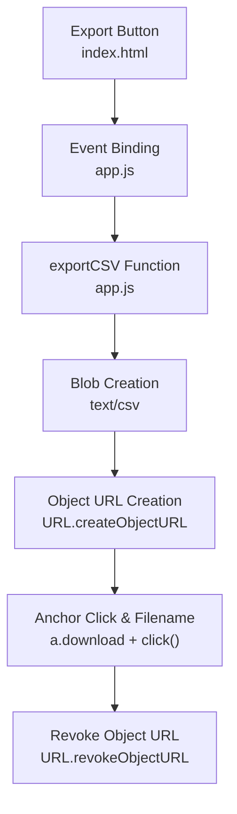
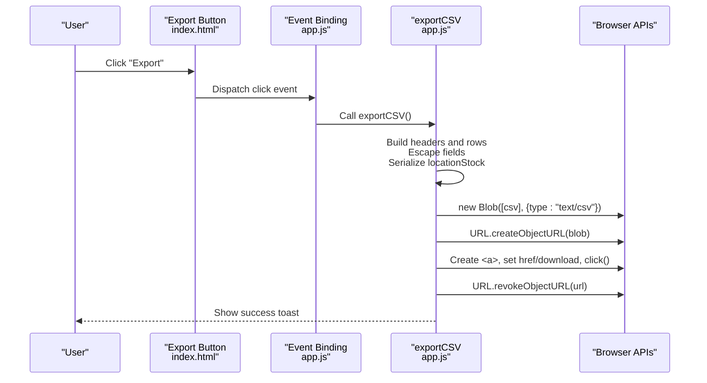
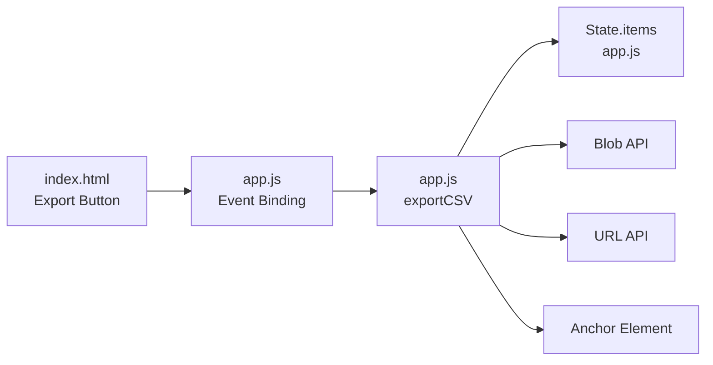

# CSV Export Generation

<cite>
**Referenced Files in This Document**
- [app.js](file://app.js)
- [index.html](file://index.html)
- [README.md](file://README.md)
</cite>

## Table of Contents
1. [Introduction](#introduction)
2. [Project Structure](#project-structure)
3. [Core Components](#core-components)
4. [Architecture Overview](#architecture-overview)
5. [Detailed Component Analysis](#detailed-component-analysis)
6. [Dependency Analysis](#dependency-analysis)
7. [Performance Considerations](#performance-considerations)
8. [Troubleshooting Guide](#troubleshooting-guide)
9. [Conclusion](#conclusion)

## Introduction
This document explains the CSV export functionality in Shadow Ledger, focusing on the exportCSV function that generates a properly formatted CSV file for inventory data. It covers header order, field escaping rules (including double quotes and embedded commas), special character handling, serialization of complex nested location stock mappings via JSON.stringify, blob creation, download link generation, automatic filename formatting with timestamps, and compatibility considerations for spreadsheet applications. It also includes performance guidance for large dataset exports and browser memory management during file generation.

## Project Structure
The CSV export feature is implemented within the main application logic and triggered from the UI:
- The export button is defined in the HTML interface.
- The exportCSV function resides in the primary application script.
- The README confirms CSV export as a core feature.

**Diagram sources**
- [index.html:370-374](file://index.html#L370-L374)
- [app.js:2133-2134](file://app.js#L2133-L2134)
- [app.js:1853-1872](file://app.js#L1853-L1872)

**Section sources**
- [index.html:370-374](file://index.html#L370-L374)
- [app.js:2133-2134](file://app.js#L2133-L2134)
- [README.md:12](file://README.md#L12)

## Core Components
- Header definition order: The export defines a fixed sequence of columns to ensure consistent output across exports.
- Field escaping: All fields are wrapped in double quotes; internal double quotes are escaped by doubling them.
- Special characters: Because values are quoted, embedded commas and other special characters are preserved safely.
- Complex field serialization: The locationStock map is serialized using JSON.stringify to preserve nested structure.
- File generation: A Blob is created with text/csv MIME type, an object URL is generated, and a temporary anchor element triggers the download with a timestamped filename.
- Memory cleanup: The object URL is revoked after triggering the download to free memory.

**Section sources**
- [app.js:1853-1872](file://app.js#L1853-L1872)

## Architecture Overview
The CSV export flow is straightforward: user clicks the Export button, which invokes exportCSV. The function builds CSV content from the current state, creates a Blob, generates a download link, and initiates the download. Afterward, it revokes the object URL to release memory.

**Diagram sources**
- [index.html:370-374](file://index.html#L370-L374)
- [app.js:2133-2134](file://app.js#L2133-L2134)
- [app.js:1853-1872](file://app.js#L1853-L1872)

## Detailed Component Analysis

### Header Definition Order
The export uses a fixed header array defining the column order:
- sku
- name
- category
- datasheetUrl
- totalStock
- buildingStock
- carrierTrigger
- maxCapacity
- purchasingTrigger
- locationStock

This order ensures predictable parsing by downstream tools and aligns with import expectations.

**Section sources**
- [app.js:1854](file://app.js#L1854)

### Field Escaping and Special Character Handling
- Every field value is converted to a string and wrapped in double quotes.
- Any existing double quotes inside a field are escaped by replacing each quote with two quotes.
- As a result, fields containing commas, line breaks, or other special characters remain intact when opened in spreadsheet applications.

Practical implications:
- Embedded commas do not break row/column alignment because the entire field is quoted.
- Embedded quotes are preserved correctly due to doubling.
- Non-string values are coerced to strings before quoting.

**Section sources**
- [app.js:1856-1861](file://app.js#L1856-L1861)

### Location Stock Serialization (locationStock)
- The locationStock field contains a map of location IDs to quantities.
- For this field, the exporter serializes the object into a JSON string using JSON.stringify.
- The resulting JSON string is then quoted like any other field, ensuring safe transport in CSV.

Example behavior:
- If an item has no locationStock, an empty object is serialized to "{}".
- If an item has multiple locations, the JSON preserves keys and numeric values.

Note: Spreadsheet applications will treat the JSON string as a single cell value. To analyze per-location breakdowns, you can parse the JSON in your preferred tool.

**Section sources**
- [app.js:1857-1859](file://app.js#L1857-L1859)

### Blob Creation, Download Link Generation, and Filename Formatting
- The CSV content is assembled as a single string and passed to new Blob with MIME type text/csv.
- An object URL is created via URL.createObjectURL(blob).
- A temporary anchor element is created, its href set to the object URL, and its download attribute set to a filename including a date stamp derived from ISO format truncated to the first 10 characters (YYYY-MM-DD).
- The anchor is programmatically clicked to trigger the download.
- Finally, URL.revokeObjectURL(url) is called to release the in-memory reference.

Filename example pattern:
- shadow_ledger_export_YYYY-MM-DD.csv

**Section sources**
- [app.js:1863-1870](file://app.js#L1863-L1870)

### Event Binding and Trigger Point
- The Export button in the UI is bound to the exportCSV function via an event listener.
- When clicked, the handler calls exportCSV, initiating the entire pipeline described above.

**Section sources**
- [index.html:370-374](file://index.html#L370-L374)
- [app.js:2133-2134](file://app.js#L2133-L2134)

### Data Model Context for Export Fields
- Items include standard inventory fields plus a locationStock map used for multi-location tracking.
- The exporter maps these fields directly into CSV rows, preserving all available information.

Key relationships:
- locationStock is a nested object mapping location IDs to stock counts.
- Other fields are primitive values (strings or numbers) that are coerced to strings for CSV.

**Section sources**
- [app.js:1855-1861](file://app.js#L1855-L1861)

### Example Export Structure
- First line: comma-separated header names in the defined order.
- Subsequent lines: one row per inventory item, with values corresponding to the header order.
- The last column (locationStock) contains a JSON string representing the location-to-stock map.

Compatibility notes:
- Most spreadsheet applications (Excel, Google Sheets, LibreOffice Calc) will open the CSV correctly.
- Quoted fields handle embedded commas and quotes without misalignment.
- The JSON string in locationStock will appear as a single cell value; you may need to parse it externally if you want to expand it into separate columns.

[No sources needed since this section describes conceptual output structure]

## Dependency Analysis
The export feature depends on:
- UI elements: Export button in index.html.
- Application state: Current items list in app.js.
- Browser APIs: Blob, URL.createObjectURL, URL.revokeObjectURL, and DOM anchor element for downloads.

**Diagram sources**
- [index.html:370-374](file://index.html#L370-L374)
- [app.js:2133-2134](file://app.js#L2133-L2134)
- [app.js:1853-1872](file://app.js#L1853-L1872)

**Section sources**
- [index.html:370-374](file://index.html#L370-L374)
- [app.js:2133-2134](file://app.js#L2133-L2134)
- [app.js:1853-1872](file://app.js#L1853-L1872)

## Performance Considerations
- Large datasets: Building a single large CSV string in memory can be expensive. For very large inventories, consider streaming chunks or using a stream-based approach to reduce peak memory usage.
- String concatenation: Joining many rows into one string is efficient but still holds the entire CSV in memory. Evaluate chunked processing if exporting thousands of records.
- JSON serialization: Serializing locationStock for each item adds overhead proportional to the number of locations per item. Keep location maps concise.
- Browser memory management: The code already revokes the object URL after download, preventing long-lived references. Avoid retaining additional references to the Blob or URL beyond the export lifecycle.
- UI responsiveness: The export runs synchronously; for extremely large exports, consider offloading work to a Web Worker to keep the UI responsive.

[No sources needed since this section provides general guidance]

## Troubleshooting Guide
Common issues and resolutions:
- Incorrect column alignment: Ensure values containing commas are properly quoted. The exporter wraps all fields in quotes and escapes internal quotes, so this should be handled automatically.
- locationStock appears as a JSON string: This is expected. Parse the JSON in your spreadsheet tool if you need to split into separate columns.
- Missing data in exported rows: Verify that State.items contains the expected records at export time.
- Download does not start: Some browsers block programmatic downloads unless initiated by a user gesture. The export is triggered by a click event, which satisfies this requirement.
- Memory warnings on large exports: Reduce dataset size or implement chunked/streaming export strategies.

**Section sources**
- [app.js:1853-1872](file://app.js#L1853-L1872)

## Conclusion
The CSV export in Shadow Ledger produces a well-structured, spreadsheet-compatible file with a fixed header order, robust field escaping, and proper handling of complex nested data through JSON serialization. The implementation leverages standard browser APIs to create a Blob, generate a downloadable link, and manage memory efficiently by revoking object URLs. For large datasets, consider streaming approaches to improve performance and maintain UI responsiveness.