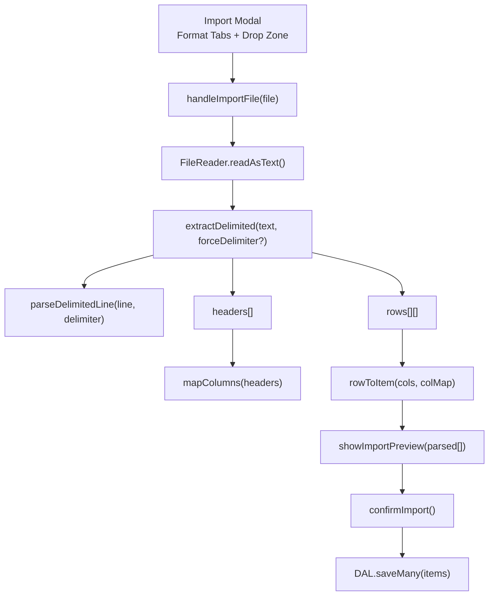
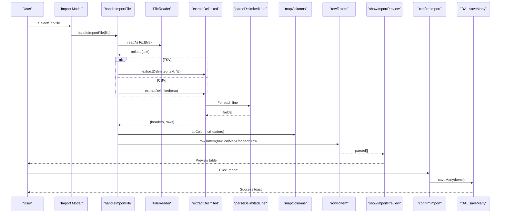
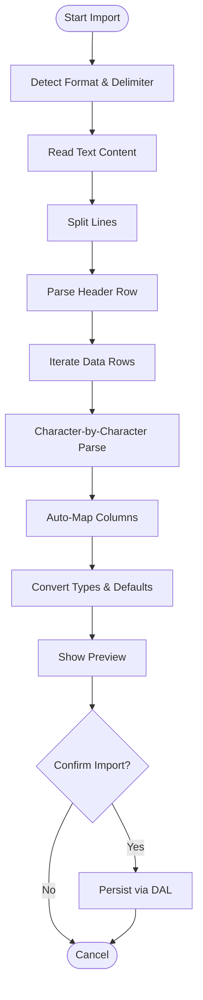
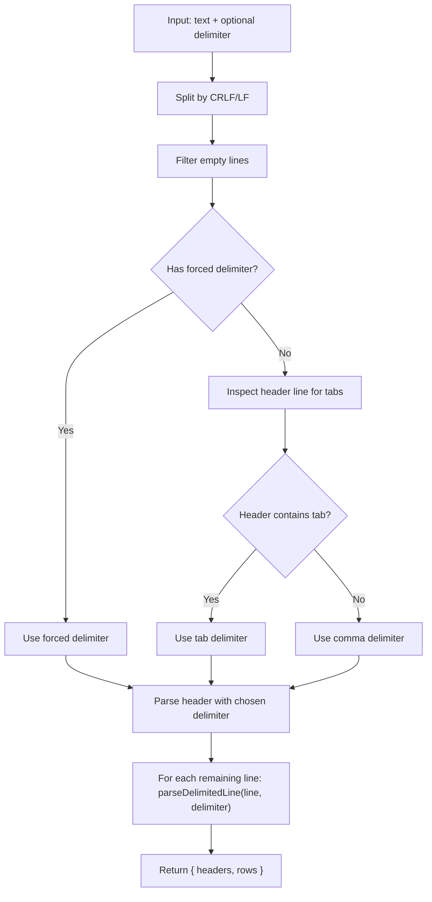
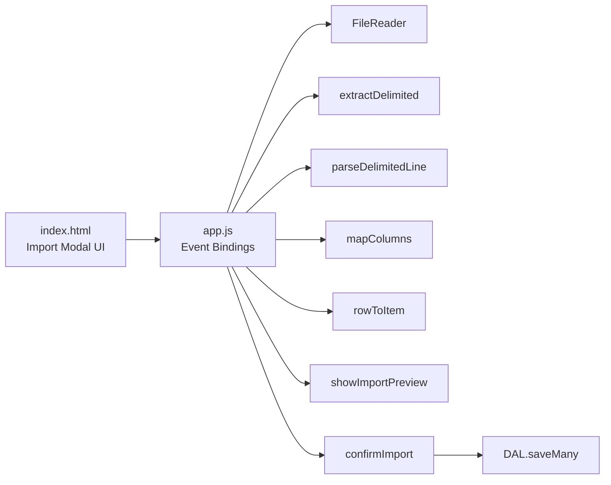

# CSV/TSV Import Processing

<cite>
**Referenced Files in This Document**
- [app.js](file://app.js)
- [index.html](file://index.html)
- [test.csv](file://test.csv)
</cite>

## Table of Contents
1. [Introduction](#introduction)
2. [Project Structure](#project-structure)
3. [Core Components](#core-components)
4. [Architecture Overview](#architecture-overview)
5. [Detailed Component Analysis](#detailed-component-analysis)
6. [Dependency Analysis](#dependency-analysis)
7. [Performance Considerations](#performance-considerations)
8. [Troubleshooting Guide](#troubleshooting-guide)
9. [Conclusion](#conclusion)
10. [Appendices](#appendices)

## Introduction
This document explains how Shadow Ledger imports and processes CSV and TSV files. It focuses on the delimited text parsing system, including automatic delimiter detection, quote handling, and line-by-line processing. It details the extractDelimited function for both comma-separated and tab-separated values with proper escaping and unescaping, and the parseDelimitedLine function’s character-by-character parsing logic for quoted fields and embedded delimiters. It also covers header validation, data type conversion, error handling for malformed files, performance considerations for large delimited files, and memory management strategies.

## Project Structure
The import functionality is implemented primarily in the application script and driven by a modal UI:
- The import modal provides format selection (CSV, Excel, JSON, TSV), file drop zone, column mapping, preview, and confirmation.
- The core parsing logic resides in the application script and includes functions to extract headers and rows from delimited text, map columns, convert types, and persist results.



**Diagram sources**
- [app.js:1668-1708](file://app.js#L1668-L1708)
- [app.js:1587-1619](file://app.js#L1587-L1619)
- [app.js:1552-1585](file://app.js#L1552-L1585)
- [app.js:1764-1826](file://app.js#L1764-L1826)
- [index.html:676-816](file://index.html#L676-L816)

**Section sources**
- [index.html:676-816](file://index.html#L676-L816)
- [app.js:1668-1708](file://app.js#L1668-L1708)

## Core Components
- File handler: Reads user-selected or dropped files, auto-detects format, and delegates to the appropriate extractor.
- Delimited extractor: Splits text into lines, detects delimiter, parses headers, and maps each subsequent line into an array of fields using a robust parser.
- Line parser: Character-by-character state machine that handles quotes, escaped quotes, and embedded delimiters.
- Column mapper: Normalizes and matches incoming headers to internal field names.
- Row converter: Converts raw string arrays into typed item objects with defaults for numeric fields.
- Preview and persistence: Displays a sample of parsed items and writes them to the database in merge or replace mode.

Key responsibilities and interactions are illustrated below.



**Diagram sources**
- [app.js:1668-1708](file://app.js#L1668-L1708)
- [app.js:1587-1619](file://app.js#L1587-L1619)
- [app.js:1552-1585](file://app.js#L1552-L1585)
- [app.js:1764-1826](file://app.js#L1764-L1826)

**Section sources**
- [app.js:1587-1619](file://app.js#L1587-L1619)
- [app.js:1552-1585](file://app.js#L1552-L1585)
- [app.js:1668-1708](file://app.js#L1668-L1708)
- [app.js:1764-1826](file://app.js#L1764-L1826)

## Architecture Overview
The import pipeline is event-driven and modular:
- UI events trigger file reading.
- Format-specific extraction normalizes input into a common structure: headers and rows.
- Mapping aligns external headers to internal schema.
- Conversion applies type coercion and defaults.
- Preview allows verification before committing to storage.



[No sources needed since this diagram shows conceptual workflow, not actual code structure]

## Detailed Component Analysis

### Delimited Text Parsing System
- Automatic delimiter detection: If no explicit delimiter is provided, the first line is inspected; if it contains tabs, tabs are used, otherwise commas are assumed.
- Quote handling: Fields may be enclosed in double quotes. Embedded quotes are represented by doubling the quote character within a quoted field.
- Line-by-line processing: After splitting on newline sequences, each non-empty line is parsed independently.



**Diagram sources**
- [app.js:1587-1598](file://app.js#L1587-L1598)

**Section sources**
- [app.js:1587-1598](file://app.js#L1587-L1598)

### extractDelimited Function
Responsibilities:
- Normalize line endings and remove blank lines.
- Validate minimum content (header plus at least one data row).
- Determine delimiter when not explicitly provided.
- Parse header row, trimming whitespace and stripping surrounding quotes.
- Map each subsequent line into an array of fields using the robust parser.

Behavioral notes:
- Returns null if fewer than two non-empty lines exist.
- Trims and unquotes header tokens.
- Preserves order of fields per row.

Complexity:
- Time: O(N) where N is total characters across all lines.
- Space: O(M) where M is the number of fields across all rows.

**Section sources**
- [app.js:1587-1598](file://app.js#L1587-L1598)

### parseDelimitedLine Function
Responsibilities:
- Implement a stateful scanner over the line characters.
- Track whether the current position is inside a quoted field.
- Handle escaped quotes by recognizing doubled quotes within a quoted field.
- Emit a new field upon encountering the delimiter outside quotes.
- Append the final accumulated field after the loop.

Parsing rules:
- Quotes toggle quoting state.
- Doubled quotes inside quotes represent a literal quote.
- Delimiters only split fields when outside quotes.
- Any other characters are appended to the current field.

Complexity:
- Time: O(L) where L is the length of the line.
- Space: O(F) where F is the number of fields produced.

```mermaid
flowchart TD
S["Start parseDelimitedLine(line, delimiter)"] --> Init["result=[], current='', inQuotes=false"]
Init --> Loop{"i < line.length"}
Loop --> |Yes| Ch["ch = line[i]"]
Ch --> InQ{"inQuotes?"}
InQ --> |Yes| QCh{"ch == '\"' ?"}
QCh --> |Yes| NextQ{"line[i+1] == '\"' ?"}
NextQ --> |Yes| Esc["current += '\"'; i++"] --> Loop
NextQ --> |No| Unquote["inQuotes = false"] --> Loop
QCh --> |No| AppendQ["current += ch"] --> Loop
InQ --> |No| NonQ{"ch == '\"' ?"}
NonQ --> |Yes| EnterQ["inQuotes = true"] --> Loop
NonQ --> |No| Delim{"ch == delimiter ?"}
Delim --> |Yes| Push["result.push(current); current=''"] --> Loop
Delim --> |No| Append["current += ch"] --> Loop
Loop --> |No| Final["result.push(current)"] --> Ret["return result"]
```

**Diagram sources**
- [app.js:1600-1619](file://app.js#L1600-L1619)

**Section sources**
- [app.js:1600-1619](file://app.js#L1600-L1619)

### Header Validation and Auto-Mapping
- The importer accepts multiple header name variants and normalizes them to internal field identifiers.
- Matching is case-insensitive and ignores non-alphanumeric characters during comparison.
- Supported mappings include SKU, Name, Category, Datasheet URL, Total Stock, Building Stock, Carrier Trigger, Max Capacity, and Purchasing Trigger.

Supported header variants (non-exhaustive):
- SKU: sku, itemcode, code, productcode, stockcode, partno, partnumber, articlenumber
- Name: name, itemname, productname, description, item, itemdescription, desc
- Category: category, cat, group, type, productgroup, itemgroup
- Datasheet URL: datasheeturl, datasheet, url, link, producturl, productlink, specsheet, productpage
- Total Stock: totalstock, total, qty, quantity, stockqty, onhand, qtyonhand, stockonhand, available
- Building Stock: buildingstock, building, bldgstock, sitestock, localstock, buildingqty
- Carrier Trigger: carriertrigger, carrier, carriermin, mintransfer, transfermin
- Max Capacity: maxcapacity, max, maxbuilding, maxbldg, capacity, maxqty
- Purchasing Trigger: purchasingtrigger, purchasing, reorder, reorderlevel, minstock, reorderpoint

Validation behavior:
- At least one of SKU or Name must be mapped to proceed.
- Missing numeric fields default to safe values.

**Section sources**
- [app.js:1552-1567](file://app.js#L1552-L1567)
- [app.js:1753-1756](file://app.js#L1753-L1756)

### Data Type Conversion
- String fields are trimmed and coerced to strings.
- Numeric fields are parsed as integers; invalid values fall back to defaults:
  - Total Stock: 0
  - Building Stock: 0
  - Carrier Trigger: 5
  - Max Capacity: 20
  - Purchasing Trigger: 10

This ensures robustness against malformed or missing numeric data.

**Section sources**
- [app.js:1569-1585](file://app.js#L1569-L1585)

### Error Handling for Malformed Files
- Empty or insufficiently populated files return null from the extractor and trigger an error toast indicating no valid data found.
- Invalid JSON or unsupported formats are handled gracefully without crashing the UI.
- During import confirmation, the system validates that at least one identifier (SKU or Name) is mapped.

Common error scenarios:
- No header or no data rows: “No valid data found. Check file format and headers.”
- Missing required mapping: “You must map at least SKU or Name”
- Unexpected formats: Silently ignored or rejected with user feedback.

**Section sources**
- [app.js:1699-1703](file://app.js#L1699-L1703)
- [app.js:1753-1756](file://app.js#L1753-L1756)

### Examples of Supported Formats
- CSV example (comma-separated):
  - Header row followed by data rows.
  - Example file included in the repository demonstrates basic usage.
- TSV example (tab-separated):
  - Same schema as CSV but uses tabs.
  - Useful when pasting from spreadsheets or clipboard.

Notes:
- Quoted fields are supported in both CSV and TSV.
- Embedded delimiters within quoted fields are preserved.

**Section sources**
- [test.csv:1-4](file://test.csv#L1-L4)
- [app.js:1694-1697](file://app.js#L1694-L1697)

## Dependency Analysis
The import subsystem depends on:
- DOM elements for modal UI and file input.
- FileReader API for reading text content.
- Internal helpers for mapping and conversion.
- Database Access Layer (DAL) for persistence.



**Diagram sources**
- [index.html:676-816](file://index.html#L676-L816)
- [app.js:1668-1708](file://app.js#L1668-L1708)
- [app.js:1587-1619](file://app.js#L1587-L1619)
- [app.js:1552-1585](file://app.js#L1552-L1585)
- [app.js:1764-1826](file://app.js#L1764-L1826)

**Section sources**
- [app.js:1668-1708](file://app.js#L1668-L1708)
- [app.js:1587-1619](file://app.js#L1587-L1619)
- [app.js:1552-1585](file://app.js#L1552-L1585)
- [app.js:1764-1826](file://app.js#L1764-L1826)

## Performance Considerations
Current implementation characteristics:
- Entire file is loaded into memory via FileReader.readAsText.
- Lines are split and processed sequentially.
- Each line is parsed character-by-character.

Implications:
- Memory usage scales linearly with file size due to full-text loading and intermediate arrays.
- CPU time scales linearly with total characters.

Recommendations for large delimited files:
- Stream processing: Use a streaming reader or chunked FileReader to avoid loading the entire file into memory.
- Incremental parsing: Process lines as they arrive rather than splitting the whole text upfront.
- Lazy mapping and conversion: Convert rows on demand and batch writes to reduce peak memory.
- Backpressure and progress: Provide UI feedback and allow cancellation for very large uploads.
- Avoid unnecessary copies: Reuse buffers and minimize intermediate string allocations.

[No sources needed since this section provides general guidance]

## Troubleshooting Guide
Common issues and resolutions:
- No valid data found: Ensure the file has a header row and at least one data row. Verify correct format (CSV vs TSV) and delimiter.
- Incorrect mapping: Use the column mapping UI to align source headers to expected fields. Remember that matching is case-insensitive and ignores non-alphanumeric characters.
- Missing numeric values: These will default to safe values; verify your source data if unexpected defaults appear.
- Large files: If the browser becomes unresponsive, consider splitting the file into smaller chunks or using a server-side preprocessor.

Operational checks:
- Confirm that the file extension matches the selected format.
- Validate that quoted fields use double quotes and escaped quotes are doubled.
- Ensure there are no trailing empty lines that could be misinterpreted.

**Section sources**
- [app.js:1699-1703](file://app.js#L1699-L1703)
- [app.js:1753-1756](file://app.js#L1753-L1756)

## Conclusion
Shadow Ledger’s CSV/TSV import pipeline provides a robust, user-friendly way to ingest inventory data. The delimited text parser supports automatic delimiter detection, proper quote handling, and flexible header mapping. With clear previews and safe defaults, it minimizes errors while accommodating diverse source formats. For very large files, consider stream-based enhancements to improve memory efficiency and responsiveness.

[No sources needed since this section summarizes without analyzing specific files]

## Appendices

### Supported Header Variants Reference
- SKU: sku, itemcode, code, productcode, stockcode, partno, partnumber, articlenumber
- Name: name, itemname, productname, description, item, itemdescription, desc
- Category: category, cat, group, type, productgroup, itemgroup
- Datasheet URL: datasheeturl, datasheet, url, link, producturl, productlink, specsheet, productpage
- Total Stock: totalstock, total, qty, quantity, stockqty, onhand, qtyonhand, stockonhand, available
- Building Stock: buildingstock, building, bldgstock, sitestock, localstock, buildingqty
- Carrier Trigger: carriertrigger, carrier, carriermin, mintransfer, transfermin
- Max Capacity: maxcapacity, max, maxbuilding, maxbldg, capacity, maxqty
- Purchasing Trigger: purchasingtrigger, purchasing, reorder, reorderlevel, minstock, reorderpoint

**Section sources**
- [app.js:1552-1567](file://app.js#L1552-L1567)