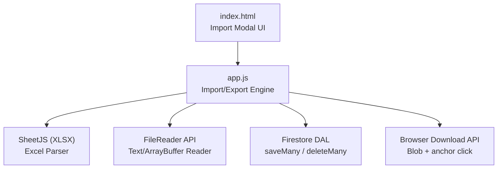
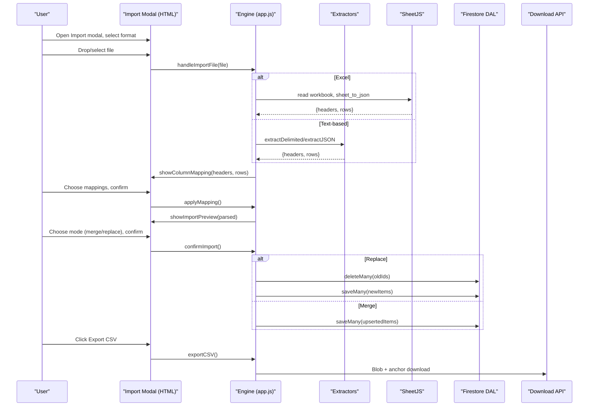
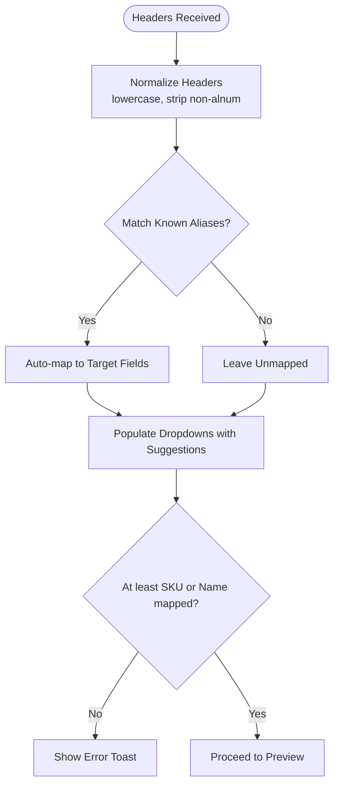
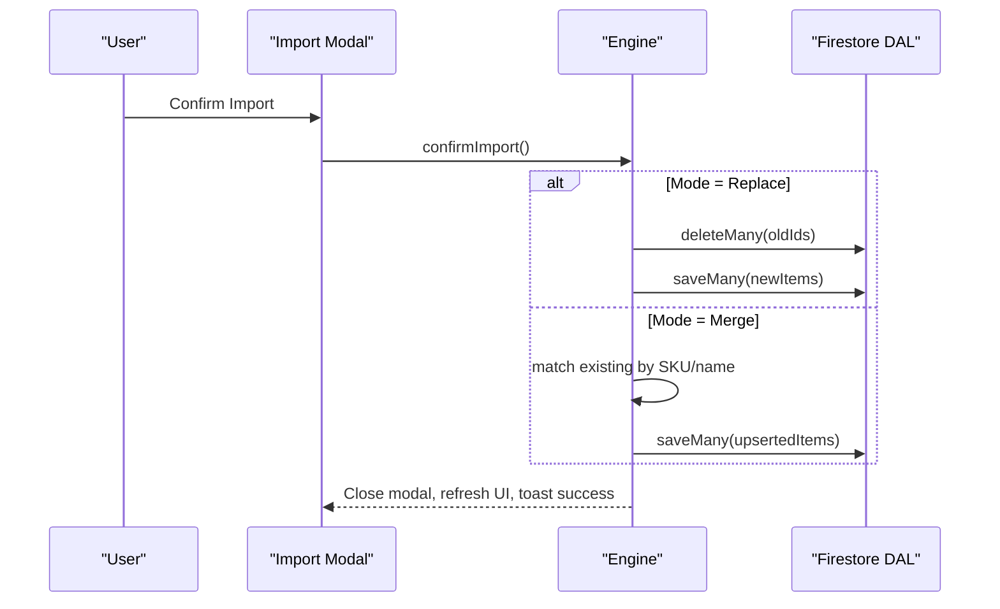
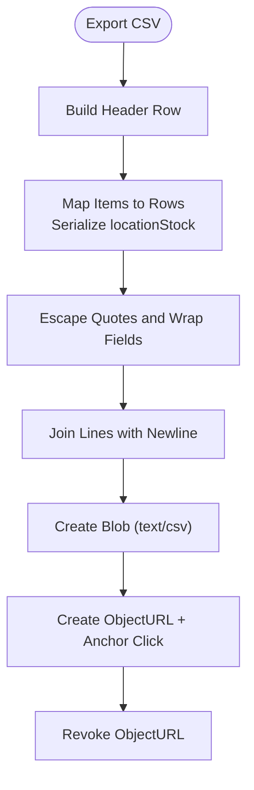
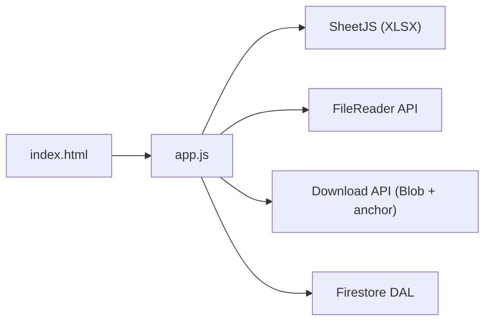

# Data Import/Export Engine

<cite>
**Referenced Files in This Document**
- [README.md](file://README.md)
- [app.js](file://app.js)
- [index.html](file://index.html)
- [test.csv](file://test.csv)
</cite>

## Table of Contents
1. [Introduction](#introduction)
2. [Project Structure](#project-structure)
3. [Core Components](#core-components)
4. [Architecture Overview](#architecture-overview)
5. [Detailed Component Analysis](#detailed-component-analysis)
6. [Dependency Analysis](#dependency-analysis)
7. [Performance Considerations](#performance-considerations)
8. [Troubleshooting Guide](#troubleshooting-guide)
9. [Conclusion](#conclusion)
10. [Appendices](#appendices)

## Introduction
This document explains the multi-format data import/export engine used by Shadow Ledger (St3s). It covers supported formats (CSV, Excel .xlsx/.xls, JSON, TSV), intelligent column mapping and auto-detection, the end-to-end import workflow (parsing, validation, merge vs replace modes, preview before confirmation), and the export system that generates properly escaped CSV files including a location stock map. It also documents error handling strategies, data transformation processes, batch operation support, performance considerations for large datasets, and troubleshooting guidance.

## Project Structure
The import/export functionality is implemented primarily in the application logic file with UI wiring in the HTML page:
- Application logic: centralized functions for parsing, mapping, previewing, importing, and exporting
- UI: modal dialogs, format tabs, drop zone, mapping selectors, preview table, and confirm actions
- Sample data: example CSV to validate import behavior



**Diagram sources**
- [index.html:676-816](file://index.html#L676-L816)
- [app.js:1548-1863](file://app.js#L1548-L1863)

**Section sources**
- [README.md:11-12](file://README.md#L11-L12)
- [index.html:676-816](file://index.html#L676-L816)
- [app.js:1548-1863](file://app.js#L1548-L1863)

## Core Components
- Unified Column Mapper: maps diverse source headers to internal fields using fuzzy matching rules
- Format Extractors:
  - CSV/TSV parser with quoted field handling and delimiter auto-detection
  - JSON extractor supporting arrays or objects containing an array
  - Excel extractor via SheetJS reading the first sheet as tabular data
- File Handler: accepts drag-and-drop or file input, auto-detects format from extension, reads content
- Mapping UI: populates dropdowns per target field with auto-mapped suggestions; requires at least SKU or Name mapped
- Preview: renders first 10 rows after mapping for user review
- Import Modes:
  - Merge: updates existing items by SKU or name if present; adds new items otherwise
  - Replace: deletes all current items and replaces with imported dataset
- Export: builds a CSV with standard columns plus a serialized locationStock map, with proper escaping

**Section sources**
- [app.js:1552-1585](file://app.js#L1552-L1585)
- [app.js:1587-1640](file://app.js#L1587-L1640)
- [app.js:1642-1708](file://app.js#L1642-L1708)
- [app.js:1710-1741](file://app.js#L1710-L1741)
- [app.js:1743-1778](file://app.js#L1743-L1778)
- [app.js:1780-1826](file://app.js#L1780-L1826)
- [app.js:1844-1863](file://app.js#L1844-L1863)

## Architecture Overview
The import/export engine follows a clear pipeline:
- User selects format and provides a file
- File is parsed into raw headers and rows
- Column mapping UI appears with auto-suggestions
- User confirms mapping and previews results
- User chooses import mode (merge or replace) and confirms
- Batch write operations are executed via Firestore DAL
- Export creates a downloadable CSV with correct escaping and includes locationStock map



**Diagram sources**
- [index.html:676-816](file://index.html#L676-L816)
- [app.js:1642-1708](file://app.js#L1642-L1708)
- [app.js:1710-1741](file://app.js#L1710-L1741)
- [app.js:1743-1778](file://app.js#L1743-L1778)
- [app.js:1780-1826](file://app.js#L1780-L1826)
- [app.js:1844-1863](file://app.js#L1844-L1863)

## Detailed Component Analysis

### Supported Formats and Auto-Detection
- CSV: comma-delimited, supports quoted fields and embedded commas/newlines
- TSV: tab-delimited; auto-detected when header contains tabs
- JSON: expects an array or an object with one array property; flattens keys across records to derive headers
- Excel (.xlsx/.xls): uses SheetJS to read the first sheet; first row treated as headers

Auto-detection prioritizes file extension but allows overriding via selected format tab. If mismatched, it switches to detected format automatically.

**Section sources**
- [app.js:1587-1640](file://app.js#L1587-L1640)
- [app.js:1642-1708](file://app.js#L1642-L1708)

### Intelligent Column Mapping
- The mapper normalizes headers by lowercasing and stripping non-alphanumeric characters
- Recognizes multiple aliases for each target field:
  - SKU: sku, itemcode, code, productcode, stockcode, partno, partnumber, articlenumber
  - Name: name, itemname, productname, description, item, itemdescription, desc
  - Category: category, cat, group, type, productgroup, itemgroup
  - Datasheet URL: datasheeturl, datasheet, url, link, producturl, productlink, specsheet, productpage
  - Total Stock: totalstock, total, qty, quantity, stockqty, onhand, qtyonhand, stockonhand, available
  - Building Stock: buildingstock, building, bldgstock, sitestock, localstock, buildingqty
  - Carrier Trigger: carriertrigger, carrier, carriermin, mintransfer, transfermin
  - Max Capacity: maxcapacity, max, maxbuilding, maxbldg, capacity, maxqty
  - Purchasing Trigger: purchasingtrigger, purchasing, reorder, reorderlevel, minstock, reorderpoint
- UI pre-selects best matches based on mapping rules; users can adjust or skip fields
- Validation enforces at least SKU or Name mapped



**Diagram sources**
- [app.js:1552-1585](file://app.js#L1552-L1585)
- [app.js:1710-1741](file://app.js#L1710-L1741)
- [app.js:1743-1762](file://app.js#L1743-L1762)

**Section sources**
- [app.js:1552-1585](file://app.js#L1552-L1585)
- [app.js:1710-1741](file://app.js#L1710-L1741)
- [app.js:1743-1762](file://app.js#L1743-L1762)

### Parsing and Data Transformation
- CSV/TSV line parser handles quoted strings and escapes double quotes within fields
- Numeric fields default to safe values when missing or invalid:
  - totalStock/buildingStock/carrierTrigger/maxCapacity/purchasingTrigger default to 0 or configured defaults
- JSON extractor collects unique keys across all objects to build headers and maps values accordingly
- Excel extraction converts the first sheet to a two-dimensional array and treats the first row as headers

```mermaid
classDiagram
class ColumnMapper {
+mapColumns(headers) Map
}
class RowTransformer {
+rowToItem(cols, colMap) Item
}
class CSVParser {
+extractDelimited(text, forceDelimiter) {headers, rows}
+parseDelimitedLine(line, delimiter) string[]
}
class JSONExtractor {
+extractJSON(text) {headers, rows}
}
class ExcelExtractor {
+readFirstSheet(buffer) {headers, rows}
}
ColumnMapper --> RowTransformer : "provides colMap"
CSVParser --> RowTransformer : "feeds cols"
JSONExtractor --> RowTransformer : "feeds cols"
ExcelExtractor --> RowTransformer : "feeds cols"
```

**Diagram sources**
- [app.js:1552-1585](file://app.js#L1552-L1585)
- [app.js:1587-1640](file://app.js#L1587-L1640)
- [app.js:1642-1708](file://app.js#L1642-L1708)

**Section sources**
- [app.js:1587-1640](file://app.js#L1587-L1640)
- [app.js:1642-1708](file://app.js#L1642-L1708)

### Import Workflow and Modes
- Drag-and-drop or file picker triggers parsing and mapping UI
- After mapping, a preview shows up to 10 rows
- Two import modes:
  - Merge:
    - Matches by SKU (case-insensitive) or by Name if SKU not provided
    - Updates existing items and inserts new ones
    - Uses batch writes to minimize network calls
  - Replace:
    - Deletes all existing items and replaces with imported set
    - Generates new IDs for imported items



**Diagram sources**
- [app.js:1780-1826](file://app.js#L1780-L1826)

**Section sources**
- [app.js:1780-1826](file://app.js#L1780-L1826)

### Export System
- Exports all items to CSV with these columns:
  - sku, name, category, datasheetUrl, totalStock, buildingStock, carrierTrigger, maxCapacity, purchasingTrigger, locationStock
- locationStock is serialized as a JSON string to preserve per-location maps
- Proper CSV escaping:
  - All fields are wrapped in quotes
  - Embedded quotes are doubled
- Filename includes date stamp for easy identification



**Diagram sources**
- [app.js:1844-1863](file://app.js#L1844-L1863)

**Section sources**
- [app.js:1844-1863](file://app.js#L1844-L1863)

### Example Input Files
- CSV sample demonstrates how external ERP systems may provide different column names; the importer will auto-map them to internal fields

Example CSV structure:
- Columns: Artikelnummer, Description, Q_Total, Q_Bldg
- Expected mapping:
  - Artikelnummer → SKU
  - Description → Name
  - Q_Total → Total Stock
  - Q_Bldg → Building Stock

**Section sources**
- [test.csv:1-4](file://test.csv#L1-L4)
- [app.js:1552-1585](file://app.js#L1552-L1585)

## Dependency Analysis
- External Libraries:
  - SheetJS (XLSX) for Excel parsing
- Browser APIs:
  - FileReader for text/array buffer reading
  - Blob and anchor element for CSV download
- Backend:
  - Firestore via DAL for batch writes and deletions



**Diagram sources**
- [index.html:91-93](file://index.html#L91-L93)
- [app.js:1642-1708](file://app.js#L1642-L1708)
- [app.js:1844-1863](file://app.js#L1844-L1863)
- [app.js:82-97](file://app.js#L82-L97)

**Section sources**
- [index.html:91-93](file://index.html#L91-L93)
- [app.js:1642-1708](file://app.js#L1642-L1708)
- [app.js:1844-1863](file://app.js#L1844-L1863)
- [app.js:82-97](file://app.js#L82-L97)

## Performance Considerations
- Large CSV/TSV/JSON files:
  - Entire file is loaded into memory via FileReader.readAsText; consider limiting file size or implementing chunked processing for very large datasets
  - JSON extractor scans all objects to collect headers; this is O(n) over number of records
- Excel parsing:
  - SheetJS loads the entire workbook into memory; prefer smaller sheets or split workbooks
- Batch operations:
  - Use saveMany/deleteMany to reduce round-trips; currently used during import
- UI rendering:
  - Preview limits to 10 rows to avoid heavy DOM updates
- Recommendations:
  - For large imports, split files into batches of ~1k–5k rows
  - Prefer CSV/TSV over Excel for speed and memory efficiency
  - Avoid unnecessary re-parsing by caching extracted data until confirmed

[No sources needed since this section provides general guidance]

## Troubleshooting Guide
Common issues and resolutions:
- No valid data found:
  - Ensure file has headers and at least one data row
  - Verify format selection matches file type
- Missing required mapping:
  - At least one of SKU or Name must be mapped
- Invalid numeric values:
  - Non-numeric fields default to zero; check your source data
- Excel parsing errors:
  - Ensure the first sheet contains tabular data with headers in the first row
- Permission denied or unavailable errors:
  - Check Firebase rules and connectivity; the app surfaces specific messages for permission-denied and unavailable states

**Section sources**
- [app.js:1699-1708](file://app.js#L1699-L1708)
- [app.js:1743-1762](file://app.js#L1743-L1762)
- [app.js:55-70](file://app.js#L55-L70)

## Conclusion
Shadow Ledger’s import/export engine provides robust multi-format ingestion with intelligent column mapping, safe defaults, and flexible merge/replace modes. The export system ensures accurate CSV generation with proper escaping and inclusion of per-location stock maps. With batch operations and careful UI previews, the engine balances usability and reliability while remaining mindful of performance constraints for larger datasets.

[No sources needed since this section summarizes without analyzing specific files]

## Appendices

### Column Mapping Reference
- Target fields and accepted aliases:
  - SKU: sku, itemcode, code, productcode, stockcode, partno, partnumber, articlenumber
  - Name: name, itemname, productname, description, item, itemdescription, desc
  - Category: category, cat, group, type, productgroup, itemgroup
  - Datasheet URL: datasheeturl, datasheet, url, link, producturl, productlink, specsheet, productpage
  - Total Stock: totalstock, total, qty, quantity, stockqty, onhand, qtyonhand, stockonhand, available
  - Building Stock: buildingstock, building, bldgstock, sitestock, localstock, buildingqty
  - Carrier Trigger: carriertrigger, carrier, carriermin, mintransfer, transfermin
  - Max Capacity: maxcapacity, max, maxbuilding, maxbldg, capacity, maxqty
  - Purchasing Trigger: purchasingtrigger, purchasing, reorder, reorderlevel, minstock, reorderpoint

**Section sources**
- [app.js:1552-1585](file://app.js#L1552-L1585)

### Export CSV Schema
- Columns:
  - sku, name, category, datasheetUrl, totalStock, buildingStock, carrierTrigger, maxCapacity, purchasingTrigger, locationStock
- Notes:
  - locationStock is a JSON string representing per-location quantities
  - All fields are quoted; embedded quotes are doubled

**Section sources**
- [app.js:1844-1863](file://app.js#L1844-L1863)