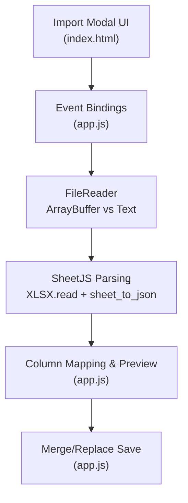
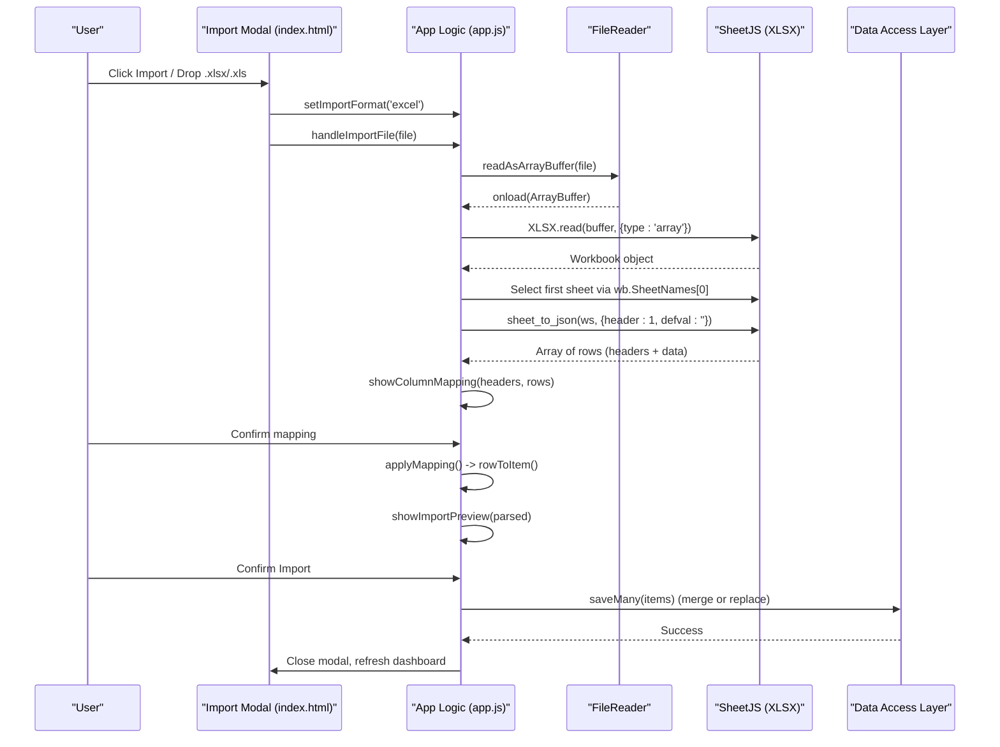
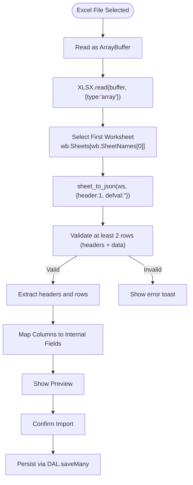
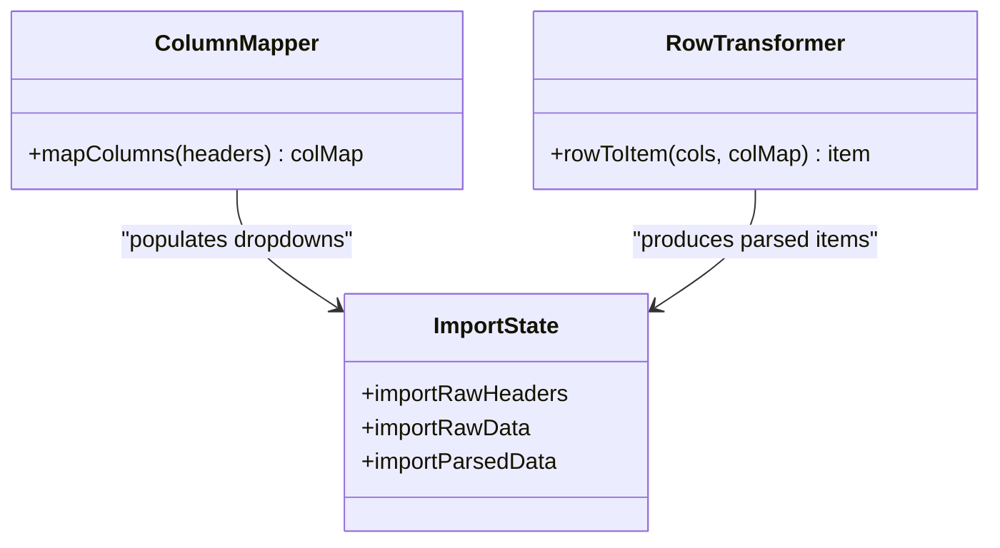
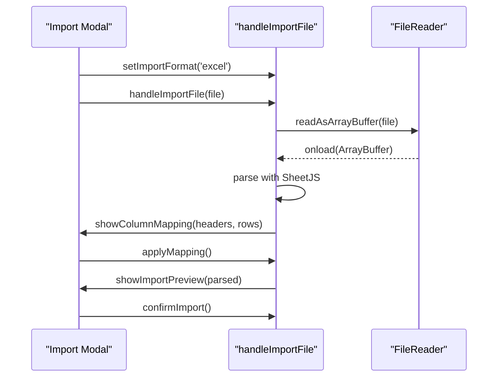
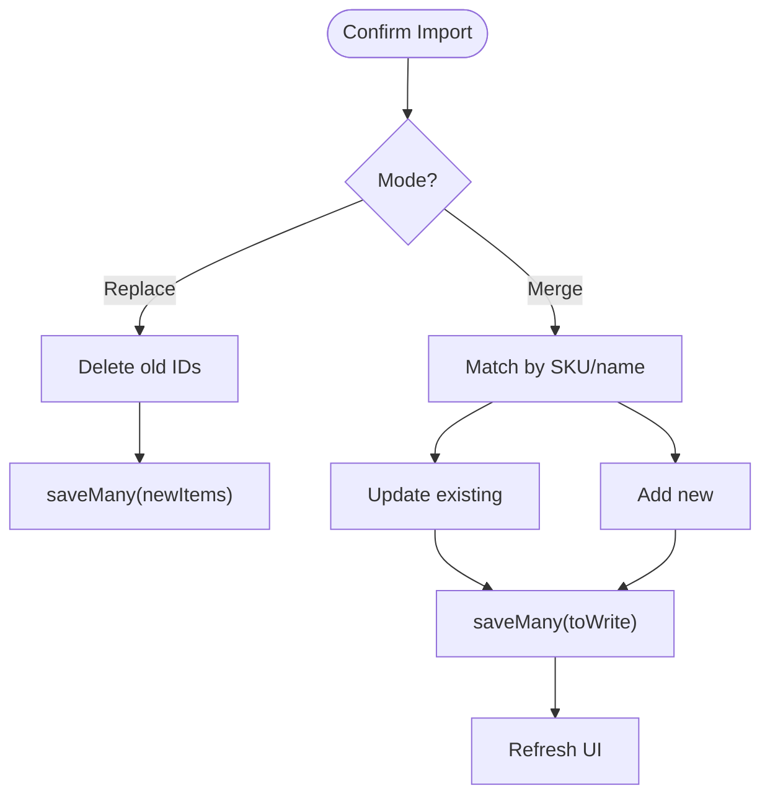
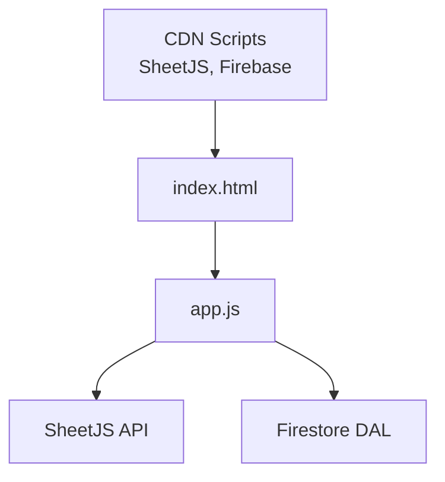

# Excel File Import

<cite>
**Referenced Files in This Document**
- [index.html](file://index.html)
- [app.js](file://app.js)
</cite>

## Table of Contents
1. [Introduction](#introduction)
2. [Project Structure](#project-structure)
3. [Core Components](#core-components)
4. [Architecture Overview](#architecture-overview)
5. [Detailed Component Analysis](#detailed-component-analysis)
6. [Dependency Analysis](#dependency-analysis)
7. [Performance Considerations](#performance-considerations)
8. [Troubleshooting Guide](#troubleshooting-guide)
9. [Conclusion](#conclusion)

## Introduction
This document explains the Excel (.xlsx/.xls) import functionality implemented with SheetJS integration. It covers how binary files are read, how worksheets are selected from workbook objects, and how sheet_to_json is used with header:1 to produce a tabular array for mapping and preview. It also documents error handling for corrupted or empty sheets, supported column mappings, data type preservation during conversion, and performance strategies for large datasets.

## Project Structure
The Excel import feature spans two primary files:
- index.html: Loads the SheetJS library via CDN and provides the import modal UI (tabs, drop zone, mapping controls, preview).
- app.js: Implements file reading, parsing, column mapping, preview, and persistence logic.

**Diagram sources**
- [index.html:91-92](file://index.html#L91-L92)
- [index.html:676-710](file://index.html#L676-L710)
- [app.js:1642-1708](file://app.js#L1642-L1708)
- [app.js:1722-1778](file://app.js#L1722-L1778)
- [app.js:1780-1826](file://app.js#L1780-L1826)

**Section sources**
- [index.html:91-92](file://index.html#L91-L92)
- [index.html:676-710](file://index.html#L676-L710)
- [app.js:1642-1708](file://app.js#L1642-L1708)
- [app.js:1722-1778](file://app.js#L1722-L1778)
- [app.js:1780-1826](file://app.js#L1780-L1826)

## Core Components
- SheetJS Library Integration: Loaded from CDN to provide XLSX.read and utils.sheet_to_json.
- File Reading Strategy:
  - Excel files are read as ArrayBuffer using FileReader.readAsArrayBuffer.
  - CSV/TSV/JSON are read as text using FileReader.readAsText.
- Worksheet Selection: The first worksheet is selected by wb.SheetNames[0] and its Sheets entry.
- Conversion to Array Rows: sheet_to_json(ws, { header: 1, defval: '' }) returns an array of arrays where the first row is headers and subsequent rows are data.
- Column Mapping: A flexible mapping layer normalizes various spreadsheet column names into internal fields.
- Preview and Confirmation: Parsed items are previewed before merge or replace operations.

**Section sources**
- [index.html:91-92](file://index.html#L91-L92)
- [app.js:1683-1708](file://app.js#L1683-L1708)
- [app.js:1687-1692](file://app.js#L1687-L1692)
- [app.js:1551-1585](file://app.js#L1551-L1585)
- [app.js:1722-1778](file://app.js#L1722-L1778)

## Architecture Overview
The Excel import flow integrates UI events, file I/O, SheetJS parsing, mapping, and persistence.

**Diagram sources**
- [index.html:676-710](file://index.html#L676-L710)
- [app.js:1642-1708](file://app.js#L1642-L1708)
- [app.js:1722-1778](file://app.js#L1722-L1778)
- [app.js:1780-1826](file://app.js#L1780-L1826)

## Detailed Component Analysis

### Excel Parsing with SheetJS
- Binary Reading: For Excel files, the code uses FileReader.readAsArrayBuffer to obtain raw bytes suitable for SheetJS.
- Workbook Creation: XLSX.read(e.target.result, { type: 'array' }) parses the ArrayBuffer into a workbook object.
- Worksheet Selection: The first worksheet is accessed via wb.Sheets[wb.SheetNames[0]].
- Tabular Conversion: XLSX.utils.sheet_to_json(ws, { header: 1, defval: '' }) converts the worksheet to an array of arrays. The first element is treated as headers; subsequent elements are data rows. Empty cells default to empty strings due to defval.

**Diagram sources**
- [app.js:1683-1708](file://app.js#L1683-L1708)
- [app.js:1687-1692](file://app.js#L1687-L1692)
- [app.js:1699-1703](file://app.js#L1699-L1703)

**Section sources**
- [app.js:1683-1708](file://app.js#L1683-L1708)
- [app.js:1687-1692](file://app.js#L1687-L1692)
- [app.js:1699-1703](file://app.js#L1699-L1703)

### Column Mapping and Data Type Preservation
- Auto-mapping: mapColumns normalizes many common spreadsheet header variants (e.g., SKU, Item Code, Product Name, Total Stock, Building Stock, Carrier Trigger, Max Capacity, Purchasing Trigger) into internal field IDs.
- Row Transformation: rowToItem maps each row’s values to internal item structures, coercing numeric fields via parseInt with defaults when invalid.
- Supported Excel Structures: Any .xlsx/.xls with a single header row followed by data rows is supported. Extra columns are ignored if not mapped. Missing numeric values default to configured defaults.

**Diagram sources**
- [app.js:1551-1585](file://app.js#L1551-L1585)
- [app.js:1722-1741](file://app.js#L1722-L1741)

**Section sources**
- [app.js:1551-1585](file://app.js#L1551-L1585)
- [app.js:1722-1741](file://app.js#L1722-L1741)

### UI Integration and Event Flow
- Format Tabs: Users can select Excel format; the drop zone and accept attributes update accordingly.
- Drag-and-Drop and File Input: Both trigger handleImportFile with the selected file.
- Preview and Confirm: After mapping, a preview table shows the first few rows; users confirm to proceed with merge or replace.

**Diagram sources**
- [index.html:676-710](file://index.html#L676-L710)
- [app.js:1642-1708](file://app.js#L1642-L1708)
- [app.js:1722-1778](file://app.js#L1722-L1778)

**Section sources**
- [index.html:676-710](file://index.html#L676-L710)
- [app.js:1642-1708](file://app.js#L1642-L1708)
- [app.js:1722-1778](file://app.js#L1722-L1778)

### Persistence and Merge/Replace Modes
- Replace Mode: Clears existing items and writes imported items directly.
- Merge Mode: Matches incoming items by SKU or name against existing records; updates matched items and adds new ones. All changes are batch-saved via DAL.saveMany.

**Diagram sources**
- [app.js:1780-1826](file://app.js#L1780-L1826)

**Section sources**
- [app.js:1780-1826](file://app.js#L1780-L1826)

## Dependency Analysis
- External Dependencies:
  - SheetJS loaded via CDN script tag.
  - Firebase SDKs for authentication and Firestore persistence.
- Internal Dependencies:
  - DOM helpers and state management within app.js.
  - Data Access Layer (DAL) for Firestore operations.

**Diagram sources**
- [index.html:48-52](file://index.html#L48-L52)
- [index.html:91-92](file://index.html#L91-L92)
- [app.js:33-132](file://app.js#L33-L132)

**Section sources**
- [index.html:48-52](file://index.html#L48-L52)
- [index.html:91-92](file://index.html#L91-L92)
- [app.js:33-132](file://app.js#L33-L132)

## Performance Considerations
- Large Datasets:
  - Prefer server-side preprocessing for very large Excel files to reduce client memory pressure.
  - Use pagination or chunked imports on the backend; client-side merge/saveMany already batches writes.
- Memory Cleanup:
  - Avoid retaining references to large intermediate arrays after import completes.
  - Reset import state (headers, raw data, parsed data) after confirmation to free memory.
- Rendering Optimization:
  - Preview only a subset of rows (first 10) to avoid heavy DOM updates.
  - Debounce user interactions where applicable.

[No sources needed since this section provides general guidance]

## Troubleshooting Guide
- Corrupted Excel Files:
  - If XLSX.read fails, the catch block prevents crashes; the code then reports “No valid data found.” Ensure the file is a valid .xlsx/.xls.
- Empty Worksheets:
  - The parser requires at least two rows (headers + one data row). Empty sheets will trigger an error toast.
- Unsupported Excel Versions:
  - Only .xlsx and .xls are accepted. Older formats outside these extensions are not supported.
- Column Mismatch:
  - At least SKU or Name must be mapped. The auto-mapper supports many common header variants; otherwise, manually map columns in the UI.
- Data Types:
  - Numeric fields are coerced via parseInt; invalid values fall back to defaults. Dates and formulas may appear as strings depending on SheetJS behavior.

**Section sources**
- [app.js:1687-1692](file://app.js#L1687-L1692)
- [app.js:1699-1703](file://app.js#L1699-L1703)
- [app.js:1753-1758](file://app.js#L1753-L1758)
- [app.js:1551-1585](file://app.js#L1551-L1585)

## Conclusion
The Excel import feature leverages SheetJS to parse binary Excel files into tabular arrays, selects the first worksheet, and converts it to rows using header:1 configuration. A robust mapping layer accommodates diverse spreadsheet headers, while preview and confirmation ensure safe data ingestion. Error handling gracefully manages corrupted or empty files, and merge/replace modes support both incremental updates and full replacements. For large datasets, consider preprocessing and careful memory management to maintain performance.