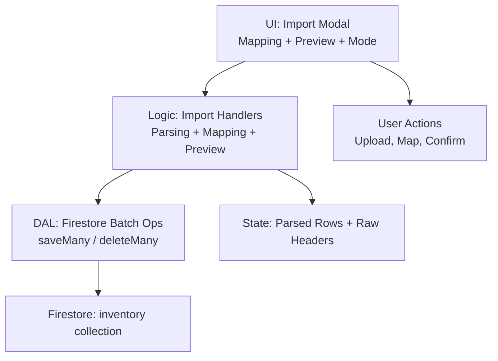
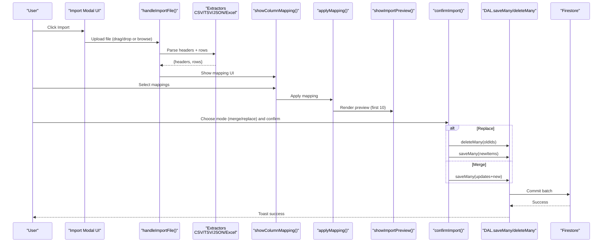
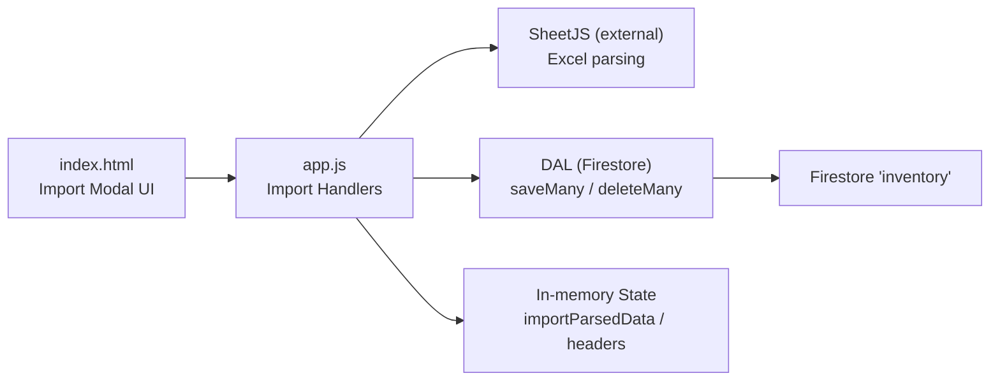

# Import Workflow and Data Processing

<cite>
**Referenced Files in This Document**
- [app.js](file://app.js)
- [index.html](file://index.html)
- [README.md](file://README.md)
- [test.csv](file://test.csv)
</cite>

## Table of Contents
1. [Introduction](#introduction)
2. [Project Structure](#project-structure)
3. [Core Components](#core-components)
4. [Architecture Overview](#architecture-overview)
5. [Detailed Component Analysis](#detailed-component-analysis)
6. [Dependency Analysis](#dependency-analysis)
7. [Performance Considerations](#performance-considerations)
8. [Troubleshooting Guide](#troubleshooting-guide)
9. [Conclusion](#conclusion)

## Introduction
This document explains the complete import workflow in Shadow Ledger from file upload to data persistence. It covers multi-format detection (CSV, TSV, JSON, Excel), column mapping, preview generation, merge vs replace modes, row-to-item transformation with type conversion and defaults, batch operations, transaction logging, error handling, and progress feedback for large imports. The system is designed to be user-friendly while ensuring robust data integrity and auditability.

## Project Structure
Shadow Ledger is a single-page application with:
- index.html: UI including import modal, mapping controls, preview table, mode selector, and confirmation buttons.
- app.js: Application logic including import parsing, mapping, preview, merge/replace execution, Firestore integration, and event bindings.
- README.md: High-level overview and quick start.
- test.csv: Sample CSV used for testing import flows.

**Diagram sources**
- [index.html:708-848](file://index.html#L708-L848)
- [app.js:1652-1835](file://app.js#L1652-L1835)

**Section sources**
- [index.html:708-848](file://index.html#L708-L848)
- [app.js:1652-1835](file://app.js#L1652-L1835)
- [README.md:1-32](file://README.md#L1-L32)

## Core Components
- File format detection and extraction:
  - Auto-detects format by extension; supports CSV, TSV, JSON, Excel (.xlsx/.xls).
  - Uses SheetJS for Excel parsing; custom parsers for delimited text and JSON arrays.
- Column mapping:
  - Presents dropdowns to map source columns to Shadow Ledger fields.
  - Auto-maps common header variants (e.g., SKU synonyms like Artikelnummer).
- Row transformation:
  - Converts mapped rows into item objects with numeric parsing and default values.
- Preview:
  - Renders first 10 rows with pagination indicator “and more” when >10.
- Merge vs Replace:
  - Merge updates existing items by SKU or name match and adds new ones.
  - Replace clears all existing items before importing.
- Persistence:
  - Uses Firestore batch writes for efficiency.
- Transaction logging:
  - Logs stock movements (scan-out and transfers); import does not log transactions by design.
- Error handling and feedback:
  - Toast notifications for errors and success; confirm dialogs for destructive actions.

**Section sources**
- [app.js:1558-1592](file://app.js#L1558-L1592)
- [app.js:1594-1649](file://app.js#L1594-L1649)
- [app.js:1652-1719](file://app.js#L1652-L1719)
- [app.js:1731-1787](file://app.js#L1731-L1787)
- [app.js:1789-1835](file://app.js#L1789-L1835)
- [index.html:708-848](file://index.html#L708-L848)

## Architecture Overview
The import flow is a sequence of UI-driven steps backed by parsing and mapping utilities, culminating in batched Firestore writes.

**Diagram sources**
- [index.html:708-848](file://index.html#L708-L848)
- [app.js:1652-1719](file://app.js#L1652-L1719)
- [app.js:1731-1787](file://app.js#L1731-L1787)
- [app.js:1789-1835](file://app.js#L1789-L1835)

## Detailed Component Analysis

### File Format Detection and Extraction
- Supported formats:
  - CSV: comma-delimited with quoted field support.
  - TSV: tab-delimited.
  - JSON: expects an array or object containing an array.
  - Excel: reads first sheet using SheetJS.
- Auto-detection:
  - If selected format differs from file extension, it switches automatically.
- Extractors:
  - extractDelimited(text, delimiter): parses headers and rows with proper quoting.
  - extractJSON(text): validates structure and normalizes to headers/rows.
  - Excel path: XLSX.read -> sheet_to_json(header:1).

Key behaviors:
- Rejects files without valid headers or rows.
- Normalizes headers by trimming and removing quotes.

**Section sources**
- [app.js:1594-1649](file://app.js#L1594-L1649)
- [app.js:1652-1719](file://app.js#L1652-L1719)

### Column Mapping
- UI presents dropdowns for each target field (SKU, Name, Category, Datasheet URL, Total Stock, Building Stock, Carrier Trigger, Max Capacity, Purchasing Trigger).
- Auto-mapping attempts to match common header names and aliases (e.g., Artikelnummer → SKU).
- Validation requires at least one of SKU or Name mapped.

Implementation highlights:
- mapColumns(headers): builds a field-to-index map based on normalized header tokens.
- showColumnMapping(headers, rows): populates dropdowns and pre-selects auto-mapped columns.
- applyMapping(): collects selections, validates, transforms rows, and shows preview.

**Section sources**
- [app.js:1558-1574](file://app.js#L1558-L1574)
- [app.js:1731-1771](file://app.js#L1731-L1771)
- [index.html:765-810](file://index.html#L765-L810)

### Row-to-Item Transformation (rowToItem)
Purpose: Convert a mapped row into a standardized inventory item object.

Behavior:
- String fields are trimmed.
- Numeric fields are parsed via parseInt with safe defaults:
  - totalStock: default 0
  - buildingStock: default 0
  - carrierTrigger: default 5
  - maxCapacity: default 20
  - purchasingTrigger: default 10
- Missing mapped columns result in empty strings for text and defaults for numbers.

Complexity:
- O(1) per row; constant number of fields.

Data types:
- Strings for identifiers and metadata.
- Numbers for quantities and thresholds.

Edge cases:
- Non-numeric values become 0.
- Empty rows filtered out during preview generation.

**Section sources**
- [app.js:1576-1592](file://app.js#L1576-L1592)

### Preview Generation
- Displays up to 10 rows in a compact table.
- Shows a count label indicating total parsed items.
- Appends a “and more” row if there are additional items beyond 10.
- Enables the final Import button only after a valid preview exists.

Validation hints:
- Requires at least SKU or Name mapped.
- Filters out rows where both SKU and Name are empty.

**Section sources**
- [app.js:1773-1787](file://app.js#L1773-L1787)
- [app.js:1752-1771](file://app.js#L1752-L1771)

### Merge vs Replace Modes
- Replace mode:
  - Clears all existing items from Firestore.
  - Replaces inventory with imported items (new IDs generated).
  - Suitable for full refresh scenarios.
- Merge mode:
  - Matches incoming items to existing ones by:
    - SKU equality (case-insensitive), or
    - Name equality (if no SKU provided).
  - Updates matched items and adds new ones.
  - Preserves existing IDs for updated items.

Operational differences:
- Replace triggers a delete-many followed by save-many.
- Merge performs targeted updates and inserts in a single batch.

Safety:
- Replace is destructive; users should be cautious.
- Merge preserves historical IDs and minimizes side effects.

**Section sources**
- [app.js:1789-1835](file://app.js#L1789-L1835)

### Batch Operations and Persistence
- DAL.saveMany(items):
  - Builds a Firestore batch with set({ merge: true }) for each item.
  - Attaches ownerId and serverTimestamp.
- DAL.deleteMany(ids):
  - Deletes multiple documents in a single batch.
- DAL.saveOne(item):
  - Used elsewhere (not in import), but demonstrates consistent write pattern.

Benefits:
- Reduces network round-trips.
- Ensures atomicity within a batch.

**Section sources**
- [app.js:82-97](file://app.js#L82-L97)
- [app.js:55-70](file://app.js#L55-L70)

### Transaction Logging
- Import operations do not create transaction logs by design.
- Other operations (scan-out, transfer) log to a transactions collection with user context and timestamps.

Implication:
- Import is treated as a bulk data operation rather than a stock movement.

**Section sources**
- [app.js:124-131](file://app.js#L124-L131)
- [app.js:1397-1409](file://app.js#L1397-L1409)
- [app.js:2431-2436](file://app.js#L2431-L2436)

### Error Handling and Recovery
- Parsing errors:
  - Invalid JSON or malformed files produce toast errors and abort import.
- Permission/network issues:
  - Firestore write errors are caught and surfaced via toast messages.
- Confirmation dialogs:
  - For destructive actions (delete, replace), a Promise-based dialog ensures explicit consent.

Recovery:
- Users can cancel mapping or preview steps.
- Errors do not mutate state until confirmed and successful.

**Section sources**
- [app.js:1708-1719](file://app.js#L1708-L1719)
- [app.js:55-70](file://app.js#L55-L70)
- [app.js:2630-2671](file://app.js#L2630-L2671)

### Progress Feedback During Large Imports
- Current behavior:
  - No real-time progress bar during batch commits.
  - Immediate toast upon completion.
- Recommendations:
  - Add a simple spinner and step indicators (parsing, mapping, preview, saving).
  - Chunk very large batches if needed and update progress incrementally.

[No sources needed since this section provides general guidance]

## Dependency Analysis

**Diagram sources**
- [index.html:708-848](file://index.html#L708-L848)
- [app.js:1652-1719](file://app.js#L1652-L1719)
- [app.js:82-97](file://app.js#L82-L97)

**Section sources**
- [index.html:708-848](file://index.html#L708-L848)
- [app.js:1652-1719](file://app.js#L1652-L1719)
- [app.js:82-97](file://app.js#L82-L97)

## Performance Considerations
- Parsing:
  - CSV/TSV parsing is linear in file size.
  - JSON parsing depends on payload size; ensure well-formed arrays.
  - Excel parsing uses SheetJS; keep sheets small and avoid excessive formatting.
- Mapping and preview:
  - Mapping is O(n) over rows; preview limits rendering to 10 rows.
- Persistence:
  - Batch writes reduce latency; consider batching size limits imposed by Firestore.
- Memory:
  - Avoid loading extremely large files into memory; consider chunking strategies if needed.

[No sources needed since this section provides general guidance]

## Troubleshooting Guide
Common issues and resolutions:
- No valid data found:
  - Ensure file has headers and at least one data row.
  - Verify correct format selection (CSV/TSV/JSON/Excel).
- Mapping validation fails:
  - Map at least SKU or Name to proceed.
- Replace mode unexpected results:
  - Replace deletes all existing items; use Merge to preserve existing records.
- Firestore permission denied:
  - Check database rules and authentication status.
- Network unavailable:
  - Retry after reconnection; check offline indicator.

**Section sources**
- [app.js:1708-1719](file://app.js#L1708-L1719)
- [app.js:1752-1771](file://app.js#L1752-L1771)
- [app.js:55-70](file://app.js#L55-L70)

## Conclusion
Shadow Ledger’s import workflow provides a flexible, user-friendly pipeline for ingesting inventory data across multiple formats. With robust column mapping, clear previews, and two distinct modes (merge and replace), it accommodates both incremental updates and full refreshes. Batched Firestore operations ensure efficient persistence, while comprehensive error handling and confirmation dialogs protect against accidental data loss. Future enhancements could include progress feedback for large imports and optional transaction logging for import operations.