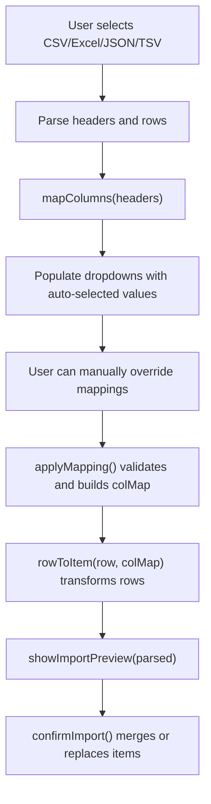
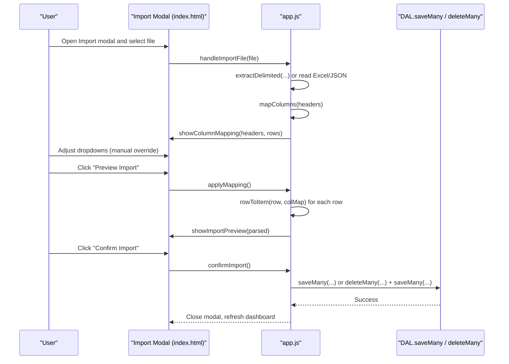
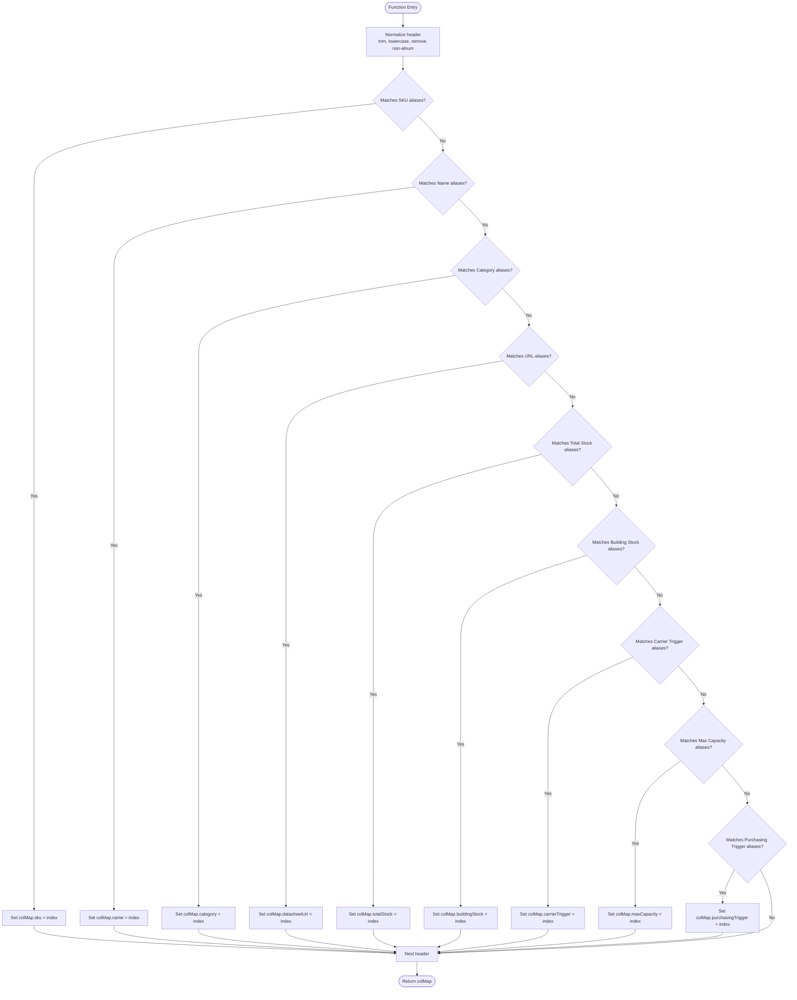
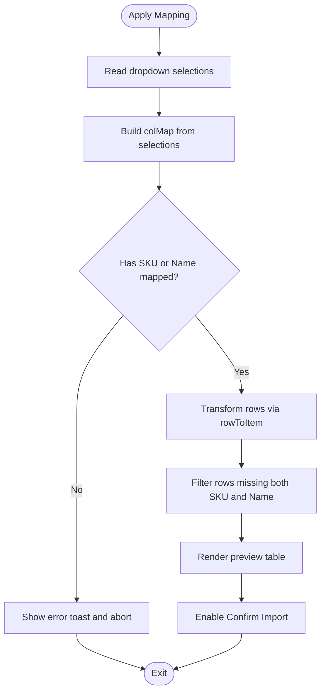
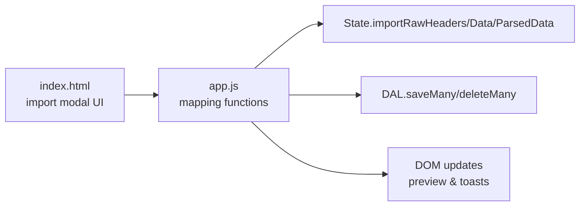

# Intelligent Column Mapping System

<cite>
**Referenced Files in This Document**
- [app.js](file://app.js)
- [index.html](file://index.html)
- [test.csv](file://test.csv)
</cite>

## Table of Contents
1. [Introduction](#introduction)
2. [Project Structure](#project-structure)
3. [Core Components](#core-components)
4. [Architecture Overview](#architecture-overview)
5. [Detailed Component Analysis](#detailed-component-analysis)
6. [Dependency Analysis](#dependency-analysis)
7. [Performance Considerations](#performance-considerations)
8. [Troubleshooting Guide](#troubleshooting-guide)
9. [Conclusion](#conclusion)
10. [Appendices](#appendices)

## Introduction
This document explains Shadow Ledger’s intelligent column mapping system used during data import. It focuses on how the application automatically detects and maps source columns to internal fields, the fuzzy matching algorithm behind mapColumns, the IMPORT_FIELDS configuration that defines target fields and their display labels, manual override capabilities, validation rules (at least SKU or Name must be mapped), and the user interface for mapping selection and preview.

## Project Structure
The mapping logic is implemented in the main application script and exposed via the import modal UI:
- app.js contains the mapping functions, field definitions, parsing helpers, and UI orchestration for import.
- index.html provides the import modal UI with dropdowns for each target field and buttons to confirm/cancel mapping and proceed to preview/import.
- test.csv demonstrates a sample file with non-standard headers that still get auto-mapped by the fuzzy matcher.

**Diagram sources**
- [app.js:1551-1567](file://app.js#L1551-L1567)
- [app.js:1710-1720](file://app.js#L1710-L1720)
- [app.js:1722-1741](file://app.js#L1722-L1741)
- [app.js:1743-1762](file://app.js#L1743-L1762)
- [app.js:1764-1778](file://app.js#L1764-L1778)
- [app.js:1780-1826](file://app.js#L1780-L1826)

**Section sources**
- [app.js:1551-1567](file://app.js#L1551-L1567)
- [app.js:1710-1720](file://app.js#L1710-L1720)
- [app.js:1722-1741](file://app.js#L1722-L1741)
- [app.js:1743-1762](file://app.js#L1743-L1762)
- [app.js:1764-1778](file://app.js#L1764-L1778)
- [app.js:1780-1826](file://app.js#L1780-L1826)
- [index.html:760-805](file://index.html#L760-L805)
- [test.csv:1-4](file://test.csv#L1-L4)

## Core Components
- mapColumns(headers): Performs fuzzy matching against normalized header tokens to auto-select source columns for each target field.
- IMPORT_FIELDS: Defines the set of target fields and their human-readable labels rendered in the UI.
- showColumnMapping(headers, rows): Populates dropdowns with source columns and preselects auto-mapped options.
- applyMapping(): Validates required mappings and constructs a final column map; filters out invalid rows.
- rowToItem(cols, colMap): Converts a single parsed row into an internal item object using the column map.
- showImportPreview(parsed): Renders a preview table of the first few mapped rows.
- confirmImport(): Merges or replaces inventory based on user-selected mode.

Key behaviors:
- Auto-mapping recognizes multiple naming conventions for SKU, Name, Category, URL, stock quantities, and triggers.
- Manual overrides are supported via dropdowns per target field.
- Validation requires at least one of SKU or Name to be mapped; otherwise, the user is blocked from proceeding.
- Rows without both SKU and Name are discarded after mapping.

**Section sources**
- [app.js:1551-1567](file://app.js#L1551-L1567)
- [app.js:1710-1720](file://app.js#L1710-L1720)
- [app.js:1722-1741](file://app.js#L1722-L1741)
- [app.js:1743-1762](file://app.js#L1743-L1762)
- [app.js:1764-1778](file://app.js#L1764-L1778)
- [app.js:1780-1826](file://app.js#L1780-L1826)

## Architecture Overview
The import flow integrates parsing, mapping, validation, preview, and persistence:

**Diagram sources**
- [app.js:1587-1708](file://app.js#L1587-L1708)
- [app.js:1722-1741](file://app.js#L1722-L1741)
- [app.js:1743-1762](file://app.js#L1743-L1762)
- [app.js:1764-1778](file://app.js#L1764-L1778)
- [app.js:1780-1826](file://app.js#L1780-L1826)
- [index.html:760-805](file://index.html#L760-L805)

## Detailed Component Analysis

### mapColumns — Fuzzy Matching Algorithm
- Normalization: Each header is trimmed, lowercased, and stripped of non-alphanumeric characters before comparison.
- Exact token sets: The function checks if the normalized header matches any known alias for a target field.
- First-match wins: For each target field, the first matching source column index is recorded.
- Supported aliases include:
  - SKU: itemcode, code, productcode, stockcode, partno, partnumber, articlenumber
  - Name: itemname, productname, description, item, itemdescription, desc
  - Category: cat, group, type, productgroup, itemgroup
  - Datasheet URL: datasheet, url, link, producturl, productlink, specsheet, productpage
  - Total Stock: total, qty, quantity, stockqty, onhand, qtyonhand, stockonhand, available
  - Building Stock: building, bldgstock, sitestock, localstock, buildingqty
  - Carrier Trigger: carrier, carriermin, mintransfer, transfermin
  - Max Capacity: max, maxbuilding, maxbldg, capacity, maxqty
  - Purchasing Trigger: purchasing, reorder, reorderlevel, minstock, reorderpoint

Common patterns recognized:
- “Artikelnummer” → SKU
- “Description” → Name
- “Q_Total” → Total Stock
- “Q_Bldg” → Building Stock

Confidence levels:
- The current implementation uses exact normalized token matching and does not compute numeric confidence scores. Confidence is effectively binary: matched or not matched.

Manual override capability:
- After auto-mapping, each target field has a dropdown listing all source columns. Users can change selections freely.

Validation rules:
- At least one of SKU or Name must be mapped; otherwise, the user receives an error and cannot proceed.
- After applying mapping, rows missing both SKU and Name are filtered out.

Complexity:
- Time complexity: O(H × K) where H is number of headers and K is the number of alias lists checked per header. Given small typical header counts, this is negligible.
- Space complexity: O(F) for the resulting column map, where F is the number of target fields.

**Section sources**
- [app.js:1551-1567](file://app.js#L1551-L1567)
- [test.csv:1-4](file://test.csv#L1-L4)

#### Flowchart of mapColumns

**Diagram sources**
- [app.js:1551-1567](file://app.js#L1551-L1567)

### IMPORT_FIELDS Configuration
IMPORT_FIELDS enumerates the target fields and their display labels shown in the mapping UI:
- SKU
- Item Name
- Category
- Datasheet URL
- Total Stock
- Building Stock
- Carrier Trigger
- Max Capacity
- Purch. Trigger

These labels drive the UI rendering and help users understand what each mapping controls.

**Section sources**
- [app.js:1710-1720](file://app.js#L1710-L1720)
- [index.html:760-805](file://index.html#L760-L805)

### showColumnMapping — UI Population and Auto-Selection
- Stores raw headers and rows in state for later use.
- Calls mapColumns to obtain auto-mappings.
- Populates each dropdown with all source columns and preselects the auto-mapped option when present.
- Switches the UI from file drop zone to mapping controls.

**Section sources**
- [app.js:1722-1741](file://app.js#L1722-L1741)
- [index.html:760-805](file://index.html#L760-L805)

### applyMapping — Validation and Resolution Logic
- Reads selected dropdown values to build a final colMap.
- Enforces validation: at least one of SKU or Name must be mapped.
- Transforms each row using rowToItem and filters out rows lacking both SKU and Name.
- Displays the preview panel and enables the import confirmation button.

**Diagram sources**
- [app.js:1743-1762](file://app.js#L1743-L1762)

**Section sources**
- [app.js:1743-1762](file://app.js#L1743-L1762)

### rowToItem — Row Transformation
- Parses numeric fields with defaults for missing values.
- Maps string fields to internal names using colMap indices.
- Ensures consistent types across imported records.

**Section sources**
- [app.js:1569-1585](file://app.js#L1569-L1585)

### showImportPreview — Preview Functionality
- Renders up to ten rows in a compact table showing key fields.
- Shows a count of total mapped rows.
- Enables the import confirmation button.

**Section sources**
- [app.js:1764-1778](file://app.js#L1764-L1778)

### confirmImport — Merge vs Replace Modes
- Replace mode: Deletes existing items and writes new ones.
- Merge mode: Matches incoming items to existing ones by SKU (case-insensitive) or by Name (if SKU is absent). Updates existing records or adds new ones.
- Persists changes via batch operations and refreshes the UI.

**Section sources**
- [app.js:1780-1826](file://app.js#L1780-L1826)

### User Interface Elements
- Import modal includes tabs for format selection, drag-and-drop area, and help text.
- Mapping section shows labeled dropdowns for each target field.
- Buttons allow confirming mapping to preview and canceling the operation.

**Section sources**
- [index.html:703-805](file://index.html#L703-L805)

## Dependency Analysis
- UI elements referenced by IDs (e.g., map-sku, map-name, import-mapping) are bound to JavaScript functions that populate and validate mappings.
- State variables store raw headers, raw rows, and parsed results to support re-rendering and undo flows.
- The Data Access Layer performs Firestore writes and deletions during import confirmation.

**Diagram sources**
- [index.html:703-805](file://index.html#L703-L805)
- [app.js:1722-1741](file://app.js#L1722-L1741)
- [app.js:1764-1778](file://app.js#L1764-L1778)
- [app.js:1780-1826](file://app.js#L1780-L1826)

**Section sources**
- [index.html:703-805](file://index.html#L703-L805)
- [app.js:1722-1741](file://app.js#L1722-L1741)
- [app.js:1764-1778](file://app.js#L1764-L1778)
- [app.js:1780-1826](file://app.js#L1780-L1826)

## Performance Considerations
- Header normalization and alias checks are linear in the number of headers and constant in the number of alias lists; performance impact is minimal for typical imports.
- Row transformation is O(N) over the dataset size; filtering removes invalid rows early.
- Batch writes via DAL.saveMany reduce network overhead during import confirmation.

[No sources needed since this section provides general guidance]

## Troubleshooting Guide
Common issues and resolutions:
- Unmapped columns: If a source column is not recognized by mapColumns, ensure its header matches one of the accepted aliases or manually select it in the mapping UI.
- Missing required mapping: The system requires at least SKU or Name to be mapped. If you see an error indicating a required mapping, adjust the dropdowns accordingly.
- Empty rows after mapping: Rows without both SKU and Name are filtered out. Verify your source data contains identifiers.
- Non-standard headers: Use examples like “Artikelnummer”, “Description”, “Q_Total”, “Q_Bldg” as references; these are recognized by the fuzzy matcher.

Actionable steps:
- Inspect the mapping dropdowns to verify correct assignments.
- Use the preview table to confirm expected values before confirming import.
- If duplicates occur, consider replace mode to overwrite existing data or merge mode to update matching records.

**Section sources**
- [app.js:1743-1762](file://app.js#L1743-L1762)
- [app.js:1764-1778](file://app.js#L1764-L1778)
- [test.csv:1-4](file://test.csv#L1-L4)

## Conclusion
Shadow Ledger’s intelligent column mapping system combines a robust fuzzy matcher with a flexible UI to streamline data imports. By recognizing diverse naming conventions, enforcing essential validations, and providing clear previews, it reduces manual effort while ensuring data integrity. Users can rely on automatic suggestions and easily override them to fit varied source formats.

[No sources needed since this section summarizes without analyzing specific files]

## Appendices

### Example Mapping Scenarios
- Standard headers: sku, name, category, datasheetUrl, totalStock, buildingStock, carrierTrigger, maxCapacity, purchasingTrigger
- ERP-style headers: Artikelnummer, Description, Q_Total, Q_Bldg
- Spreadsheet exports: Part Number, Product Name, Group, Link, Qty On Hand, Site Stock, Reorder Level

[No sources needed since this section provides general guidance]