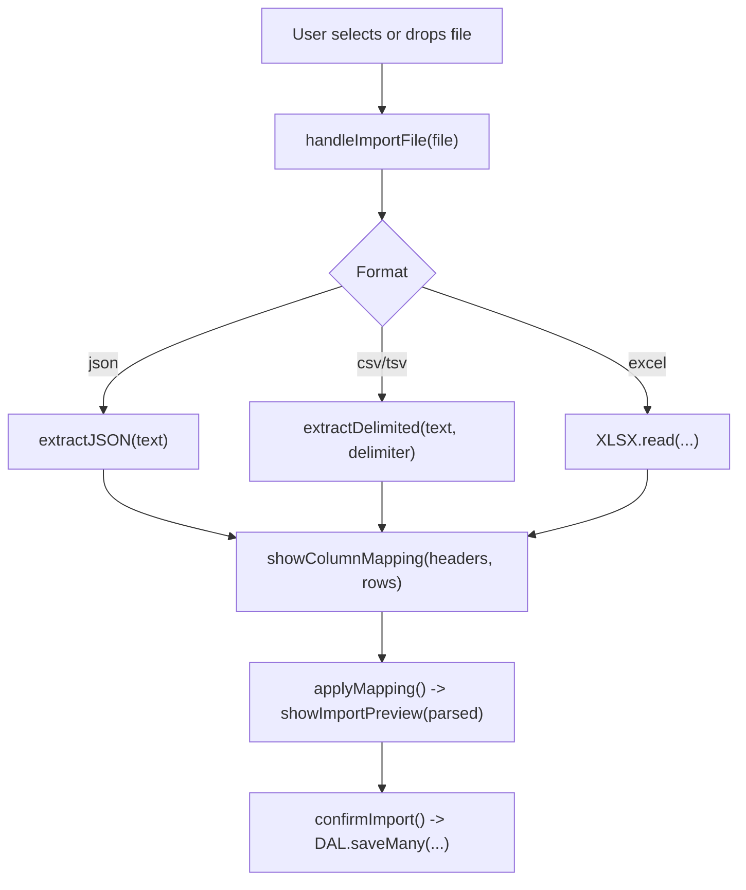
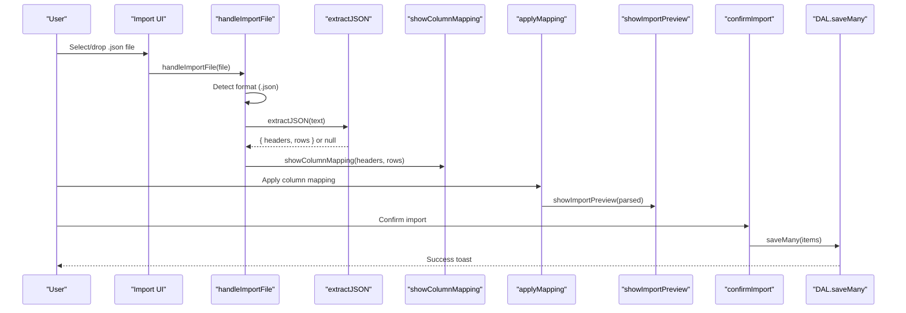
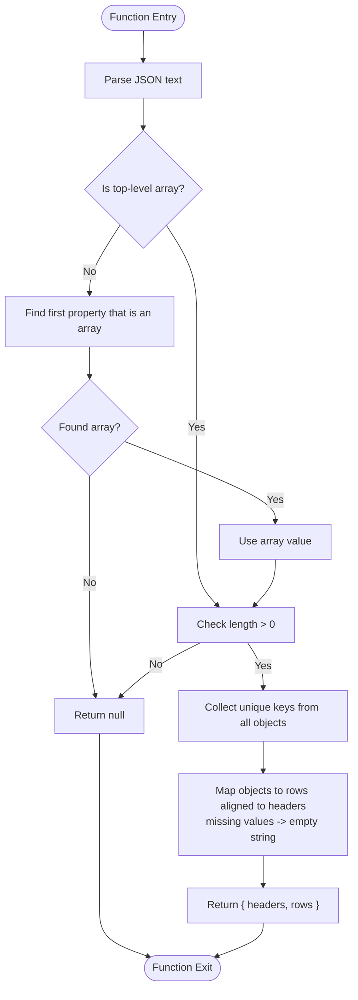
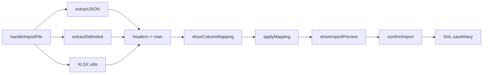

# JSON Data Import

<cite>
**Referenced Files in This Document**
- [app.js](file://app.js)
- [index.html](file://index.html)
</cite>

## Table of Contents
1. [Introduction](#introduction)
2. [Project Structure](#project-structure)
3. [Core Components](#core-components)
4. [Architecture Overview](#architecture-overview)
5. [Detailed Component Analysis](#detailed-component-analysis)
6. [Dependency Analysis](#dependency-analysis)
7. [Performance Considerations](#performance-considerations)
8. [Troubleshooting Guide](#troubleshooting-guide)
9. [Conclusion](#conclusion)

## Introduction
This document explains how Shadow Ledger imports and processes JSON files for inventory data. It focuses on the extractJSON function, which supports both array-based and object-based JSON structures with automatic key detection. The documentation covers header extraction from object keys, row generation from array elements, fallback mechanisms when the top-level structure is not an array, error handling for malformed JSON, and integration points with the import UI and mapping workflow. Security considerations and memory management guidance for large JSON files are also included.

## Project Structure
The JSON import feature is implemented within the main application script and interacts with the import modal UI. Key responsibilities:
- File reading and format detection
- JSON parsing and normalization to a tabular representation (headers and rows)
- Column mapping and preview before committing to the database

**Diagram sources**
- [app.js:1668-1708](file://app.js#L1668-L1708)
- [app.js:1587-1598](file://app.js#L1587-L1598)
- [app.js:1621-1640](file://app.js#L1621-L1640)
- [app.js:1722-1741](file://app.js#L1722-L1741)
- [app.js:1743-1762](file://app.js#L1743-L1762)
- [app.js:1780-1826](file://app.js#L1780-L1826)

**Section sources**
- [app.js:1668-1708](file://app.js#L1668-L1708)
- [app.js:1587-1598](file://app.js#L1587-L1598)
- [app.js:1621-1640](file://app.js#L1621-L1640)
- [app.js:1722-1741](file://app.js#L1722-L1741)
- [app.js:1743-1762](file://app.js#L1743-L1762)
- [app.js:1780-1826](file://app.js#L1780-L1826)

## Core Components
- extractJSON(text): Parses JSON text into normalized headers and rows. Supports:
  - Top-level arrays of objects
  - Object containing a single array value as a fallback
- handleImportFile(file): Reads the file, detects format, delegates to extractors, and triggers mapping UI
- showColumnMapping(headers, rows): Displays mapping UI with auto-mapping suggestions
- applyMapping(): Applies user mappings, coerces types, filters invalid rows, and shows preview
- confirmImport(): Merges or replaces items and persists via DAL

Key behaviors:
- Headers are extracted from all object keys across the dataset
- Rows are generated by aligning values to headers; missing values become empty strings
- Type coercion occurs later during mapping (numbers parsed where applicable)

**Section sources**
- [app.js:1621-1640](file://app.js#L1621-L1640)
- [app.js:1668-1708](file://app.js#L1668-L1708)
- [app.js:1722-1741](file://app.js#L1722-L1741)
- [app.js:1743-1762](file://app.js#L1743-L1762)
- [app.js:1780-1826](file://app.js#L1780-L1826)

## Architecture Overview
The JSON import pipeline integrates file input, parsing, mapping, preview, and persistence.

**Diagram sources**
- [app.js:1668-1708](file://app.js#L1668-L1708)
- [app.js:1621-1640](file://app.js#L1621-L1640)
- [app.js:1722-1741](file://app.js#L1722-L1741)
- [app.js:1743-1762](file://app.js#L1743-L1762)
- [app.js:1780-1826](file://app.js#L1780-L1826)

## Detailed Component Analysis

### JSON Extractor: extractJSON
Responsibilities:
- Parse JSON text safely
- Normalize to array of objects
- Auto-detect nested array if top-level is an object
- Build headers from union of all object keys
- Generate rows aligned to headers, coercing values to strings

Algorithm overview:
- Try to parse JSON; on failure return null
- If result is not an array, find the first property whose value is an array and use it; otherwise return null
- If resulting array is empty, return null
- Collect unique headers across all objects
- Map each object to a row using the header list; missing fields become empty strings

**Diagram sources**
- [app.js:1621-1640](file://app.js#L1621-L1640)

Supported JSON formats:
- Flat array of objects:
  - Example shape: [{"sku":"A","name":"Item A"},{"sku":"B","name":"Item B"}]
- Nested object with a single array value:
  - Example shape: {"items":[{"sku":"A","name":"Item A"}]}
- Mixed data types:
  - Numbers, booleans, strings, nulls are accepted; values are converted to strings during row generation

Notes:
- No explicit schema validation is performed at this stage; validation occurs later during mapping and import confirmation
- Header order is derived from the union of keys encountered across all objects

**Section sources**
- [app.js:1621-1640](file://app.js#L1621-L1640)

### File Handling and Format Detection: handleImportFile
Responsibilities:
- Determine effective format based on file extension and current selection
- Read file content (text for CSV/TSV/JSON; ArrayBuffer for Excel)
- Delegate to appropriate extractor
- Validate extracted data presence and trigger mapping UI

Behavior highlights:
- Auto-detection overrides selected format when extension mismatches
- For JSON, calls extractJSON; for TSV/CSV, uses extractDelimited; for Excel, uses XLSX utilities
- If no valid data found, displays an error toast and aborts

**Section sources**
- [app.js:1668-1708](file://app.js#L1668-L1708)

### Column Mapping and Row Generation: showColumnMapping and applyMapping
Responsibilities:
- Display mapping UI with dropdowns for each target field
- Attempt auto-mapping based on common header names
- Enforce minimum mapping requirements (at least SKU or Name)
- Convert raw rows to internal item objects with type coercion for numeric fields
- Filter out rows without SKU or Name

Type coercion details:
- Numeric fields (e.g., totalStock, buildingStock, carrierTrigger, maxCapacity, purchasingTrigger) are parsed as integers with defaults applied when invalid
- Textual fields are trimmed

**Section sources**
- [app.js:1722-1741](file://app.js#L1722-L1741)
- [app.js:1743-1762](file://app.js#L1743-L1762)
- [app.js:1551-1585](file://app.js#L1551-L1585)

### Preview and Commit: showImportPreview and confirmImport
Responsibilities:
- Render a limited preview of mapped items
- On confirmation, either replace existing inventory or merge by matching SKU or Name
- Persist changes via batch write operations

Merge behavior:
- Matches by SKU (case-insensitive) or Name (if SKU absent)
- Updates existing records or adds new ones
- Generates IDs for new entries and updates timestamps via DAL

**Section sources**
- [app.js:1764-1778](file://app.js#L1764-L1778)
- [app.js:1780-1826](file://app.js#L1780-L1826)

### UI Integration Points
- Import modal tabs and help text update based on selected format
- Drop zone and file input accept attributes adapt to format
- Mapping UI renders dropdowns populated from extracted headers

**Section sources**
- [app.js:1657-1666](file://app.js#L1657-L1666)
- [index.html:733-753](file://index.html#L733-L753)

## Dependency Analysis
High-level dependencies:
- extractJSON depends only on native JSON.parse
- handleImportFile depends on FileReader and format-specific parsers (extractJSON, extractDelimited, XLSX)
- Mapping functions depend on mapColumns and rowToItem helpers
- Persistence depends on DAL.saveMany

**Diagram sources**
- [app.js:1668-1708](file://app.js#L1668-L1708)
- [app.js:1621-1640](file://app.js#L1621-L1640)
- [app.js:1587-1598](file://app.js#L1587-L1598)
- [app.js:1722-1741](file://app.js#L1722-L1741)
- [app.js:1743-1762](file://app.js#L1743-L1762)
- [app.js:1780-1826](file://app.js#L1780-L1826)

**Section sources**
- [app.js:1668-1708](file://app.js#L1668-L1708)
- [app.js:1621-1640](file://app.js#L1621-L1640)
- [app.js:1587-1598](file://app.js#L1587-L1598)
- [app.js:1722-1741](file://app.js#L1722-L1741)
- [app.js:1743-1762](file://app.js#L1743-L1762)
- [app.js:1780-1826](file://app.js#L1780-L1826)

## Performance Considerations
- Memory usage: Large JSON files are read entirely into memory via FileReader.readAsText. For very large datasets, consider chunked processing or server-side preprocessing to avoid browser memory pressure.
- Parsing overhead: JSON.parse is efficient but still O(n) in file size. Avoid importing extremely large files directly in the browser.
- Header collection: Building a Set of keys across all objects is O(N*K), where N is number of rows and K is average keys per row. Keep schemas reasonably flat.
- Row generation: Mapping each object to a row is O(N*H), where H is number of headers. Minimize unnecessary fields.
- Preview rendering: Only a subset of rows is rendered in preview to limit DOM cost.

[No sources needed since this section provides general guidance]

## Troubleshooting Guide
Common issues and resolutions:
- Malformed JSON:
  - Symptom: No valid data found message
  - Cause: JSON.parse fails or structure does not match expected patterns
  - Resolution: Validate JSON syntax and ensure top-level is an array or contains a single array property
- Empty dataset:
  - Symptom: No valid data found message
  - Cause: Array is empty after extraction
  - Resolution: Ensure file contains at least one record
- Missing required mapping:
  - Symptom: Error requiring at least SKU or Name mapping
  - Cause: Neither SKU nor Name mapped in the mapping UI
  - Resolution: Map at least one of these fields
- Unexpected header order:
  - Symptom: Columns appear in unexpected order
  - Cause: Headers are collected from all objects; order depends on traversal
  - Resolution: Reorder columns in mapping UI as needed

Error handling paths:
- extractJSON returns null on parse errors or unsupported structure
- handleImportFile checks for null or empty results and shows an error toast
- applyMapping enforces mapping constraints and filters invalid rows

**Section sources**
- [app.js:1621-1640](file://app.js#L1621-L1640)
- [app.js:1699-1702](file://app.js#L1699-L1702)
- [app.js:1753-1756](file://app.js#L1753-L1756)
- [app.js:1757-1762](file://app.js#L1757-L1762)

## Conclusion
Shadow Ledger’s JSON import pipeline provides flexible parsing for both flat arrays and nested object structures, with automatic header discovery and robust error handling. The mapping step ensures data integrity through type coercion and constraint enforcement before committing to the database. For optimal performance and security, keep JSON payloads reasonable in size, validate inputs early, and rely on the built-in escaping utilities when rendering imported data in the UI.