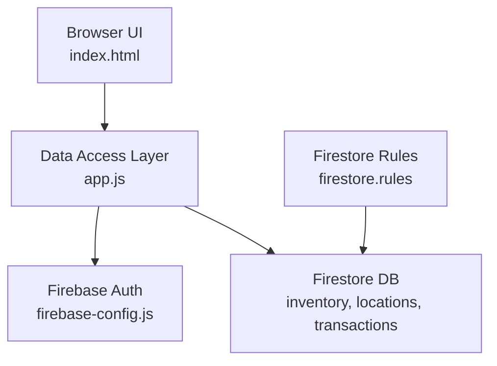
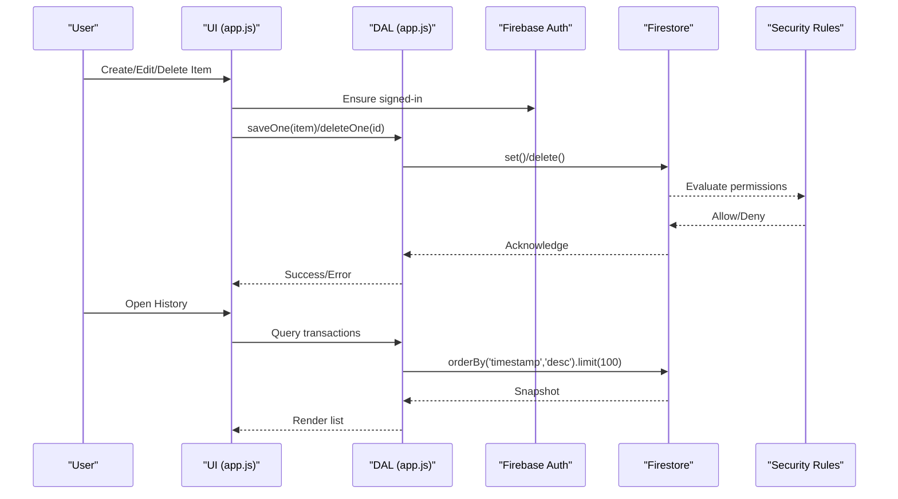
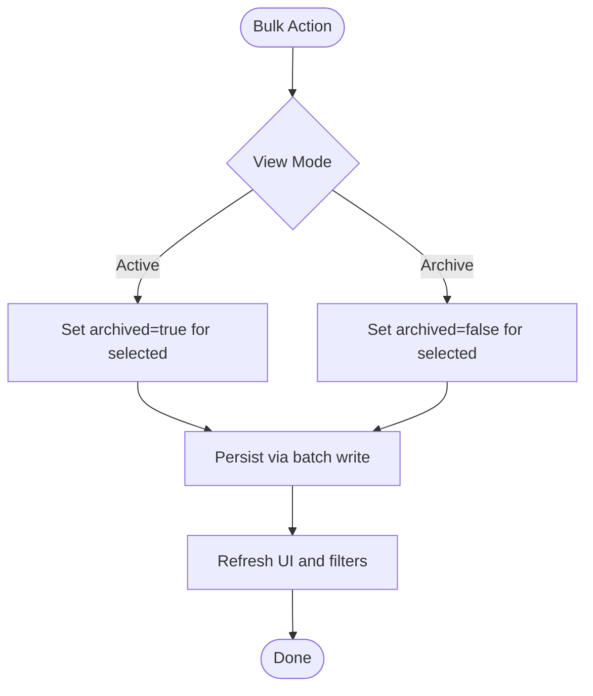
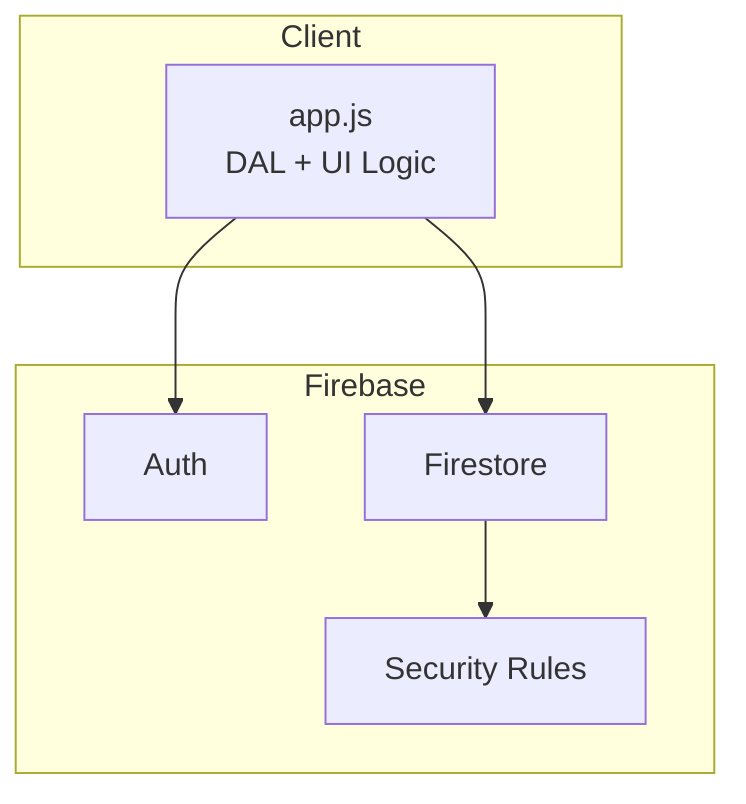

# Data Models and Schema

<cite>
**Referenced Files in This Document**
- [app.js](file://app.js)
- [firestore.rules](file://firestore.rules)
- [firebase-config.js](file://firebase-config.js)
</cite>

## Table of Contents
1. [Introduction](#introduction)
2. [Project Structure](#project-structure)
3. [Core Components](#core-components)
4. [Architecture Overview](#architecture-overview)
5. [Detailed Component Analysis](#detailed-component-analysis)
6. [Dependency Analysis](#dependency-analysis)
7. [Performance Considerations](#performance-considerations)
8. [Troubleshooting Guide](#troubleshooting-guide)
9. [Conclusion](#conclusion)
10. [Appendices](#appendices)

## Introduction
This document describes the data models and schema used by Shadow Ledger’s Firestore-backed inventory system. It focuses on:
- Inventory item structure (SKU, name, category, datasheet URL, location-based stock arrays, thresholds)
- Location management model (unlimited locations with core location protection)
- Transaction history for audit trails (timestamps, user attribution, operation types)
- Validation rules enforced by Firestore security rules
- Primary/foreign key relationships and constraints
- Sample data structures
- Indexing strategies for performance
- Data lifecycle management including archive/restore

## Project Structure
Shadow Ledger uses a single-page web application backed by Firebase Authentication and Firestore. The relevant files for data modeling are:
- Application logic and data access layer (DAL): app.js
- Firestore Security Rules: firestore.rules
- Firebase initialization and persistence configuration: firebase-config.js

**Diagram sources**
- [app.js:33-132](file://app.js#L33-L132)
- [firebase-config.js:14-28](file://firebase-config.js#L14-L28)
- [firestore.rules:12-45](file://firestore.rules#L12-L45)

**Section sources**
- [app.js:33-132](file://app.js#L33-L132)
- [firebase-config.js:14-28](file://firebase-config.js#L14-L28)
- [firestore.rules:12-45](file://firestore.rules#L12-L45)

## Core Components
The database consists of three top-level collections:
- inventory: items owned by authenticated users
- locations: configurable storage locations
- transactions: immutable audit log entries

Key responsibilities:
- inventory: stores item metadata and per-location stock counts; enforces ownership via ownerId
- locations: supports unlimited locations; two core locations are protected from deletion at the application level
- transactions: records scan-out and transfer operations with timestamps and user attribution

**Section sources**
- [app.js:33-132](file://app.js#L33-L132)
- [firestore.rules:16-38](file://firestore.rules#L16-L38)

## Architecture Overview
High-level data flow between UI, DAL, and Firestore:

**Diagram sources**
- [app.js:55-79](file://app.js#L55-L79)
- [app.js:1440-1476](file://app.js#L1440-L1476)
- [firestore.rules:16-38](file://firestore.rules#L16-L38)

## Detailed Component Analysis

### Inventory Model
Collection: inventory
Document ID: application-generated unique id (e.g., sl_...)
Ownership: Each document includes an ownerId field that must match the requesting user’s uid.

Primary fields:
- id: string (application-generated)
- sku: string (unique identifier for the item)
- name: string (human-readable name)
- category: string (categorization)
- datasheetUrl: string (optional link to specification)
- totalStock: number (derived sum across all locations)
- buildingStock: number (legacy convenience field; equals locationStock[LOC_BUILDING])
- carrierTrigger: number (threshold for “carrier” alerts)
- maxCapacity: number (target capacity for on-site stock)
- purchasingTrigger: number (threshold for procurement alerts)
- archived: boolean (soft-delete flag for lifecycle management)
- locationStock: map<string,number> (per-location stock counts)
- ownerId: string (user id; required on create)
- updatedAt: timestamp (server timestamp on writes)

Derived and computed behavior:
- totalStock is derived from locationStock values; UI updates maintain consistency when editing totalStock or buildingStock.
- buildingStock is a convenience alias for locationStock[LOC_BUILDING].
- Archived items are excluded from default views but can be restored.

Validation and constraints:
- Ownership enforcement: read/update/delete require resource.data.ownerId == request.auth.uid
- Create requires keys: sku, name, category
- Non-negative integers for numeric fields are enforced client-side before write

Sample document structure:
- {
    "id": "sl_xxx",
    "sku": "FB-M8-50",
    "name": "M8x50 Hex Bolt",
    "category": "Détection Incendie - Conventionnel - Centrales",
    "datasheetUrl": "",
    "totalStock": 500,
    "buildingStock": 12,
    "carrierTrigger": 20,
    "maxCapacity": 100,
    "purchasingTrigger": 80,
    "archived": false,
    "locationStock": {
      "depot": 488,
      "building": 12
    },
    "ownerId": "auth_uid",
    "updatedAt": "<serverTimestamp>"
  }

Indexing strategy:
- No server-side indexes defined in code for inventory reads; real-time listener fetches all documents and filters/sorts client-side.
- For large datasets, consider adding composite indexes for common queries such as owner + archived + category if moving to server-side filtering.

Lifecycle:
- Archive/restore toggles archived boolean and persists changes in bulk.

**Section sources**
- [app.js:33-132](file://app.js#L33-L132)
- [app.js:344-368](file://app.js#L344-L368)
- [app.js:700-771](file://app.js#L700-L771)
- [app.js:824-854](file://app.js#L824-L854)
- [app.js:1878-1929](file://app.js#L1878-L1929)
- [firestore.rules:16-29](file://firestore.rules#L16-L29)

### Locations Model
Collection: locations
Document ID: fixed ids for core locations and auto-assigned ids for custom ones
Fields:
- id: string (fixed for core locations; otherwise generated)
- name: string (display name)
- order: number (sort order)

Core locations:
- depot: Main Depot
- building: Company Building

Protection:
- Core locations cannot be deleted by the UI; attempts are blocked and a toast message is shown.

Seeding:
- On first run, if no locations exist, the app seeds the two core locations automatically.

Sample documents:
- { "id": "depot", "name": "Main Depot", "order": 1 }
- { "id": "building", "name": "Company Building", "order": 2 }
- { "id": "custom_id", "name": "Showroom", "order": 1712345678901 }

Relationships:
- Referenced indirectly by inventory.locationStock map keys. There is no explicit foreign key constraint in Firestore; referential integrity is maintained by application logic.

Indexing strategy:
- Real-time listener orders by order ascending; this implies a simple index on order. If many locations exist, ensure the index exists in the console.

**Section sources**
- [app.js:103-121](file://app.js#L103-L121)
- [app.js:340-380](file://app.js#L340-L380)
- [app.js:2373-2383](file://app.js#L2373-L2383)

### Transactions Model
Collection: transactions
Purpose: Audit trail for stock movements (scan-out and transfers).

Fields:
- itemId: string (reference to inventory document id)
- sku: string (item SKU)
- name: string (item name)
- qtyOut: number (quantity moved out)
- remainingBuilding: number (on-hand after operation; present for scan-out)
- type: string ("transfer" for inter-location moves; "scan-out" implied by presence of remainingBuilding)
- from: string (source location id; present for transfers)
- to: string (destination location id; present for transfers)
- remainingMap: map<string,number> (snapshot of locationStock after transfer; present for transfers)
- user: string (email or display name)
- userId: string (auth uid)
- timestamp: timestamp (server timestamp)

Operations:
- Scan-out: decrements building stock and logs a transaction with remainingBuilding.
- Transfer: adjusts locationStock between two locations and logs a transaction with from/to and remainingMap.

Security:
- All authenticated users can read and create transactions.
- Only the creator can delete their own transaction.

Sample documents:
- Scan-out:
  {
    "itemId": "sl_xxx",
    "sku": "EL-CB-2.5",
    "name": "2.5mm² Cable (100m)",
    "qtyOut": 3,
    "remainingBuilding": 17,
    "user": "user@example.com",
    "userId": "auth_uid",
    "timestamp": "<serverTimestamp>"
  }
- Transfer:
  {
    "itemId": "sl_xxx",
    "sku": "FB-M8-50",
    "name": "M8x50 Hex Bolt",
    "qtyOut": 10,
    "type": "transfer",
    "from": "depot",
    "to": "building",
    "remainingMap": { "depot": 478, "building": 22 },
    "user": "user@example.com",
    "userId": "auth_uid",
    "timestamp": "<serverTimestamp>"
  }

Indexing strategy:
- History view orders by timestamp descending with limit 100. Ensure an index on timestamp exists in Firestore.

**Section sources**
- [app.js:124-131](file://app.js#L124-L131)
- [app.js:1390-1402](file://app.js#L1390-L1402)
- [app.js:2420-2424](file://app.js#L2420-L2424)
- [app.js:1440-1476](file://app.js#L1440-L1476)
- [firestore.rules:31-38](file://firestore.rules#L31-L38)

### Data Validation Rules (Firestore Security Rules)
- Read access to inventory requires authentication and ownership: resource.data.ownerId must equal request.auth.uid.
- Create access to inventory requires authentication, matching ownerId, and presence of required keys: sku, name, category.
- Update/delete access to inventory requires authentication and ownership.
- Transactions:
  - Read/create allowed for any authenticated user.
  - Delete allowed only if resource.data.userId matches request.auth.uid.
- Catch-all denies all other paths.

These rules enforce primary ownership constraints and basic field requirements at the database boundary.

**Section sources**
- [firestore.rules:16-29](file://firestore.rules#L16-L29)
- [firestore.rules:31-38](file://firestore.rules#L31-L38)
- [firestore.rules:40-43](file://firestore.rules#L40-L43)

### Relationships and Constraints
- Primary keys:
  - inventory.id: application-generated unique id
  - locations.id: fixed for core locations; generated for custom
  - transactions: document id auto-assigned by Firestore
- Foreign key references:
  - inventory.locationStock keys reference locations.id
  - transactions.itemId references inventory.id
  - transactions.userId references auth.uid
- Constraints:
  - Ownership: enforced by rules for inventory
  - Required fields on create: sku, name, category
  - Non-negative integers for stock/threshold fields enforced client-side
  - Core locations protected from deletion by UI logic

**Section sources**
- [app.js:33-132](file://app.js#L33-L132)
- [app.js:2373-2383](file://app.js#L2373-L2383)
- [firestore.rules:16-29](file://firestore.rules#L16-L29)

### Data Lifecycle Management (Archive/Restore)
- Items can be archived or restored in bulk.
- archived boolean controls visibility in default views.
- Bulk actions update state and persist changes to Firestore.

**Diagram sources**
- [app.js:1878-1929](file://app.js#L1878-L1929)

**Section sources**
- [app.js:1878-1929](file://app.js#L1878-L1929)

## Dependency Analysis
The following diagram shows how components depend on each other and where data flows occur.

**Diagram sources**
- [app.js:33-132](file://app.js#L33-L132)
- [firebase-config.js:14-28](file://firebase-config.js#L14-L28)
- [firestore.rules:12-45](file://firestore.rules#L12-L45)

**Section sources**
- [app.js:33-132](file://app.js#L33-L132)
- [firebase-config.js:14-28](file://firebase-config.js#L14-L28)
- [firestore.rules:12-45](file://firestore.rules#L12-L45)

## Performance Considerations
- Real-time listeners:
  - inventory: listens to entire collection; suitable for small-to-medium inventories. For larger datasets, implement server-side queries with appropriate indexes (e.g., by ownerId).
  - locations: ordered by order; ensure an index on order exists.
  - transactions: history query orders by timestamp desc with limit 100; ensure an index on timestamp exists.
- Client-side sorting/filtering:
  - Current implementation sorts and filters in-memory. Consider moving heavy computations to the backend or using Cloud Functions for aggregation if needed.
- Batch writes:
  - Import and bulk archive/restore use batched writes to reduce round-trips.

[No sources needed since this section provides general guidance]

## Troubleshooting Guide
Common issues and resolutions:
- Permission denied on inventory writes:
  - Ensure the document’s ownerId matches the current user’s uid and that required fields (sku, name, category) are present.
- Unavailable or offline errors:
  - Persistence is enabled; intermittent failures may occur if multiple tabs conflict. Check browser support and connection status.
- Missing indexes:
  - If ordering fails (e.g., transactions by timestamp or locations by order), add the required composite/simple indexes in the Firestore console.
- Core location deletion blocked:
  - The UI prevents deleting core locations; this is expected behavior.

**Section sources**
- [app.js:55-79](file://app.js#L55-L79)
- [app.js:1440-1476](file://app.js#L1440-L1476)
- [app.js:2373-2383](file://app.js#L2373-L2383)
- [firebase-config.js:20-28](file://firebase-config.js#L20-L28)

## Conclusion
Shadow Ledger’s data model centers around three collections: inventory, locations, and transactions. Ownership and field validation are enforced by Firestore security rules, while application logic ensures referential integrity and operational correctness. The design supports unlimited locations with core location protection, comprehensive audit trails, and flexible lifecycle management through archiving. For scale, introduce server-side queries and indexes aligned with usage patterns.

[No sources needed since this section summarizes without analyzing specific files]

## Appendices

### Appendix A: Field Reference Summary
- inventory
  - id: string
  - sku: string
  - name: string
  - category: string
  - datasheetUrl: string
  - totalStock: number
  - buildingStock: number
  - carrierTrigger: number
  - maxCapacity: number
  - purchasingTrigger: number
  - archived: boolean
  - locationStock: map<string,number>
  - ownerId: string
  - updatedAt: timestamp
- locations
  - id: string
  - name: string
  - order: number
- transactions
  - itemId: string
  - sku: string
  - name: string
  - qtyOut: number
  - remainingBuilding: number (scan-out)
  - type: string (transfer)
  - from: string (transfer)
  - to: string (transfer)
  - remainingMap: map<string,number> (transfer)
  - user: string
  - userId: string
  - timestamp: timestamp

**Section sources**
- [app.js:33-132](file://app.js#L33-L132)
- [app.js:1390-1402](file://app.js#L1390-L1402)
- [app.js:2420-2424](file://app.js#L2420-L2424)