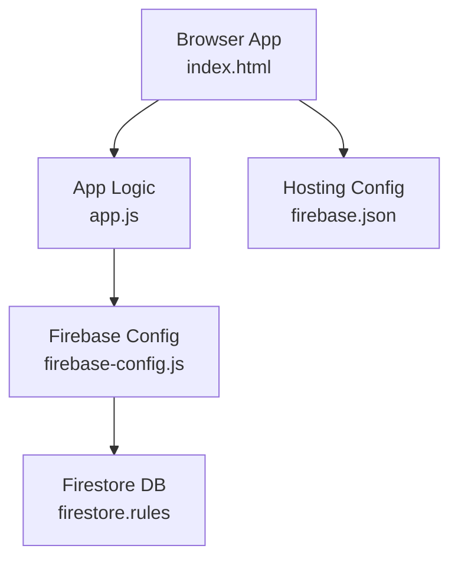
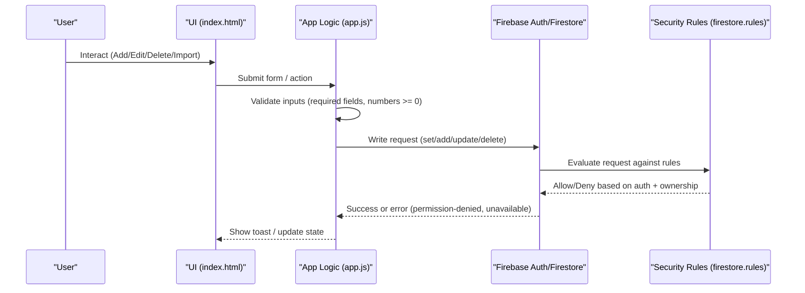
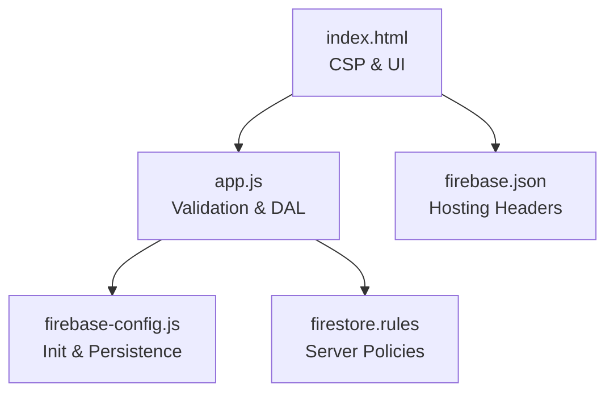

# Data Validation and Security Rules

<cite>
**Referenced Files in This Document**
- [firestore.rules](file://firestore.rules)
- [app.js](file://app.js)
- [firebase-config.js](file://firebase-config.js)
- [index.html](file://index.html)
- [firebase.json](file://firebase.json)
</cite>

## Table of Contents
1. [Introduction](#introduction)
2. [Project Structure](#project-structure)
3. [Core Components](#core-components)
4. [Architecture Overview](#architecture-overview)
5. [Detailed Component Analysis](#detailed-component-analysis)
6. [Dependency Analysis](#dependency-analysis)
7. [Performance Considerations](#performance-considerations)
8. [Troubleshooting Guide](#troubleshooting-guide)
9. [Conclusion](#conclusion)
10. [Appendices](#appendices)

## Introduction
This document explains the data validation rules and security policies for the inventory application, focusing on:
- Firestore security rules that enforce user-based data isolation and permission controls
- Client-side validation for inventory items including field constraints, numeric validations, and business rule enforcement
- Ownership model ensuring users can only access their own data
- Authentication requirements, role-based access control (RBAC), and data mutation permissions
- Examples of valid and invalid operations, error handling strategies, and security best practices for database interactions

The system uses Firebase Authentication and Firestore with strict server-side rules to ensure that each authenticated user can only read and write their own inventory items. The client enforces additional validation and UX safeguards before sending requests to the backend.

## Project Structure
Key files relevant to data validation and security:
- firestore.rules: Server-side Firestore security rules
- app.js: Application logic, client-side validation, and Firestore integration
- firebase-config.js: Firebase initialization and persistence settings
- index.html: UI and Content Security Policy (CSP) configuration
- firebase.json: Hosting configuration and Firestore rules path



**Diagram sources**
- [index.html:1-120](file://index.html#L1-L120)
- [app.js:1-120](file://app.js#L1-L120)
- [firebase-config.js:1-29](file://firebase-config.js#L1-L29)
- [firestore.rules:1-46](file://firestore.rules#L1-L46)
- [firebase.json:1-55](file://firebase.json#L1-L55)

**Section sources**
- [index.html:1-120](file://index.html#L1-L120)
- [app.js:1-120](file://app.js#L1-L120)
- [firebase-config.js:1-29](file://firebase-config.js#L1-L29)
- [firestore.rules:1-46](file://firestore.rules#L1-L46)
- [firebase.json:1-55](file://firebase.json#L1-L55)

## Core Components
- Firestore Security Rules: Enforce authentication, ownership checks, and required fields for inventory documents; restrict transactions logs by creator; deny all other paths.
- Client-Side Validation: HTML form constraints, numeric parsing, non-negative enforcement, and business rule calculations (e.g., depot stock derived from location map).
- Ownership Model: Each inventory item includes an owner identifier; server rules verify that reads/writes match the current user’s ID.
- Authentication: Email/password and Google sign-in flows; real-time listeners start only after successful auth.
- Error Handling: User-friendly toasts and messages for permission-denied, unavailable, and general errors; graceful fallbacks for offline or service issues.

**Section sources**
- [firestore.rules:12-45](file://firestore.rules#L12-L45)
- [app.js:32-132](file://app.js#L32-L132)
- [app.js:204-265](file://app.js#L204-L265)
- [app.js:268-305](file://app.js#L268-L305)
- [app.js:2661-2677](file://app.js#L2661-L2677)

## Architecture Overview
The application follows a client-server architecture where the browser app performs client-side validation and then delegates writes to Firestore. Firestore security rules act as the final authority, enforcing per-user ownership and required fields.



**Diagram sources**
- [app.js:204-265](file://app.js#L204-L265)
- [app.js:54-90](file://app.js#L54-L90)
- [app.js:73-97](file://app.js#L73-L97)
- [firestore.rules:16-43](file://firestore.rules#L16-L43)

## Detailed Component Analysis

### Firestore Security Rules
- Inventory collection:
  - Read allowed if authenticated and the document’s owner matches the requesting user.
  - Create allowed if authenticated, the incoming ownerId equals the requesting user’s ID, and required fields are present.
  - Update/Delete allowed only if the requester is the owner.
- Transactions collection:
  - Read/Create allowed for any authenticated user.
  - Delete allowed only by the creator (userId matches requesting user).
- Catch-all denies all other paths.

```mermaid
flowchart TD
Start(["Request to Firestore"]) --> CheckAuth{"Authenticated?"}
CheckAuth --> |No| DenyAll["Deny"]
CheckAuth --> |Yes| Path{"Path"}
Path --> |inventory/{itemId}| OwnerCheck{"ownerId == request.auth.uid?"}
OwnerCheck --> |No| Deny
OwnerCheck --> |Yes| FieldsCheck{"Has required fields?"}
FieldsCheck --> |No| Deny
FieldsCheck --> |Yes| AllowReadCreate["Allow read/create"]
Path --> |transactions/{txId}| TxOp{"Operation"}
TxOp --> |read| AllowTxRead["Allow read"]
TxOp --> |create| AllowTxCreate["Allow create"]
TxOp --> |delete| TxOwner{"userId == request.auth.uid?"}
TxOwner --> |No| Deny
TxOwner --> |Yes| AllowTxDelete["Allow delete"]
Path --> |other| DenyAll
```

**Diagram sources**
- [firestore.rules:16-43](file://firestore.rules#L16-L43)

**Section sources**
- [firestore.rules:12-45](file://firestore.rules#L12-L45)

### Client-Side Validation for Inventory Items
- Required fields: SKU and Name are marked required in the form.
- Numeric fields: All numeric inputs use min="0" and parse to integers with defaults to zero when missing.
- Business rules:
  - Depot stock is derived from total minus building stock across locations.
  - Carrier alerts trigger when building stock is at or below carrier trigger.
  - Procurement alerts trigger when total stock is at or below purchasing trigger.
- Import validation:
  - Column mapping requires at least SKU or Name.
  - Numeric fields default to safe values when absent.
  - Preview step allows review before committing.

Examples of valid operations:
- Add item with SKU, Name, Category, and numeric fields set to non-negative values.
- Edit existing item updating numeric fields while preserving owner context.
- Import CSV/Excel/JSON/TSV with mapped columns and previewed rows.

Examples of invalid operations:
- Attempting to create an item without SKU or Name.
- Setting negative quantities for stock fields.
- Modifying another user’s item (server will deny due to ownership check).

Error handling strategies:
- Permission denied: Toast informs about database rules blocking access.
- Unavailable: Toast indicates connectivity issues.
- General errors: Toast displays message or code.

Best practices demonstrated:
- Always validate on the client for UX, but rely on server rules for security.
- Normalize and sanitize inputs (trim strings, parse numbers, clamp negatives).
- Provide clear feedback to users on failures.

**Section sources**
- [index.html:552-672](file://index.html#L552-L672)
- [app.js:824-854](file://app.js#L824-L854)
- [app.js:425-443](file://app.js#L425-L443)
- [app.js:1743-1778](file://app.js#L1743-L1778)
- [app.js:54-90](file://app.js#L54-L90)
- [app.js:73-97](file://app.js#L73-L97)
- [app.js:204-265](file://app.js#L204-L265)

### Ownership Model and Data Isolation
- Ownership is enforced via an owner identifier stored in each inventory document.
- Server rules compare this identifier to the authenticated user’s ID for all read/write operations.
- Clients do not need to trust the client-side owner assignment; server rules prevent cross-user access.

Operational implications:
- Users cannot see or modify other users’ inventory items.
- Bulk operations (saveMany/deleteMany) still respect per-document ownership at the server level.

**Section sources**
- [firestore.rules:16-29](file://firestore.rules#L16-L29)
- [app.js:54-90](file://app.js#L54-L90)
- [app.js:73-97](file://app.js#L73-L97)

### Authentication Requirements and RBAC
- Authentication:
  - Email/password and Google sign-in supported.
  - Real-time listeners and UI features activate only after successful authentication.
- Role-Based Access Control:
  - Current rules implement user-level isolation rather than explicit roles.
  - If multi-role support is needed, extend rules to include a role field and evaluate it alongside ownership.

Security considerations:
- Ensure domains are authorized for Google sign-in.
- Use strong passwords and consider enabling additional providers or MFA as needed.

**Section sources**
- [app.js:268-305](file://app.js#L268-L305)
- [app.js:204-265](file://app.js#L204-L265)
- [app.js:2661-2677](file://app.js#L2661-L2677)

### Data Mutation Permissions
- Inventory:
  - Create: Requires authentication and matching ownerId; required fields must be present.
  - Update/Delete: Only owners can modify or remove their items.
- Transactions:
  - Read/Create: Any authenticated user can read history and create entries.
  - Delete: Only the creator can delete their transaction log entries.

Validation and safety:
- Client-side clamps numeric values to non-negative.
- Import flow validates column mapping and previews changes.
- Confirmation dialogs protect destructive actions.

**Section sources**
- [firestore.rules:16-43](file://firestore.rules#L16-L43)
- [app.js:856-871](file://app.js#L856-L871)
- [app.js:1932-1949](file://app.js#L1932-L1949)
- [app.js:1743-1778](file://app.js#L1743-L1778)

### Example Operations and Outcomes
Valid operations:
- Add new item with required fields and non-negative numbers → saved with owner context.
- Edit item fields inline → persisted silently with optimistic updates.
- Import CSV/Excel/JSON/TSV with mapped columns → previewed and committed safely.

Invalid operations:
- Create item without SKU or Name → blocked by client validation and server rules.
- Modify another user’s item → server denies due to ownership mismatch.
- Delete another user’s transaction → server denies because userId does not match.

Error handling examples:
- Permission denied → toast instructs checking database rules.
- Service unavailable → toast prompts checking connection.
- General errors → toast shows message/code.

**Section sources**
- [app.js:54-90](file://app.js#L54-L90)
- [app.js:73-97](file://app.js#L73-L97)
- [app.js:204-265](file://app.js#L204-L265)
- [app.js:1743-1778](file://app.js#L1743-L1778)

## Dependency Analysis
The following diagram maps key dependencies between components involved in validation and security:



**Diagram sources**
- [index.html:19-37](file://index.html#L19-L37)
- [app.js:1-120](file://app.js#L1-L120)
- [firebase-config.js:14-29](file://firebase-config.js#L14-L29)
- [firestore.rules:12-45](file://firestore.rules#L12-L45)
- [firebase.json:17-48](file://firebase.json#L17-L48)

**Section sources**
- [index.html:19-37](file://index.html#L19-L37)
- [app.js:1-120](file://app.js#L1-L120)
- [firebase-config.js:14-29](file://firebase-config.js#L14-L29)
- [firestore.rules:12-45](file://firestore.rules#L12-L45)
- [firebase.json:17-48](file://firebase.json#L17-L48)

## Performance Considerations
- Firestore persistence is enabled to improve resilience during brief network outages.
- Client-side debounce reduces excessive writes during inline edits.
- Batch writes are used for bulk operations to minimize round-trips.
- Service worker caches app shell assets and CDN scripts with appropriate strategies, while bypassing caching for Firebase endpoints.

[No sources needed since this section provides general guidance]

## Troubleshooting Guide
Common issues and resolutions:
- Permission denied:
  - Cause: Request violates ownership or required fields.
  - Action: Verify user is signed in and owns the item; ensure required fields exist.
- Unavailable:
  - Cause: Network or Firebase service issue.
  - Action: Check internet connection and Firebase status.
- Import fails:
  - Cause: Missing headers or invalid format.
  - Action: Confirm file format and column mapping; use preview step.
- Google sign-in errors:
  - Cause: Domain not authorized or provider disabled.
  - Action: Configure authorized domains and enable Google provider in Firebase Console.

**Section sources**
- [app.js:54-90](file://app.js#L54-L90)
- [app.js:73-97](file://app.js#L73-L97)
- [app.js:204-265](file://app.js#L204-L265)
- [app.js:2661-2677](file://app.js#L2661-L2677)

## Conclusion
The application implements robust data validation and security through a combination of client-side checks and strict Firestore rules. Ownership-based isolation ensures users can only interact with their own inventory items. Authentication gates access, and comprehensive error handling improves user experience. For future enhancements, consider adding explicit roles and expanding server-side validations to cover more business constraints.

[No sources needed since this section summarizes without analyzing specific files]

## Appendices

### Security Best Practices Checklist
- Always require authentication for sensitive operations.
- Enforce ownership checks on every read/write.
- Validate required fields server-side.
- Sanitize and normalize inputs on the client for better UX.
- Use batch writes for bulk operations.
- Provide clear error messages and recovery steps.
- Keep CSP restrictive and allow only necessary origins.
- Avoid caching Firebase endpoints in service workers.

[No sources needed since this section provides general guidance]