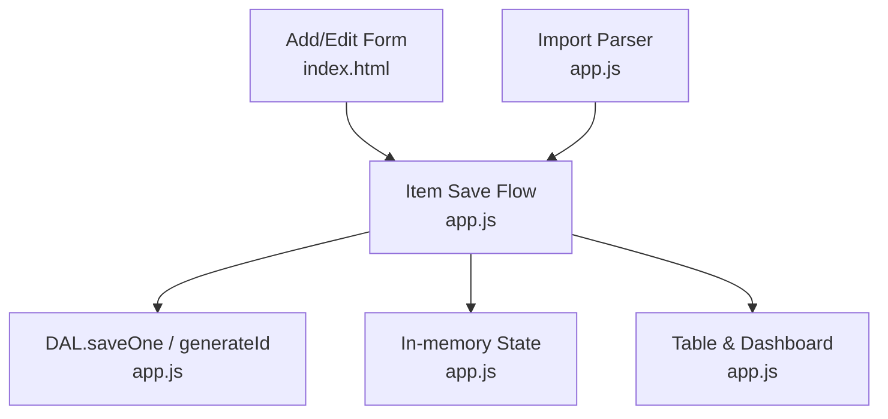
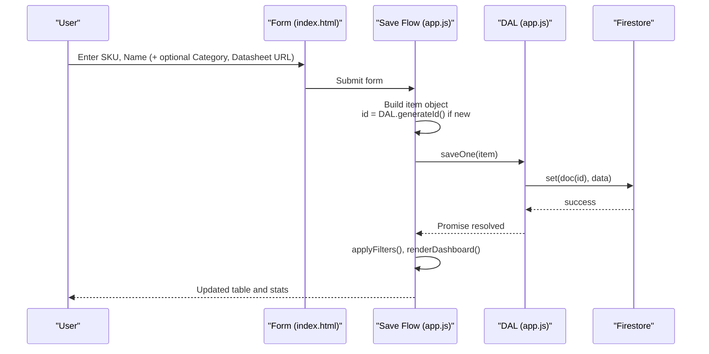
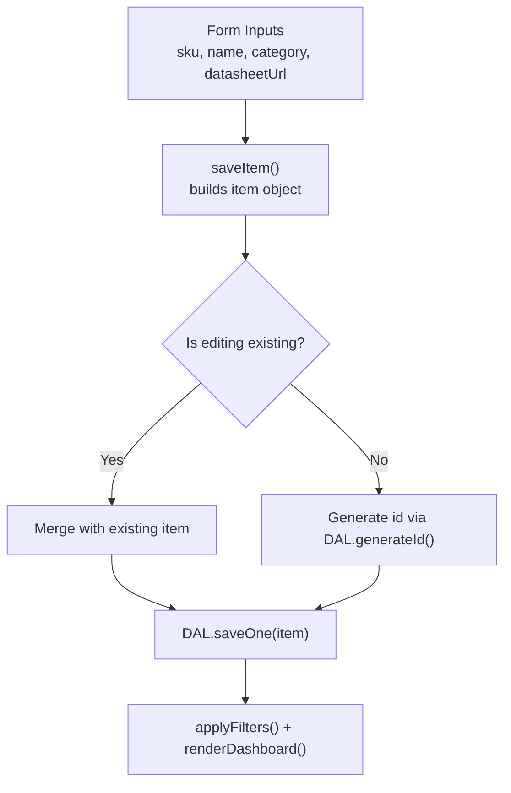

# Basic Item Fields

<cite>
**Referenced Files in This Document**
- [app.js](file://app.js)
- [index.html](file://index.html)
</cite>

## Table of Contents
1. [Introduction](#introduction)
2. [Project Structure](#project-structure)
3. [Core Components](#core-components)
4. [Architecture Overview](#architecture-overview)
5. [Detailed Component Analysis](#detailed-component-analysis)
6. [Dependency Analysis](#dependency-analysis)
7. [Performance Considerations](#performance-considerations)
8. [Troubleshooting Guide](#troubleshooting-guide)
9. [Conclusion](#conclusion)
10. [Appendices](#appendices)

## Introduction
This document defines the basic inventory item fields used by the application, focusing on required and optional attributes for a minimal yet complete item record. It explains data types, validation rules, constraints, and provides examples of properly formatted items using both minimal and complete field sets. The unique identifier is generated by DAL.generateId().

## Project Structure
The inventory item model is defined and enforced across:
- UI form inputs (HTML) that declare required fields and input types
- Application logic (JavaScript) that builds, validates, persists, and renders items
- Import utilities that parse external files into the same item schema

**Diagram sources**
- [index.html:580-706](file://index.html#L580-L706)
- [app.js:825-856](file://app.js#L825-L856)
- [app.js:99-101](file://app.js#L99-L101)

**Section sources**
- [index.html:580-706](file://index.html#L580-L706)
- [app.js:825-856](file://app.js#L825-L856)

## Core Components
- id: Unique identifier generated by DAL.generateId() when creating new items.
- sku: Stock Keeping Unit; required string.
- name: Product description; required string.
- category: Optional string used for organization and filtering.
- datasheetUrl: Optional URL to external documentation or product page.

These fields are present in the add/edit form, persisted via DAL.saveOne(), and used throughout filtering, sorting, and rendering.

**Section sources**
- [app.js:99-101](file://app.js#L99-L101)
- [app.js:825-856](file://app.js#L825-L856)
- [index.html:584-675](file://index.html#L584-L675)

## Architecture Overview
The item lifecycle for basic fields:
- User fills SKU and Name (required). Category and Datasheet URL are optional.
- On submit, the app constructs an item object, generates id if new, and saves to Firestore via DAL.saveOne().
- The table and filters use sku, name, category, and datasheetUrl for display and search.

**Diagram sources**
- [index.html:580-706](file://index.html#L580-L706)
- [app.js:825-856](file://app.js#L825-L856)
- [app.js:99-101](file://app.js#L99-L101)

## Detailed Component Analysis

### Field Definitions and Validation Rules

- id
  - Type: string
  - Required: Yes (for persistence and uniqueness)
  - Generation: Created automatically by DAL.generateId() during item creation
  - Constraints: Must be unique; not user-editable
  - Notes: Used as the Firestore document key

- sku
  - Type: string
  - Required: Yes
  - Validation: Non-empty after trimming whitespace
  - Constraints: No explicit format enforced at the code level; must be non-blank
  - Usage: Displayed prominently; used for search and barcode scanning

- name
  - Type: string
  - Required: Yes
  - Validation: Non-empty after trimming whitespace
  - Constraints: No explicit length limit enforced at the code level
  - Usage: Displayed in table rows and alerts

- category
  - Type: string
  - Required: No
  - Validation: None beyond being a plain string
  - Constraints: Can be empty; supports free-form values and predefined options
  - Usage: Filtering and grouping; appears in search results

- datasheetUrl
  - Type: string (URL)
  - Required: No
  - Validation: HTML input type=url enforces URL syntax at the UI layer
  - Constraints: Empty string is allowed; when present, rendered as a clickable link
  - Usage: External documentation link shown in the table row

Additional notes:
- All text fields are trimmed before saving.
- Numeric fields (e.g., stock quantities) default to zero if missing or invalid; these are not part of the basic fields but influence behavior.

**Section sources**
- [app.js:99-101](file://app.js#L99-L101)
- [app.js:825-856](file://app.js#L825-L856)
- [index.html:584-675](file://index.html#L584-L675)

### Data Types and Constraints Summary
- id: string (auto-generated)
- sku: string (required, non-empty)
- name: string (required, non-empty)
- category: string (optional)
- datasheetUrl: string/URL (optional, validated by browser’s url input type)

### Examples of Properly Formatted Basic Item Objects

Minimal item (only required fields plus generated id):
- { id, sku, name }

Complete item (including optional fields):
- { id, sku, name, category, datasheetUrl }

Where:
- id is produced by DAL.generateId()
- sku and name are non-empty strings
- category is any string or omitted
- datasheetUrl is either omitted or a valid URL string

[No sources needed since this section provides conceptual examples]

## Dependency Analysis
The following diagram shows how the basic item fields flow through the system:

**Diagram sources**
- [index.html:580-706](file://index.html#L580-L706)
- [app.js:825-856](file://app.js#L825-L856)
- [app.js:99-101](file://app.js#L99-L101)

**Section sources**
- [app.js:825-856](file://app.js#L825-L856)
- [index.html:580-706](file://index.html#L580-L706)

## Performance Considerations
- Keeping sku and name short improves table rendering speed and search responsiveness.
- Avoid excessively long category names or datasheet URLs to reduce DOM payload.
- Since id is auto-generated and stable, avoid reassigning it manually.

[No sources needed since this section provides general guidance]

## Troubleshooting Guide
- If submission fails due to permission issues, the DAL layer surfaces a toast message indicating database rules may be blocking access.
- If Firebase is unavailable, a toast indicates connection problems.
- Ensure sku and name are non-empty; otherwise, the browser’s required validation will prevent submission.

**Section sources**
- [app.js:55-70](file://app.js#L55-L70)

## Conclusion
The basic inventory item model centers on three core attributes—id, sku, and name—with two helpful optional fields—category and datasheetUrl. The application enforces required fields at the UI layer, generates ids automatically, and persists items via DAL.saveOne(). Following the data types and constraints outlined here ensures consistent behavior across import, editing, and display features.

[No sources needed since this section summarizes without analyzing specific files]

## Appendices

### Appendix A: Where Fields Are Defined and Used
- Add/Edit form fields and labels: [index.html:580-706](file://index.html#L580-L706)
- Item save flow and id generation: [app.js:825-856](file://app.js#L825-L856), [app.js:99-101](file://app.js#L99-L101)
- Rendering and search usage of sku, name, category, datasheetUrl: [app.js:452-495](file://app.js#L452-L495), [app.js:547-619](file://app.js#L547-L619)

**Section sources**
- [index.html:580-706](file://index.html#L580-L706)
- [app.js:825-856](file://app.js#L825-L856)
- [app.js:99-101](file://app.js#L99-L101)
- [app.js:452-495](file://app.js#L452-L495)
- [app.js:547-619](file://app.js#L547-L619)