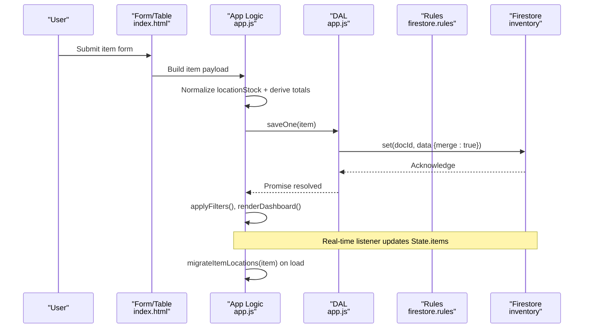
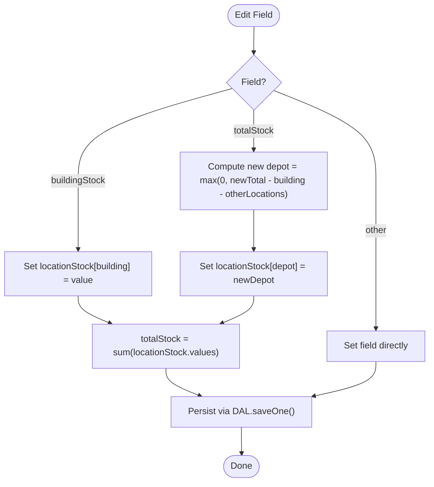
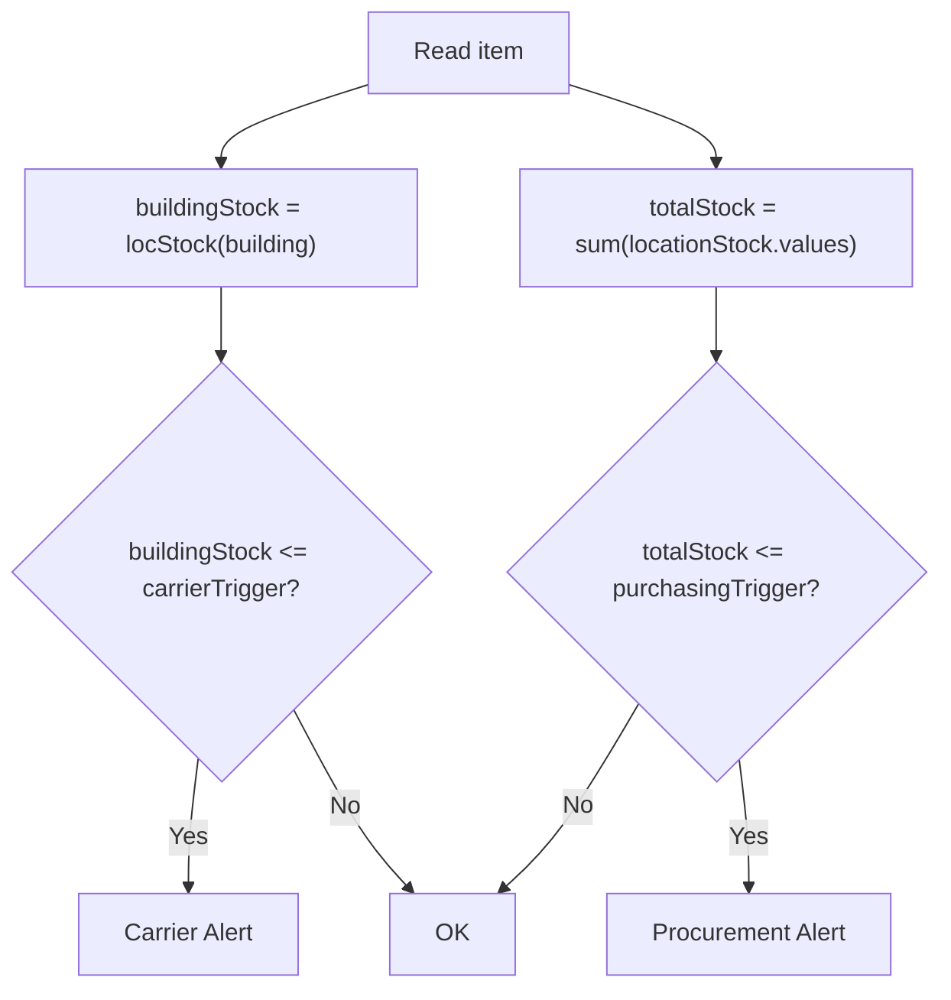
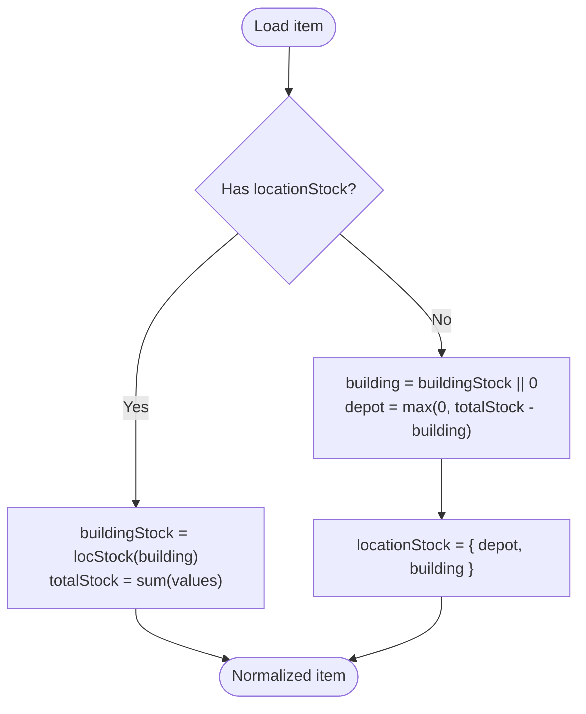
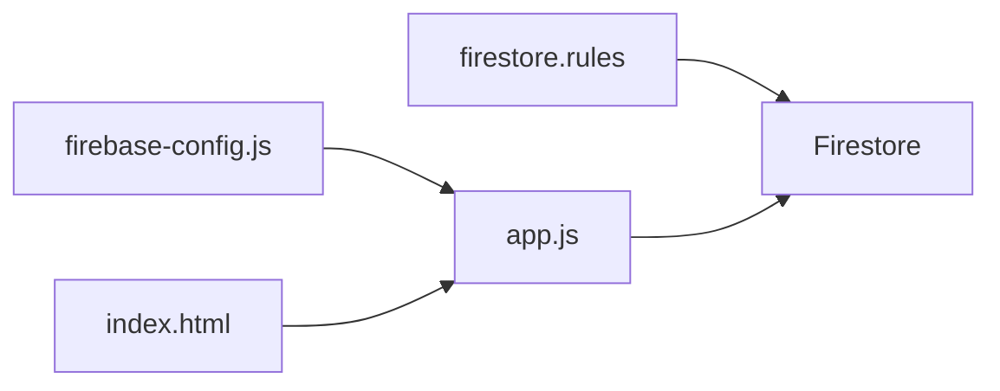

# Inventory Item Schema

<cite>
**Referenced Files in This Document**
- [app.js](file://app.js)
- [index.html](file://index.html)
- [firebase-config.js](file://firebase-config.js)
- [firestore.rules](file://firestore.rules)
</cite>

## Table of Contents
1. Introduction
2. Project Structure
3. Core Components
4. Architecture Overview
5. Detailed Component Analysis
6. Dependency Analysis
7. Performance Considerations
8. Troubleshooting Guide
9. Conclusion
10. Appendices

## Introduction
This document defines the inventory item data model used by the application, including required and optional fields, stock management structure, threshold configuration, validation rules, migration logic from legacy single-stock format to multi-location support, and sample documents for both new and migrated formats. The schema is persisted in Firestore under the inventory collection and synchronized in real time.

## Project Structure
The inventory item schema is defined and enforced across:
- Client-side state and persistence (Firestore writes/reads)
- UI form inputs that map to schema fields
- Security rules enforcing ownership and core field presence on create
- Migration helpers that normalize legacy items into a multi-location model

```mermaid
graph TB
subgraph "Client"
UI["UI Form & Table<br/>index.html"]
Logic["App Logic & DAL<br/>app.js"]
end
subgraph "Backend"
Rules["Firestore Rules<br/>firestore.rules"]
DB[(Firestore)<br/>inventory collection]
end
UI --> Logic
Logic --> Rules
Logic --> DB
```

**Diagram sources**
- [app.js:33-132](file://app.js#L33-L132)
- [index.html:544-674](file://index.html#L544-L674)
- [firestore.rules:12-29](file://firestore.rules#L12-L29)

**Section sources**
- [app.js:33-132](file://app.js#L33-L132)
- [index.html:544-674](file://index.html#L544-L674)
- [firestore.rules:12-29](file://firestore.rules#L12-L29)

## Core Components
The inventory item object includes:

- Identifier
  - id: string (generated client-side; unique per document)
- Identification
  - sku: string (required)
  - name: string (required)
  - category: string (optional)
  - datasheetUrl: string or URL (optional)
- Stock Management
  - locationStock: object (map of locationId → number). Supports unlimited locations with dynamic key-value pairs.
  - buildingStock: number (derived convenience field representing stock at the “Company Building” location)
  - totalStock: number (derived convenience field representing sum across all locations)
- Threshold Configuration
  - carrierTrigger: number (non-negative)
  - maxCapacity: number (non-negative)
  - purchasingTrigger: number (non-negative)
- System Fields
  - ownerId: string (set server-side via write path)
  - updatedAt: timestamp (server timestamp set on save)

Notes:
- locationStock keys are arbitrary strings (location IDs). Two default IDs are seeded: depot and building.
- buildingStock and totalStock are derived values maintained for backward compatibility and UI performance. They are recomputed when locationStock changes.

**Section sources**
- [app.js:340-368](file://app.js#L340-L368)
- [app.js:824-854](file://app.js#L824-L854)
- [app.js:425-435](file://app.js#L425-L435)
- [index.html:556-666](file://index.html#L556-L666)

## Architecture Overview
The item lifecycle involves creation, update, and synchronization with Firestore. On read, legacy items are normalized to include locationStock and derived totals.



**Diagram sources**
- [app.js:214-239](file://app.js#L214-L239)
- [app.js:344-356](file://app.js#L344-L356)
- [app.js:824-854](file://app.js#L824-L854)
- [app.js:55-70](file://app.js#L55-L70)
- [firestore.rules:16-29](file://firestore.rules#L16-L29)

## Detailed Component Analysis

### Item Data Model
- Required fields
  - sku: non-empty string
  - name: non-empty string
  - category: present in create request (enforced by rules)
- Optional fields
  - datasheetUrl: URL string (validated by HTML input type=url)
- Stock management
  - locationStock: object with dynamic keys (locationId → non-negative integer)
  - buildingStock: number (convenience field equal to locationStock[building])
  - totalStock: number (sum of all values in locationStock)
- Thresholds
  - carrierTrigger: non-negative integer
  - maxCapacity: non-negative integer
  - purchasingTrigger: non-negative integer
- System fields
  - ownerId: string (must match authenticated user)
  - updatedAt: timestamp (server timestamp)

Validation constraints:
- Non-negative integers for numeric fields
- SKU and Name required on create/update
- Category required on create (enforced by rules)
- Owner must match authenticated user for all operations

Business logic:
- Carrier alert triggers when buildingStock ≤ carrierTrigger
- Procurement alert triggers when totalStock ≤ purchasingTrigger
- Max capacity influences gauge and suggested transfer quantity

**Section sources**
- [firestore.rules:16-29](file://firestore.rules#L16-L29)
- [index.html:556-666](file://index.html#L556-L666)
- [app.js:425-435](file://app.js#L425-L435)
- [app.js:344-368](file://app.js#L344-L368)

### Multi-Location Support and Derived Fields
- locationStock supports unlimited locations via dynamic key-value pairs
- Default locations:
  - depot: Main Depot
  - building: Company Building
- Derived fields:
  - buildingStock = locationStock[building]
  - totalStock = sum(locationStock.values)
- Editing behavior:
  - Editing buildingStock updates locationStock[building] and recalculates totalStock
  - Editing totalStock adjusts depot so that new total equals user input while keeping building stable



**Diagram sources**
- [app.js:704-728](file://app.js#L704-L728)
- [app.js:778-796](file://app.js#L778-L796)
- [app.js:364-368](file://app.js#L364-L368)

**Section sources**
- [app.js:340-368](file://app.js#L340-L368)
- [app.js:704-728](file://app.js#L704-L728)
- [app.js:778-796](file://app.js#L778-L796)

### Threshold Configuration and Business Logic
- carrierTrigger: if buildingStock ≤ carrierTrigger → carrier alert
- purchasingTrigger: if totalStock ≤ purchasingTrigger → procurement alert
- maxCapacity: used for gauge visualization and suggested transfer quantity



**Diagram sources**
- [app.js:425-435](file://app.js#L425-L435)
- [app.js:359-368](file://app.js#L359-L368)

**Section sources**
- [app.js:425-435](file://app.js#L425-L435)

### Location Object Structure
- Keys: arbitrary location IDs (strings)
- Values: non-negative integers representing units at that location
- Defaults:
  - depot: Main Depot
  - building: Company Building
- Additional locations can be added and will appear in filters and transfers

**Section sources**
- [app.js:340-368](file://app.js#L340-L368)
- [app.js:377-380](file://app.js#L377-L380)

### Data Validation Rules
- Client-side
  - HTML inputs enforce non-negative numbers and URL format where applicable
  - Numeric parsing coerces invalid inputs to zero
- Server-side (Firestore rules)
  - Read/write requires authentication
  - Create requires sku, name, and category
  - Writes require matching ownerId to authenticated user

**Section sources**
- [index.html:556-666](file://index.html#L556-L666)
- [app.js:2044-2055](file://app.js#L2044-L2055)
- [firestore.rules:16-29](file://firestore.rules#L16-L29)

### Migration Logic: Legacy Single-Stock to Multi-Location
Legacy items may only have totalStock and buildingStock. Migration:
- If locationStock exists: recompute buildingStock and totalStock for consistency
- Else: compute depot = max(0, totalStock - buildingStock), then set locationStock = { depot, building }



**Diagram sources**
- [app.js:344-356](file://app.js#L344-L356)
- [app.js:359-368](file://app.js#L359-L368)

**Section sources**
- [app.js:344-356](file://app.js#L344-L356)

### Sample Item Documents

New format (multi-location):
- id: string
- sku: string
- name: string
- category: string
- datasheetUrl: string
- locationStock: object with dynamic keys (e.g., depot, building, showroom)
- buildingStock: number (derived)
- totalStock: number (derived)
- carrierTrigger: number
- maxCapacity: number
- purchasingTrigger: number
- ownerId: string
- updatedAt: timestamp

Migrated format (from legacy):
- Same as above, but locationStock was created by migration using legacy totalStock and buildingStock

Note: These samples describe structure and semantics without embedding literal content.

**Section sources**
- [app.js:344-356](file://app.js#L344-L356)
- [app.js:323-334](file://app.js#L323-L334)

## Dependency Analysis
- app.js depends on firebase-config.js for db and auth globals
- firestore.rules enforce ownership and required fields
- index.html provides UI bindings for schema fields



**Diagram sources**
- [firebase-config.js:14-18](file://firebase-config.js#L14-L18)
- [app.js:33-132](file://app.js#L33-L132)
- [index.html:544-674](file://index.html#L544-L674)
- [firestore.rules:12-29](file://firestore.rules#L12-L29)

**Section sources**
- [firebase-config.js:14-18](file://firebase-config.js#L14-L18)
- [app.js:33-132](file://app.js#L33-L132)
- [index.html:544-674](file://index.html#L544-L674)
- [firestore.rules:12-29](file://firestore.rules#L12-L29)

## Performance Considerations
- Derived fields (buildingStock, totalStock) reduce repeated computations during rendering
- Real-time listeners keep UI in sync; avoid unnecessary re-renders by updating only affected rows
- Use batch writes for bulk operations to minimize network overhead

## Troubleshooting Guide
Common issues and resolutions:
- Permission denied on writes: ensure authenticated user matches ownerId and rules allow access
- Firebase unavailable: check connectivity and browser support for persistence
- Incorrect totals after edit: verify editing totalStock recalculates depot correctly and that locationStock is consistent

**Section sources**
- [app.js:55-70](file://app.js#L55-L70)
- [app.js:229-238](file://app.js#L229-L238)
- [app.js:704-728](file://app.js#L704-L728)

## Conclusion
The inventory item schema centers on a flexible multi-location stock model backed by derived convenience fields and robust validation. Migration ensures seamless transition from legacy single-stock records, while security rules protect data integrity and ownership.

## Appendices

### Field Reference Summary
- id: string (unique identifier)
- sku: string (required)
- name: string (required)
- category: string (required on create)
- datasheetUrl: string (optional)
- locationStock: object (dynamic keys → non-negative integers)
- buildingStock: number (derived)
- totalStock: number (derived)
- carrierTrigger: number (non-negative)
- maxCapacity: number (non-negative)
- purchasingTrigger: number (non-negative)
- ownerId: string (owner identity)
- updatedAt: timestamp (last updated)

**Section sources**
- [app.js:340-368](file://app.js#L340-L368)
- [app.js:824-854](file://app.js#L824-L854)
- [index.html:556-666](file://index.html#L556-L666)
- [firestore.rules:16-29](file://firestore.rules#L16-L29)