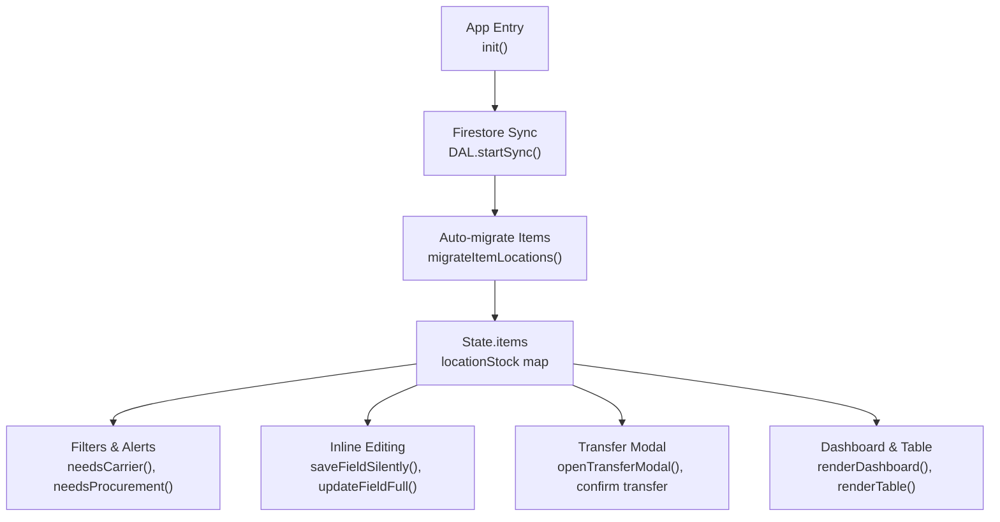
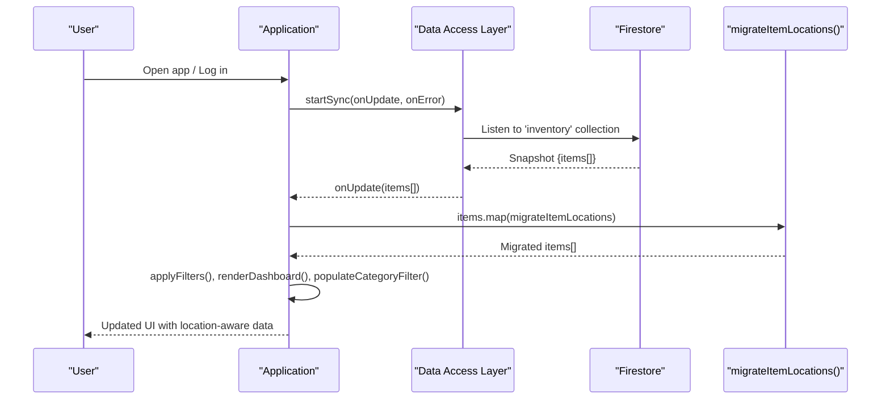
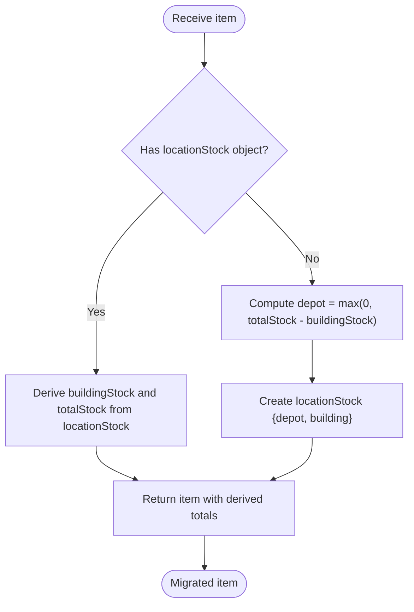
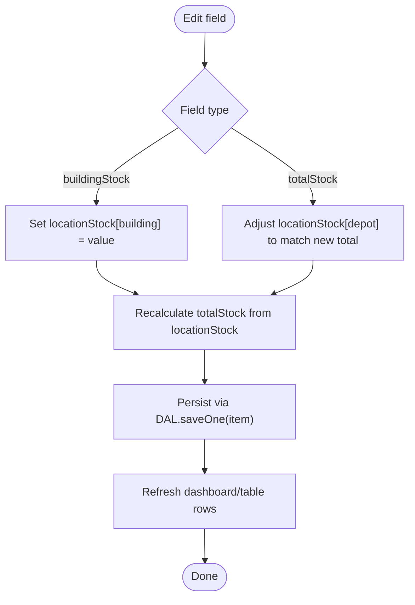
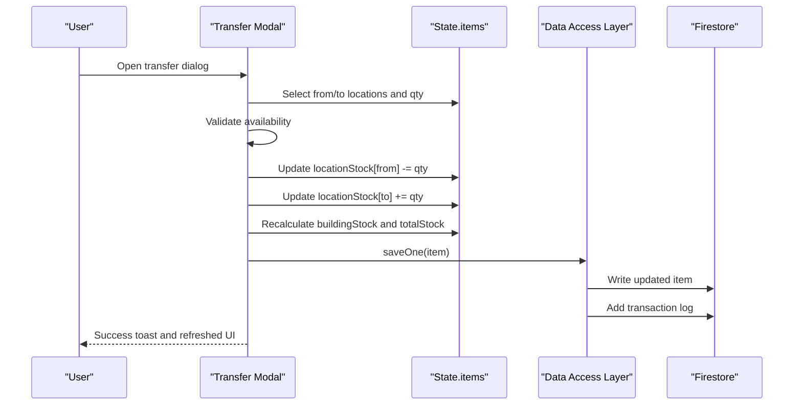
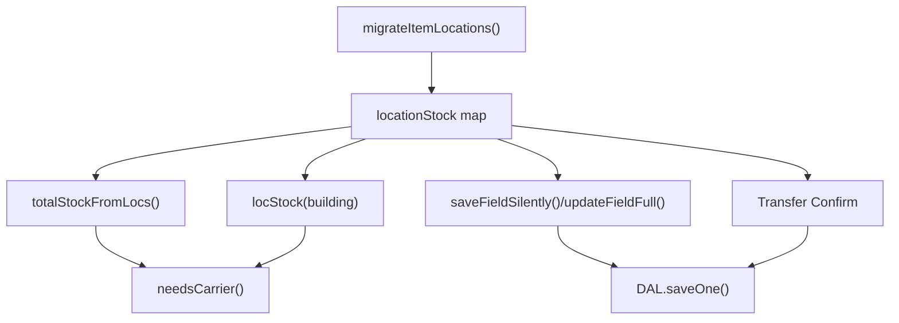

# Legacy Data Migration

<cite>
**Referenced Files in This Document**
- [app.js](file://app.js)
- [index.html](file://index.html)
- [README.md](file://README.md)
</cite>

## Table of Contents
1. [Introduction](#introduction)
2. [Project Structure](#project-structure)
3. [Core Components](#core-components)
4. [Architecture Overview](#architecture-overview)
5. [Detailed Component Analysis](#detailed-component-analysis)
6. [Dependency Analysis](#dependency-analysis)
7. [Performance Considerations](#performance-considerations)
8. [Troubleshooting Guide](#troubleshooting-guide)
9. [Conclusion](#conclusion)

## Introduction
This document explains the migration system that converts legacy single-stock inventory items to a new location-based model. The application supports both legacy and new formats simultaneously during a transition period, ensuring backward compatibility while gradually adopting a per-location stock map.

Key goals:
- Automatically detect legacy items with totalStock and buildingStock properties.
- Convert them into a locationStock object with two default locations: Main Depot and Company Building.
- Maintain backward compatibility by keeping derived fields (totalStock, buildingStock) consistent with the new structure.
- Provide seamless user experience for editing, transfers, alerts, and reporting across both old and new data shapes.

## Project Structure
The migration logic is implemented within the main application script and interacts with Firestore via a data access layer. The UI references legacy fields for forms and table inputs but reads and writes using the new location-based model under the hood.

**Diagram sources**
- [app.js:200-265](file://app.js#L200-L265)
- [app.js:343-368](file://app.js#L343-L368)
- [app.js:421-443](file://app.js#L421-L443)
- [app.js:700-808](file://app.js#L700-L808)
- [app.js:1527-1555](file://app.js#L1527-L1555)
- [app.js:2413-2443](file://app.js#L2413-L2443)
- [app.js:500-619](file://app.js#L500-L619)
- [app.js:624-663](file://app.js#L624-L663)

**Section sources**
- [app.js:200-265](file://app.js#L200-L265)
- [app.js:343-368](file://app.js#L343-L368)
- [app.js:500-619](file://app.js#L500-L619)
- [app.js:624-663](file://app.js#L624-L663)

## Core Components
- Migration function: Converts legacy items to location-based format on read from Firestore.
- Location helpers: Read/write per-location stock and compute totals.
- Backward compatibility: Derives legacy fields (totalStock, buildingStock) from locationStock when needed.
- Edit flows: Inline editing updates locationStock and recalculates totals consistently.
- Transfer flow: Moves stock between locations and logs transactions.

**Section sources**
- [app.js:343-368](file://app.js#L343-L368)
- [app.js:700-808](file://app.js#L700-L808)
- [app.js:1527-1555](file://app.js#L1527-L1555)
- [app.js:2413-2443](file://app.js#L2413-L2443)

## Architecture Overview
The migration is triggered automatically whenever inventory data is synced from Firestore. Each item is passed through the migration function before being stored in application state. All subsequent operations use the new locationStock structure while preserving legacy field values for compatibility.

**Diagram sources**
- [app.js:200-265](file://app.js#L200-L265)
- [app.js:343-368](file://app.js#L343-L368)

## Detailed Component Analysis

### Migration Trigger and Detection
- Trigger point: On successful Firestore sync, each item is mapped through the migration function.
- Detection logic: If an item already has a valid locationStock object, it is considered migrated; otherwise, it is treated as legacy.
- Legacy assumption: For legacy items, buildingStock represents on-site stock at Company Building; depot stock equals totalStock minus buildingStock.

**Diagram sources**
- [app.js:343-368](file://app.js#L343-L368)

**Section sources**
- [app.js:217-226](file://app.js#L217-L226)
- [app.js:343-368](file://app.js#L343-L368)

### Data Transformation Process
- New format: locationStock is a map keyed by location id (e.g., depot, building).
- Legacy fields:
  - buildingStock: Derived from locationStock[building].
  - totalStock: Sum of all values in locationStock.
- Default locations:
  - Main Depot (id: depot)
  - Company Building (id: building)

Backward compatibility measures:
- When reading legacy items, the system constructs locationStock and ensures legacy fields remain accurate.
- When reading migrated items, the system derives legacy fields from locationStock to keep existing UI and logic working.

**Section sources**
- [app.js:343-368](file://app.js#L343-L368)
- [app.js:376-380](file://app.js#L376-L380)

### Editing Flows and Consistency
- Inline editing of buildingStock updates locationStock[building] and recalculates totalStock.
- Inline editing of totalStock adjusts depot stock so that the sum across locations matches the new total while keeping building stable.
- Full-field updates follow the same rules, ensuring consistency across UI interactions.

**Diagram sources**
- [app.js:700-808](file://app.js#L700-L808)

**Section sources**
- [app.js:700-808](file://app.js#L700-L808)

### Transfers Between Locations
- Transfer modal allows moving stock between any two locations.
- Validation ensures source has sufficient stock and different locations are selected.
- After confirmation, locationStock is updated, legacy fields are recalculated, and a transaction log entry is created.

**Diagram sources**
- [app.js:1527-1555](file://app.js#L1527-L1555)
- [app.js:2413-2443](file://app.js#L2413-L2443)

**Section sources**
- [app.js:1527-1555](file://app.js#L1527-L1555)
- [app.js:2413-2443](file://app.js#L2413-L2443)

### Alerts and Computed Helpers
- Carrier alert: Building stock at Company Building is at or below carrierTrigger.
- Procurement alert: Total stock across all locations is at or below purchasingTrigger.
- These helpers rely on locationStock-derived values, ensuring correct behavior regardless of whether items were originally legacy or migrated.

**Section sources**
- [app.js:421-443](file://app.js#L421-L443)

### UI Integration and Legacy Fields
- The form and table still expose totalStock and buildingStock fields for familiarity.
- Internally, these map to locationStock entries and computed totals, maintaining a smooth transition for users.

**Section sources**
- [index.html:675-706](file://index.html#L675-L706)
- [app.js:579-619](file://app.js#L579-L619)

## Dependency Analysis
- Migration depends on:
  - Firestore sync callback to trigger conversion.
  - Location seeding to ensure default locations exist.
  - Helper functions for reading/writing locationStock and computing totals.
- Downstream components depend on:
  - Filters and alerts using derived totals and building stock.
  - Inline editing and transfer flows updating locationStock and persisting changes.

**Diagram sources**
- [app.js:343-368](file://app.js#L343-L368)
- [app.js:700-808](file://app.js#L700-L808)
- [app.js:2413-2443](file://app.js#L2413-L2443)

**Section sources**
- [app.js:343-368](file://app.js#L343-L368)
- [app.js:700-808](file://app.js#L700-L808)
- [app.js:2413-2443](file://app.js#L2413-L2443)

## Performance Considerations
- Migration runs once per item on each Firestore snapshot; mapping is lightweight and avoids unnecessary rewrites.
- Derived totals are computed on demand and cached implicitly in State.items after migration.
- Inline edits perform targeted updates rather than full re-renders where possible, improving responsiveness.

[No sources needed since this section provides general guidance]

## Troubleshooting Guide
- Permission denied errors: Ensure Firestore rules allow read/write for authenticated users.
- Firebase unavailable: Check network connectivity and service status.
- Missing locations: Default locations are seeded on first run; if missing, verify seedDefaultLocations execution.
- Inconsistent totals: Verify that editing flows update locationStock and recalculate totals consistently.

**Section sources**
- [app.js:229-238](file://app.js#L229-L238)
- [app.js:376-380](file://app.js#L376-L380)

## Conclusion
The migration system seamlessly transitions legacy single-stock items to a robust location-based model. It detects legacy structures, transforms them into locationStock maps, and maintains backward compatibility by deriving legacy fields. Users can continue editing familiar fields while the system ensures data integrity and enables advanced features like multi-location transfers and precise alerts.

[No sources needed since this section summarizes without analyzing specific files]