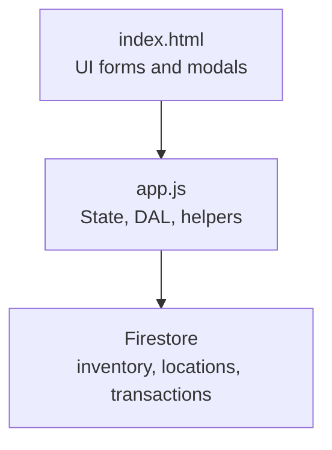
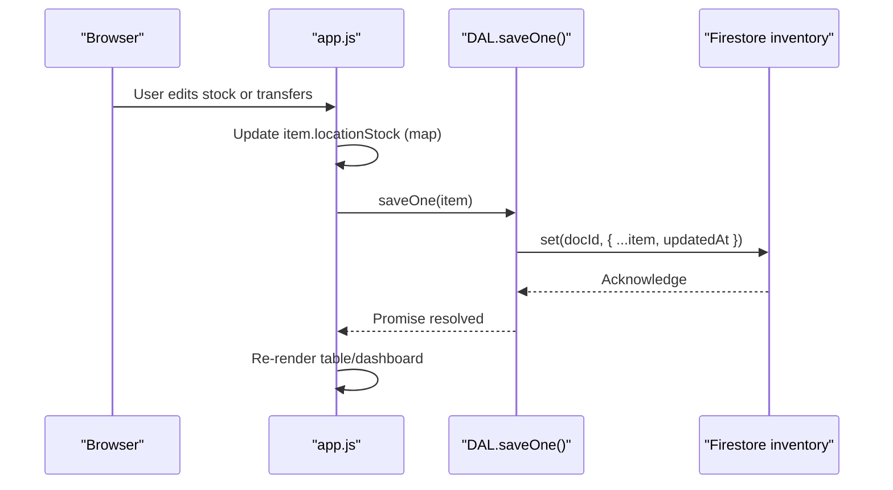
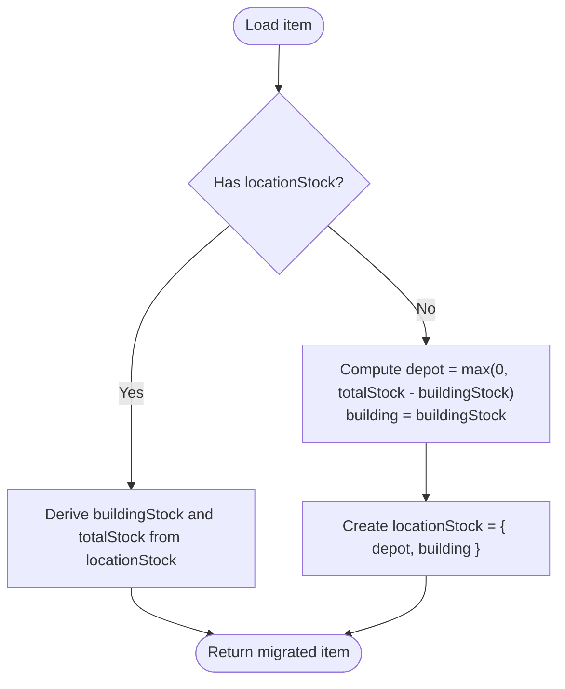
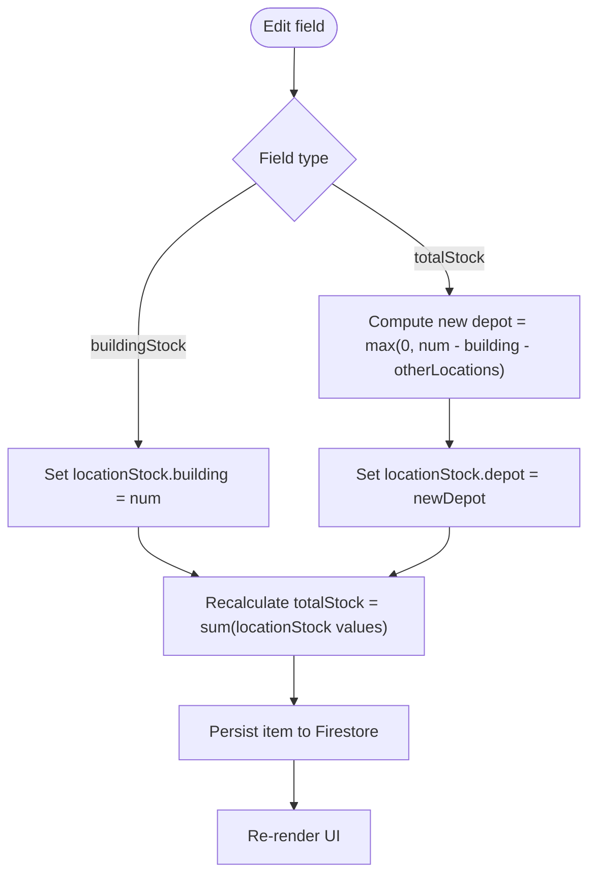
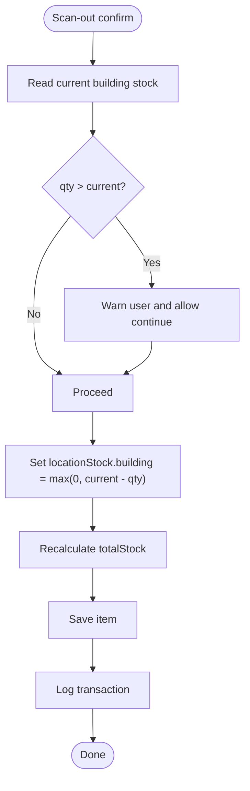
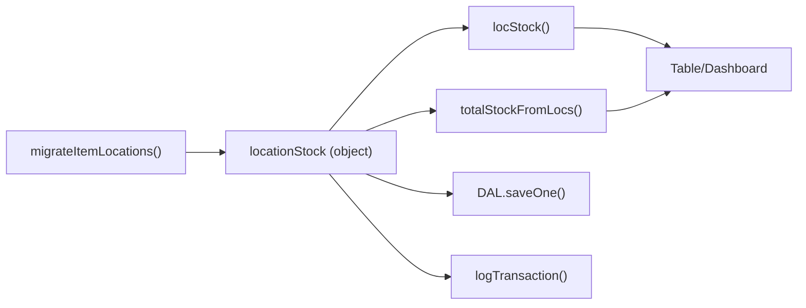

# Location Stock Data Structure

<cite>
**Referenced Files in This Document**
- [app.js](file://app.js)
- [index.html](file://index.html)
- [README.md](file://README.md)
</cite>

## Table of Contents
1. [Introduction](#introduction)
2. [Project Structure](#project-structure)
3. [Core Components](#core-components)
4. [Architecture Overview](#architecture-overview)
5. [Detailed Component Analysis](#detailed-component-analysis)
6. [Dependency Analysis](#dependency-analysis)
7. [Performance Considerations](#performance-considerations)
8. [Troubleshooting Guide](#troubleshooting-guide)
9. [Conclusion](#conclusion)

## Introduction
This document explains the locationStock object structure used to enable multi-location inventory tracking. It covers how dynamic key-value pairs map location IDs to stock quantities, migration from legacy fields (totalStock and buildingStock), default values, validation rules, and how the design supports unlimited locations without schema changes.

## Project Structure
The application is a single-page web app with client-side logic in app.js and UI templates in index.html. The README describes core business logic and quick start instructions.



**Diagram sources**
- [app.js:1-50](file://app.js#L1-L50)
- [index.html:1184-1263](file://index.html#L1184-L1263)

**Section sources**
- [README.md:1-32](file://README.md#L1-L32)
- [app.js:1-50](file://app.js#L1-L50)
- [index.html:1184-1263](file://index.html#L1184-L1263)

## Core Components
- locationStock: A dynamic object where each key is a location ID and each value is a non-negative integer representing stock at that location.
- Legacy fields: totalStock and buildingStock are maintained for backward compatibility and UI convenience but are derived from locationStock when present.
- Default locations: Two core locations are seeded automatically if none exist: depot and building.

Key behaviors:
- Migration: Items without locationStock are migrated by computing depot = max(0, totalStock - buildingStock) and building = buildingStock, then creating locationStock with those two keys.
- Derived totals: totalStock is computed as the sum of all values in locationStock; buildingStock is read from the building key.
- Unlimited locations: New custom locations can be added; items can hold stock at any number of locations via additional keys in locationStock.

**Section sources**
- [app.js:340-380](file://app.js#L340-L380)
- [app.js:358-368](file://app.js#L358-L368)
- [app.js:217-226](file://app.js#L217-L226)

## Architecture Overview
The data model centers on an item document with a locationStock map. The application reads items from Firestore, migrates legacy formats into locationStock, and persists updates back to Firestore.



**Diagram sources**
- [app.js:54-70](file://app.js#L54-L70)
- [app.js:826-856](file://app.js#L826-L856)
- [app.js:2413-2443](file://app.js#L2413-L2443)

## Detailed Component Analysis

### locationStock Object Schema
- Type: Object
- Keys: String location IDs (e.g., "depot", "building", or any custom id)
- Values: Non-negative integers representing quantity at that location
- Semantics:
  - Sum of all values equals the effective total stock for the item.
  - Special keys "depot" and "building" are reserved for core locations.
  - Additional keys represent custom locations created by users.

Examples:
- Legacy item (before migration):
  - Fields: totalStock, buildingStock
  - No locationStock field
- Migrated item (after migration):
  - Fields: locationStock: { "depot": N, "building": M }
  - Derived fields: totalStock = N + M; buildingStock = M
- Item with multiple custom locations:
  - locationStock: { "depot": N, "building": M, "showroom": S, "van-1": V }
  - totalStock = N + M + S + V; buildingStock = M

Validation rules enforced by the application:
- All values must be integers >= 0.
- Editing totalStock adjusts the depot key so that new total equals user input while keeping other locations unchanged.
- Transfers subtract from source and add to destination, never allowing negative stock.
- Scanning out reduces building stock to zero minimum.

Default values:
- If locationStock is missing, it is created with depot and building keys based on legacy fields.
- If a location key is absent when reading stock, it is treated as 0.

How unlimited locations are supported:
- locationStock is a plain object keyed by location IDs. Adding a new location does not require schema changes; items simply gain new keys as needed.

**Section sources**
- [app.js:340-380](file://app.js#L340-L380)
- [app.js:358-368](file://app.js#L358-L368)
- [app.js:706-731](file://app.js#L706-L731)
- [app.js:780-800](file://app.js#L780-L800)
- [app.js:810-824](file://app.js#L810-L824)
- [app.js:2413-2443](file://app.js#L2413-L2443)
- [app.js:1377-1430](file://app.js#L1377-L1430)

### Migration Logic
When items are loaded, legacy items are converted to use locationStock:
- If locationStock exists, derive buildingStock and totalStock for compatibility.
- Otherwise, compute depot = max(0, totalStock - buildingStock) and building = buildingStock, then create locationStock with these two keys.



**Diagram sources**
- [app.js:344-356](file://app.js#L344-L356)

**Section sources**
- [app.js:344-356](file://app.js#L344-L356)

### Updating Stock and Totals
- Editing buildingStock updates the building key in locationStock and recalculates totalStock.
- Editing totalStock recalculates depot so that the new total equals the user input while preserving other locations.
- Quick +/- buttons adjust buildingStock only.



**Diagram sources**
- [app.js:706-731](file://app.js#L706-L731)
- [app.js:780-800](file://app.js#L780-L800)

**Section sources**
- [app.js:706-731](file://app.js#L706-L731)
- [app.js:780-800](file://app.js#L780-L800)

### Transfer Between Locations
Transfers move stock between any two locations defined in the system:
- Validates that source has sufficient stock.
- Decrements source and increments destination.
- Updates derived fields and logs a transaction.

```mermaid
sequenceDiagram
participant UI as "Transfer Modal"
participant App as "app.js"
participant DAL as "DAL.saveOne()"
participant TX as "transactions"
UI->>App : Confirm transfer (from, to, qty)
App->>App : Validate qty <= source stock
App->>App : newLS[from] -= qty; newLS[to] += qty
App->>DAL : saveOne(item with updated locationStock)
DAL-->>App : Success
App->>TX : logTransaction({ type : "transfer", from, to, qty })
App->>App : Re-render dashboard/table
```

**Diagram sources**
- [app.js:2413-2443](file://app.js#L2413-L2443)

**Section sources**
- [app.js:2413-2443](file://app.js#L2413-L2443)

### Scan-Out Flow
Scanning out removes units from the building location:
- Validates against current building stock.
- Sets building stock to max(0, current - qty).
- Persists and logs the transaction.



**Diagram sources**
- [app.js:1377-1430](file://app.js#L1377-L1430)

**Section sources**
- [app.js:1377-1430](file://app.js#L1377-L1430)

### Default Locations and Seeding
On first run, two core locations are seeded if none exist:
- depot ("Main Depot")
- building ("Company Building")

These IDs are used consistently across the codebase for core operations.

**Section sources**
- [app.js:376-380](file://app.js#L376-L380)

## Dependency Analysis
- locationStock depends on:
  - Location definitions (for display and transfer dropdowns)
  - Helper functions for reading and summing stock
  - Persistence layer for saving changes
- Backward compatibility depends on:
  - Migration function to convert legacy fields into locationStock
  - Derived fields (buildingStock, totalStock) for UI and filters



**Diagram sources**
- [app.js:358-368](file://app.js#L358-L368)
- [app.js:344-356](file://app.js#L344-L356)
- [app.js:54-70](file://app.js#L54-L70)
- [app.js:2413-2443](file://app.js#L2413-L2443)

**Section sources**
- [app.js:344-368](file://app.js#L344-L368)
- [app.js:54-70](file://app.js#L54-L70)
- [app.js:2413-2443](file://app.js#L2413-L2443)

## Performance Considerations
- Reading stock per location is O(1) by key lookup.
- Computing total stock is O(n) over the number of locations in locationStock.
- Keep locationStock reasonably sized; avoid excessive custom locations per item to minimize serialization overhead.
- Batch writes are available for bulk operations to reduce network calls.

[No sources needed since this section provides general guidance]

## Troubleshooting Guide
Common issues and resolutions:
- Missing locationStock:
  - Ensure migration runs on load; legacy items will be converted automatically.
- Negative stock:
  - All updates clamp values to >= 0; verify inputs before editing.
- Transfer fails due to insufficient stock:
  - Check source location availability; the UI disables confirmation when qty exceeds available stock.
- Total stock mismatch:
  - Editing totalStock recalculates depot; ensure no manual overrides break consistency.

**Section sources**
- [app.js:344-356](file://app.js#L344-L356)
- [app.js:2413-2443](file://app.js#L2413-L2443)
- [app.js:706-731](file://app.js#L706-L731)

## Conclusion
The locationStock object provides a flexible, schema-less way to track inventory across unlimited locations. By maintaining backward-compatible derived fields and enforcing simple validation rules, the system supports both legacy data and future expansion without requiring database schema changes.

[No sources needed since this section summarizes without analyzing specific files]