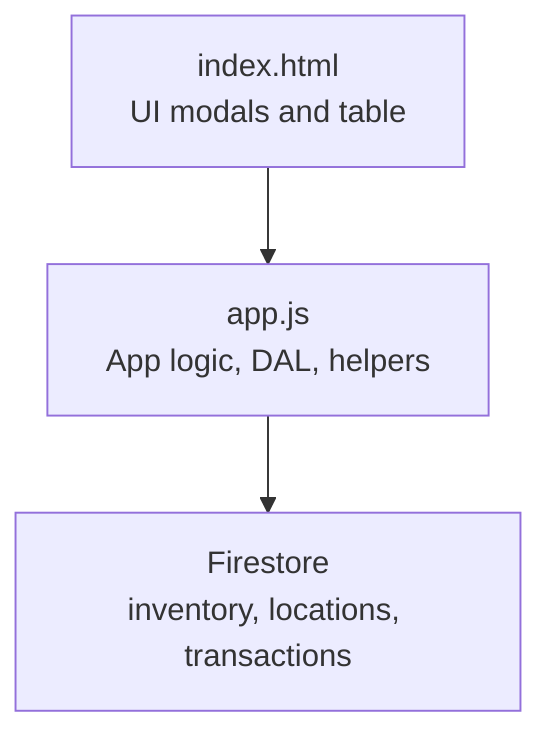
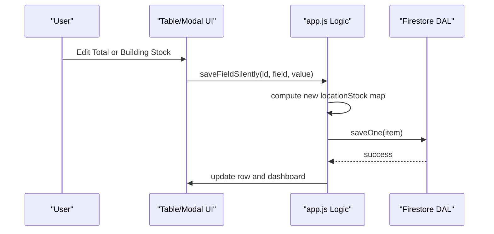
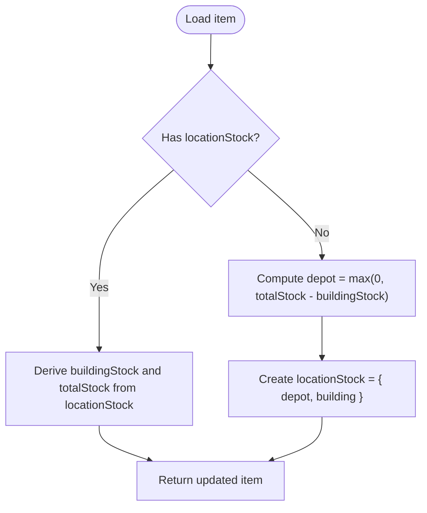
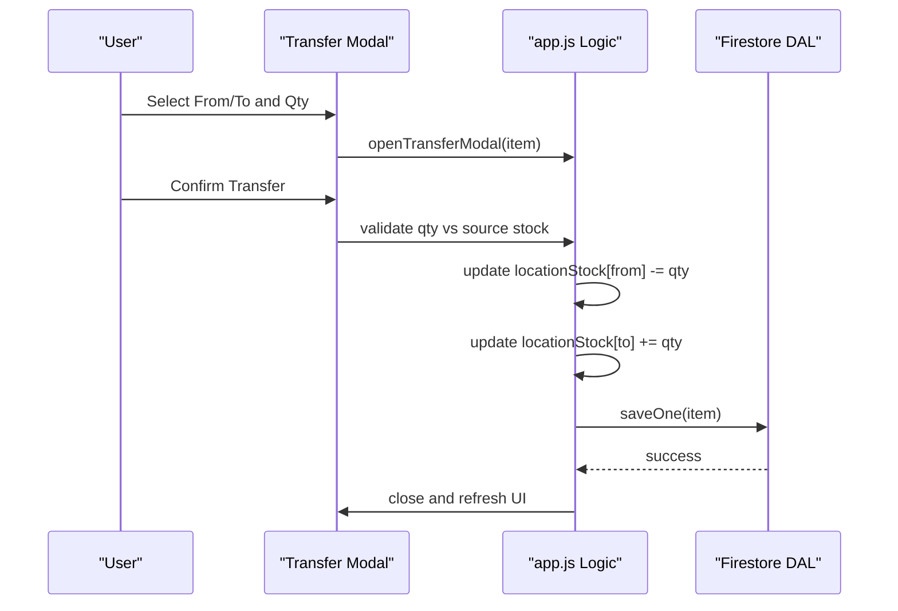
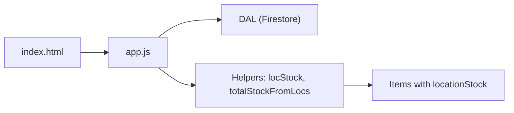

# Location Stock Management

<cite>
**Referenced Files in This Document**
- [app.js](file://app.js)
- [index.html](file://index.html)
- [README.md](file://README.md)
</cite>

## Table of Contents
1. [Introduction](#introduction)
2. [Project Structure](#project-structure)
3. [Core Components](#core-components)
4. [Architecture Overview](#architecture-overview)
5. [Detailed Component Analysis](#detailed-component-analysis)
6. [Dependency Analysis](#dependency-analysis)
7. [Performance Considerations](#performance-considerations)
8. [Troubleshooting Guide](#troubleshooting-guide)
9. [Conclusion](#conclusion)
10. [Appendices](#appendices)

## Introduction
This document explains the multi-location stock management system implemented in the application. It focuses on:
- The locationStock object structure that supports unlimited locations with dynamic key-value pairs (location IDs to quantities).
- Migration logic from legacy single-stock format (totalStock + buildingStock) to the new location-based model.
- Helper functions locStock() and totalStockFromLocs() for calculating stock at a specific location and across all locations.
- Examples of locationStock objects for different scenarios: legacy items, migrated items, and items with multiple custom locations.

The system is designed to be extensible: you can add arbitrary locations beyond the two core ones (Main Depot and Company Building), and all totals are derived from the per-location map.

## Project Structure
At a high level, the application is a single-page web app backed by Firestore. The main logic resides in app.js, which includes:
- Data Access Layer (DAL) for Firestore operations
- State management for inventory items and locations
- UI rendering and event handling
- Location helpers, migration, and transfer workflows

**Diagram sources**
- [index.html:1184-1233](file://index.html#L1184-L1233)
- [app.js:33-132](file://app.js#L33-L132)

**Section sources**
- [README.md:1-32](file://README.md#L1-L32)
- [app.js:1-31](file://app.js#L1-L31)

## Core Components
- locationStock: A map where keys are location IDs and values are integer stock quantities for an item.
- Core locations: Two fixed IDs are used internally:
  - depot: Main Depot
  - building: Company Building
- Derived fields:
  - buildingStock: convenience field set to the quantity at the building location
  - totalStock: convenience field set to the sum across all locations

Key responsibilities:
- Migrate legacy items to use locationStock
- Provide helper functions to read and aggregate stock
- Support adding/removing/transferring stock between any defined locations

**Section sources**
- [app.js:339-380](file://app.js#L339-L380)

## Architecture Overview
The system uses a simple but powerful pattern:
- Items store their stock as a map keyed by location ID.
- All totals and alerts are computed from this map.
- The UI exposes both legacy-compatible fields (buildingStock, totalStock) and the underlying locationStock map.

**Diagram sources**
- [app.js:700-773](file://app.js#L700-L773)
- [app.js:54-70](file://app.js#L54-L70)

## Detailed Component Analysis

### locationStock Object Structure
- Type: Plain object (map)
- Keys: String location IDs (e.g., "depot", "building", "showroom-a", "van-1")
- Values: Non-negative integers representing stock quantity at that location
- Semantics:
  - An item’s total stock equals the sum of all values in its locationStock map
  - buildingStock is a convenience alias for the value at the "building" key
  - Legacy compatibility: if locationStock is missing, the system derives buildingStock and totalStock from legacy fields during migration

Example structures:
- Legacy item (before migration):
  - { sku: "...", name: "...", totalStock: 100, buildingStock: 20 }
- Migrated item (after first load):
  - { sku: "...", name: "...", locationStock: { "depot": 80, "building": 20 }, buildingStock: 20, totalStock: 100 }
- Item with multiple custom locations:
  - { sku: "...", name: "...", locationStock: { "depot": 50, "building": 10, "showroom-a": 30, "van-1": 10 }, buildingStock: 10, totalStock: 100 }

Notes:
- The system ensures non-negative values when updating stock.
- Custom locations can be added via the Locations Manager; they appear in filters and transfers.

**Section sources**
- [app.js:339-380](file://app.js#L339-L380)
- [app.js:343-368](file://app.js#L343-L368)

### Migration Logic: Legacy to Multi-Location
When items are loaded from Firestore, each item is passed through migrateItemLocations():
- If locationStock already exists:
  - Derive buildingStock from the "building" key
  - Derive totalStock as the sum across all locations
- Else (legacy item):
  - Compute depot = max(0, totalStock - buildingStock)
  - Create locationStock with depot and building entries
  - Preserve original fields for backward compatibility

This approach guarantees:
- Zero data loss for existing records
- Backward-compatible fields remain present
- New features work seamlessly with old data

**Diagram sources**
- [app.js:343-356](file://app.js#L343-L356)

**Section sources**
- [app.js:217-219](file://app.js#L217-L219)
- [app.js:343-356](file://app.js#L343-L356)

### Helper Functions

#### locStock(item, locId)
Purpose:
- Returns the stock quantity at a given location for an item
- Returns 0 if the item has no locationStock or the key is missing
- Ensures non-negative numeric result

Complexity:
- Time: O(1)
- Space: O(1)

Usage examples:
- Get building stock: locStock(item, "building")
- Get depot stock: locStock(item, "depot")
- Get custom location stock: locStock(item, "showroom-a")

**Section sources**
- [app.js:358-362](file://app.js#L358-L362)

#### totalStockFromLocs(item)
Purpose:
- Computes the total stock across all locations for an item
- Falls back to item.totalStock if locationStock is not present
- Sums numeric values across all keys in locationStock

Complexity:
- Time: O(n) where n is number of locations for the item
- Space: O(1)

Usage examples:
- Dashboard totals: sum(totalStockFromLocs(i)) over all items
- Procurement alerts: compare totalStockFromLocs(item) with purchasingTrigger

**Section sources**
- [app.js:364-368](file://app.js#L364-L368)

### Transfer Between Locations
The Transfer modal allows moving stock between any two locations:
- Validates source availability
- Updates locationStock map accordingly
- Recalculates buildingStock and totalStock
- Persists changes via DAL.saveOne()
- Logs a transaction record

**Diagram sources**
- [app.js:2413-2443](file://app.js#L2413-L2443)
- [app.js:1527-1555](file://app.js#L1527-L1555)

**Section sources**
- [app.js:2413-2443](file://app.js#L2413-L2443)
- [index.html:1207-1233](file://index.html#L1207-L1233)

### Locations Manager
- Lists all locations with total units across all SKUs
- Allows adding new locations
- Protects core locations ("depot", "building") from deletion
- Populates filter dropdowns and transfer modal options

**Section sources**
- [app.js:1492-1521](file://app.js#L1492-L1521)
- [index.html:1184-1205](file://index.html#L1184-L1205)

### Inline Editing Behavior
- Editing buildingStock updates only the "building" key in locationStock
- Editing totalStock adjusts the "depot" key to maintain the new total while keeping other locations unchanged
- Both paths recalculate buildingStock and totalStock and persist via DAL.saveOne()

**Section sources**
- [app.js:700-773](file://app.js#L700-L773)

## Dependency Analysis
- UI depends on app.js for state and persistence
- app.js depends on Firestore via DAL for real-time sync and writes
- Helpers (locStock, totalStockFromLocs) are pure functions operating on item objects
- Core location IDs are constants used throughout the codebase

**Diagram sources**
- [app.js:33-132](file://app.js#L33-L132)
- [app.js:358-368](file://app.js#L358-L368)

**Section sources**
- [app.js:33-132](file://app.js#L33-L132)
- [app.js:358-368](file://app.js#L358-L368)

## Performance Considerations
- locStock() is O(1) and safe to call frequently (e.g., in render loops).
- totalStockFromLocs() is O(n) per item; avoid redundant calls in tight loops by caching results when possible.
- Real-time Firestore listeners keep UI in sync; batch writes are used for bulk operations to reduce network overhead.

[No sources needed since this section provides general guidance]

## Troubleshooting Guide
Common issues and resolutions:
- Permission denied errors when saving:
  - Ensure Firestore rules allow reads/writes for the current user
- Firebase unavailable:
  - Check internet connectivity and service status
- Missing locationStock:
  - On first load, items are auto-migrated; verify that migrateItemLocations runs after data fetch
- Negative stock values:
  - All updates clamp to zero; check input validation in UI flows

**Section sources**
- [app.js:54-70](file://app.js#L54-L70)
- [app.js:229-238](file://app.js#L229-L238)

## Conclusion
The multi-location stock management system centers around a flexible locationStock map, enabling unlimited locations and consistent aggregation. Migration preserves legacy data while unlocking advanced features like transfers and granular filtering. Helper functions provide efficient access patterns for reading and computing stock levels.

[No sources needed since this section summarizes without analyzing specific files]

## Appendices

### Example Scenarios

- Legacy item (pre-migration):
  - Fields: totalStock, buildingStock
  - No locationStock
- Migrated item (post-first-load):
  - locationStock contains "depot" and "building"
  - buildingStock and totalStock are derived
- Multiple custom locations:
  - locationStock includes additional keys such as "showroom-a", "van-1"
  - Totals reflect the sum across all keys

These examples illustrate how the same APIs (locStock, totalStockFromLocs) work uniformly regardless of the number of locations.

[No sources needed since this section provides conceptual examples]