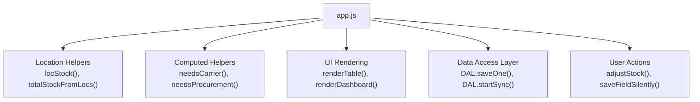
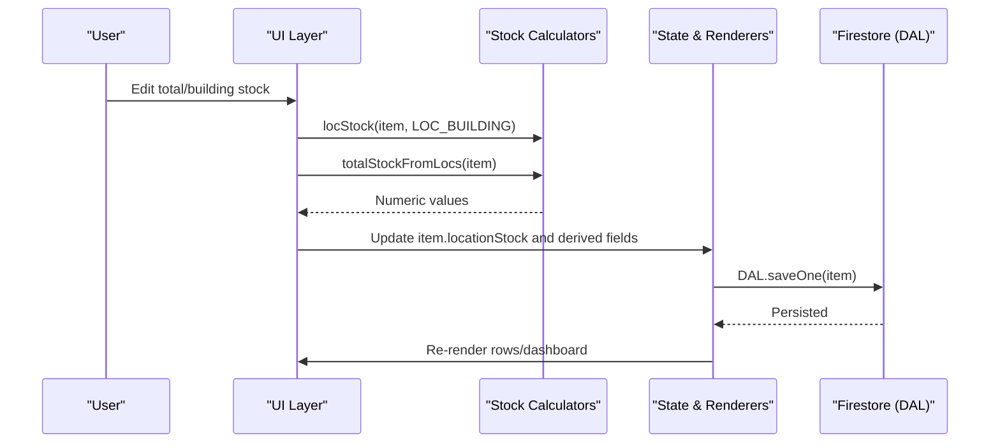
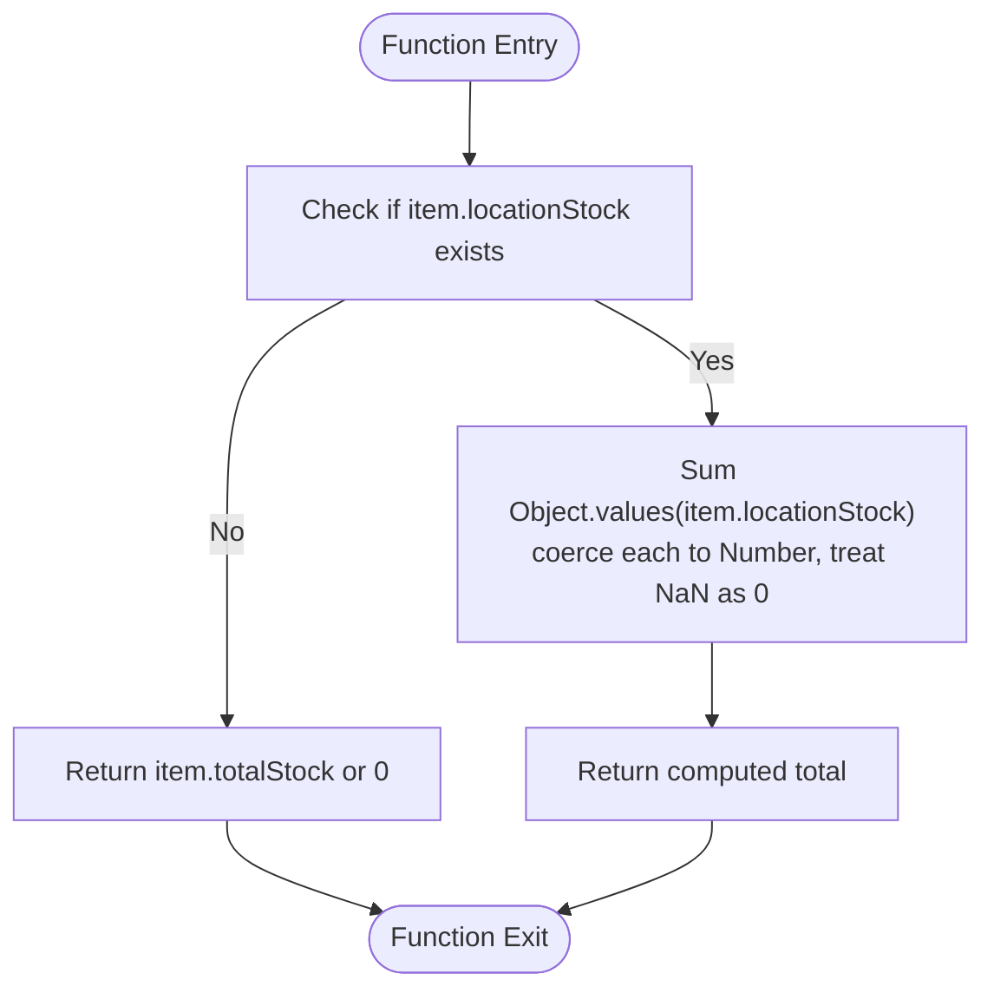
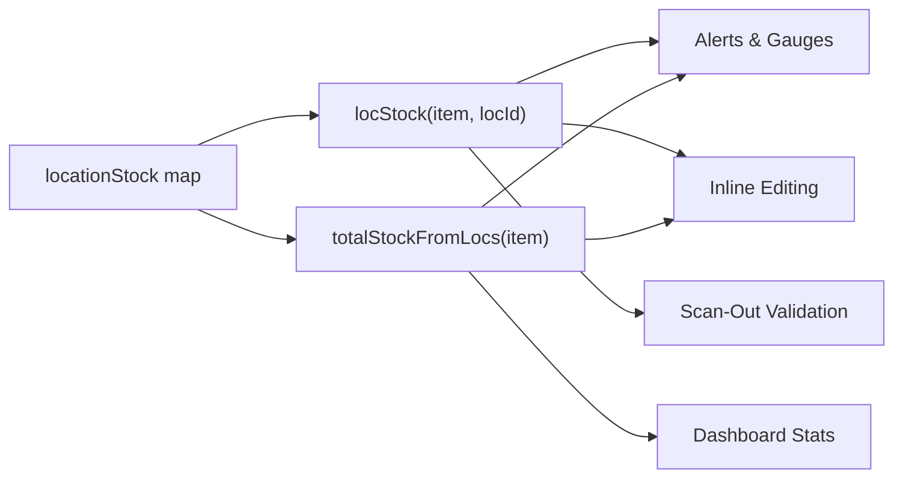

# Stock Calculation Functions

<cite>
**Referenced Files in This Document**
- [app.js](file://app.js)
- [README.md](file://README.md)
</cite>

## Table of Contents
1. [Introduction](#introduction)
2. [Project Structure](#project-structure)
3. [Core Components](#core-components)
4. [Architecture Overview](#architecture-overview)
5. [Detailed Component Analysis](#detailed-component-analysis)
6. [Dependency Analysis](#dependency-analysis)
7. [Performance Considerations](#performance-considerations)
8. [Troubleshooting Guide](#troubleshooting-guide)
9. [Conclusion](#conclusion)

## Introduction
This document provides comprehensive documentation for the stock calculation helper functions locStock() and totalStockFromLocs(). It explains how these functions retrieve per-location stock with fallback logic for legacy data formats, and how they compute aggregate totals across all locations. The guide includes function signatures, parameters, return values, edge case handling, and practical usage examples from the codebase showing integration with inventory operations such as filtering, alerts, inline editing, scanning out, and dashboard statistics.

## Project Structure
The application is a single-page web app that manages inventory items stored in Firestore. The core business logic resides in app.js, which includes:
- Data access layer (DAL) for Firestore sync and writes
- State management for items and locations
- UI rendering and event handling
- Location helpers and migration utilities
- Computed helpers for alerts and calculations

**Diagram sources**
- [app.js:336-380](file://app.js#L336-L380)
- [app.js:418-447](file://app.js#L418-L447)
- [app.js:498-628](file://app.js#L498-L628)
- [app.js:32-132](file://app.js#L32-L132)
- [app.js:700-824](file://app.js#L700-L824)

**Section sources**
- [README.md:1-32](file://README.md#L1-L32)
- [app.js:1-50](file://app.js#L1-L50)

## Core Components
- locStock(item, locId): Retrieves stock at a specific location for an item, returning zero if missing or invalid.
- totalStockFromLocs(item): Computes aggregate stock by summing all locationStock values; falls back to legacy totalStock when locationStock is absent.

These functions are central to:
- Displaying current stock levels in tables and forms
- Driving alert logic for carrier transfers and procurement
- Updating totals after edits and scans
- Computing dashboard statistics

**Section sources**
- [app.js:358-368](file://app.js#L358-L368)

## Architecture Overview
The stock calculation functions integrate into multiple layers:
- Migration: Converts legacy fields (totalStock, buildingStock) into a normalized locationStock map
- Computation: Supplies per-location and aggregate totals used throughout the app
- UI: Populates table cells, form fields, and dashboard metrics
- Operations: Adjustments via inline editing, quick buttons, scan-out, and transfer flows update locationStock and recalculate totals

**Diagram sources**
- [app.js:700-773](file://app.js#L700-L773)
- [app.js:810-824](file://app.js#L810-L824)
- [app.js:1377-1430](file://app.js#L1377-L1430)
- [app.js:32-132](file://app.js#L32-L132)

## Detailed Component Analysis

### Function: locStock(item, locId)
- Purpose: Retrieve stock quantity for a given item at a specific location id.
- Signature: locStock(item, locId)
- Parameters:
  - item: Inventory item object expected to have a locationStock map keyed by location ids
  - locId: String identifier of the location (e.g., 'depot', 'building')
- Return value: Non-negative integer representing stock at the specified location; returns 0 if:
  - item.locationStock is missing
  - item.locationStock[locId] is undefined
  - item.locationStock[locId] is null/undefined or non-numeric
- Edge cases handled:
  - Missing locationStock map
  - Non-numeric or negative values coerced to zero via Number() and Math.max(0, ...)
  - Unknown locId returns 0

Practical usage examples in the codebase:
- Deriving depot stock: depotStock(item) calls locStock(item, LOC_DEPOT)
- Building stock checks: needsCarrier(item) compares locStock(item, LOC_BUILDING) to trigger thresholds
- Gauge computation: uses locStock(item, LOC_BUILDING) to calculate percentage of max capacity
- Inline editing: saveFieldSilently() reads current building stock via locStock() before updating
- Transfer modal: openTransferModal() shows available stock per location using locStock()
- Scan-out confirmation: confirmScanOut() validates qty against locStock(item, LOC_BUILDING)

**Section sources**
- [app.js:358-362](file://app.js#L358-L362)
- [app.js:421-427](file://app.js#L421-L427)
- [app.js:553-556](file://app.js#L553-L556)
- [app.js:707-713](file://app.js#L707-L713)
- [app.js:1534-1541](file://app.js#L1534-L1541)
- [app.js:1381-1390](file://app.js#L1381-L1390)

### Function: totalStockFromLocs(item)
- Purpose: Compute aggregate stock across all locations by summing values in item.locationStock.
- Signature: totalStockFromLocs(item)
- Parameters:
  - item: Inventory item object expected to have a locationStock map keyed by location ids
- Return value: Non-negative integer representing total stock across all locations; falls back to item.totalStock when locationStock is absent.
- Edge cases handled:
  - If item.locationStock is missing, returns item.totalStock or 0
  - Coerces each value to Number and treats non-numeric entries as zero
  - Sums all values regardless of unknown location ids

Practical usage examples in the codebase:
- Migration: migrateItemLocations() derives totalStock from locationStock for backward compatibility
- Filtering: applyFilters() uses totalStock > 0 to filter “in_stock” items
- Dashboard stats: renderDashboard() sums totalStockFromLocs(i) across all items
- Inline editing: saveFieldSilently() updates item.totalStock = totalStockFromLocs(item) after changes
- Form population: openItemModal() sets field-totalStock value using totalStockFromLocs(item)
- Procurement alerts: needsProcurement(item) compares totalStockFromLocs(item) to purchasingTrigger

**Diagram sources**
- [app.js:364-368](file://app.js#L364-L368)

**Section sources**
- [app.js:344-356](file://app.js#L344-L356)
- [app.js:429-431](file://app.js#L429-L431)
- [app.js:478-479](file://app.js#L478-L479)
- [app.js:627-632](file://app.js#L627-L632)
- [app.js:712-726](file://app.js#L712-L726)
- [app.js:887-889](file://app.js#L887-L889)

### Integration Points and Usage Patterns
- Alert Logic:
  - Carrier alerts: needsCarrier(item) uses locStock(item, LOC_BUILDING) vs carrierTrigger
  - Procurement alerts: needsProcurement(item) uses totalStockFromLocs(item) vs purchasingTrigger
- Table Rendering:
  - Displays total stock via totalStockFromLocs(item)
  - Shows building stock via locStock(item, LOC_BUILDING) and gauge bar
- Inline Editing:
  - Editing buildingStock updates locationStock[LOC_BUILDING], recalculates totalStock
  - Editing totalStock adjusts depot stock while keeping building stable
- Quick Adjustments:
  - adjustStock(id, delta) increments/decrements building stock using locStock()
- Scan-Out Flow:
  - Validates requested qty against locStock(item, LOC_BUILDING)
  - Updates locationStock[LOC_BUILDING], recalculates totalStock, persists via DAL.saveOne()
- Locations Manager:
  - Shows per-location totals by summing locStock(i, l.id) across items

**Section sources**
- [app.js:425-431](file://app.js#L425-L431)
- [app.js:547-619](file://app.js#L547-L619)
- [app.js:700-773](file://app.js#L700-L773)
- [app.js:810-824](file://app.js#L810-L824)
- [app.js:1377-1430](file://app.js#L1377-L1430)
- [app.js:1507-1521](file://app.js#L1507-L1521)

## Dependency Analysis
The stock calculation functions depend on:
- Item structure: presence and shape of locationStock map
- Constants: LOC_DEPOT and LOC_BUILDING identifiers
- Derived fields: buildingStock and totalStock for backward compatibility and UI convenience

They are consumed by:
- Computed helpers (needsCarrier, needsProcurement, depotStock, carrierQty)
- UI rendering (table rows, dashboard stats)
- User actions (inline edits, quick adjustments, scan-out, transfers)

**Diagram sources**
- [app.js:358-368](file://app.js#L358-L368)
- [app.js:418-447](file://app.js#L418-L447)
- [app.js:700-773](file://app.js#L700-L773)
- [app.js:1377-1430](file://app.js#L1377-L1430)
- [app.js:627-632](file://app.js#L627-L632)

**Section sources**
- [app.js:340-341](file://app.js#L340-L341)
- [app.js:418-447](file://app.js#L418-L447)

## Performance Considerations
- Complexity:
  - locStock(): O(1) lookup in item.locationStock
  - totalStockFromLocs(): O(n) where n is number of locations in item.locationStock
- Optimization opportunities:
  - Cache frequently accessed totals during batch operations to avoid repeated summation
  - Normalize locationStock on write paths to ensure consistent numeric types
  - Avoid unnecessary re-renders by diffing updated fields before DOM updates

## Troubleshooting Guide
Common issues and resolutions:
- Unexpected zero stock:
  - Verify item.locationStock exists and contains the expected locId key
  - Ensure values are numeric; non-numeric entries are treated as zero
- Legacy data not reflected:
  - Confirm migrateItemLocations() has run to populate locationStock from totalStock/buildingStock
- Totals mismatch:
  - After edits, ensure item.totalStock is recalculated via totalStockFromLocs(item)
  - For bulk edits, recompute totals consistently before saving

Operational checks:
- In table rendering, confirm inputs display totalStockFromLocs(item) and locStock(item, LOC_BUILDING)
- In alerts, verify triggers compare correctly against computed values
- In scan-out, validate qty does not exceed locStock(item, LOC_BUILDING) unless explicitly confirmed

**Section sources**
- [app.js:344-356](file://app.js#L344-L356)
- [app.js:712-726](file://app.js#L712-L726)
- [app.js:1381-1390](file://app.js#L1381-L1390)

## Conclusion
locStock() and totalStockFromLocs() provide robust, defensive stock retrieval and aggregation across locations. They support both modern per-location maps and legacy flat fields, ensuring continuity during migration. Their integration spans UI rendering, alerting, editing, scanning, and reporting, making them foundational to accurate inventory operations in the application.