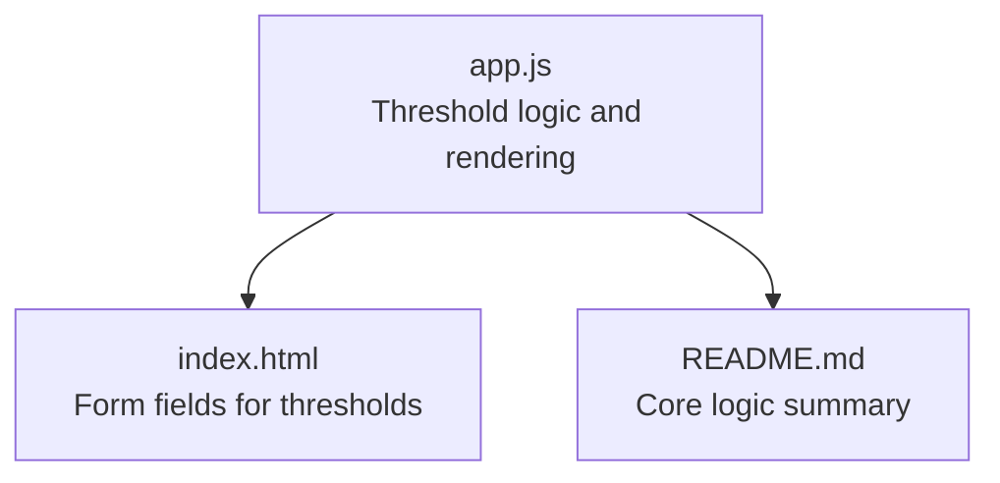
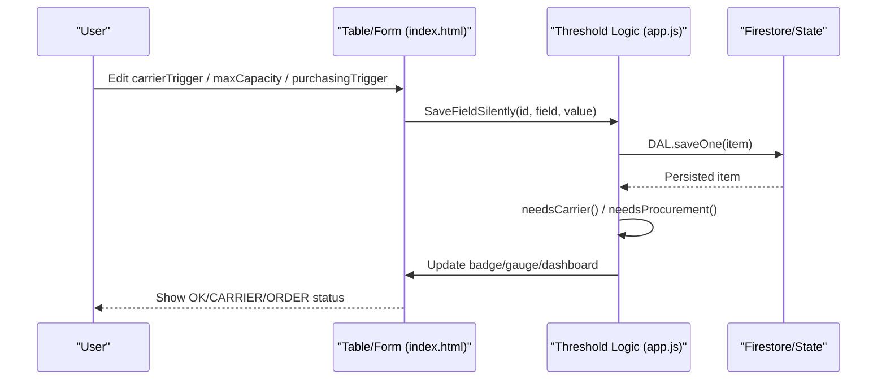
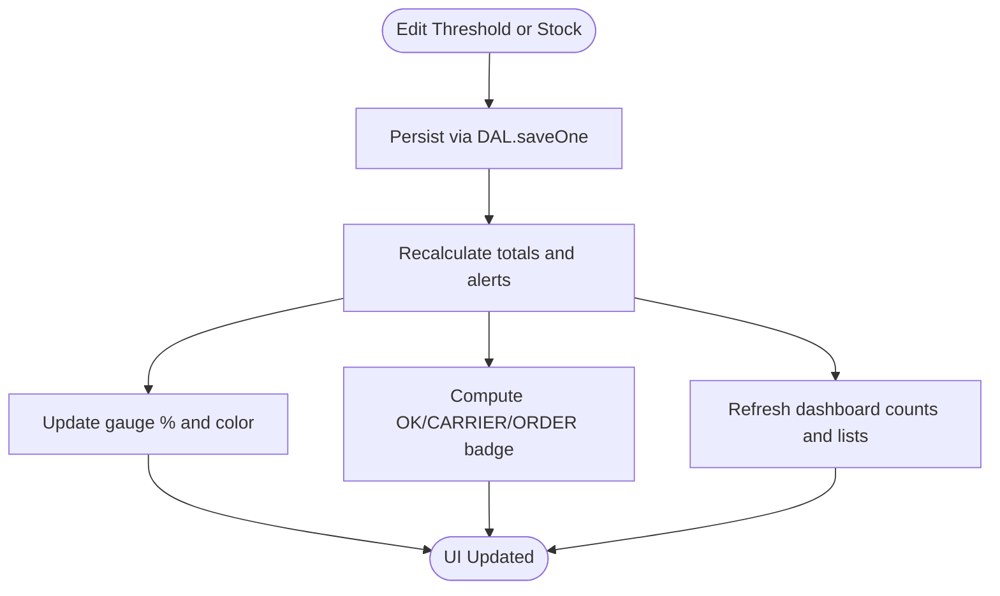
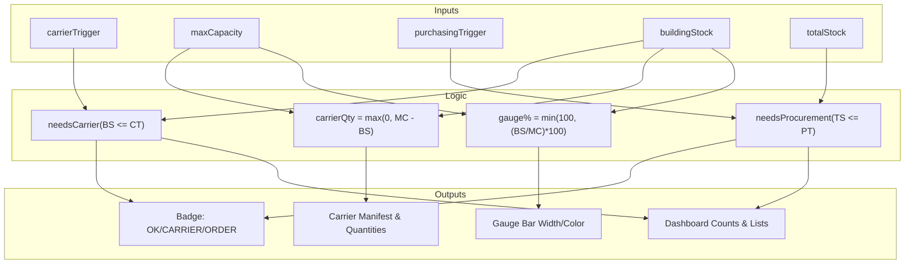

# Threshold Configuration

<cite>
**Referenced Files in This Document**
- [app.js](file://app.js)
- [README.md](file://README.md)
- [index.html](file://index.html)
</cite>

## Table of Contents
1. [Introduction](#introduction)
2. [Project Structure](#project-structure)
3. [Core Components](#core-components)
4. [Architecture Overview](#architecture-overview)
5. [Detailed Component Analysis](#detailed-component-analysis)
6. [Dependency Analysis](#dependency-analysis)
7. [Performance Considerations](#performance-considerations)
8. [Troubleshooting Guide](#troubleshooting-guide)
9. [Conclusion](#conclusion)

## Introduction
This document explains the inventory threshold configuration fields used to drive alerting and replenishment workflows:
- carrierTrigger: minimum building stock before a transfer alert is triggered
- maxCapacity: maximum capacity for the building location
- purchasingTrigger: total stock level that triggers procurement alerts

It details the business logic behind each threshold, how they determine alert states (CARRIER, ORDER, OK), the calculation formulas used by the system, and recommended strategies for setting thresholds based on typical inventory patterns.

## Project Structure
The threshold logic is implemented in the application’s main script and surfaced through the UI forms and table. The README summarizes the core rules used across the app.

**Diagram sources**
- [app.js:425-435](file://app.js#L425-L435)
- [index.html:686-698](file://index.html#L686-L698)
- [README.md:17-23](file://README.md#L17-L23)

**Section sources**
- [README.md:17-23](file://README.md#L17-L23)

## Core Components
- carrierTrigger: numeric field representing the minimum on-hand quantity at the Company Building before a carrier transfer alert is raised.
- maxCapacity: numeric field representing the maximum number of units that can be stored at the Company Building; used to compute fill percentage and suggested transfer quantities.
- purchasingTrigger: numeric field representing the total stock across all locations below which a procurement (ORDER) alert is raised.

These fields are editable inline in the table and in the item modal form. They directly influence:
- Alert state badges (OK, CARRIER, ORDER)
- Dashboard quicklists and counts
- Carrier manifest generation and suggested transfer quantities
- Visual gauges showing building utilization relative to maxCapacity

**Section sources**
- [app.js:425-435](file://app.js#L425-L435)
- [app.js:553-562](file://app.js#L553-L562)
- [app.js:889-892](file://app.js#L889-L892)
- [index.html:686-698](file://index.html#L686-L698)

## Architecture Overview
The threshold system computes alert conditions from current stock levels and configured thresholds, then updates UI elements accordingly.

**Diagram sources**
- [app.js:701-773](file://app.js#L701-L773)
- [app.js:425-435](file://app.js#L425-L435)
- [app.js:553-562](file://app.js#L553-L562)

## Detailed Component Analysis

### Field Definitions and Defaults
- carrierTrigger
  - Purpose: Minimum building stock before a transfer alert is triggered.
  - Default value when adding a new item: 5
  - UI presence: Inline table column and modal form input
- maxCapacity
  - Purpose: Maximum capacity for the building location; used to calculate fill percentage and suggested transfer quantity.
  - Default value when adding a new item: 20
  - UI presence: Inline table column and modal form input
- purchasingTrigger
  - Purpose: Total stock level triggering procurement alerts.
  - Default value when adding a new item: 10
  - UI presence: Inline table column and modal form input

**Section sources**
- [app.js:889-892](file://app.js#L889-L892)
- [index.html:686-698](file://index.html#L686-L698)
- [app.js:593-601](file://app.js#L593-L601)

### Business Logic and Alert States
- CARRIER alert: Triggered when building stock is less than or equal to carrierTrigger. Indicates a need to transfer stock from Main Depot to the Company Building.
- ORDER alert: Triggered when total stock across all locations is less than or equal to purchasingTrigger. Indicates a need to procure more stock from suppliers.
- OK state: When neither CARRIER nor ORDER conditions are met.

The status badge reflects these states:
- If both CARRIER and ORDER conditions are true, both badges appear.
- If only one condition is true, the corresponding badge appears.
- Otherwise, OK is shown.

**Section sources**
- [app.js:425-431](file://app.js#L425-L431)
- [app.js:559-562](file://app.js#L559-L562)
- [README.md:17-23](file://README.md#L17-L23)

### Calculation Formulas
- Needs Carrier Transfer
  - Condition: buildingStock <= carrierTrigger
  - Suggested transfer quantity: max(0, maxCapacity - buildingStock)
- Needs Procurement
  - Condition: totalStock <= purchasingTrigger
- Building Utilization Gauge
  - Percentage: min(100, (buildingStock / maxCapacity) * 100) when maxCapacity > 0; otherwise 0%

These formulas are used to:
- Determine alert states
- Compute suggested transfer quantities for the carrier manifest
- Render the building stock gauge with color-coded fill levels

**Section sources**
- [app.js:425-435](file://app.js#L425-L435)
- [app.js:553-556](file://app.js#L553-L556)
- [app.js:918-922](file://app.js#L918-L922)

### Data Flow and Rendering
When any threshold or stock field changes:
- The change is saved silently without full re-render
- The depot stock and totals are recalculated
- The gauge bar width and color are updated based on maxCapacity
- The row’s alert classes and badge are recomputed
- The dashboard counters and quicklists are refreshed

**Diagram sources**
- [app.js:701-773](file://app.js#L701-L773)
- [app.js:553-562](file://app.js#L553-L562)
- [app.js:624-663](file://app.js#L624-L663)

**Section sources**
- [app.js:701-773](file://app.js#L701-L773)
- [app.js:624-663](file://app.js#L624-L663)

### Recommended Threshold Setting Strategies
Use these guidelines to set thresholds aligned with your operational patterns:

- For fast-moving items at the Company Building:
  - Set carrierTrigger higher to trigger earlier transfers and avoid stockouts on-site.
  - Keep maxCapacity sufficient for peak demand days plus a small buffer.
  - Set purchasingTrigger to account for supplier lead time and consumption rate.

- For slow-moving or bulky items:
  - Lower carrierTrigger to reduce unnecessary transfers.
  - Set maxCapacity conservatively to reflect physical constraints.
  - Use a lower purchasingTrigger to avoid overstocking.

- Seasonal or project-based items:
  - Temporarily increase carrierTrigger and maxCapacity during high-demand periods.
  - Raise purchasingTrigger ahead of known spikes to ensure supply continuity.

- Safety-critical components:
  - Maintain higher carrierTrigger and purchasingTrigger values to minimize risk of shortages.
  - Monitor gauge percentages closely; keep them above a safe operating range.

- General best practices:
  - Ensure purchasingTrigger < maxCapacity to decouple procurement from on-site capacity.
  - Review thresholds periodically based on actual usage data and supplier reliability.
  - Use the dashboard quicklists to validate that thresholds produce actionable alerts.

[No sources needed since this section provides general guidance]

## Dependency Analysis
The threshold fields depend on stock levels and interact with multiple UI features:

**Diagram sources**
- [app.js:425-435](file://app.js#L425-L435)
- [app.js:553-562](file://app.js#L553-L562)
- [app.js:918-922](file://app.js#L918-L922)
- [app.js:624-663](file://app.js#L624-L663)

**Section sources**
- [app.js:425-435](file://app.js#L425-L435)
- [app.js:553-562](file://app.js#L553-L562)
- [app.js:918-922](file://app.js#L918-L922)
- [app.js:624-663](file://app.js#L624-L663)

## Performance Considerations
- Threshold checks are simple comparisons and arithmetic operations executed per item; performance impact is minimal even with large inventories.
- Inline edits update only affected DOM nodes and recalculate metrics locally before persisting, avoiding full page re-renders.
- Real-time Firestore listeners refresh State.items; threshold computations run on each update, keeping UI consistent with backend data.

[No sources needed since this section provides general guidance]

## Troubleshooting Guide
- No alerts despite low stock:
  - Verify carrierTrigger and purchasingTrigger are set appropriately for the item’s usage pattern.
  - Confirm buildingStock and totalStock values are accurate and up to date.
- Excessive alerts:
  - Increase carrierTrigger and purchasingTrigger if they are too sensitive for your consumption rates.
  - Adjust maxCapacity to reflect realistic storage limits and avoid inflated transfer suggestions.
- Gauge shows 100% but no CARRIER alert:
  - Ensure maxCapacity is not set unrealistically low compared to actual on-site capacity.
  - Check that carrierTrigger is not set higher than expected buildingStock.
- Discrepancy between manifest quantity and depot availability:
  - The manifest suggests bringing max(0, maxCapacity - buildingStock); if depot stock is insufficient, consider placing a supplier order first.

**Section sources**
- [app.js:425-435](file://app.js#L425-L435)
- [app.js:553-562](file://app.js#L553-L562)
- [app.js:918-922](file://app.js#L918-L922)

## Conclusion
The threshold configuration fields provide a straightforward yet powerful mechanism to automate replenishment decisions:
- carrierTrigger drives timely transfers to the Company Building
- maxCapacity informs capacity planning and transfer sizing
- purchasingTrigger ensures overall stock levels remain adequate

By aligning thresholds with real-world consumption patterns and supplier lead times, teams can maintain optimal stock levels, reduce stockouts, and streamline logistics.

[No sources needed since this section summarizes without analyzing specific files]