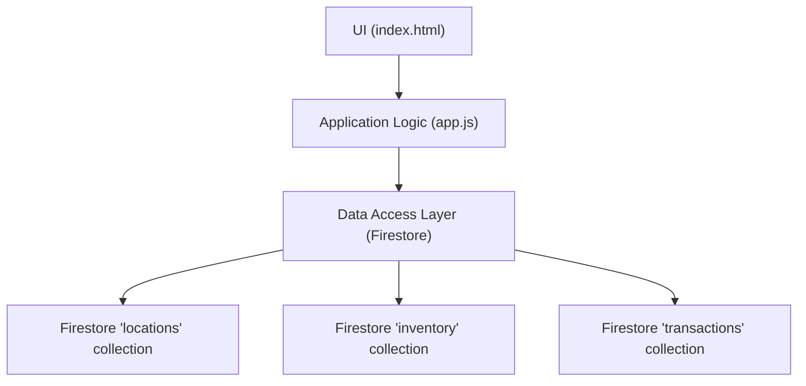
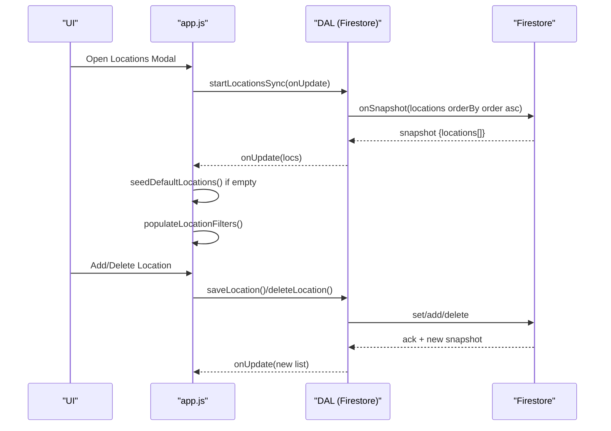
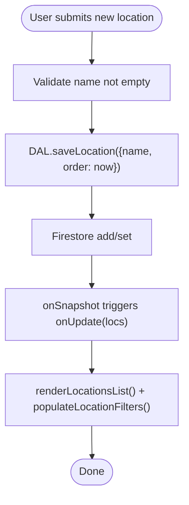
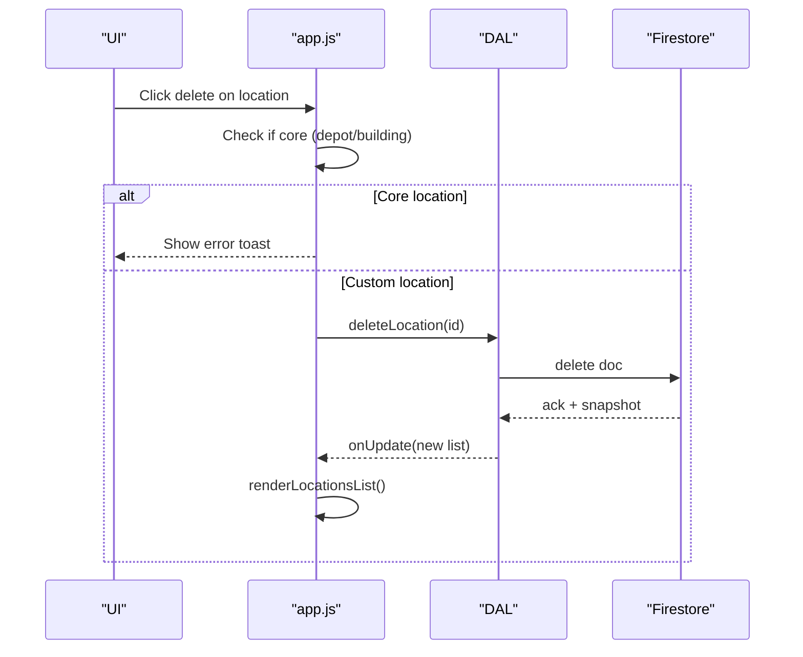
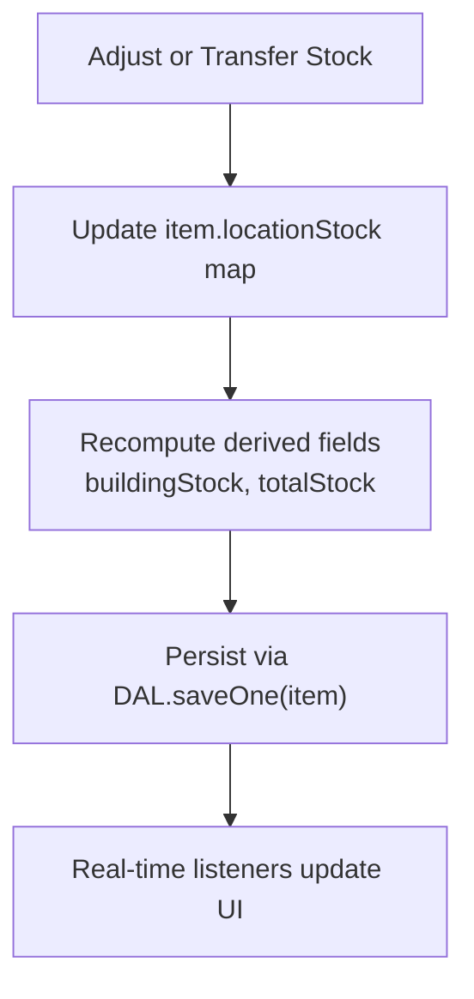
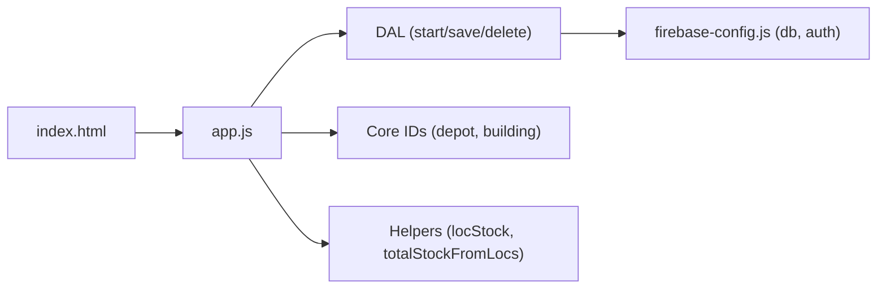

# Location Management Model

<cite>
**Referenced Files in This Document**
- [app.js](file://app.js)
- [README.md](file://README.md)
- [firebase-config.js](file://firebase-config.js)
- [index.html](file://index.html)
</cite>

## Table of Contents
1. [Introduction](#introduction)
2. [Project Structure](#project-structure)
3. [Core Components](#core-components)
4. [Architecture Overview](#architecture-overview)
5. [Detailed Component Analysis](#detailed-component-analysis)
6. [Dependency Analysis](#dependency-analysis)
7. [Performance Considerations](#performance-considerations)
8. [Troubleshooting Guide](#troubleshooting-guide)
9. [Conclusion](#conclusion)
10. [Appendices](#appendices)

## Introduction
This document describes the data model and behavior for the location management system within the inventory application. It focuses on:
- The location entity structure (id, name, order)
- Protection mechanism for predefined locations (Main Depot, Company Building) with fixed IDs
- Location lifecycle (creation, deletion, ordering)
- Relationship between locations and inventory items via the locationStock mapping
- Seed data initialization and default location setup
- Location filtering logic
- Examples of CRUD operations and integration with inventory stock calculations

The system uses a real-time Firestore backend to synchronize locations and inventory across clients.

## Project Structure
At a high level, the application is a single-page web app that:
- Initializes Firebase and exposes db/auth globals
- Subscribes to real-time collections for inventory and locations
- Maintains an in-memory State object with items and locations
- Provides UI modals and filters for managing locations and transferring stock

**Diagram sources**
- [app.js:103-131](file://app.js#L103-L131)
- [firebase-config.js:14-21](file://firebase-config.js#L14-L21)

**Section sources**
- [firebase-config.js:14-21](file://firebase-config.js#L14-L21)
- [app.js:103-131](file://app.js#L103-L131)

## Core Components
- Location entity fields: id, name, order
- Predefined core locations: Main Depot (fixed id depot), Company Building (fixed id building)
- Item-to-location mapping: item.locationStock is a map from location id to quantity
- Real-time sync for locations and inventory
- Seeding of default locations when none exist
- Filtering by selected location

Key responsibilities:
- DAL methods for locations: startLocationsSync, saveLocation, deleteLocation
- Helpers for migration and totals: migrateItemLocations, locStock, totalStockFromLocs
- UI helpers: openLocationsModal, renderLocationsList, populateLocationFilters
- Protection rules: prevent deletion of core locations

**Section sources**
- [app.js:103-131](file://app.js#L103-L131)
- [app.js:340-380](file://app.js#L340-L380)
- [app.js:382-402](file://app.js#L382-L402)
- [app.js:1481-1511](file://app.js#L1481-L1511)
- [app.js:2362-2383](file://app.js#L2362-L2383)

## Architecture Overview
The location subsystem integrates with inventory through a per-item locationStock map. Locations are ordered and synced in real time. Default locations are seeded automatically if missing.

**Diagram sources**
- [app.js:103-131](file://app.js#L103-L131)
- [app.js:241-246](file://app.js#L241-L246)
- [app.js:376-380](file://app.js#L376-L380)
- [app.js:382-402](file://app.js#L382-L402)
- [app.js:2362-2383](file://app.js#L2362-L2383)

## Detailed Component Analysis

### Data Model: Location Entity
- Fields:
  - id: string identifier; core locations use fixed ids
  - name: display name
  - order: numeric sort key used to order locations in lists and dropdowns
- Storage:
  - Firestore collection: locations
  - Ordered by field order ascending during sync

Protection:
- Core locations have fixed ids:
  - Main Depot: id = depot
  - Company Building: id = building
- Deletion of core locations is blocked at the UI layer

Ordering:
- New locations receive order = Date.now()
- Sync orders results by field order ascending

**Section sources**
- [app.js:103-117](file://app.js#L103-L117)
- [app.js:340-341](file://app.js#L340-L341)
- [app.js:376-380](file://app.js#L376-L380)
- [app.js:2373-2383](file://app.js#L2373-L2383)

### Data Model: Inventory Items and locationStock Mapping
- Each inventory item may include a locationStock map:
  - Keys: location id strings
  - Values: integer quantities per location
- Derived fields:
  - buildingStock: convenience value equal to locStock(item, LOC_BUILDING)
  - totalStock: sum across all values in locationStock
- Migration:
  - Legacy items without locationStock are migrated to include depot and building entries based on existing totalStock/buildingStock

Integration points:
- Stock adjustments update locationStock and recompute derived fields
- Transfers move quantities between locations using the map
- Alerts and manifests rely on locStock(item, LOC_BUILDING) and totalStockFromLocs(item)

Complexity:
- Reading a specific location’s stock is O(1) over the map
- Computing total stock is O(n) where n is number of locations per item

**Section sources**
- [app.js:344-368](file://app.js#L344-L368)
- [app.js:704-728](file://app.js#L704-L728)
- [app.js:808-822](file://app.js#L808-L822)
- [app.js:824-854](file://app.js#L824-L854)
- [app.js:2400-2430](file://app.js#L2400-L2430)

### Core Location Protection Mechanism
- Fixed identifiers:
  - LOC_DEPOT = depot
  - LOC_BUILDING = building
- Deletion guard:
  - Attempting to delete a core location shows an error toast and aborts
- Seeding:
  - If no locations exist, the app seeds both core locations with names and initial order values

Operational notes:
- Core locations cannot be deleted via UI
- They can still be updated (e.g., renaming) via saveLocation since they have explicit ids

**Section sources**
- [app.js:340-341](file://app.js#L340-L341)
- [app.js:376-380](file://app.js#L376-L380)
- [app.js:2373-2383](file://app.js#L2373-L2383)

### Location Lifecycle

#### Creation
- User adds a location via the modal form
- Backend call persists the location with auto-assigned order
- Real-time listener updates the UI list and filter options

**Diagram sources**
- [app.js:2362-2371](file://app.js#L2362-L2371)
- [app.js:103-117](file://app.js#L103-L117)
- [app.js:1481-1511](file://app.js#L1481-L1511)
- [app.js:382-402](file://app.js#L382-L402)

**Section sources**
- [app.js:2362-2371](file://app.js#L2362-L2371)
- [app.js:103-117](file://app.js#L103-L117)
- [app.js:1481-1511](file://app.js#L1481-L1511)
- [app.js:382-402](file://app.js#L382-L402)

#### Deletion
- Delete button shown only for non-core locations
- Click handler prevents deletion of core locations and calls DAL.deleteLocation otherwise
- UI refreshes via real-time listener

**Diagram sources**
- [app.js:2373-2383](file://app.js#L2373-L2383)
- [app.js:103-111](file://app.js#L103-L111)

**Section sources**
- [app.js:2373-2383](file://app.js#L2373-L2383)
- [app.js:103-111](file://app.js#L103-L111)

#### Ordering
- New locations get order = Date.now()
- List and dropdowns reflect order from Firestore query (orderBy('order', 'asc'))
- No explicit reorder UI is implemented; order is determined by creation timestamp

**Section sources**
- [app.js:103-111](file://app.js#L103-L111)
- [app.js:2362-2371](file://app.js#L2362-L2371)

### Seed Data Initialization and Default Setup
- On first run with no locations, the app seeds two core locations:
  - Main Depot (id: depot, order: 1)
  - Company Building (id: building, order: 2)
- Sample inventory items are also loaded once if the inventory collection is empty

**Section sources**
- [app.js:241-246](file://app.js#L241-L246)
- [app.js:376-380](file://app.js#L376-L380)
- [app.js:318-334](file://app.js#L318-L334)

### Location Filtering Logic
- A location filter dropdown is created/updated dynamically
- Options include “All Locations” plus each defined location
- The filter is integrated into applyFilters to scope displayed items by activeLocation
- The active location selection is maintained in State.activeLocation

Note: While the filter UI is present and populated, the current filtering implementation primarily uses category, alert, and stock filters. Ensure State.activeLocation is applied in applyFilters if you intend to filter by location.

**Section sources**
- [app.js:382-402](file://app.js#L382-L402)
- [app.js:452-494](file://app.js#L452-L494)
- [app.js:27-29](file://app.js#L27-L29)

### Integration with Inventory Stock Calculations
- Per-location stock access: locStock(item, locId)
- Total stock calculation: totalStockFromLocs(item)
- Adjustments:
  - Inline edits to buildingStock update locationStock[building] and recompute totalStock
  - Editing totalStock adjusts depot to maintain consistency while keeping building stable
  - Transfer moves qty from one location to another, updating remainingMap and logging a transaction
- Alerts and manifests depend on building stock vs thresholds and total stock vs purchasing trigger

**Diagram sources**
- [app.js:704-728](file://app.js#L704-L728)
- [app.js:808-822](file://app.js#L808-L822)
- [app.js:2400-2430](file://app.js#L2400-L2430)

**Section sources**
- [app.js:344-368](file://app.js#L344-L368)
- [app.js:704-728](file://app.js#L704-L728)
- [app.js:808-822](file://app.js#L808-L822)
- [app.js:2400-2430](file://app.js#L2400-L2430)

### Examples of Location CRUD Operations

- Create a location
  - Submit the “Add” button in the Locations Manager modal
  - The system persists the location with a timestamp-based order and refreshes the list

- Read locations
  - Real-time subscription returns all locations ordered by field order
  - The list and filter dropdowns are updated automatically

- Update a location
  - Use DAL.saveLocation with an existing id to merge changes (e.g., rename)
  - The change propagates via onSnapshot

- Delete a location
  - Click the delete icon next to a non-core location
  - Core locations cannot be deleted; attempting so shows an error toast

- Filter items by location
  - Select a location in the location filter dropdown
  - Integrate State.activeLocation into applyFilters to scope results accordingly

- Transfer stock between locations
  - Open the transfer modal, choose source and destination, enter quantity
  - System validates availability, updates locationStock, recomputes totals, saves, logs a transaction, and refreshes UI

**Section sources**
- [app.js:2362-2371](file://app.js#L2362-L2371)
- [app.js:103-117](file://app.js#L103-L117)
- [app.js:2373-2383](file://app.js#L2373-L2383)
- [app.js:382-402](file://app.js#L382-L402)
- [app.js:2400-2430](file://app.js#L2400-L2430)

## Dependency Analysis
- UI depends on app.js functions for opening modals, rendering lists, and handling events
- app.js depends on DAL for Firestore operations
- DAL depends on firebase-config.js globals (db, auth)
- Core protection constants are referenced throughout the codebase

**Diagram sources**
- [app.js:103-131](file://app.js#L103-L131)
- [app.js:340-341](file://app.js#L340-L341)
- [app.js:344-368](file://app.js#L344-L368)
- [firebase-config.js:14-21](file://firebase-config.js#L14-L21)

**Section sources**
- [app.js:103-131](file://app.js#L103-L131)
- [app.js:340-368](file://app.js#L340-L368)
- [firebase-config.js:14-21](file://firebase-config.js#L14-L21)

## Performance Considerations
- Real-time listeners minimize round-trips and keep UI consistent
- Sorting by order in Firestore avoids client-side sorting overhead
- Computed totals iterate over locationStock maps; consider limiting the number of locations per item to keep computations fast
- Avoid unnecessary re-renders by updating only affected rows after inline edits

## Troubleshooting Guide
- Cannot delete a location
  - If it is a core location (Main Depot or Company Building), deletion is blocked by design
- Locations not appearing
  - Ensure Firestore permissions allow reading the locations collection
  - Verify the onSnapshot callback is invoked and State.locations is updated
- Order not reflected
  - Confirm the locations are ordered by the order field in the query
  - New locations should receive a timestamp-based order value
- Filters not working as expected
  - Ensure State.activeLocation is considered in applyFilters if you want to filter by location
- Stock totals inconsistent
  - After transfers or edits, verify that locationStock is updated and totalStock is recomputed before saving

**Section sources**
- [app.js:2373-2383](file://app.js#L2373-L2383)
- [app.js:103-111](file://app.js#L103-L111)
- [app.js:452-494](file://app.js#L452-L494)
- [app.js:2400-2430](file://app.js#L2400-L2430)

## Conclusion
The location management system provides a robust foundation for tracking inventory across multiple locations. Core locations are protected with fixed identifiers, and the locationStock mapping enables flexible multi-location accounting. Real-time synchronization ensures consistent views across clients, while seeding guarantees sensible defaults. With clear CRUD operations and integration points for stock calculations, the system supports practical workflows such as transfers, alerts, and reporting.

## Appendices

### API Reference: DAL Methods for Locations
- startLocationsSync(onUpdate, onError)
  - Starts a real-time listener on the locations collection ordered by field order
- saveLocation(loc)
  - Creates or updates a location; assigns order if creating
- deleteLocation(id)
  - Deletes a location by id

**Section sources**
- [app.js:103-121](file://app.js#L103-L121)

### Example Workflows

- Create a new location
  - Open Locations Manager modal
  - Enter a name and submit
  - Observe the new entry appear in the list and filter dropdown

- Transfer stock between locations
  - From an item row, click the transfer action
  - Choose source and destination locations and quantity
  - Confirm to update stock, log the transaction, and refresh the view

- Filter items by location
  - Select a location in the location filter dropdown
  - Apply filters to narrow the table to items relevant to that location

**Section sources**
- [app.js:2362-2371](file://app.js#L2362-L2371)
- [app.js:2400-2430](file://app.js#L2400-L2430)
- [app.js:382-402](file://app.js#L382-L402)