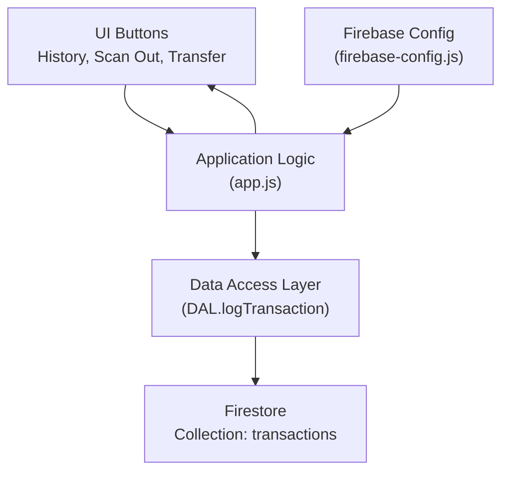
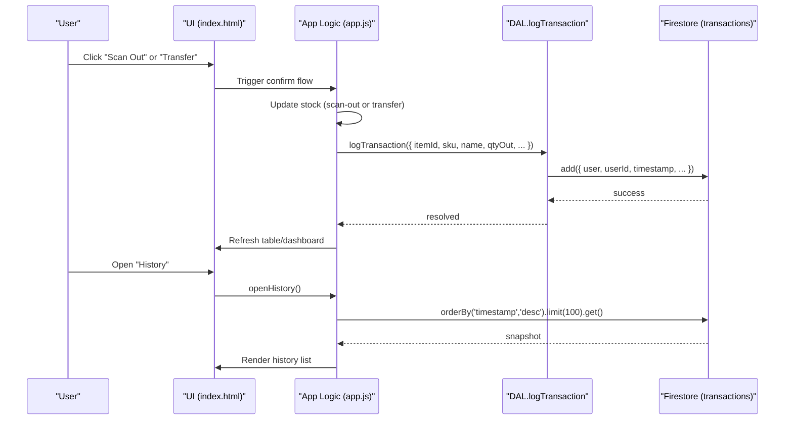
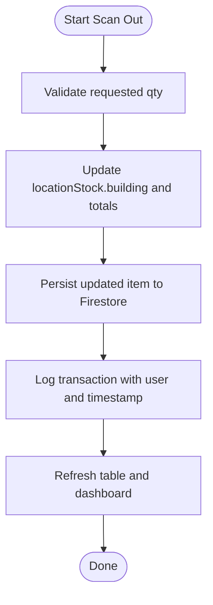
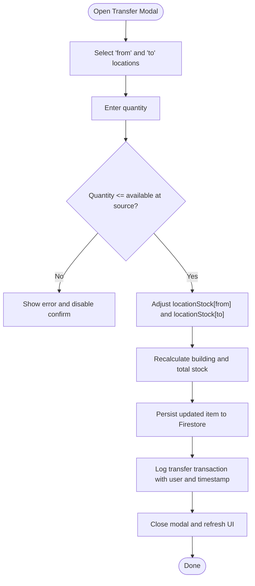
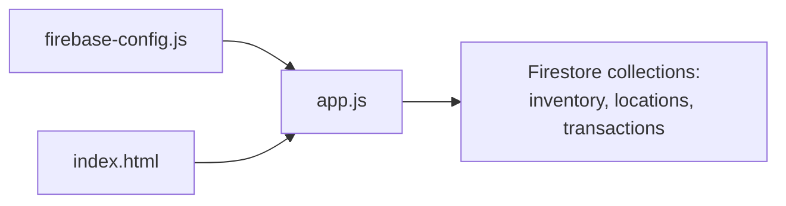

# Transaction History Schema

<cite>
**Referenced Files in This Document**
- [app.js](file://app.js)
- [index.html](file://index.html)
- [firebase-config.js](file://firebase-config.js)
</cite>

## Table of Contents
1. [Introduction](#introduction)
2. [Project Structure](#project-structure)
3. [Core Components](#core-components)
4. [Architecture Overview](#architecture-overview)
5. [Detailed Component Analysis](#detailed-component-analysis)
6. [Dependency Analysis](#dependency-analysis)
7. [Performance Considerations](#performance-considerations)
8. [Troubleshooting Guide](#troubleshooting-guide)
9. [Conclusion](#conclusion)

## Introduction
This document describes the transaction history data model and audit trail for stock movements in the inventory application. It focuses on:
- The transaction entity structure, including item identification (itemId, sku, name), quantity changes (qtyOut), timestamps, user attribution (user, userId), and operation type.
- Audit trail functionality for tracking stock movements such as transfers and scan-out operations.
- Real-time logging mechanisms and how transactions are persisted to Firestore.
- Query patterns for retrieving transaction history, monitoring user activity, and generating audit reports.
- Examples of different transaction types and their data structures.

## Project Structure
The transaction system is implemented primarily in the application logic file and the HTML UI. The Firebase configuration initializes Firestore and Auth, which are used by the app to persist and attribute transactions.

**Diagram sources**
- [app.js:123-131](file://app.js#L123-L131)
- [app.js:1390-1402](file://app.js#L1390-L1402)
- [app.js:2419-2424](file://app.js#L2419-L2424)
- [index.html:1126-1139](file://index.html#L1126-L1139)
- [firebase-config.js:14-18](file://firebase-config.js#L14-L18)

**Section sources**
- [app.js:123-131](file://app.js#L123-L131)
- [app.js:1390-1402](file://app.js#L1390-L1402)
- [app.js:2419-2424](file://app.js#L2419-L2424)
- [index.html:1126-1139](file://index.html#L1126-L1139)
- [firebase-config.js:14-18](file://firebase-config.js#L14-L18)

## Core Components
- Data Access Layer (DAL): Provides a centralized method to log transactions with user attribution and server timestamp.
- Scan-Out Flow: Decrement building stock and write a scan-out transaction record.
- Transfer Flow: Move stock between locations and write a transfer transaction record.
- History UI: Loads recent transactions from Firestore and renders them in a modal.

Key responsibilities:
- Persisting immutable audit records for stock movements.
- Capturing user identity and time of action.
- Supporting retrieval and display of historical events.

**Section sources**
- [app.js:123-131](file://app.js#L123-L131)
- [app.js:1390-1402](file://app.js#L1390-L1402)
- [app.js:2419-2424](file://app.js#L2419-L2424)
- [app.js:1440-1476](file://app.js#L1440-L1476)

## Architecture Overview
The transaction system integrates with Firestore via the DAL. Two primary flows create transactions:
- Scan-out: Removes units from building stock and logs a scan-out event.
- Transfer: Moves units between locations and logs a transfer event.

**Diagram sources**
- [app.js:1367-1420](file://app.js#L1367-L1420)
- [app.js:2400-2430](file://app.js#L2400-L2430)
- [app.js:123-131](file://app.js#L123-L131)
- [app.js:1440-1476](file://app.js#L1440-L1476)
- [index.html:1126-1139](file://index.html#L1126-L1139)

## Detailed Component Analysis

### Transaction Entity Model
The transaction collection stores immutable audit records for stock movements. Each record includes:
- Identification:
  - itemId: Unique identifier of the inventory item.
  - sku: Stock keeping unit string.
  - name: Human-readable item name.
- Movement details:
  - qtyOut: Quantity removed or moved out of the source location.
  - type: Operation type (e.g., "transfer", "scan-out").
  - from: Source location id (for transfers).
  - to: Destination location id (for transfers).
  - remainingMap: Snapshot of per-location stock after the movement (for transfers).
  - remainingBuilding: Building stock after removal (for scan-outs).
- Attribution and timing:
  - user: Email of the authenticated user performing the action.
  - userId: UID of the authenticated user.
  - timestamp: Server-side timestamp at write time.

Notes:
- For scan-out operations, the record includes remainingBuilding to reflect post-operation building stock.
- For transfer operations, the record includes type, from, to, and remainingMap to capture the full state change across locations.

Example structures (described without code content):
- Scan-out example:
  - Fields: itemId, sku, name, qtyOut, remainingBuilding, user, userId, timestamp.
- Transfer example:
  - Fields: itemId, sku, name, qtyOut, type="transfer", from, to, remainingMap, user, userId, timestamp.

These fields align with the write paths in the application logic and the history rendering logic.

**Section sources**
- [app.js:1390-1402](file://app.js#L1390-L1402)
- [app.js:2419-2424](file://app.js#L2419-L2424)
- [app.js:1440-1476](file://app.js#L1440-L1476)

### Scan-Out Audit Trail
The scan-out flow decrements building stock and writes a scan-out transaction record.

Key behaviors:
- Validates that the requested quantity does not exceed available stock; if it does, prompts for confirmation before proceeding.
- Updates the item’s location-based stock map and recalculates derived totals.
- Persists the updated item and then logs a scan-out transaction with user attribution and server timestamp.
- Refreshes UI elements to reflect new stock levels.

**Diagram sources**
- [app.js:1367-1420](file://app.js#L1367-L1420)

**Section sources**
- [app.js:1367-1420](file://app.js#L1367-L1420)

### Transfer Audit Trail
The transfer flow moves stock between two locations and writes a transfer transaction record.

Key behaviors:
- Prevents invalid transfers (source must have sufficient stock).
- Updates the per-location stock map and recalculates derived totals.
- Persists the updated item and logs a transfer transaction including source and destination locations and a snapshot of remaining stock across locations.

**Diagram sources**
- [app.js:2400-2430](file://app.js#L2400-L2430)

**Section sources**
- [app.js:2400-2430](file://app.js#L2400-L2430)

### Real-Time Logging Mechanism and Persistence
- The DAL provides a single entry point for logging transactions, ensuring consistent user attribution and timestamping.
- Transactions are written to a dedicated Firestore collection using server timestamps for authoritative ordering.
- The history UI loads the most recent transactions ordered by timestamp descending, limited to a fixed number for performance.

Implementation highlights:
- Centralized logging function adds user email and uid from the current auth session and uses server timestamp.
- History query orders by timestamp and limits results to avoid large payloads.

**Section sources**
- [app.js:123-131](file://app.js#L123-L131)
- [app.js:1440-1476](file://app.js#L1440-L1476)
- [firebase-config.js:14-18](file://firebase-config.js#L14-L18)

### Query Patterns
- Retrieve recent transactions:
  - Order by timestamp descending and limit to a reasonable number (e.g., 100).
  - Use this pattern for the in-app history modal.
- Filter by user:
  - Add a where clause on userId or user to show activity for a specific operator.
- Filter by operation type:
  - Add a where clause on type to isolate transfers or scan-outs.
- Time-bounded queries:
  - Combine order by timestamp with range filters (e.g., greater than or equal to a start timestamp) to implement date-range reporting.
- Aggregation for audit reports:
  - Sum qtyOut grouped by item or user for summary reports.
  - Count occurrences by type for operational metrics.

Note: These patterns describe how to construct queries based on the documented fields and existing usage in the application.

**Section sources**
- [app.js:1440-1476](file://app.js#L1440-L1476)

### UI Integration
- The History button opens a modal that displays recent transactions.
- The modal lists each transaction with SKU, name, remaining stock, operator, and formatted timestamp.

**Section sources**
- [index.html:1126-1139](file://index.html#L1126-L1139)
- [app.js:1440-1476](file://app.js#L1440-L1476)

## Dependency Analysis
- Application logic depends on Firebase Auth and Firestore initialized in the configuration file.
- The DAL encapsulates Firestore interactions for inventory and transactions, centralizing persistence and real-time sync.
- UI components trigger flows that update items and log transactions through the DAL.

**Diagram sources**
- [firebase-config.js:14-18](file://firebase-config.js#L14-L18)
- [app.js:33-132](file://app.js#L33-L132)
- [index.html:1215-1217](file://index.html#L1215-L1217)

**Section sources**
- [firebase-config.js:14-18](file://firebase-config.js#L14-L18)
- [app.js:33-132](file://app.js#L33-L132)
- [index.html:1215-1217](file://index.html#L1215-L1217)

## Performance Considerations
- Limit history queries to a fixed number of recent entries to reduce payload size and improve load times.
- Use server timestamps to ensure consistent ordering across clients.
- Avoid unnecessary re-renders by updating only affected rows when possible.
- Batch writes for bulk operations where applicable to minimize network overhead.

[No sources needed since this section provides general guidance]

## Troubleshooting Guide
Common issues and resolutions:
- Permission denied errors when writing transactions:
  - Ensure Firestore rules allow authenticated users to write to the transactions collection.
- Unavailable service errors:
  - Check internet connectivity and Firebase service status.
- History fails to load:
  - Verify Firestore rules for reading the transactions collection and confirm the presence of documents.

Operational tips:
- Inspect browser console for detailed error messages.
- Confirm that authentication is active before attempting to log transactions.

**Section sources**
- [app.js:123-131](file://app.js#L123-L131)
- [app.js:1440-1476](file://app.js#L1440-L1476)

## Conclusion
The transaction history system provides a robust audit trail for stock movements, capturing essential context such as item identifiers, quantities, user attribution, and timestamps. By centralizing logging through the DAL and leveraging Firestore’s server timestamps, the application ensures reliable, auditable records for both scan-out and transfer operations. The provided query patterns enable flexible retrieval for user activity monitoring and audit reporting, while the UI offers immediate visibility into recent transactions.