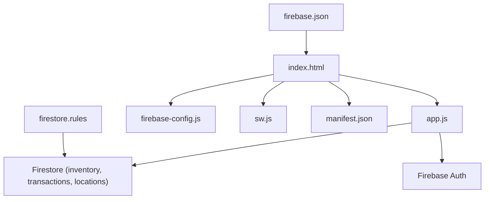
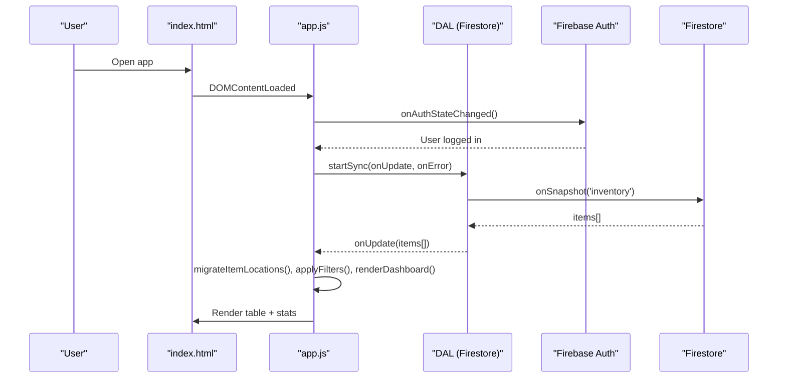
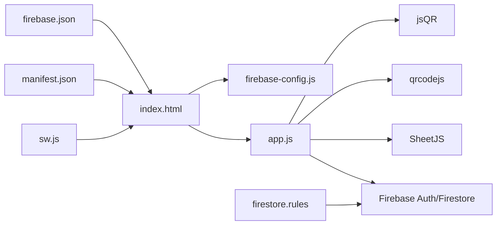

# Developer Guide

<cite>
**Referenced Files in This Document**
- [README.md](file://README.md)
- [index.html](file://index.html)
- [app.js](file://app.js)
- [firebase-config.js](file://firebase-config.js)
- [firestore.rules](file://firestore.rules)
- [firebase.json](file://firebase.json)
- [sw.js](file://sw.js)
- [manifest.json](file://manifest.json)
- [test.csv](file://test.csv)
</cite>

## Table of Contents
1. [Introduction](#introduction)
2. [Project Structure](#project-structure)
3. [Core Components](#core-components)
4. [Architecture Overview](#architecture-overview)
5. [Detailed Component Analysis](#detailed-component-analysis)
6. [Dependency Analysis](#dependency-analysis)
7. [Performance Considerations](#performance-considerations)
8. [Troubleshooting Guide](#troubleshooting-guide)
9. [Conclusion](#conclusion)
10. [Appendices](#appendices)

## Introduction
Shadow Ledger is a lightweight, responsive web application for tracking stock across multiple locations (e.g., Main Depot and Company Building). It provides real-time inventory management with alerting for carrier transfers and procurement needs, multi-format import/export, label generation with QR codes, scan-out workflows, and transaction history. The app uses Firebase Authentication and Firestore for persistence, Tailwind CSS for styling, and a service worker for PWA capabilities.

Key goals for contributors:
- Understand the code organization and naming conventions
- Extend features via documented extension points (import mapping, labels, alerts, locations)
- Debug effectively using browser tools and Firebase utilities
- Test business logic, integrate with Firebase, and validate end-to-end user flows
- Build, develop, and deploy confidently while maintaining backward compatibility and performance

## Project Structure
The project is a single-page application with minimal files:
- index.html: UI shell, modals, styles, and script includes
- app.js: Application logic, state management, UI rendering, event handling, and data access layer
- firebase-config.js: Firebase initialization and global references to auth and firestore
- firestore.rules: Security rules for Firestore collections
- firebase.json: Hosting configuration and headers
- sw.js: Service worker for caching and offline resilience
- manifest.json: PWA metadata and shortcuts
- README.md: Quick start and feature overview
- test.csv: Sample CSV for import testing

**Diagram sources**
- [index.html:1-1220](file://index.html#L1-L1220)
- [app.js:1-2699](file://app.js#L1-L2699)
- [firebase-config.js:1-29](file://firebase-config.js#L1-L29)
- [firestore.rules:1-46](file://firestore.rules#L1-L46)
- [firebase.json:1-55](file://firebase.json#L1-L55)
- [sw.js:1-88](file://sw.js#L1-L88)
- [manifest.json:1-50](file://manifest.json#L1-L50)

**Section sources**
- [README.md:1-32](file://README.md#L1-L32)
- [index.html:1-1220](file://index.html#L1-L1220)
- [app.js:1-2699](file://app.js#L1-L2699)
- [firebase-config.js:1-29](file://firebase-config.js#L1-L29)
- [firestore.rules:1-46](file://firestore.rules#L1-L46)
- [firebase.json:1-55](file://firebase.json#L1-L55)
- [sw.js:1-88](file://sw.js#L1-L88)
- [manifest.json:1-50](file://manifest.json#L1-L50)

## Core Components
- State Management: Centralized in-memory state object holds items, filtered results, pagination, selection, view mode, locations, and label generator selections.
- Data Access Layer (DAL): Encapsulates Firestore operations for inventory, transactions, and locations; supports real-time listeners and batch writes.
- UI Rendering: DOM references are cached; table rows and dashboard stats are rendered from state; inline editing updates fields without full re-renders.
- Import/Export: Multi-format parser (CSV, TSV, JSON, Excel) with column mapping UI and preview; CSV export includes locationStock map.
- Label Generator: Configurable sizes, logo upload, QR codes (SKU or URL), single/bulk generation, print-friendly layout.
- Scan-Out Workflow: Camera-based QR scanning with jsQR, manual SKU entry, quantity confirmation, decrement stock, log transaction.
- Alert System: Computes carrier and procurement alerts based on thresholds and displays quicklists and detail modals.
- Locations Manager: CRUD for locations with core defaults seeded; per-location stock maps maintained per item.
- Authentication: Email/password and Google sign-in; per-user data isolation enforced by Firestore rules.

**Section sources**
- [app.js:14-30](file://app.js#L14-L30)
- [app.js:33-132](file://app.js#L33-L132)
- [app.js:134-195](file://app.js#L134-L195)
- [app.js:452-494](file://app.js#L452-L494)
- [app.js:499-617](file://app.js#L499-L617)
- [app.js:622-692](file://app.js#L622-L692)
- [app.js:1552-1585](file://app.js#L1552-L1585)
- [app.js:1642-1708](file://app.js#L1642-L1708)
- [app.js:1710-1741](file://app.js#L1710-L1741)
- [app.js:1780-1826](file://app.js#L1780-L1826)
- [app.js:1844-1863](file://app.js#L1844-L1863)
- [app.js:1005-1073](file://app.js#L1005-L1073)
- [app.js:1099-1149](file://app.js#L1099-L1149)
- [app.js:1264-1434](file://app.js#L1264-L1434)
- [app.js:1440-1476](file://app.js#L1440-L1476)
- [app.js:1482-1511](file://app.js#L1482-L1511)
- [app.js:1517-1545](file://app.js#L1517-L1545)
- [app.js:2400-2430](file://app.js#L2400-L2430)
- [firebase-config.js:1-29](file://firebase-config.js#L1-L29)
- [firestore.rules:1-46](file://firestore.rules#L1-L46)

## Architecture Overview
Shadow Ledger follows a modular, event-driven architecture:
- Initialization bootstraps theme, binds events, and starts Firebase Auth listener
- On authentication success, DAL starts real-time sync for inventory and locations
- UI reacts to state changes through render functions and partial DOM updates
- Import pipeline parses files, maps columns, previews, then merges/replaces data
- Label generator composes printable labels with QR codes
- Scan-out workflow decodes QR, validates SKU, decrements stock, logs transaction
- Alerts computed from thresholds drive dashboard highlights and modal details

**Diagram sources**
- [app.js:200-265](file://app.js#L200-L265)
- [app.js:33-48](file://app.js#L33-L48)
- [app.js:452-494](file://app.js#L452-L494)
- [app.js:622-692](file://app.js#L622-L692)

## Detailed Component Analysis

### Data Access Layer (DAL)
Responsibilities:
- Real-time synchronization for inventory and locations
- Batch write/delete operations
- Transaction logging
- ID generation

Key methods:
- startSync/onError callbacks
- saveOne/saveMany/deleteOne/deleteMany
- generateId
- startLocationsSync/saveLocation/deleteLocation
- logTransaction

Complexity:
- Batch operations scale linearly with number of items
- Real-time listeners maintain consistent state across tabs via persistence

Error handling:
- Permission denied and unavailable errors surfaced via toast messages
- Console warnings/errors for debugging

Optimization opportunities:
- Debounce rapid writes if needed
- Use Firestore indexes for queries (transactions ordered by timestamp)

**Section sources**
- [app.js:33-132](file://app.js#L33-L132)

### State Management and Computed Helpers
State fields include items, filteredItems, currentPage, sortField/sortAsc, editingId, importParsedData/rawHeaders/rawData/format, selectedIds, viewMode, locations, activeLocation, labelGenSelected.

Computed helpers:
- depotStock(item)
- needsCarrier(item), needsProcurement(item)
- carrierQty(item)
- getCarrierAlerts(), getProcureAlerts()
- getCategories()

These functions encapsulate alert logic and derived metrics used throughout rendering.

**Section sources**
- [app.js:14-30](file://app.js#L14-L30)
- [app.js:421-447](file://app.js#L421-L447)

### Filtering, Sorting, and Pagination
applyFilters():
- Applies search query, category filter, alert filter, stock filter
- Sorts by field with case-insensitive string comparison
- Updates State.filteredItems and triggers renderTable()

renderTable():
- Slices items by PAGE_SIZE
- Renders rows with badges, gauges, and action buttons
- Updates pagination controls and bulk actions visibility

**Section sources**
- [app.js:452-494](file://app.js#L452-L494)
- [app.js:499-527](file://app.js#L499-L527)

### Inline Editing and Field Persistence
saveFieldSilently(id, field, value):
- Validates numeric input
- For buildingStock and totalStock, updates locationStock map and recalculates totals
- Persists changes via DAL.saveOne()
- Partially updates row visuals (depot cell, gauge bar, badge)

adjustStock(id, delta):
- Increments/decrements buildingStock at LOC_BUILDING
- Persists and refreshes UI

**Section sources**
- [app.js:699-771](file://app.js#L699-L771)
- [app.js:808-822](file://app.js#L808-L822)

### Import Pipeline and Column Mapping
mapColumns(headers):
- Auto-maps common header variants to Shadow Ledger fields

rowToItem(cols, colMap):
- Parses numeric fields with defaults

extractDelimited(text, forceDelimiter):
- Handles CSV/TSV parsing with quoted fields

extractJSON(text):
- Supports arrays or objects containing an array

handleImportFile(file):
- Reads file, auto-detects format, extracts data, shows mapping UI

showColumnMapping(headers, rows):
- Populates dropdowns with auto-mapped suggestions

confirmImport():
- Merge vs Replace modes
- Bulk save via DAL.saveMany()

exportCSV():
- Exports current state including locationStock map

**Section sources**
- [app.js:1552-1585](file://app.js#L1552-L1585)
- [app.js:1587-1619](file://app.js#L1587-L1619)
- [app.js:1621-1640](file://app.js#L1621-L1640)
- [app.js:1642-1708](file://app.js#L1642-L1708)
- [app.js:1710-1741](file://app.js#L1710-L1741)
- [app.js:1780-1826](file://app.js#L1780-L1826)
- [app.js:1844-1863](file://app.js#L1844-L1863)

### Label Generator
Features:
- Size presets and custom dimensions
- Logo upload persisted in localStorage
- Single or bulk source selection
- QR code content options (SKU, datasheet URL, custom)
- Live preview and print-ready output

buildLabelElement(item, opts):
- Creates label DOM node with dynamic sizing and optional logo
- Generates QR codes using qrcodejs

generateLabels():
- Builds labels for single or selected items
- Triggers window.print() after rendering

**Section sources**
- [app.js:1005-1073](file://app.js#L1005-L1073)
- [app.js:1099-1149](file://app.js#L1099-L1149)
- [app.js:1152-1181](file://app.js#L1152-L1181)
- [app.js:1212-1258](file://app.js#L212-L258)

### Scan-Out Workflow
Start camera:
- Requests mediaDevices.getUserMedia
- Decodes frames using jsQR

handleScanResult(scanData):
- Normalizes SKU, finds matching item, stops camera, proceeds to step 2

confirmScanOut():
- Validates quantity, decrements buildingStock, persists change, logs transaction, refreshes UI

**Section sources**
- [app.js:1264-1434](file://app.js#L1264-L1434)

### Transaction History
openHistory():
- Loads recent transactions ordered by timestamp
- Displays remaining stock and user info

**Section sources**
- [app.js:1440-1476](file://app.js#L1440-L1476)

### Locations Manager
Open and render locations list:
- Shows core locations (Main Depot, Company Building) and custom ones
- Allows adding new locations and deleting non-core ones

Transfer modal:
- Selects from/to locations, validates availability, moves stock, logs transfer

**Section sources**
- [app.js:1482-1511](file://app.js#L1482-L1511)
- [app.js:1517-1545](file://app.js#L1517-L1545)
- [app.js:2400-2430](file://app.js#L2400-L2430)

### Alert System and Dashboard
getCarrierAlerts(), getProcureAlerts():
- Filter items not archived that meet threshold conditions

renderDashboard():
- Updates summary stats, quicklists, and pulse indicators

**Section sources**
- [app.js:421-447](file://app.js#L421-L447)
- [app.js:622-692](file://app.js#L622-L692)

### Event Bindings and Keyboard Accessibility
bindEvents():
- Theme toggle, search/filter inputs, archive toggle, check-all, bulk actions
- Sort headers, pagination, inline edit input/focusout/keydown handlers
- Global barcode scanner listener and numpad shortcuts (+/-)
- Modal open/close, import flow, export, manifest, alert details
- Label generator events, scan-out events, history, locations, transfer

**Section sources**
- [app.js:1868-2206](file://app.js#L1868-L2206)
- [app.js:2208-2353](file://app.js#L2208-L2353)
- [app.js:2354-2400](file://app.js#L2354-L2400)

## Dependency Analysis
External dependencies:
- Tailwind CSS (CDN)
- Firebase SDKs (compat)
- SheetJS (Excel import)
- qrcodejs (QR generation)
- jsQR (QR decoding)

Internal relationships:
- index.html includes firebase-config.js and app.js
- app.js depends on global db/auth from firebase-config.js
- firestore.rules enforce per-user ownership and permissions
- sw.js caches app shell and CDN assets, bypasses Firebase requests

**Diagram sources**
- [index.html:1-1220](file://index.html#L1-L1220)
- [app.js:1-2699](file://app.js#L1-L2699)
- [firebase-config.js:1-29](file://firebase-config.js#L1-L29)
- [firestore.rules:1-46](file://firestore.rules#L1-L46)
- [sw.js:1-88](file://sw.js#L1-L88)
- [manifest.json:1-50](file://manifest.json#L1-L50)
- [firebase.json:1-55](file://firebase.json#L1-L55)

**Section sources**
- [index.html:1-1220](file://index.html#L1-L1220)
- [app.js:1-2699](file://app.js#L1-L2699)
- [firebase-config.js:1-29](file://firebase-config.js#L1-L29)
- [firestore.rules:1-46](file://firestore.rules#L1-L46)
- [sw.js:1-88](file://sw.js#L1-L88)
- [manifest.json:1-50](file://manifest.json#L1-L50)
- [firebase.json:1-55](file://firebase.json#L1-L55)

## Performance Considerations
- Debounced input handlers reduce excessive saves during typing
- Partial DOM updates preserve focus and avoid full re-renders
- Pagination limits rendering to PAGE_SIZE items
- Service worker caches app shell and CDN assets for faster load and offline resilience
- Firestore persistence enabled for offline-first behavior
- Avoid unnecessary reflows by updating specific cells and gauge bars

[No sources needed since this section provides general guidance]

## Troubleshooting Guide
Common issues and resolutions:
- Firestore permission denied: Check security rules and ensure ownerId matches request.auth.uid
- Firebase unavailable: Verify internet connection and hosting configuration
- Import fails: Validate headers and format; use mapping UI to align columns
- QR generation errors: Ensure qrcodejs loaded and canvas elements exist
- Camera access denied: Allow permissions and verify HTTPS context
- Offline indicator visible: Confirm service worker registration and cache strategy

Debugging techniques:
- Browser DevTools: Inspect network requests to Firebase endpoints, monitor console logs, and review DOM state
- Console logging strategies: Add temporary logs around critical paths (DAL operations, import parsing, label generation)
- Firebase debugging: Use Firebase Console → Firestore → Rules simulator and Logs Explorer to trace errors

**Section sources**
- [app.js:55-79](file://app.js#L55-L79)
- [app.js:229-238](file://app.js#L229-L238)
- [app.js:1699-1702](file://app.js#L1699-L1702)
- [app.js:1031-1058](file://app.js#L1031-L1058)
- [app.js:1283-1287](file://app.js#L1283-L1287)
- [app.js:2680-2686](file://app.js#L2680-L2686)

## Conclusion
Shadow Ledger provides a robust, extensible foundation for inventory management with clear separation of concerns, strong error handling, and thoughtful UX patterns. Contributors can extend functionality by leveraging the DAL abstraction, import mapping system, label generator customization, and alert threshold configuration. Following the guidelines here will help maintain backward compatibility, optimize performance, and streamline development and deployment.

[No sources needed since this section summarizes without analyzing specific files]

## Appendices

### Extension Points and Customization

- Custom Column Mapping for Imports
  - Extend mapColumns to recognize additional header aliases
  - Update IMPORT_FIELDS and showColumnMapping to support new fields
  - Modify rowToItem to parse and default new numeric/text fields

- Label Template Customization
  - Adjust buildLabelElement to add new text lines or layout sections
  - Customize size presets and grid modes for different label stocks
  - Integrate additional QR sources or logos

- Alert Threshold Configuration
  - Modify needsCarrier and needsProcurement to incorporate new criteria
  - Update renderDashboard to display additional metrics or quicklists

- Location Definition Systems
  - Seed default locations via seedDefaultLocations
  - Extend locations manager UI to support attributes (address, contact)
  - Enforce constraints in transfer modal and update calculations accordingly

**Section sources**
- [app.js:1552-1585](file://app.js#L1552-L1585)
- [app.js:1710-1741](file://app.js#L1710-L1741)
- [app.js:1099-1149](file://app.js#L1099-L1149)
- [app.js:421-447](file://app.js#L421-L447)
- [app.js:377-380](file://app.js#L377-L380)
- [app.js:1517-1545](file://app.js#L1517-L1545)

### Testing Strategies

- Unit Testing Business Logic
  - Isolate functions like mapColumns, rowToItem, extractDelimited, extractJSON
  - Assert correct parsing, mapping, and defaults for various inputs
  - Mock State and DAL to avoid side effects

- Integration Testing with Firebase
  - Use Firebase Emulator Suite for local Firestore and Auth
  - Create test users and seed sample data
  - Validate real-time sync, batch writes, and rule enforcement

- End-to-End Testing of User Workflows
  - Automate login, import, edit, label generation, scan-out, and history viewing
  - Simulate keyboard inputs and barcode scanning sequences
  - Assert UI states and Firestore changes post-action

[No sources needed since this section provides general guidance]

### Build Processes, Development Setup, and Deployment

- Local Development
  - Serve locally using a static server (e.g., npx serve . -l 3000)
  - Configure Firebase project and credentials in firebase-config.js
  - Enable required services (Auth, Firestore) and set up rules in firestore.rules

- Build and Deploy
  - Use Firebase CLI to deploy hosting and rules
  - Verify service worker registration and caching behavior
  - Validate PWA manifest and icons

- Environment Variables and Secrets
  - Keep API keys secure; consider environment-specific configs for production
  - Restrict authorized domains for Google sign-in in Firebase Console

**Section sources**
- [README.md:25-32](file://README.md#L25-L32)
- [firebase-config.js:1-29](file://firebase-config.js#L1-L29)
- [firestore.rules:1-46](file://firestore.rules#L1-L46)
- [firebase.json:1-55](file://firebase.json#L1-L55)
- [sw.js:1-88](file://sw.js#L1-L88)
- [manifest.json:1-50](file://manifest.json#L1-L50)

### Backward Compatibility Guidelines

- Maintain migration helpers for legacy fields (e.g., migrateItemLocations)
- Preserve existing column mappings and default values
- Avoid breaking changes to DAL interfaces and state shape
- Provide graceful fallbacks when external libraries fail to load

**Section sources**
- [app.js:344-356](file://app.js#L344-L356)
- [app.js:1552-1585](file://app.js#L1552-L1585)
- [app.js:33-132](file://app.js#L33-L132)

### Performance Optimization Techniques

- Debounce frequent operations (input, search, label preview)
- Minimize DOM mutations by targeting specific nodes
- Leverage Firestore indexes for efficient queries
- Optimize image/logo sizes and use lazy loading where applicable
- Monitor service worker cache hits and invalidation strategies

[No sources needed since this section provides general guidance]