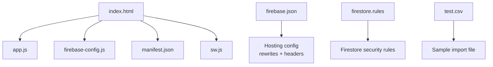

# Getting Started

<cite>
**Referenced Files in This Document**
- [README.md](file://README.md)
- [index.html](file://index.html)
- [app.js](file://app.js)
- [firebase-config.js](file://firebase-config.js)
- [firebase.json](file://firebase.json)
- [firestore.rules](file://firestore.rules)
- [manifest.json](file://manifest.json)
- [sw.js](file://sw.js)
</cite>

## Table of Contents
1. [Introduction](#introduction)
2. [Prerequisites](#prerequisites)
3. [Project Structure](#project-structure)
4. [Installation and Local Development](#installation-and-local-development)
5. [Firebase Setup and Configuration](#firebase-setup-and-configuration)
6. [Environment Variables and Security Rules](#environment-variables-and-security-rules)
7. [Initial Deployment to Firebase Hosting](#initial-deployment-to-firebase-hosting)
8. [Quick Start: First Launch and Basic Navigation](#quick-start-first-launch-and-basic-navigation)
9. [First-Time User Workflow](#first-time-user-workflow)
10. [Troubleshooting Guide](#troubleshooting-guide)
11. [Conclusion](#conclusion)

## Introduction
Shadow Ledger (St3s) is a lightweight, responsive inventory tracker that helps you manage stock across a Main Depot and a Company Building. It provides real-time alerts for carrier transfers and procurement needs, supports multi-format import/export, QR label generation, and optional Firebase-backed authentication and data persistence.

This guide walks you through prerequisites, local development with npx serve, Firebase project setup, environment configuration, initial deployment to Firebase Hosting, and your first run through the app.

## Prerequisites
- A modern browser (Chrome, Edge, Firefox, Safari). The app uses ES modules features, service workers, and camera APIs.
- Basic web development knowledge: running commands in a terminal, editing text files, and using a browser developer console.
- Node.js installed (for npx usage).
- A Google account for Firebase.

[No sources needed since this section provides general guidance]

## Project Structure
The repository is a single-page application with minimal dependencies and Firebase integration.

**Diagram sources**
- [index.html:1-120](file://index.html#L1-L120)
- [app.js:1-120](file://app.js#L1-L120)
- [firebase-config.js:1-29](file://firebase-config.js#L1-L29)
- [firebase.json:1-55](file://firebase.json#L1-L55)
- [firestore.rules:1-46](file://firestore.rules#L1-L46)
- [manifest.json:1-50](file://manifest.json#L1-L50)
- [sw.js:1-88](file://sw.js#L1-L88)

**Section sources**
- [README.md:1-32](file://README.md#L1-L32)
- [index.html:1-120](file://index.html#L1-L120)
- [app.js:1-120](file://app.js#L1-L120)
- [firebase-config.js:1-29](file://firebase-config.js#L1-L29)
- [firebase.json:1-55](file://firebase.json#L1-L55)
- [firestore.rules:1-46](file://firestore.rules#L1-L46)
- [manifest.json:1-50](file://manifest.json#L1-L50)
- [sw.js:1-88](file://sw.js#L1-L88)

## Installation and Local Development
You can run Shadow Ledger locally without any build step.

Steps:
1. Open a terminal in the project root directory.
2. Serve the site locally:
   - Run: npx serve . -l 3000
3. Open http://localhost:3000 in your browser.

Notes:
- The README includes the same command for quick local serving.
- The app registers a service worker when served over HTTP(S), not from file://.

**Section sources**
- [README.md:25-32](file://README.md#L25-L32)
- [app.js:2679-2696](file://app.js#L2679-L2696)

## Firebase Setup and Configuration
Shadow Ledger integrates with Firebase Authentication and Firestore. You must create a Firebase project and enable these services before using authenticated features.

High-level steps:
1. Create a new Firebase project in the Firebase Console.
2. Enable Authentication:
   - Sign-in method: Email/Password and/or Google.
   - Add your localhost domain to Authorized domains if testing Google sign-in locally.
3. Create a Cloud Firestore database in production mode.
4. Deploy security rules from firestore.rules.
5. Configure the app’s Firebase credentials in firebase-config.js.

Important:
- The app initializes Firebase via firebase-config.js and uses Firestore collections: inventory, transactions, locations.
- Real-time listeners are started after successful authentication.

**Section sources**
- [firebase-config.js:1-29](file://firebase-config.js#L1-L29)
- [app.js:200-265](file://app.js#L200-L265)
- [app.js:33-132](file://app.js#L33-L132)
- [firestore.rules:1-46](file://firestore.rules#L1-L46)

## Environment Variables and Security Rules
There are no external environment variable files in this project. Instead, Firebase configuration is defined directly in code.

What to configure:
- In firebase-config.js, set the following fields to match your Firebase project:
  - apiKey
  - authDomain
  - projectId
  - storageBucket
  - messagingSenderId
  - appId

Security considerations:
- Firestore rules enforce per-user ownership for inventory items and restrict access to authenticated users only.
- Transactions logs allow read/create by authenticated users; deletion is limited to the creator.

If you want all signed-in users to share one inventory instead of per-user isolation, adjust the rules accordingly.

**Section sources**
- [firebase-config.js:5-12](file://firebase-config.js#L5-L12)
- [firestore.rules:12-45](file://firestore.rules#L12-L45)

## Initial Deployment to Firebase Hosting
The project includes a firebase.json configured for hosting a single-page app with rewrites and security headers.

Steps:
1. Install the Firebase CLI globally (if not already installed):
   - npm install -g firebase-tools
2. Initialize Firebase in the project folder:
   - firebase login
   - firebase init
     - Choose Hosting
     - Select your Firebase project
     - Set public directory to "." (the current folder)
     - Configure as a single-page app: Yes
     - Do not overwrite existing files (keep firebase.json)
3. Deploy:
   - firebase deploy --only hosting

Notes:
- The hosting configuration sets a catch-all rewrite to index.html for client-side routing.
- Headers include cache-control and security policies suitable for production.

**Section sources**
- [firebase.json:1-55](file://firebase.json#L1-L55)

## Quick Start: First Launch and Basic Navigation
After deploying or serving locally:
1. Open the app URL in a modern browser.
2. If Firebase Auth is enabled, you will see a login overlay. Sign in with Email/Password or Google.
3. Once authenticated, the dashboard appears with:
   - Inventory overview cards
   - Search bar and filters
   - Inventory table with inline editing
   - Action buttons: Import, Export CSV, Labels, Manifest, Scan Out, History, Locations

Navigation highlights:
- Header controls: Archive toggle, Import, Export, Labels, Add Item, Theme toggle.
- Filters: Search by SKU/name/category, filter by stock status, category, alert type.
- Table actions: Increment/decrement building stock, edit, print labels, transfer between locations, delete.
- Modals: Import wizard, manifest preview, alert details, history, locations manager, scan-out flow.

**Section sources**
- [index.html:307-474](file://index.html#L307-L474)
- [app.js:200-265](file://app.js#L200-L265)
- [app.js:1868-2036](file://app.js#L1868-L2036)

## First-Time User Workflow
Recommended path for new users:
1. Authenticate:
   - Use Email/Password or Google sign-in.
2. Seed sample data (optional):
   - On first use with an empty Firestore, the app attempts to load sample items into Firestore automatically.
3. Explore the dashboard:
   - Review summary stats and alerts.
   - Use search and filters to find items.
4. Add or import items:
   - Click Add Item to create manually.
   - Or click Import to upload CSV/Excel/JSON/TSV with column mapping.
5. Adjust stock:
   - Use +/- buttons or inline inputs to update building stock.
   - Total stock updates depot stock automatically.
6. Generate labels:
   - Use Labels to generate shelf labels with QR codes for SKUs or datasheet URLs.
7. Manage transfers:
   - Use Transfer to move stock between locations.
   - Use Scan Out to decrement building stock via camera or manual SKU entry.
8. View history:
   - Check transaction history for scan-outs and transfers.

**Section sources**
- [app.js:318-334](file://app.js#L318-L334)
- [app.js:879-894](file://app.js#L879-L894)
- [app.js:1548-1863](file://app.js#L1548-L1863)
- [app.js:1004-1073](file://app.js#L1004-L1073)
- [app.js:1264-1434](file://app.js#L1264-L1434)
- [app.js:1440-1476](file://app.js#L1440-L1476)

## Troubleshooting Guide
Common issues and resolutions:

CORS and Content Security Policy (CSP):
- The app includes a CSP meta tag allowing connections to Firebase and CDN resources. Ensure your hosting origin allows these domains.
- If you host on a custom domain, verify that the CSP connect-src includes your domain and Firebase endpoints.

Firebase Authentication errors:
- Popup blocked: Allow popups for the site when using Google sign-in.
- Unauthorized domain: Add your deployed domain to Authorized domains in Firebase Console → Authentication → Settings.
- Operation not allowed: Enable Google sign-in in Firebase Console → Authentication → Sign-in providers.

Firestore permission denied:
- Ensure you have deployed firestore.rules and that the user is authenticated.
- Verify that inventory documents include ownerId matching the current user.

Service Worker and offline behavior:
- Service worker registration requires HTTPS or localhost. It does not register when opening index.html via file://.
- If assets do not update, clear site data or force reload.

Browser compatibility:
- Requires a modern browser supporting service workers, fetch, and mediaDevices.getUserMedia for scanning.
- Some older browsers may not support certain features; upgrade to a recent version.

Import/export issues:
- For Excel imports, ensure the first row contains headers and the first sheet has data.
- For CSV/TSV, ensure delimiters are correct and numeric fields are valid numbers.

**Section sources**
- [index.html:19-37](file://index.html#L19-L37)
- [app.js:2661-2677](file://app.js#L2661-L2677)
- [app.js:200-265](file://app.js#L200-L265)
- [app.js:2679-2696](file://app.js#L2679-L2696)
- [firestore.rules:12-45](file://firestore.rules#L12-L45)

## Conclusion
You now have everything needed to run Shadow Ledger locally, configure Firebase, deploy to Firebase Hosting, and perform your first inventory workflow. Use the troubleshooting section to resolve common setup issues, and explore the advanced features like QR label generation, multi-format import, and location-based stock management.

[No sources needed since this section summarizes without analyzing specific files]