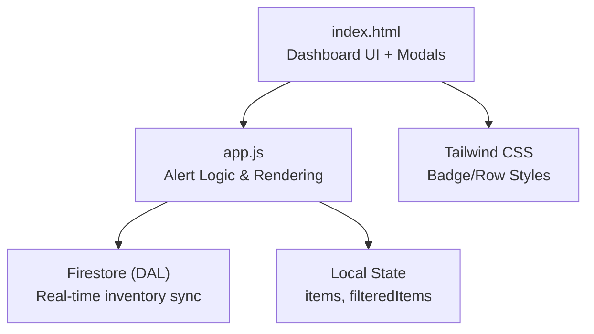
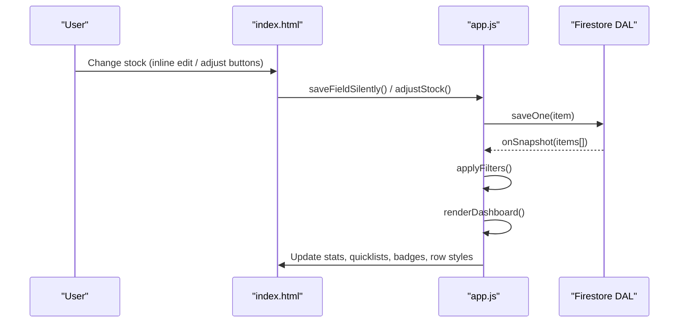
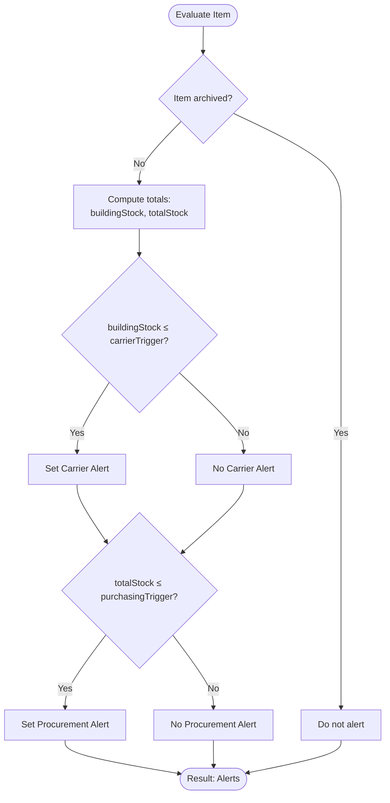
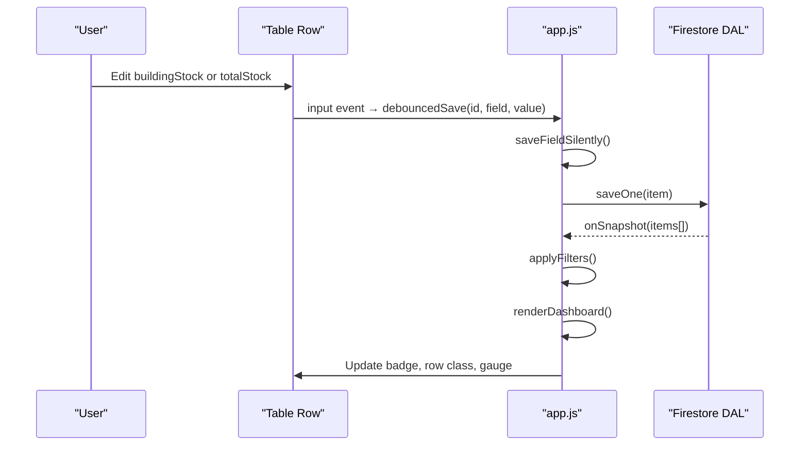
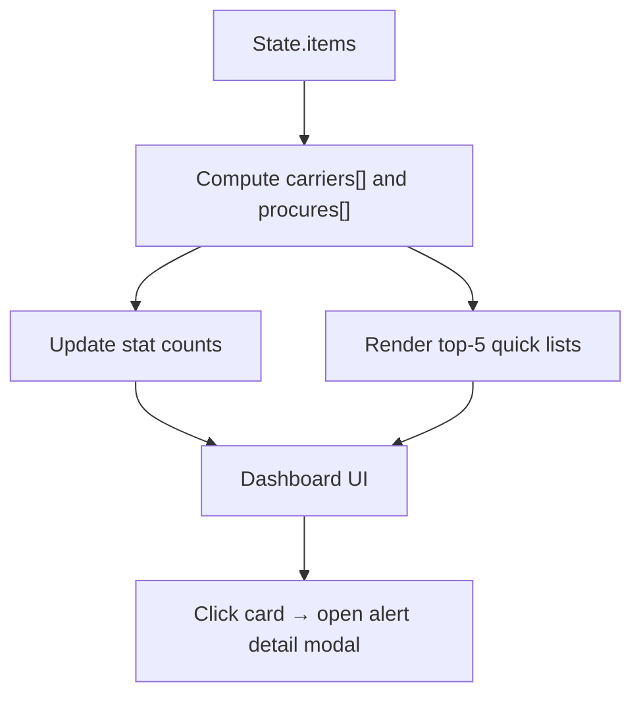
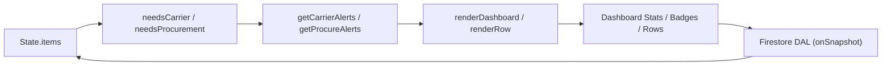

# Alerting System

<cite>
**Referenced Files in This Document**
- [README.md](file://README.md)
- [app.js](file://app.js)
- [index.html](file://index.html)
</cite>

## Table of Contents
1. [Introduction](#introduction)
2. [Project Structure](#project-structure)
3. [Core Components](#core-components)
4. [Architecture Overview](#architecture-overview)
5. [Detailed Component Analysis](#detailed-component-analysis)
6. [Dependency Analysis](#dependency-analysis)
7. [Performance Considerations](#performance-considerations)
8. [Troubleshooting Guide](#troubleshooting-guide)
9. [Conclusion](#conclusion)
10. [Appendices](#appendices)

## Introduction
This document explains Shadow Ledger’s intelligent alerting system that provides a dual-alert mechanism:
- Carrier transfer alerts (red indicators): triggered when building stock falls at or below the carrier trigger threshold.
- Procurement alerts (yellow indicators): triggered when total stock falls at or below the purchasing trigger threshold.

It covers how alerts are calculated, how badges and dashboard statistics reflect current status, how real-time updates propagate as stock levels change, and how to configure thresholds. It also includes troubleshooting guidance for sensitivity issues.

## Project Structure
The alerting logic is implemented in the application script and rendered via the main HTML page. The README summarizes the core formulas used by the system.

**Diagram sources**
- [index.html:367-428](file://index.html#L367-L428)
- [app.js:424-443](file://app.js#L424-L443)
- [app.js:621-661](file://app.js#L621-L661)
- [README.md:17-23](file://README.md#L17-L23)

**Section sources**
- [README.md:17-23](file://README.md#L17-L23)
- [index.html:367-428](file://index.html#L367-L428)
- [app.js:424-443](file://app.js#L424-L443)
- [app.js:621-661](file://app.js#L621-L661)

## Core Components
- Alert calculation functions:
  - needsCarrier(item): true if buildingStock ≤ carrierTrigger
  - needsProcurement(item): true if totalStock ≤ purchasingTrigger
- Aggregators:
  - getCarrierAlerts(): non-archived items with carrier alerts
  - getProcureAlerts(): non-archived items with procurement alerts
- Dashboard rendering:
  - renderDashboard(): updates counts and quick lists for both alert types
- Row badge and row styling:
  - Status badges show OK, CARRIER, ORDER, or both
  - Row highlights use red for carrier and yellow for procurement

Key implementation references:
- Alert predicates and aggregators
- Dashboard update and quick lists
- Badge generation and row highlighting

**Section sources**
- [app.js:424-443](file://app.js#L424-L443)
- [app.js:546-562](file://app.js#L546-L562)
- [app.js:621-661](file://app.js#L621-L661)

## Architecture Overview
The alerting system integrates with Firestore for real-time data synchronization. When inventory changes, the app re-renders the dashboard and table rows, updating badges and counts instantly.

**Diagram sources**
- [app.js:699-771](file://app.js#L699-L771)
- [app.js:808-822](file://app.js#L808-L822)
- [app.js:214-239](file://app.js#L214-L239)
- [app.js:621-661](file://app.js#L621-L661)

## Detailed Component Analysis

### Dual-Alert Calculation Algorithms
- Carrier Transfer Alert (Red):
  - Trigger condition: buildingStock ≤ carrierTrigger
  - Purpose: indicates need to replenish on-hand stock from depot
- Procurement Alert (Yellow):
  - Trigger condition: totalStock ≤ purchasingTrigger
  - Purpose: indicates need to order more stock from suppliers

These conditions are evaluated per item and aggregated into alert lists. Archived items are excluded from alert calculations.

**Diagram sources**
- [app.js:424-443](file://app.js#L424-L443)
- [app.js:452-494](file://app.js#L452-L494)

**Section sources**
- [app.js:424-443](file://app.js#L424-L443)
- [app.js:452-494](file://app.js#L452-L494)
- [README.md:17-23](file://README.md#L17-L23)

### Badge System and Visual Indicators
- Badges:
  - OK: no alerts
  - CARRIER: carrier alert active
  - ORDER: procurement alert active
  - Both CARRIER and ORDER when both alerts are active
- Row styling:
  - Red left border and gradient for carrier alerts
  - Yellow left border and gradient for procurement alerts
  - Combined styling when both alerts are present

Badges and row classes are computed during row rendering and updated inline when fields change.

**Section sources**
- [app.js:546-562](file://app.js#L546-L562)
- [app.js:748-761](file://app.js#L748-L761)
- [index.html:203-224](file://index.html#L203-L224)

### Real-Time Updates
- Firestore listener:
  - On snapshot, items are migrated to location-based storage and state is updated
  - Filters and dashboard are re-rendered automatically
- Inline edits:
  - Debounced input saves silently and updates only affected cells
  - Full re-render of row ensures badges and gauges reflect new values
- Adjust buttons (+/-):
  - Increment/decrement building stock, persist, then refresh UI

**Diagram sources**
- [app.js:699-771](file://app.js#L699-L771)
- [app.js:808-822](file://app.js#L808-L822)
- [app.js:214-239](file://app.js#L214-L239)

**Section sources**
- [app.js:214-239](file://app.js#L214-L239)
- [app.js:699-771](file://app.js#L699-L771)
- [app.js:808-822](file://app.js#L808-L822)

### Dashboard Statistics and Quick Access Lists
- Summary card shows:
  - Total items count
  - Number of categories
  - Sum of total units across all locations
- Alert cards show:
  - Count of carrier alerts
  - Count of procurement alerts
  - Quick list of up to five urgent items per type
  - Pulse animation when there are alerts
- Clicking an alert card opens a detail modal listing all affected items

**Diagram sources**
- [app.js:621-661](file://app.js#L621-L661)
- [index.html:395-427](file://index.html#L395-L427)

**Section sources**
- [app.js:621-661](file://app.js#L621-L661)
- [index.html:395-427](file://index.html#L395-L427)

### Filtering Capabilities
- Filter by alert type:
  - All Items
  - Carrier Alerts
  - Purchase Alerts
  - OK Items
- Additional filters:
  - Category
  - Stock presence (hide out-of-stock or empty building)
- Archive toggle affects which items are considered

Filtering uses the same alert predicates to narrow results.

**Section sources**
- [app.js:452-494](file://app.js#L452-L494)
- [index.html:447-453](file://index.html#L447-L453)

### Threshold Configuration Examples
Thresholds are configured per item through form fields and persisted to Firestore. Typical configuration patterns include:
- Low-volume fast-moving parts:
  - carrierTrigger set low to prompt frequent small transfers
  - purchasingTrigger set higher than carrierTrigger to ensure supplier orders before depot depletion
- High-capacity slow-moving parts:
  - carrierTrigger moderate to avoid unnecessary transfers
  - purchasingTrigger aligned with lead time and safety stock

Example fields visible in the add/edit form:
- Carrier Trigger
- Max Building Capacity
- Purchasing Trigger

These values directly influence alert behavior.

**Section sources**
- [index.html:654-667](file://index.html#L654-L667)
- [app.js:879-894](file://app.js#L879-L894)

## Dependency Analysis
The alerting system depends on:
- State management for items and filtered results
- Firestore DAL for persistence and real-time updates
- DOM elements for dashboard stats, quick lists, badges, and modals
- Tailwind CSS classes for visual indicators

**Diagram sources**
- [app.js:424-443](file://app.js#L424-L443)
- [app.js:621-661](file://app.js#L621-L661)
- [app.js:214-239](file://app.js#L214-L239)

**Section sources**
- [app.js:424-443](file://app.js#L424-L443)
- [app.js:621-661](file://app.js#L621-L661)
- [app.js:214-239](file://app.js#L214-L239)

## Performance Considerations
- Debounced inline editing reduces excessive writes while preserving focus and cursor position.
- Selective DOM updates for inline edits minimize full re-renders.
- Pagination limits table rendering to a fixed page size.
- Firestore onSnapshot triggers efficient incremental updates; avoid heavy computations inside listeners.

[No sources needed since this section provides general guidance]

## Troubleshooting Guide
Common alert sensitivity issues and resolutions:
- Too many carrier alerts:
  - Increase carrierTrigger to reduce false positives
  - Verify maxCapacity reflects realistic shelf capacity
- Too few procurement alerts:
  - Decrease purchasingTrigger to catch lower total stock earlier
  - Ensure totalStock accurately reflects sum across locations
- Alerts not updating:
  - Confirm Firestore connection and rules allow reads/writes
  - Check browser console for permission-denied or unavailable errors
- Archived items still showing:
  - Ensure archive flag is correctly set; alert functions exclude archived items

Operational checks:
- Validate that buildingStock and totalStock fields are populated
- Confirm category and stock filters are not hiding alerted items
- Use alert detail modal to inspect specific items triggering alerts

**Section sources**
- [app.js:229-238](file://app.js#L229-L238)
- [app.js:436-443](file://app.js#L436-L443)
- [app.js:452-494](file://app.js#L452-L494)

## Conclusion
Shadow Ledger’s alerting system provides clear, actionable signals for operational readiness:
- Red carrier alerts prompt timely depot-to-building transfers
- Yellow procurement alerts guide supplier ordering decisions
- Real-time updates keep dashboards and badges accurate
- Flexible thresholds enable customization to business needs

By configuring appropriate triggers and using filtering and quick lists, teams can maintain optimal stock levels and reduce downtime.

[No sources needed since this section summarizes without analyzing specific files]

## Appendices

### Key Functions and UI Elements Reference
- Alert predicates and aggregators:
  - needsCarrier, needsProcurement, getCarrierAlerts, getProcureAlerts
- Dashboard rendering:
  - renderDashboard (counts and quick lists)
- Row rendering:
  - renderRow (badges and row classes)
- Real-time sync:
  - DAL.startSync and onSnapshot callbacks
- UI elements:
  - Dashboard cards and quick lists
  - Alert filter dropdown
  - Alert detail modal

**Section sources**
- [app.js:424-443](file://app.js#L424-L443)
- [app.js:546-562](file://app.js#L546-L562)
- [app.js:621-661](file://app.js#L621-L661)
- [index.html:395-427](file://index.html#L395-L427)
- [index.html:447-453](file://index.html#L447-L453)