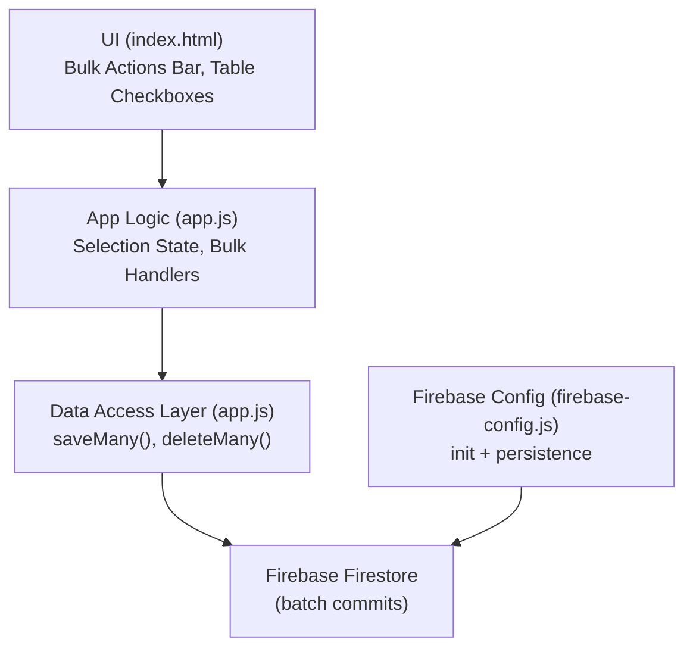
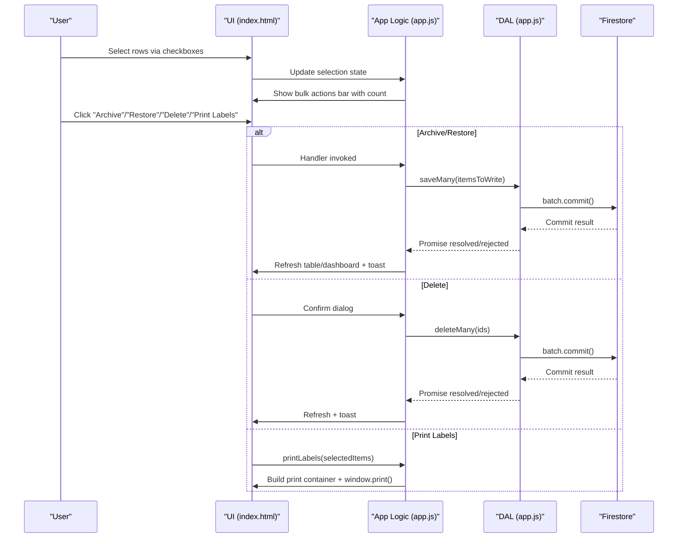
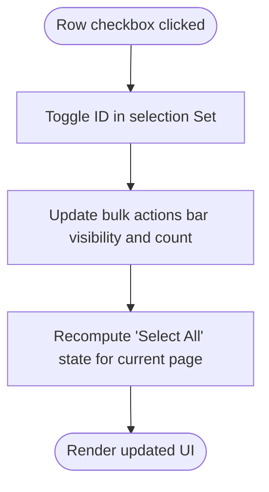
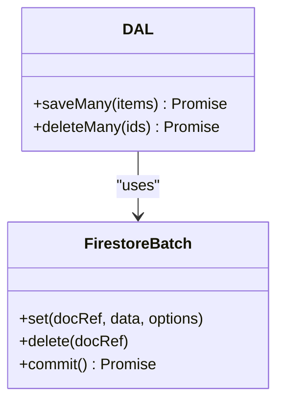
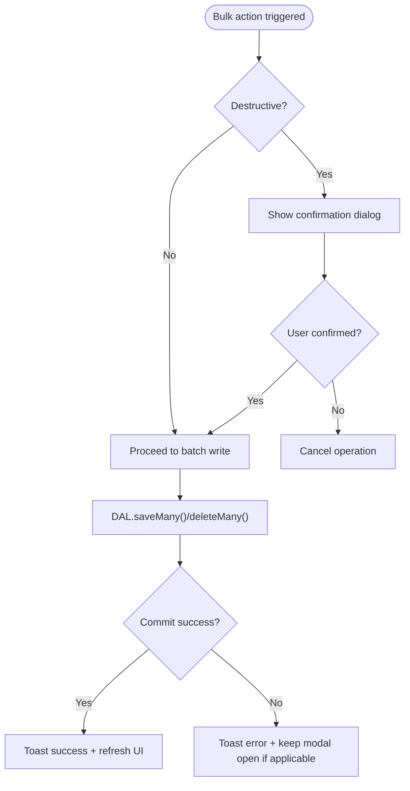
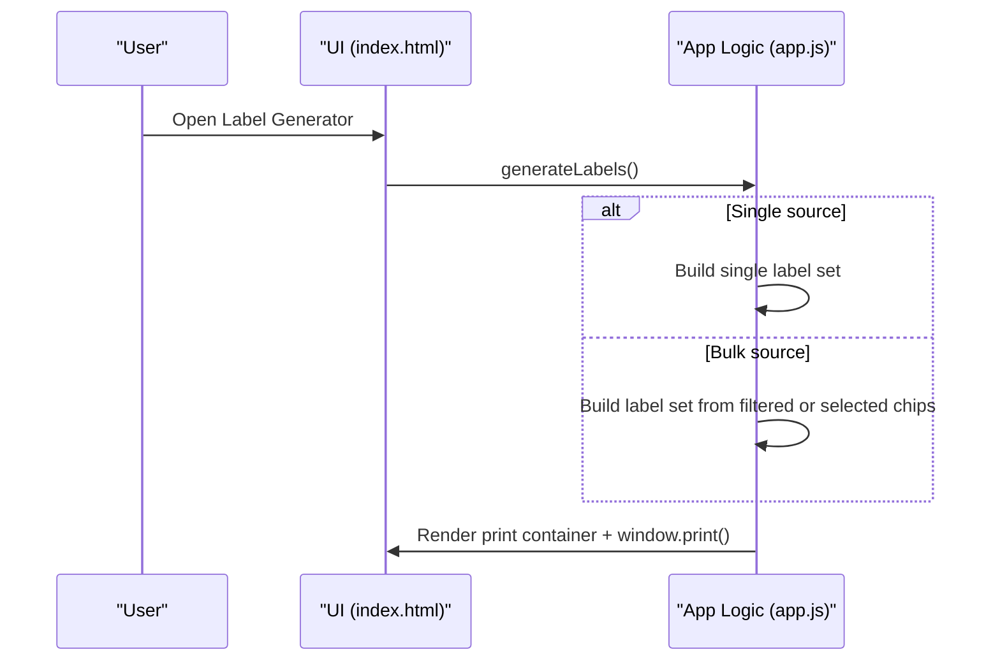
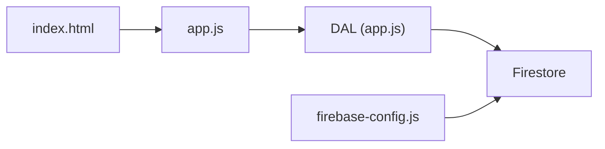

# Bulk Operations

<cite>
**Referenced Files in This Document**
- [index.html](file://index.html)
- [app.js](file://app.js)
- [firebase-config.js](file://firebase-config.js)
</cite>

## Table of Contents
1. [Introduction](#introduction)
2. [Project Structure](#project-structure)
3. [Core Components](#core-components)
4. [Architecture Overview](#architecture-overview)
5. [Detailed Component Analysis](#detailed-component-analysis)
6. [Dependency Analysis](#dependency-analysis)
7. [Performance Considerations](#performance-considerations)
8. [Troubleshooting Guide](#troubleshooting-guide)
9. [Conclusion](#conclusion)
10. [Appendices](#appendices)

## Introduction
This document explains Shadow Ledger’s bulk operation capabilities for efficient inventory management. It covers:
- The selection system that lets users select multiple items via checkboxes
- The bulk actions toolbar that appears when items are selected
- Supported bulk operations: archive, restore, delete, and label printing
- Batch processing implementation using Firebase batch writes for optimal performance
- Progress indication during bulk operations
- Error handling for partial failures
- Usage patterns for common workflows such as mass archiving old items, bulk deletion of duplicates, and generating labels for multiple products simultaneously

## Project Structure
Shadow Ledger is a single-page web application with:
- index.html: UI including the bulk actions bar, table with row checkboxes, and modals
- app.js: Application logic, state management, event bindings, and Firestore integration
- firebase-config.js: Firebase initialization and persistence configuration

**Diagram sources**
- [index.html:476-495](file://index.html#L476-L495)
- [app.js:1868-1949](file://app.js#L1868-L1949)
- [app.js:82-97](file://app.js#L82-L97)
- [firebase-config.js:14-28](file://firebase-config.js#L14-L28)

**Section sources**
- [index.html:476-495](file://index.html#L476-L495)
- [app.js:1868-1949](file://app.js#L1868-L1949)
- [app.js:82-97](file://app.js#L82-L97)
- [firebase-config.js:14-28](file://firebase-config.js#L14-L28)

## Core Components
- Selection System
  - Row-level checkboxes per item and a “Select All” checkbox for the current page
  - A Set-based selection state tracks selected IDs across pages
  - The bulk actions toolbar shows/hides based on selection count and view mode (active vs archive)
- Bulk Actions Toolbar
  - Buttons: Print Labels, Archive, Restore (shown only in archive view), Delete
  - Displays the number of selected items
- Batch Processing
  - Uses Firestore batch writes to commit multiple updates or deletions atomically
- Label Printing
  - Supports bulk label generation from selected items or filtered list
- Progress Indication
  - Toast notifications confirm completion of bulk operations
- Error Handling
  - Confirmation dialogs for destructive actions
  - User-facing error messages for permission/network issues

**Section sources**
- [index.html:476-495](file://index.html#L476-L495)
- [app.js:1888-1949](file://app.js#L1888-L1949)
- [app.js:82-97](file://app.js#L82-L97)
- [app.js:2608-2616](file://app.js#L2608-L2616)
- [app.js:2618-2659](file://app.js#L2618-L2659)

## Architecture Overview
The bulk operations flow integrates UI interactions, state management, and Firestore batch writes.

**Diagram sources**
- [index.html:476-495](file://index.html#L476-L495)
- [app.js:1888-1949](file://app.js#L1888-L1949)
- [app.js:82-97](file://app.js#L82-L97)
- [app.js:1005-1073](file://app.js#L1005-L1073)

## Detailed Component Analysis

### Selection System
- Checkbox behavior
  - Each row has a checkbox; clicking toggles the item ID in the selection Set
  - “Select All” selects/deselects all items on the current page
  - After each change, the bulk actions toolbar visibility and count update
- View-aware behavior
  - In archive view, “Archive” is hidden and “Restore” is shown; otherwise vice versa
- State synchronization
  - Selection state persists across pagination by tracking IDs rather than DOM elements

**Diagram sources**
- [app.js:1888-1949](file://app.js#L1888-L1949)

**Section sources**
- [index.html:503](file://index.html#L503)
- [app.js:1888-1949](file://app.js#L1888-L1949)

### Bulk Actions Toolbar
- Visible only when at least one item is selected
- Buttons:
  - Print Labels: generates labels for selected items
  - Archive: marks selected items as archived
  - Restore: unmarks selected items as archived (visible only in archive view)
  - Delete: permanently removes selected items after confirmation

**Section sources**
- [index.html:476-495](file://index.html#L476-L495)
- [app.js:1901-1949](file://app.js#L1901-L1949)

### Batch Processing Implementation
- Firestore batch writes
  - saveMany(items): builds a batch and sets each item with merge semantics
  - deleteMany(ids): builds a batch and deletes each document by ID
- Atomicity
  - Each batch commit is atomic; either all operations succeed or none do
- Error propagation
  - Errors bubble up through promises; callers can handle them and show user feedback

**Diagram sources**
- [app.js:82-97](file://app.js#L82-L97)

**Section sources**
- [app.js:82-97](file://app.js#L82-L97)

### Progress Indication During Bulk Operations
- Immediate feedback
  - Toast notifications inform users of success or errors
- No explicit progress bars
  - For large batches, consider adding incremental progress updates if needed

**Section sources**
- [app.js:2608-2616](file://app.js#L2608-L2616)

### Error Handling for Partial Failures
- Destructive actions use confirmation dialogs before execution
- Firestore write errors are caught and surfaced to users via toast messages
- Permission-denied and unavailable errors are handled specifically

**Diagram sources**
- [app.js:1931-1949](file://app.js#L1931-L1949)
- [app.js:2618-2659](file://app.js#L2618-L2659)

**Section sources**
- [app.js:1931-1949](file://app.js#L1931-L1949)
- [app.js:2618-2659](file://app.js#L2618-L2659)

### Bulk Label Printing
- From selection
  - Users can select items in the table and click “Print Labels” in the bulk actions bar
- From label generator
  - The label generator supports multi-select via a searchable picker and chip list
  - Bulk mode prints labels for all filtered items or the selected chips

**Diagram sources**
- [app.js:1005-1073](file://app.js#L1005-L1073)
- [app.js:2556-2592](file://app.js#L2556-L2592)

**Section sources**
- [index.html:476-495](file://index.html#L476-L495)
- [app.js:1005-1073](file://app.js#L1005-L1073)
- [app.js:2556-2592](file://app.js#L2556-L2592)

## Dependency Analysis
- UI depends on app.js for interaction handlers and state updates
- app.js depends on DAL methods which wrap Firestore batch operations
- firebase-config.js initializes Firebase and enables offline persistence

**Diagram sources**
- [index.html:476-495](file://index.html#L476-L495)
- [app.js:82-97](file://app.js#L82-L97)
- [firebase-config.js:14-28](file://firebase-config.js#L14-L28)

**Section sources**
- [index.html:476-495](file://index.html#L476-L495)
- [app.js:82-97](file://app.js#L82-L97)
- [firebase-config.js:14-28](file://firebase-config.js#L14-L28)

## Performance Considerations
- Batch writes reduce network round-trips and ensure atomicity
- Large selections may benefit from chunking into smaller batches to avoid timeouts
- Avoid re-rendering entire tables after each write; rely on real-time listeners and targeted updates where possible
- Consider adding progress indicators for very large batches to improve perceived responsiveness

[No sources needed since this section provides general guidance]

## Troubleshooting Guide
- Permission denied errors
  - Ensure Firestore rules allow read/write access for authenticated users
- Unavailable errors
  - Check internet connectivity and Firebase service status
- Bulk delete not completing
  - Verify that the user confirmed the action and that no network errors occurred
- Label printing issues
  - Ensure QR code libraries loaded successfully and browser print dialog is not blocked

**Section sources**
- [app.js:55-70](file://app.js#L55-L70)
- [app.js:2608-2616](file://app.js#L2608-L2616)

## Conclusion
Shadow Ledger provides a robust bulk operations experience:
- Intuitive selection via checkboxes and a dynamic toolbar
- Efficient batch processing using Firestore batch writes
- Clear user feedback through toasts and confirmation dialogs
- Flexible label printing for single or multiple items
For improved UX with very large datasets, consider implementing chunked batch processing and visible progress indicators.

[No sources needed since this section summarizes without analyzing specific files]

## Appendices

### Common Bulk Workflows

- Mass archive old items
  - Filter items by criteria (e.g., category or alert status)
  - Use “Select All” on the current page and navigate pages to select more
  - Click “Archive” in the bulk actions bar
  - Review results and toast confirmation

- Bulk deletion of duplicates
  - Identify duplicate SKUs or names using search and filters
  - Select duplicates via checkboxes
  - Click “Delete” and confirm in the dialog
  - Observe toast confirmation and refreshed table

- Generate labels for multiple products
  - Option A: Select items in the table and click “Print Labels” in the bulk actions bar
  - Option B: Open the Label Generator, choose “Bulk — all filtered,” configure size and QR settings, then print

**Section sources**
- [index.html:476-495](file://index.html#L476-L495)
- [app.js:1901-1949](file://app.js#L1901-L1949)
- [app.js:1005-1073](file://app.js#L1005-L1073)
- [app.js:2556-2592](file://app.js#L2556-L2592)