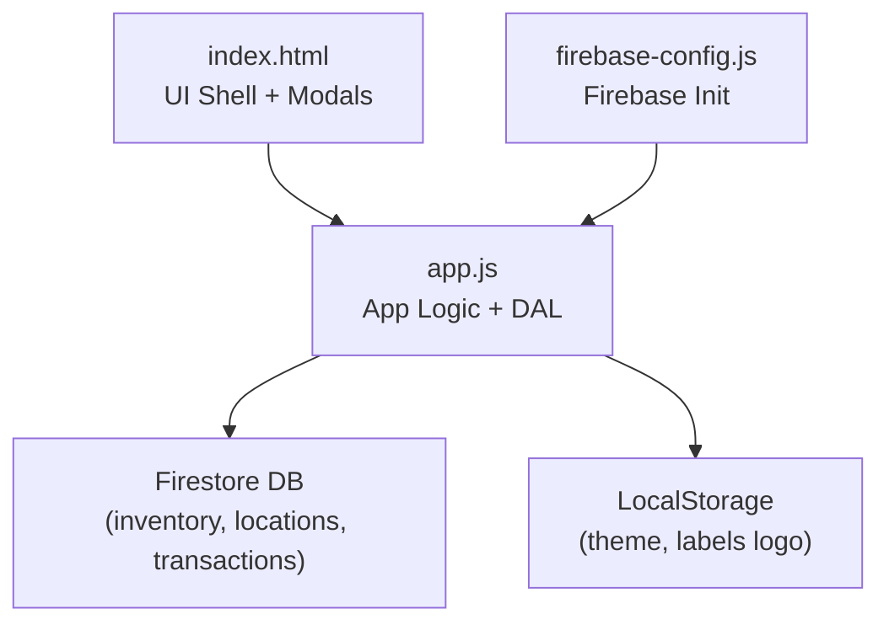
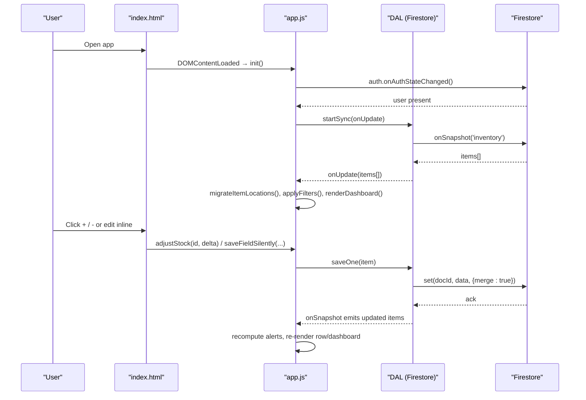
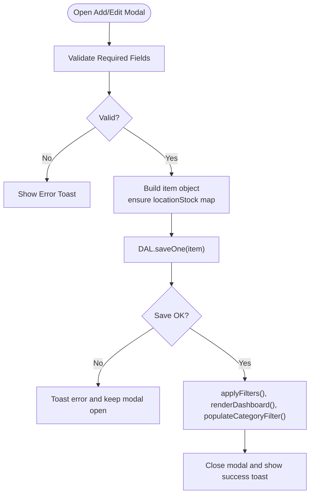
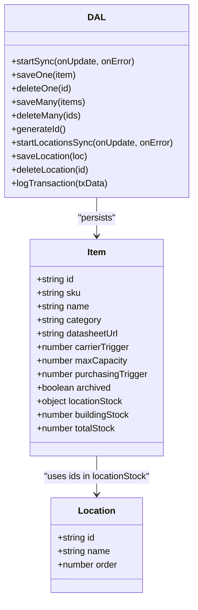
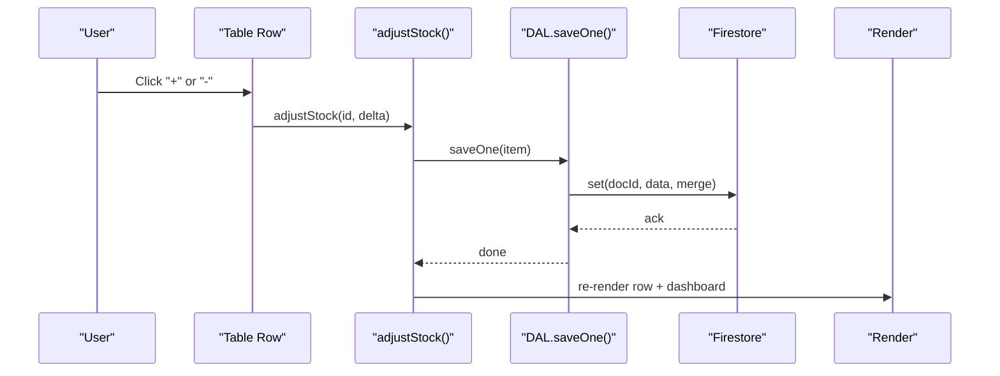
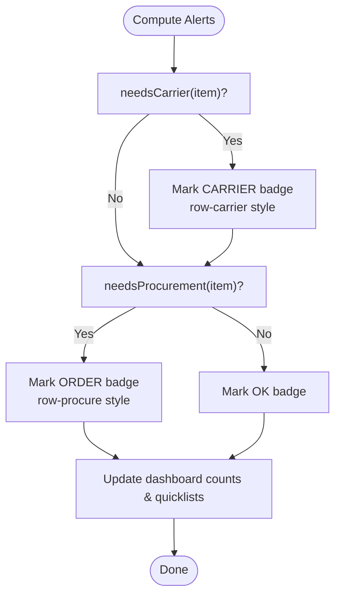
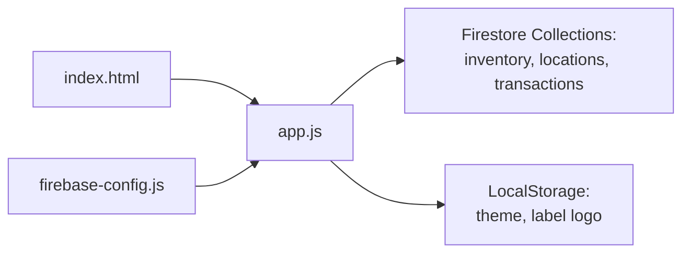

# Inventory Management System

<cite>
**Referenced Files in This Document**
- [README.md](file://README.md)
- [index.html](file://index.html)
- [app.js](file://app.js)
- [firebase-config.js](file://firebase-config.js)
</cite>

## Table of Contents
1. [Introduction](#introduction)
2. [Project Structure](#project-structure)
3. [Core Components](#core-components)
4. [Architecture Overview](#architecture-overview)
5. [Detailed Component Analysis](#detailed-component-analysis)
6. [Dependency Analysis](#dependency-analysis)
7. [Performance Considerations](#performance-considerations)
8. [Troubleshooting Guide](#troubleshooting-guide)
9. [Conclusion](#conclusion)
10. [Appendices](#appendices)

## Introduction
This document explains Shadow Ledger’s inventory management system with a focus on:
- Complete CRUD operations for inventory items (add, edit, delete, archive, restore)
- Multi-location stock tracking and depot vs building stock calculations
- Real-time stock adjustments using +/- buttons and inline editing
- Intelligent alerting for carrier transfers (red indicators) and procurement (yellow indicators)
- Keyboard-friendly navigation, bulk operations, and data validation rules
- Practical workflows and troubleshooting guidance for stock calculation issues

The application is a single-page web app that uses Firebase Authentication and Firestore for real-time persistence, with an offline-first approach via Firestore persistence.

**Section sources**
- [README.md:1-32](file://README.md#L1-L32)

## Project Structure
The project is organized as a minimal SPA:
- index.html: UI shell, modals, and Tailwind-based styles
- app.js: Application logic, state management, event bindings, and data access layer
- firebase-config.js: Firebase initialization and global references to db/auth
- README.md: Feature overview and core formulas

**Diagram sources**
- [index.html:1-1220](file://index.html#L1-L1220)
- [app.js:1-2699](file://app.js#L1-L2699)
- [firebase-config.js:1-29](file://firebase-config.js#L1-L29)

**Section sources**
- [index.html:1-1220](file://index.html#L1-L1220)
- [app.js:1-2699](file://app.js#L1-L2699)
- [firebase-config.js:1-29](file://firebase-config.js#L1-L29)

## Core Components
- Data Access Layer (DAL): Firestore listeners and batched writes for inventory, locations, and transactions
- State Manager: In-memory state for items, filters, pagination, selections, and view mode
- Rendering Engine: Dashboard stats, table rows, badges, gauges, and modals
- Alerting System: Carrier alerts (building stock ≤ trigger) and procurement alerts (total stock ≤ purchasing trigger)
- Import/Export: CSV/TSV/JSON/Excel import with column mapping; CSV export
- Label Generator: Single or bulk label printing with QR codes
- Scan Out: Camera-based QR scanning to decrement building stock and log transactions
- Locations Manager: Add/remove custom locations; core locations are protected

Key responsibilities and entry points:
- Initialization and auth flow: init(), auth.onAuthStateChanged()
- Real-time sync: DAL.startSync(), DAL.startLocationsSync()
- Filtering/sorting/rendering: applyFilters(), renderTable(), renderDashboard()
- Inline edits and quick adjust: saveFieldSilently(), adjustStock()
- Bulk actions: archive/restore/delete/print
- Manifest generation: generateManifest()

**Section sources**
- [app.js:33-132](file://app.js#L33-L132)
- [app.js:14-30](file://app.js#L14-L30)
- [app.js:452-494](file://app.js#L452-L494)
- [app.js:499-527](file://app.js#L499-L527)
- [app.js:622-661](file://app.js#L622-L661)
- [app.js:699-771](file://app.js#L699-L771)
- [app.js:808-822](file://app.js#L808-L822)
- [app.js:897-958](file://app.js#L897-L958)

## Architecture Overview
The system follows a reactive architecture:
- Firestore onSnapshot updates State.items
- State changes drive re-rendering of dashboard and table
- User interactions update State and persist via DAL.saveOne/saveMany
- Alerts are computed from current item fields and locationStock map

**Diagram sources**
- [app.js:200-265](file://app.js#L200-L265)
- [app.js:33-48](file://app.js#L33-L48)
- [app.js:699-771](file://app.js#L699-L771)
- [app.js:808-822](file://app.js#L808-L822)

## Detailed Component Analysis

### Inventory CRUD Operations
- Add Item: Opens modal form, validates required fields, persists via DAL.saveOne, refreshes UI
- Edit Item: Pre-fills modal with existing values, merges into existing record preserving other locations
- Delete Item: Confirmation dialog, removes from local state and deletes from Firestore
- Archive/Restore: Toggle archived flag per item; bulk archive/restore supported
- Export: CSV export including locationStock JSON string

Validation rules:
- SKU and Name are required in the add/edit form
- Numeric fields default to 0 if empty or invalid
- Non-negative integers enforced for stock and triggers

Keyboard-friendly inline editing:
- Enter moves to next input in the same row
- Focus selects all text for easy overwrite
- Debounced saves preserve focus and cursor position

**Diagram sources**
- [app.js:879-894](file://app.js#L879-L894)
- [app.js:824-854](file://app.js#L824-L854)
- [app.js:856-871](file://app.js#L856-L871)
- [app.js:1901-1949](file://app.js#L1901-L1949)
- [app.js:1844-1863](file://app.js#L1844-L1863)
- [app.js:1968-2010](file://app.js#L1968-L2010)

**Section sources**
- [app.js:824-854](file://app.js#L824-L854)
- [app.js:856-871](file://app.js#L856-L871)
- [app.js:1901-1949](file://app.js#L1901-L1949)
- [app.js:1844-1863](file://app.js#L1844-L1863)
- [app.js:1968-2010](file://app.js#L1968-L2010)

### Multi-Location Stock Tracking
Core concepts:
- Each item has a locationStock map keyed by location id
- Two core locations are always present: Main Depot and Company Building
- Total stock = sum across all locations
- Building stock = value at Company Building
- Depot stock = value at Main Depot

Migration and seeding:
- Legacy items without locationStock are migrated automatically
- Default locations seeded on first run

Calculations:
- needsCarrier(item): building stock ≤ carrierTrigger
- needsProcurement(item): total stock ≤ purchasingTrigger
- carrierQty(item): maxCapacity − building stock (if positive)

**Diagram sources**
- [app.js:340-380](file://app.js#L340-L380)
- [app.js:344-368](file://app.js#L344-L368)
- [app.js:421-447](file://app.js#L421-L447)
- [app.js:33-132](file://app.js#L33-L132)

**Section sources**
- [app.js:340-380](file://app.js#L340-L380)
- [app.js:344-368](file://app.js#L344-L368)
- [app.js:421-447](file://app.js#L421-L447)

### Real-Time Stock Adjustments and Inline Editing
Quick +/- buttons:
- Adjusts building stock by ±1, persists immediately, re-renders row and dashboard
Inline editing:
- Edits totalStock, buildingStock, carrierTrigger, maxCapacity, purchasingTrigger
- Editing totalStock adjusts depot so new total equals user input while keeping building stable
- Debounced saves prevent excessive writes and preserve focus/cursor

**Diagram sources**
- [app.js:808-822](file://app.js#L808-L822)
- [app.js:699-771](file://app.js#L699-L771)

**Section sources**
- [app.js:808-822](file://app.js#L808-L822)
- [app.js:699-771](file://app.js#L699-L771)

### Intelligent Alerting System
Alert types:
- Carrier Transfer Alert (red): building stock ≤ carrierTrigger
- Procurement Alert (yellow): total stock ≤ purchasingTrigger

Behavior:
- Dashboard cards display counts and quick lists
- Rows highlight with left border and background gradients
- Status badges reflect combined states
- Clicking cards opens detail modal listing affected items

**Diagram sources**
- [app.js:425-447](file://app.js#L425-L447)
- [app.js:546-617](file://app.js#L546-L617)
- [app.js:622-661](file://app.js#L622-L661)

**Section sources**
- [app.js:425-447](file://app.js#L425-L447)
- [app.js:546-617](file://app.js#L546-L617)
- [app.js:622-661](file://app.js#L622-L661)

### Keyboard-Friendly Navigation and Shortcuts
- Enter key navigates between inline inputs within a row
- Focus selects all text for fast overwrite
- Global keyboard buffer recognizes barcode scanners: typing a SKU focuses the corresponding building stock input
- Numpad +/- shortcuts when focused on building stock input

**Section sources**
- [app.js:1968-2010](file://app.js#L1968-L2010)
- [app.js:2157-2206](file://app.js#L2157-L2206)

### Bulk Operations Support
- Select rows via checkboxes; “Select All” applies to current page
- Bulk actions: Print Labels, Archive, Restore, Delete
- Bulk operations persist via batched writes and refresh UI

**Section sources**
- [app.js:1888-1949](file://app.js#L1888-L1949)

### Data Validation Rules
- Required fields: SKU and Name
- Numeric fields default to 0 if missing or invalid
- Negative values clamped to 0 for stock fields
- Import requires mapping at least SKU or Name

**Section sources**
- [app.js:824-854](file://app.js#L824-L854)
- [app.js:1753-1762](file://app.js#L1753-L1762)

### Practical Workflows

#### Workflow: Receive Shipment and Replenish Building
- Import CSV/Excel with received quantities
- Merge mode updates existing SKUs by matching SKU or Name
- Verify alerts; if building stock still low, use +/- buttons to increase building stock
- Generate manifest only when needed

**Section sources**
- [app.js:1780-1826](file://app.js#L1780-L1826)
- [app.js:808-822](file://app.js#L808-L822)
- [app.js:897-958](file://app.js#L897-L958)

#### Workflow: Daily Pick/Pack with Scan Out
- Open Scan Out modal
- Scan QR or type SKU
- Confirm quantity to remove
- Building stock decremented; transaction logged; alerts recalculated

**Section sources**
- [app.js:1264-1434](file://app.js#L1264-L1434)

#### Workflow: Transfer Between Locations
- Use Transfer modal to move stock from one location to another
- Validates availability and prevents invalid transfers
- Logs transfer transaction

**Section sources**
- [app.js:1517-1545](file://app.js#L1517-L1545)
- [app.js:2401-2430](file://app.js#L2401-L2430)

## Dependency Analysis
High-level dependencies:
- index.html depends on app.js and firebase-config.js
- app.js depends on Firebase Auth/Firestore globals exposed by firebase-config.js
- app.js manages state and renders UI elements defined in index.html

**Diagram sources**
- [index.html:1215-1218](file://index.html#L1215-L1218)
- [firebase-config.js:14-28](file://firebase-config.js#L14-L28)
- [app.js:33-132](file://app.js#L33-L132)

**Section sources**
- [index.html:1215-1218](file://index.html#L1215-L1218)
- [firebase-config.js:14-28](file://firebase-config.js#L14-L28)
- [app.js:33-132](file://app.js#L33-L132)

## Performance Considerations
- Debounced inline saves reduce write frequency during rapid typing
- Batched writes for bulk operations minimize network calls
- Pagination limits rendered rows to PAGE_SIZE for large datasets
- Firestore persistence enables offline operation and faster perceived performance
- Avoid full re-renders where possible by updating specific cells and gauges after silent saves

[No sources needed since this section provides general guidance]

## Troubleshooting Guide

Common issues and resolutions:
- Permission denied errors when saving:
  - Ensure Firestore rules allow read/write for authenticated users
  - The app shows a toast indicating permission-denied and suggests checking database rules
- Firebase unavailable:
  - Indicates connectivity issues; app displays a toast and continues working offline due to persistence
- Incorrect stock calculations:
  - Verify locationStock map exists; legacy items are auto-migrated
  - Remember totalStock = sum(locationStock.values); depot = locationStock['depot']; building = locationStock['building']
- Alerts not appearing:
  - Confirm carrierTrigger and purchasingTrigger values are set
  - Ensure archived items are excluded from alert computations
- Import mapping fails:
  - Map at least SKU or Name; ensure headers match expected names or use auto-mapping hints

Operational tips:
- Use the History modal to review scan-out transactions
- Use the Locations manager to add/remove non-core locations; core locations cannot be deleted
- Use the Manifest generator to plan depot-to-building replenishment

**Section sources**
- [app.js:55-70](file://app.js#L55-L70)
- [app.js:229-238](file://app.js#L229-L238)
- [app.js:344-368](file://app.js#L344-L368)
- [app.js:437-443](file://app.js#L437-L443)
- [app.js:1440-1476](file://app.js#L1440-L1476)
- [app.js:1482-1511](file://app.js#L1482-L1511)

## Conclusion
Shadow Ledger’s inventory system provides a robust, real-time solution for multi-location stock tracking with intuitive CRUD operations, intelligent alerting, and powerful utilities like import/export, label generation, and scan-out. Its reactive architecture ensures consistent state across clients, while keyboard-friendly interactions and bulk operations improve productivity. Proper configuration of triggers and adherence to validation rules will maintain accurate alerts and reliable stock calculations.

[No sources needed since this section summarizes without analyzing specific files]

## Appendices

### Key Formulas
- Depot Stock = Sum(locationStock) − Building Stock
- Carrier Alert: Building Stock ≤ Carrier Trigger
- Procurement Alert: Total Stock ≤ Purchasing Trigger

**Section sources**
- [README.md:17-23](file://README.md#L17-L23)
- [app.js:421-447](file://app.js#L421-L447)