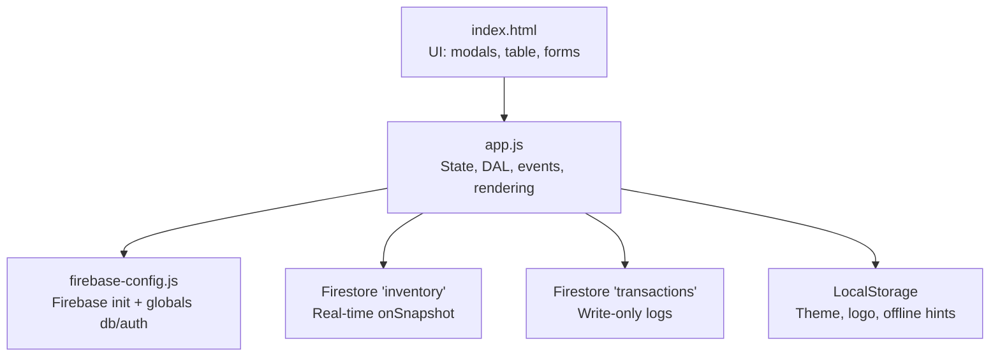
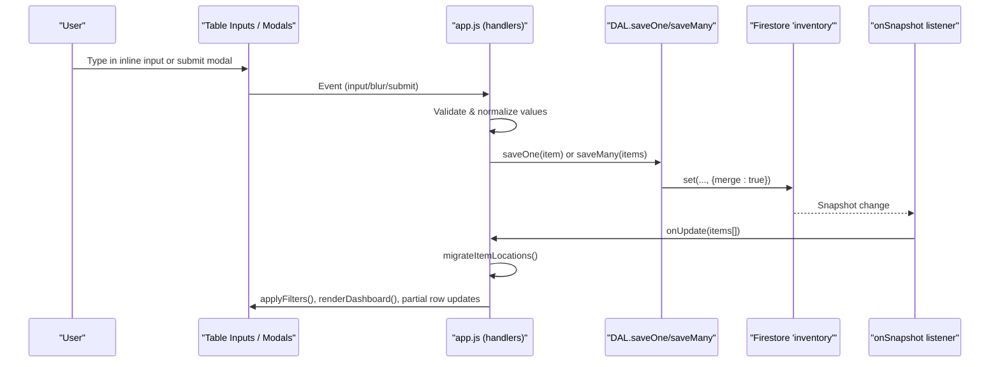
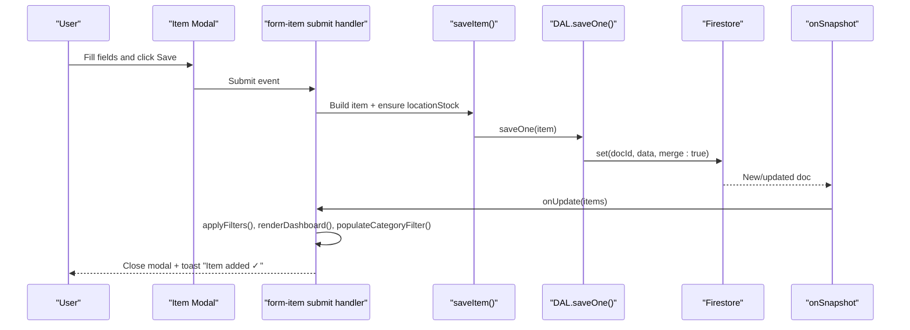
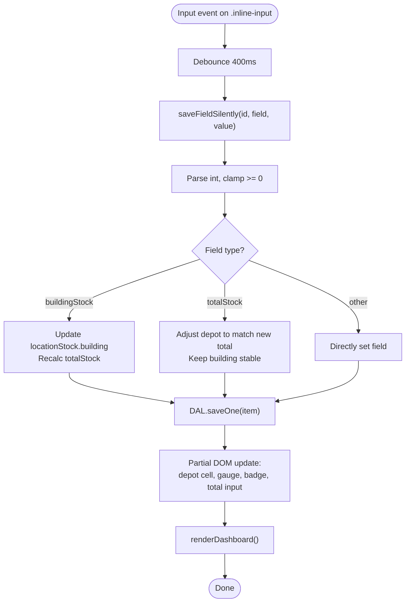
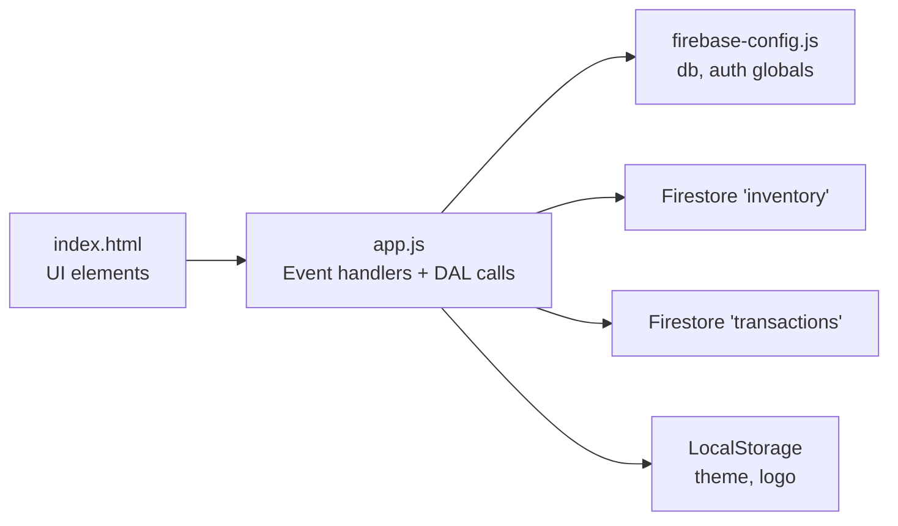

# Item CRUD Operations

<cite>
**Referenced Files in This Document**
- [index.html](file://index.html)
- [app.js](file://app.js)
- [firebase-config.js](file://firebase-config.js)
</cite>

## Table of Contents
1. [Introduction](#introduction)
2. [Project Structure](#project-structure)
3. [Core Components](#core-components)
4. [Architecture Overview](#architecture-overview)
5. [Detailed Component Analysis](#detailed-component-analysis)
6. [Dependency Analysis](#dependency-analysis)
7. [Performance Considerations](#performance-considerations)
8. [Troubleshooting Guide](#troubleshooting-guide)
9. [Conclusion](#conclusion)
10. [Appendices](#appendices)

## Introduction
This document explains Shadow Ledger’s item Create, Read, Update, and Delete (CRUD) operations with a focus on the complete item lifecycle: adding items via modal form, editing via inline table inputs and full modal editing, deleting with confirmation dialogs, and archive/restore workflows. It also details the keyboard-friendly inline editing system that enables real-time field updates without page reflows, including number validation, auto-save to Firestore, and immediate UI feedback. Data validation rules, error handling patterns, and how changes propagate through the real-time sync system are covered, along with practical workflows such as bulk creation, quick stock adjustments, and item status management.

## Project Structure
Shadow Ledger is a single-page web application using Firebase for authentication and Firestore for persistence. The main HTML defines the UI (modals, tables, forms), while app.js implements state management, event bindings, and data access. firebase-config.js initializes Firebase and exposes global references used by the app.

**Diagram sources**
- [index.html:1-1220](file://index.html#L1-L1220)
- [app.js:1-2699](file://app.js#L1-L2699)
- [firebase-config.js:1-29](file://firebase-config.js#L1-L29)

**Section sources**
- [index.html:1-1220](file://index.html#L1-L1220)
- [app.js:1-2699](file://app.js#L1-L2699)
- [firebase-config.js:1-29](file://firebase-config.js#L1-L29)

## Core Components
- State and Data Access Layer (DAL): Centralized in-memory state plus Firestore integration for real-time sync and writes.
- Inline Editing Engine: Debounced input listeners that save silently and update only affected cells.
- Modal Forms: Add/Edit item modal with validation and save flow.
- Archive/Restore: Bulk actions bar toggles between archive and restore modes.
- Confirmation Dialogs: Promise-based confirmDialog replaces native confirm for destructive actions.
- Toast Notifications: Non-blocking user feedback for success/error/info.

Key responsibilities:
- Real-time inventory sync and migration to per-location stock maps.
- Filtering, sorting, pagination, and dashboard stats.
- Import/export utilities and label generation (supporting QR codes).
- Scan-out workflow and transaction logging.

**Section sources**
- [app.js:14-31](file://app.js#L14-L31)
- [app.js:33-132](file://app.js#L33-L132)
- [app.js:695-806](file://app.js#L695-L806)
- [app.js:879-894](file://app.js#L879-L894)
- [app.js:1878-1949](file://app.js#L1878-L1949)
- [app.js:2618-2659](file://app.js#L2618-L2659)
- [app.js:2608-2616](file://app.js#L2608-L2616)

## Architecture Overview
The application uses a unidirectional data flow:
- User interactions trigger event handlers bound in app.js.
- Handlers mutate State.items and call DAL methods to persist to Firestore.
- Firestore onSnapshot pushes live updates back into State.items, which triggers filtered render and dashboard updates.

**Diagram sources**
- [app.js:37-48](file://app.js#L37-L48)
- [app.js:55-70](file://app.js#L55-L70)
- [app.js:214-239](file://app.js#L214-L239)
- [app.js:695-771](file://app.js#L695-L771)

## Detailed Component Analysis

### Add Item (Modal Form)
- Entry points: “Add Item” button opens the item modal; URL shortcut ?action=add can open it automatically after login.
- Modal fields include SKU, name, category, datasheet URL, total stock, building stock, carrier trigger, max capacity, purchasing trigger.
- On submit, the handler builds an item object, ensures locationStock map exists, saves via DAL, closes modal, refreshes filters/dashboard, and shows a toast.

Validation and behavior:
- Required fields enforced by HTML attributes and handled by the form submission path.
- Numeric fields default to safe values when empty.
- Location mapping: if locationStock is missing, defaults are seeded from form totals.

**Diagram sources**
- [index.html:544-674](file://index.html#L544-L674)
- [app.js:2042-2062](file://app.js#L2042-L2062)
- [app.js:824-854](file://app.js#L824-L854)
- [app.js:55-70](file://app.js#L55-L70)
- [app.js:214-239](file://app.js#L214-L239)

**Section sources**
- [index.html:544-674](file://index.html#L544-L674)
- [app.js:2038-2062](file://app.js#L2038-L2062)
- [app.js:824-854](file://app.js#L824-L854)

### Edit Item (Inline Table Editing)
- Inline inputs exist for Total Stock, Building Stock, Carrier Trigger, Max Capacity, Purchasing Trigger.
- Input events are debounced to reduce write frequency; blur ensures final commit.
- Enter key navigates to next input within the same row; Tab works naturally. Focus selects text for easy overwrite.

Data semantics:
- Editing Building Stock updates the locationStock map for the building location and recalculates totalStock.
- Editing Total Stock adjusts depot stock so that new total equals user input while keeping building stable.
- Other numeric fields are saved directly.

Immediate UI feedback:
- Only affected cells are updated (e.g., depot cell, gauge bar width/color, badge classes).
- Dashboard counters and alerts update without full re-render.

**Diagram sources**
- [app.js:1968-2010](file://app.js#L1968-L2010)
- [app.js:695-771](file://app.js#L695-L771)

**Section sources**
- [app.js:1968-2010](file://app.js#L1968-L2010)
- [app.js:695-771](file://app.js#L695-L771)

### Edit Item (Full Modal Editing)
- Clicking the edit action opens the modal pre-filled with current item values.
- Changes follow the same saveItem logic as add, merging into existing records and preserving other locations.

**Section sources**
- [app.js:879-894](file://app.js#L879-L894)
- [app.js:824-854](file://app.js#L824-L854)

### Delete Item
- Single delete: Row action triggers a custom confirm dialog; upon confirmation, the item is removed from local state and deleted from Firestore.
- Bulk delete: Selected items are confirmed once and batch-deleted via DAL.deleteMany.

Error handling:
- Permission-denied errors surface friendly toasts.
- Unavailable network errors are surfaced to users.

**Section sources**
- [app.js:856-871](file://app.js#L856-L871)
- [app.js:1931-1949](file://app.js#L1931-L1949)
- [app.js:73-79](file://app.js#L73-L79)
- [app.js:93-97](file://app.js#L93-L97)

### Archive and Restore
- Toggle view mode between active and archive via header button.
- Bulk actions bar adapts: Archive button appears in active view; Restore appears in archive view.
- Archiving sets archived flag and persists via batch save; restoring clears the flag.

**Section sources**
- [app.js:1878-1929](file://app.js#L1878-L1929)

### Keyboard-Friendly Inline Editing System
- Debounced input saves to Firestore without reflow.
- Enter moves focus to next input in the row; Tab works natively.
- Focus selects content for fast overwrite.
- Global numpad shortcuts (+/-) adjust building stock when focused on the building input.
- Barcode scanner support: typing SKUs quickly focuses the corresponding building input or filters the table.

**Section sources**
- [app.js:1968-2010](file://app.js#L1968-L2010)
- [app.js:2157-2206](file://app.js#L2157-L2206)

### Data Validation Rules
- Numeric fields: parsed as integers, clamped to minimum 0.
- Required fields in modal: SKU and Name are required by HTML attributes.
- Import mapping enforces at least one of SKU or Name mapped.
- Transfer and scan-out validate available stock before allowing negative results.

**Section sources**
- [app.js:695-771](file://app.js#L695-L771)
- [app.js:1743-1762](file://app.js#L1743-L1762)
- [app.js:2400-2430](file://app.js#L2400-L2430)
- [app.js:1367-1420](file://app.js#L1367-L1420)

### Error Handling Patterns
- DAL.write methods catch Firestore errors and show contextual toasts for permission-denied and unavailable states.
- Authentication flows provide user-friendly messages for common auth errors.
- Custom confirmDialog provides consistent UX for destructive actions.

**Section sources**
- [app.js:55-70](file://app.js#L55-L70)
- [app.js:214-239](file://app.js#L214-L239)
- [app.js:2618-2659](file://app.js#L2618-L2659)

### Real-Time Sync Propagation
- onSnapshot listener converts snapshots to plain objects and migrates legacy fields to locationStock maps.
- If an inline input is focused, only dashboard stats are refreshed to avoid losing focus; otherwise, full filter/render runs.
- Category filter dropdown merges predefined options with dynamically created categories.

**Section sources**
- [app.js:214-239](file://app.js#L214-L239)
- [app.js:344-368](file://app.js#L344-L368)
- [app.js:663-692](file://app.js#L663-L692)

## Dependency Analysis
High-level dependencies among modules and external services:

**Diagram sources**
- [index.html:1-1220](file://index.html#L1-L1220)
- [app.js:1-2699](file://app.js#L1-L2699)
- [firebase-config.js:1-29](file://firebase-config.js#L1-L29)

**Section sources**
- [app.js:33-132](file://app.js#L33-L132)
- [firebase-config.js:14-29](file://firebase-config.js#L14-L29)

## Performance Considerations
- Debounced saves (400 ms) minimize Firestore writes during rapid typing.
- Partial DOM updates preserve focus and avoid full table re-renders during inline edits.
- Pagination limits rendered rows to PAGE_SIZE for large datasets.
- Offline persistence enabled for Firestore to keep the app responsive during brief connectivity loss.

[No sources needed since this section provides general guidance]

## Troubleshooting Guide
Common issues and resolutions:
- Permission denied on save/delete: Check Firestore security rules for read/write permissions on inventory and transactions collections.
- Firebase unavailable: Verify internet connection and browser support for persistence.
- Import fails to parse: Ensure headers match expected names or use the mapping step to align columns.
- Barcode not found: Confirm SKU case and exact match; scanning may require trimming whitespace.

**Section sources**
- [app.js:55-70](file://app.js#L55-L70)
- [app.js:214-239](file://app.js#L214-L239)
- [app.js:1699-1708](file://app.js#L1699-L1708)
- [app.js:1325-1344](file://app.js#L1325-L1344)

## Conclusion
Shadow Ledger’s item CRUD system combines a robust real-time sync layer with a highly ergonomic inline editing experience. Users can add, edit, delete, and manage items efficiently through both modal forms and direct table interactions. The architecture cleanly separates UI, state, and data access, enabling smooth performance and clear error handling. Practical workflows like bulk import, quick stock adjustments, and status-driven alerts streamline daily inventory operations.

[No sources needed since this section summarizes without analyzing specific files]

## Appendices

### Practical Workflows

#### Bulk Item Creation (Import)
- Open Import modal, choose format (CSV/Excel/JSON/TSV), drop or select file.
- Map columns if necessary; preview parsed items.
- Choose Merge (update existing SKUs/names) or Replace all data.
- Confirm import; items are batch-saved and UI refreshes.

**Section sources**
- [index.html:677-816](file://index.html#L677-L816)
- [app.js:1668-1826](file://app.js#L1668-L1826)

#### Quick Stock Adjustments
- Use ±1 buttons beside Building Stock for fast increments/decrements.
- Or type directly into the Building Stock inline input; changes auto-save and reflect immediately.

**Section sources**
- [app.js:808-822](file://app.js#L808-L822)
- [app.js:1968-2010](file://app.js#L1968-L2010)

#### Item Status Management
- Status badges reflect two conditions:
  - Carrier Alert: Building Stock ≤ Carrier Trigger.
  - Procurement Alert: Total Stock ≤ Purchasing Trigger.
- Alerts appear in dashboard cards and can be expanded to detail views.

**Section sources**
- [app.js:425-447](file://app.js#L425-L447)
- [app.js:546-617](file://app.js#L546-L617)
- [app.js:622-661](file://app.js#L622-L661)