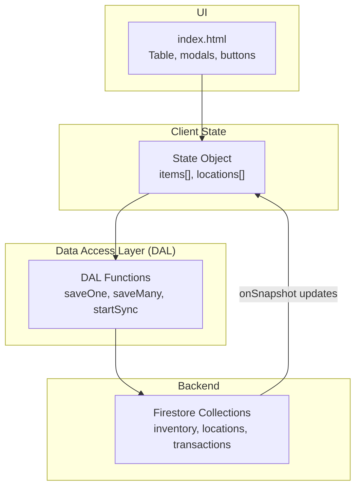
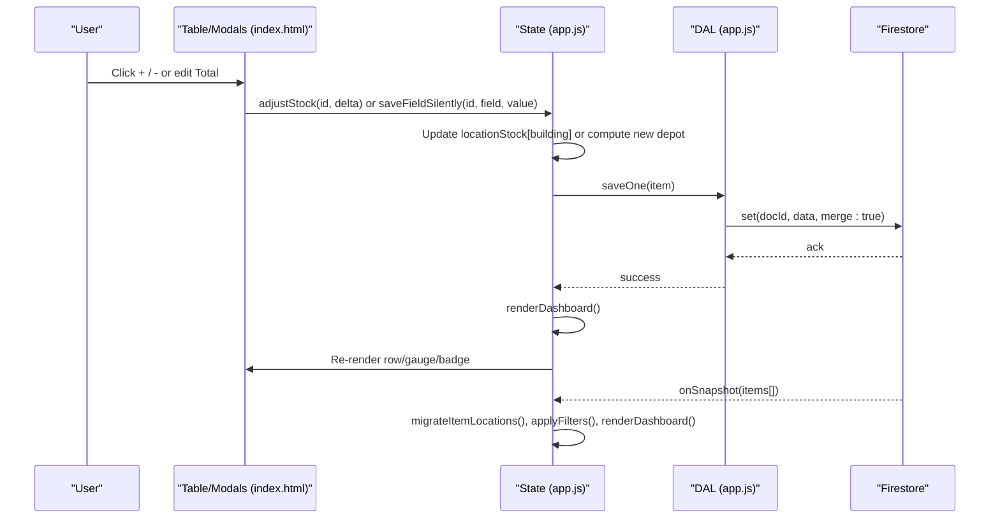
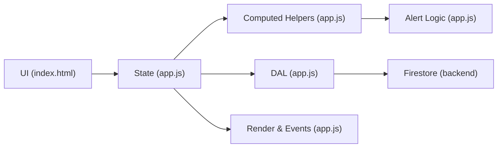

# Stock Level Management

<cite>
**Referenced Files in This Document**
- [app.js](file://app.js)
- [index.html](file://index.html)
</cite>

## Table of Contents
1. [Introduction](#introduction)
2. [Project Structure](#project-structure)
3. [Core Components](#core-components)
4. [Architecture Overview](#architecture-overview)
5. [Detailed Component Analysis](#detailed-component-analysis)
6. [Dependency Analysis](#dependency-analysis)
7. [Performance Considerations](#performance-considerations)
8. [Troubleshooting Guide](#troubleshooting-guide)
9. [Conclusion](#conclusion)

## Introduction
This document explains Shadow Ledger’s stock level management system with a focus on multi-location tracking, depot vs building stock calculations, real-time adjustments using +/- controls, and total stock synchronization across locations. It details the location-based model where each item maintains a locationStock map, automatic depot recalculation when editing total stock, the building stock gauge visualization, and how stock changes trigger alert recalculation. It also includes mathematical formulas for distribution, edge case handling, and performance considerations for large inventories.

## Project Structure
The application is a single-page web app that uses Firebase Firestore for real-time data persistence and a client-side state object to manage inventory items and locations. The core logic resides in app.js, while the UI structure and styles are defined in index.html.

**Diagram sources**
- [app.js:33-132](file://app.js#L33-L132)
- [app.js:14-30](file://app.js#L14-L30)
- [index.html:498-540](file://index.html#L498-L540)

**Section sources**
- [app.js:14-30](file://app.js#L14-L30)
- [app.js:33-132](file://app.js#L33-L132)
- [index.html:498-540](file://index.html#L498-L540)

## Core Components
- Location Model: Each item has a locationStock map keyed by location id (e.g., depot, building, showroom). Two core locations are seeded automatically: Main Depot and Company Building.
- Computed Totals: Total stock is derived from summing all values in locationStock. Building stock is the value at the building location. Depot stock is the value at the depot location.
- Real-Time Adjustments: Inline inputs and +/- buttons update building stock immediately; edits to total stock adjust depot automatically to preserve consistency.
- Alerts: Carrier alerts trigger when building stock falls at or below carrierTrigger; procurement alerts trigger when total stock falls at or below purchasingTrigger.
- Visualization: A gauge bar shows building stock as a percentage of maxCapacity, color-coded by thresholds.

Key responsibilities:
- Data persistence via DAL functions to Firestore
- State updates and computed helpers for stock metrics
- UI rendering and event handling for inline edits and quick adjustments
- Alert computation and dashboard updates

**Section sources**
- [app.js:340-380](file://app.js#L340-L380)
- [app.js:421-447](file://app.js#L421-L447)
- [app.js:546-617](file://app.js#L546-L617)
- [app.js:699-771](file://app.js#L699-L771)
- [app.js:808-822](file://app.js#L808-L822)

## Architecture Overview
The architecture centers around a reactive state updated by Firestore listeners. When data changes, the state is migrated to ensure locationStock maps exist, then filters, sorting, and dashboards recompute. User interactions (inline edits, +/- buttons, transfers) mutate the state and persist changes back to Firestore.

**Diagram sources**
- [app.js:808-822](file://app.js#L808-L822)
- [app.js:699-771](file://app.js#L699-L771)
- [app.js:33-70](file://app.js#L33-L70)
- [app.js:214-239](file://app.js#L214-L239)

## Detailed Component Analysis

### Multi-Location Stock Model
- Each item stores a locationStock map keyed by location id.
- Default locations:
  - LOC_DEPOT = 'depot' (Main Depot)
  - LOC_BUILDING = 'building' (Company Building)
- Migration ensures legacy items (with only totalStock/buildingStock) get a valid locationStock map.

Formulas:
- locStock(item, locId) = max(0, Number(item.locationStock[locId]) || 0)
- totalStockFromLocs(item) = sum over v in item.locationStock.values of max(0, Number(v))
- depotStock(item) = locStock(item, LOC_DEPOT)
- buildingStock(item) = locStock(item, LOC_BUILDING)

Edge cases:
- Missing locationStock: treated as zero per location.
- Negative values clamped to zero.
- Non-numeric entries coerced to zero.

**Section sources**
- [app.js:340-380](file://app.js#L340-L380)
- [app.js:358-368](file://app.js#L358-L368)

### Automatic Depot Calculation When Editing Total Stock
When the user edits the total stock input:
- Current totals and per-location values are read.
- Other locations (excluding depot and building) are summed into otherTotal.
- New depot quantity is computed as:
  newDepot = max(0, desiredTotal - currentBuilding - max(0, otherTotal))
- The locationStock map is updated with the new depot value, and totalStock is recomputed.

Behavior:
- Building stock remains unchanged during total edits.
- If other locations have stock, depot absorbs the difference to match the desired total.
- Negative depot results are clamped to zero.

**Section sources**
- [app.js:712-724](file://app.js#L712-L724)
- [app.js:784-793](file://app.js#L784-L793)

### Real-Time Stock Adjustments Using +/- Buttons
Quick adjustment buttons increment/decrement building stock by one unit:
- adjustStock(id, delta):
  - Reads current building stock.
  - Computes newQty = max(0, current + delta).
  - Updates locationStock[building], buildingStock, persists via DAL.saveOne, and refreshes UI.

Keyboard shortcuts:
- While focused on the building stock input, pressing '+' or '-' triggers the same adjustment.

**Section sources**
- [app.js:808-822](file://app.js#L808-L822)
- [app.js:2163-2170](file://app.js#L2163-L2170)

### Total Stock Synchronization Across Locations
- After any change to a location’s stock (including transfers), totalStock is recalculated by summing all locationStock values.
- The table’s total column reflects this sum.
- Dashboard statistics aggregate total units across all items.

**Section sources**
- [app.js:364-368](file://app.js#L364-L368)
- [app.js:622-661](file://app.js#L622-L661)

### Building Stock Gauge Visualization
- The gauge displays the percentage of building stock relative to maxCapacity.
- Formula:
  gaugePercent = min(100, (buildingNow / maxCapacity) * 100) if maxCapacity > 0 else 0
- Color coding:
  - Red if <= 25%
  - Amber if <= 50%
  - Emerald otherwise

Updates occur after any building stock change or maxCapacity edit.

**Section sources**
- [app.js:552-556](file://app.js#L552-L556)
- [app.js:740-747](file://app.js#L740-L747)

### Alert Recalculation Triggered by Stock Changes
Alerts are recomputed whenever stock levels change:
- needsCarrier(item) = locStock(item, LOC_BUILDING) <= carrierTrigger
- needsProcurement(item) = totalStockFromLocs(item) <= purchasingTrigger
- Dashboard badges and rows reflect these states.
- Quicklists show top items requiring action.

**Section sources**
- [app.js:425-443](file://app.js#L425-L443)
- [app.js:546-562](file://app.js#L546-L562)
- [app.js:622-661](file://app.js#L622-L661)

### Transfer Between Locations
Transfers move stock between two locations without changing total stock:
- Validate source availability.
- Decrease source location quantity and increase destination location quantity.
- Recompute buildingStock and totalStock.
- Persist changes and log a transaction.

**Section sources**
- [app.js:2400-2430](file://app.js#L2400-L2430)

### Scan-Out Flow
Scan-out removes stock from the building location:
- Validates requested quantity against current building stock.
- Updates locationStock[building], buildingStock, and totalStock.
- Persists changes and logs a transaction.
- Refreshes UI and dashboard.

**Section sources**
- [app.js:1367-1420](file://app.js#L1367-L1420)

### Mathematical Formulas Summary
- locStock(item, locId) = max(0, Number(item.locationStock[locId]) || 0)
- totalStockFromLocs(item) = Σ max(0, Number(v)) for v in item.locationStock.values
- depotStock(item) = locStock(item, LOC_DEPOT)
- buildingStock(item) = locStock(item, LOC_BUILDING)
- gaugePercent = maxCapacity > 0 ? min(100, (buildingStock / maxCapacity) * 100) : 0
- needsCarrier = buildingStock <= carrierTrigger
- needsProcurement = totalStock <= purchasingTrigger
- carrierQty = max(0, maxCapacity - buildingStock)
- newDepot when editing total = max(0, desiredTotal - buildingStock - max(0, otherLocationsSum))

**Section sources**
- [app.js:358-368](file://app.js#L358-L368)
- [app.js:425-435](file://app.js#L425-L435)
- [app.js:552-556](file://app.js#L552-L556)
- [app.js:712-724](file://app.js#L712-L724)

### Edge Cases Handling
- Zero or negative quantities clamped to zero.
- Missing fields default to zero.
- Non-numeric values coerced to zero.
- Max capacity zero handled gracefully (gauge percent zero).
- Transfers prevent exceeding source stock.
- Scan-out allows proceeding to zero even if requested exceeds stock, with confirmation.

**Section sources**
- [app.js:358-368](file://app.js#L358-L368)
- [app.js:2406-2408](file://app.js#L2406-L2408)
- [app.js:1371-1380](file://app.js#L1371-L1380)

## Dependency Analysis
- UI components depend on DOM references and event delegation for inline edits and actions.
- State depends on DAL for persistence and on computed helpers for metrics.
- DAL depends on Firestore SDK for real-time sync and batch operations.
- Alerts and dashboard depend on computed helpers and filtered item sets.

**Diagram sources**
- [app.js:134-195](file://app.js#L134-L195)
- [app.js:419-447](file://app.js#L419-L447)
- [app.js:33-132](file://app.js#L33-L132)

**Section sources**
- [app.js:134-195](file://app.js#L134-L195)
- [app.js:419-447](file://app.js#L419-L447)
- [app.js:33-132](file://app.js#L33-L132)

## Performance Considerations
- Debounced inline saves reduce write frequency during typing.
- Page size pagination limits DOM nodes rendered at once.
- Minimal DOM updates: partial row re-renders instead of full table rebuilds.
- Batch writes for bulk import/export operations.
- Efficient filtering and sorting on client-side arrays.
- Avoid unnecessary re-renders by checking for no-op changes before saving.

Recommendations:
- Keep locationStock maps compact; avoid excessive custom locations unless necessary.
- Use transfer flows rather than manual edits to maintain auditability.
- Monitor Firestore rules and quotas for large inventories.

**Section sources**
- [app.js:1968-2010](file://app.js#L1968-L2010)
- [app.js:499-527](file://app.js#L499-L527)
- [app.js:82-97](file://app.js#L82-L97)

## Troubleshooting Guide
Common issues and resolutions:
- Permission denied errors: Check Firestore security rules for inventory, locations, and transactions collections.
- Unavailable backend: Verify internet connectivity and Firebase service status.
- Incorrect totals after edits: Ensure locationStock map exists and migration ran; verify other locations’ sums.
- Gauge not updating: Confirm maxCapacity is set and building stock changed; check row re-render path.
- Alerts not reflecting changes: Verify triggers and thresholds; confirm dashboard re-render after updates.

Operational tips:
- Use scan-out flow for accurate decrement and logging.
- Use transfer modal to move stock between locations safely.
- Export CSV to inspect locationStock maps and validate consistency.

**Section sources**
- [app.js:55-70](file://app.js#L55-L70)
- [app.js:229-239](file://app.js#L229-L239)
- [app.js:1367-1420](file://app.js#L1367-L1420)
- [app.js:2400-2430](file://app.js#L2400-L2430)
- [app.js:1844-1863](file://app.js#L1844-L1863)

## Conclusion
Shadow Ledger’s stock level management provides a robust, real-time, multi-location inventory system. The locationStock map enables precise control over depot and building quantities, with automatic depot recalculation when adjusting totals. Real-time +/- adjustments and a visual gauge enhance usability, while alert logic keeps users informed about carrier and procurement needs. With careful attention to edge cases and performance optimizations, the system scales effectively for large inventories and supports operational workflows like transfers and scan-outs.