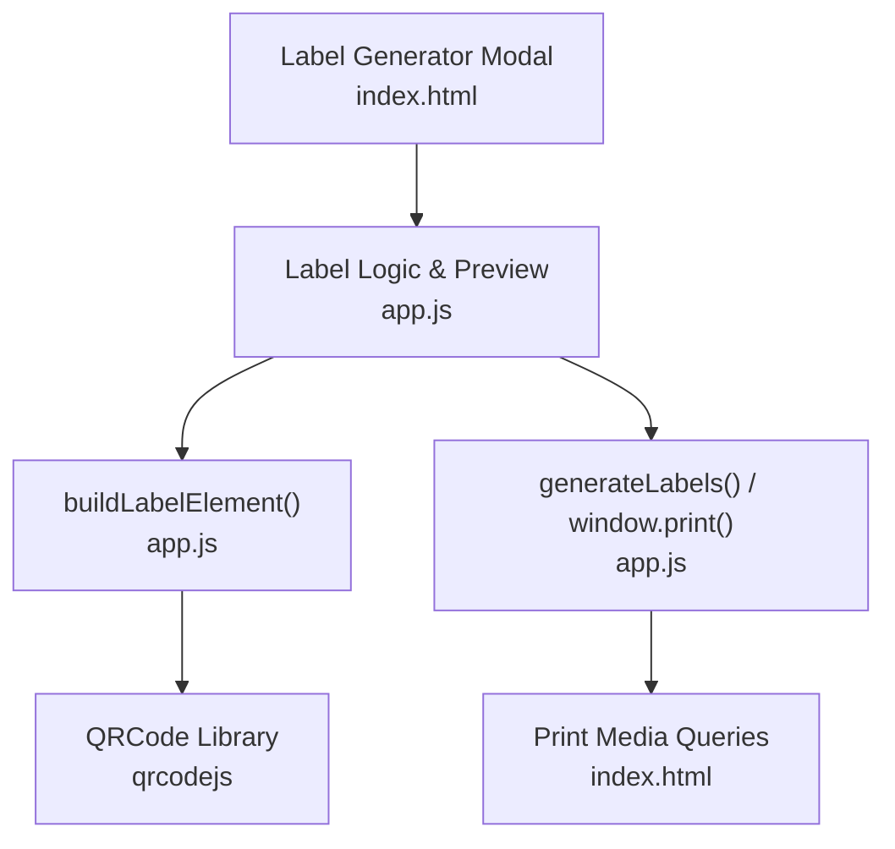
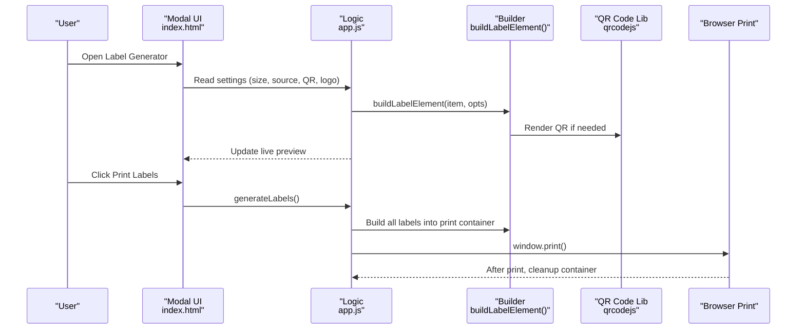
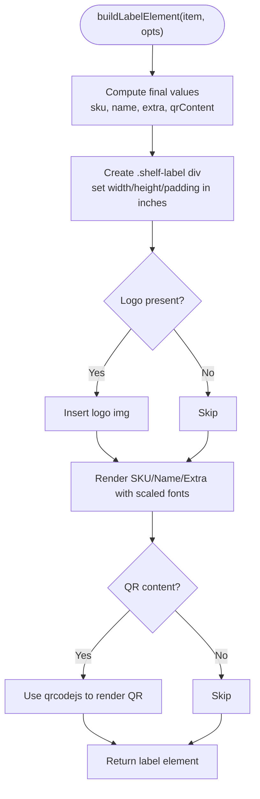
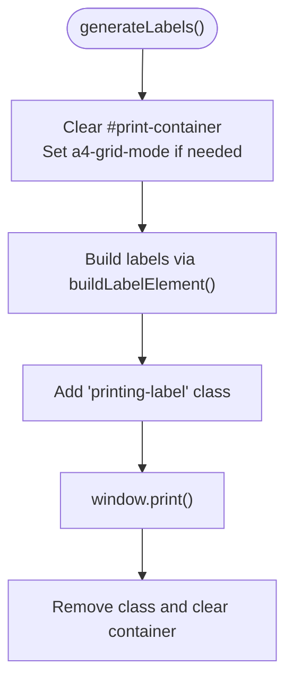
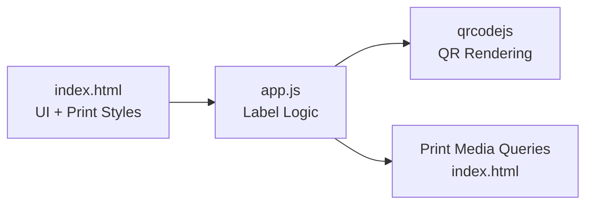

# Label Generation System

<cite>
**Referenced Files in This Document**
- [index.html](file://index.html)
- [app.js](file://app.js)
- [README.md](file://README.md)
</cite>

## Table of Contents
1. [Introduction](#introduction)
2. [Project Structure](#project-structure)
3. [Core Components](#core-components)
4. [Architecture Overview](#architecture-overview)
5. [Detailed Component Analysis](#detailed-component-analysis)
6. [Dependency Analysis](#dependency-analysis)
7. [Performance Considerations](#performance-considerations)
8. [Troubleshooting Guide](#troubleshooting-guide)
9. [Conclusion](#conclusion)

## Introduction
This document explains the label generation and printing system used by the application for creating shelf labels with QR codes, logo support, and print optimization. It covers:
- The label designer interface for single-item or bulk label creation
- Customizable sizes (4x2", 2x1", A4 grid, custom dimensions)
- QR code integration for product identification, datasheet URLs, and custom content
- Print optimization using CSS media queries and grid layout for sheet printing
- Logo upload, template customization, and live preview
- Printing workflow and browser print dialog integration
- Troubleshooting guidance for printer-specific issues
- Common configurations and best practices for optimal print quality

## Project Structure
The label system is implemented as part of the main application UI and logic:
- index.html defines the modal-based label generator UI, print container, and print-related styles
- app.js implements label size presets, DOM-based label building, QR rendering, preview, and print triggers
- README.md provides general project context

**Diagram sources**
- [index.html:944-1057](file://index.html#L944-L1057)
- [app.js:1099-1258](file://app.js#L1099-L1258)
- [index.html:246-304](file://index.html#L246-L304)

**Section sources**
- [index.html:944-1057](file://index.html#L944-L1057)
- [app.js:1099-1258](file://app.js#L1099-L1258)
- [index.html:246-304](file://index.html#L246-L304)
- [README.md:1-32](file://README.md#L1-L32)

## Core Components
- Label Designer Modal: Provides controls for size preset, custom dimensions, source selection (single or bulk), item picker, text overrides, QR source, and logo upload.
- Live Preview: Renders a real-time approximation of the label using the same builder function used for printing.
- Label Builder: Constructs a DOM node sized in inches with dynamic font scaling, optional logo, SKU/name/extra lines, and QR code.
- Print Pipeline: Populates a hidden print container, applies print-only CSS, triggers the browser print dialog, then cleans up.
- QR Integration: Uses qrcodejs to render QR codes for SKU, datasheet URL, or custom text.

Key responsibilities:
- Size management and grid mode toggling
- Template customization via logo and text overrides
- QR content selection and rendering
- Print container preparation and cleanup

**Section sources**
- [index.html:944-1057](file://index.html#L944-L1057)
- [app.js:1089-1258](file://app.js#L1089-L1258)

## Architecture Overview
The label system follows a simple client-side flow:
- User configures options in the modal
- Preview updates live using the same builder function
- On print, labels are rendered into a dedicated container
- CSS media queries hide non-print elements and format labels for output
- Browser print dialog is invoked; after completion, the container is cleared

**Diagram sources**
- [index.html:944-1057](file://index.html#L944-L1057)
- [app.js:1193-1258](file://app.js#L1193-L1258)
- [app.js:1099-1149](file://app.js#L1099-L1149)

## Detailed Component Analysis

### Label Designer Interface
- Size presets: 4x2", 2x1", A4 grid (2x1.33"), and custom width/height in inches
- Source modes: Single item (with dropdown) or Bulk (all filtered items)
- Overrides: SKU, Name, Extra line
- QR source: SKU only, Datasheet URL (if set), Custom text/URL, or None
- Logo upload: Stored locally for reuse across sessions
- Live preview: Mirrors print output using the same builder

Implementation highlights:
- getLabelSize() returns {w, h, isGrid} based on selected preset or custom inputs
- openLabelGen() initializes UI state and starts preview
- Event listeners update preview on any change

**Section sources**
- [index.html:971-1057](file://index.html#L971-L1057)
- [app.js:1089-1203](file://app.js#L1089-L1203)
- [app.js:2211-2279](file://app.js#L2211-L2279)

### Label Builder and Template Customization
- buildLabelElement() creates a label div sized in inches with proportional padding and font scaling
- Supports optional logo image at top-left
- Displays SKU, Name, and optional extra line
- Renders QR code when configured
- Returns a DOM element ready for preview or print

**Diagram sources**
- [app.js:1099-1149](file://app.js#L1099-L1149)

**Section sources**
- [app.js:1099-1149](file://app.js#L1099-L1149)

### QR Code Integration
- Supported encodings: SKU, datasheet URL (if available), or custom text/URL
- Rendering uses qrcodejs with medium error correction
- QR size adapts to label height to maintain readability

Best practices:
- Prefer short, stable identifiers (e.g., SKU) for reliable scanning
- Use HTTPS URLs for datasheets to avoid mixed-content warnings
- Avoid overly long custom strings that reduce QR density

**Section sources**
- [app.js:1115-1149](file://app.js#L1115-L1149)
- [index.html:53-56](file://index.html#L53-L56)

### Print Optimization and Grid Layout
- Print-only CSS hides UI chrome and formats labels for output
- Body class printing-label isolates print view
- For A4 grid mode, a container class enables grid layout suitable for sheet printing
- Labels use inches-based sizing for accurate physical output

Key behaviors:
- generateLabels() populates #print-container and toggles a4-grid-mode when applicable
- body.classList.add('printing-label') before printing
- Cleanup removes labels and classes after print completes

**Diagram sources**
- [app.js:1212-1258](file://app.js#L1212-L1258)
- [index.html:246-273](file://index.html#L246-L273)

**Section sources**
- [index.html:246-304](file://index.html#L246-L304)
- [app.js:1212-1258](file://app.js#L1212-L1258)

### Printing Workflow and Browser Integration
- Single-item print: Select an item in the designer or click row action to print one label
- Bulk print: Choose “Bulk — all filtered” or select multiple items and print
- After print, the system resets the print container and restores normal UI

Notes:
- Short timeout ensures QR canvases are rasterized before spooling
- Toast notifications confirm generation count

**Section sources**
- [app.js:1212-1258](file://app.js#L1212-L1258)
- [app.js:2519-2592](file://app.js#L2519-L2592)

### Logo Upload and Persistence
- Users can upload PNG/JPEG/SVG logos from the designer
- Logos are stored as data URLs in localStorage for reuse
- Clear button removes saved logo and refreshes preview

**Section sources**
- [index.html:958-969](file://index.html#L958-L969)
- [app.js:1079-1087](file://app.js#L1079-L1087)
- [app.js:2214-2230](file://app.js#L2214-L2230)

## Dependency Analysis
- UI components (modal, inputs, buttons) are defined in index.html
- Application logic resides in app.js and orchestrates:
  - State-driven preview updates
  - Label building and QR rendering
  - Print container population and cleanup
- External libraries:
  - qrcodejs for QR generation
  - Tailwind CSS for styling (not directly involved in print logic)
  - Firebase SDKs for data sync (labels themselves are client-side)

**Diagram sources**
- [index.html:944-1057](file://index.html#L944-L1057)
- [app.js:1099-1258](file://app.js#L1099-L1258)
- [index.html:246-304](file://index.html#L246-L304)
- [index.html:53-56](file://index.html#L53-L56)

**Section sources**
- [index.html:944-1057](file://index.html#L944-L1057)
- [app.js:1099-1258](file://app.js#L1099-L1258)
- [index.html:246-304](file://index.html#L246-L304)
- [index.html:53-56](file://index.html#L53-L56)

## Performance Considerations
- QR rendering cost scales with number of labels; prefer smaller sets for large batches
- A4 grid mode reduces page breaks and improves throughput for sheet printers
- Avoid excessively large logos; keep images small to minimize memory usage
- Reuse saved logos to avoid repeated uploads

[No sources needed since this section provides general guidance]

## Troubleshooting Guide
Common issues and resolutions:
- QR codes not appearing in print:
  - Ensure QR content is valid and not too long
  - Confirm qrcodejs loaded successfully
  - Allow a brief delay before printing (already handled internally)
- Incorrect label size on paper:
  - Verify printer settings: disable margins, scale to fit, and ensure units are inches
  - Test with 4x2" first; adjust custom dimensions if needed
- A4 grid misalignment:
  - Use A4 grid preset and standard 2x1.33" label sheets
  - Check browser print preview for spacing and page breaks
- Logo missing or distorted:
  - Keep logo under reasonable file size
  - Use PNG/JPEG/SVG; ensure aspect ratio fits within label width
- Bulk print performance:
  - Reduce batch size or switch to single-item prints for very large lists

**Section sources**
- [app.js:1212-1258](file://app.js#L1212-L1258)
- [index.html:246-304](file://index.html#L246-L304)

## Conclusion
The label generation system provides a flexible, client-side solution for producing high-quality shelf labels with QR codes and optional branding. Its modular design separates UI configuration, live preview, label building, and print orchestration, enabling easy customization and robust print behavior across devices and printers.

[No sources needed since this section summarizes without analyzing specific files]