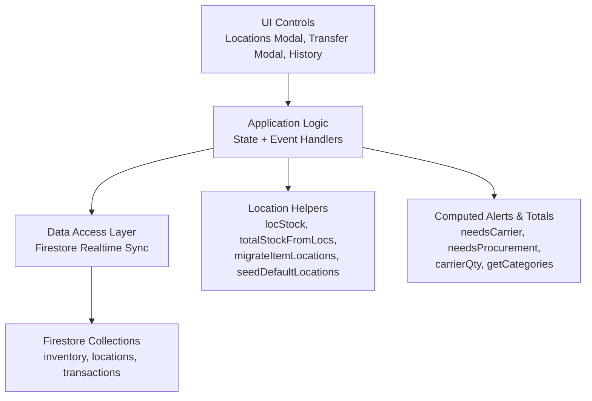
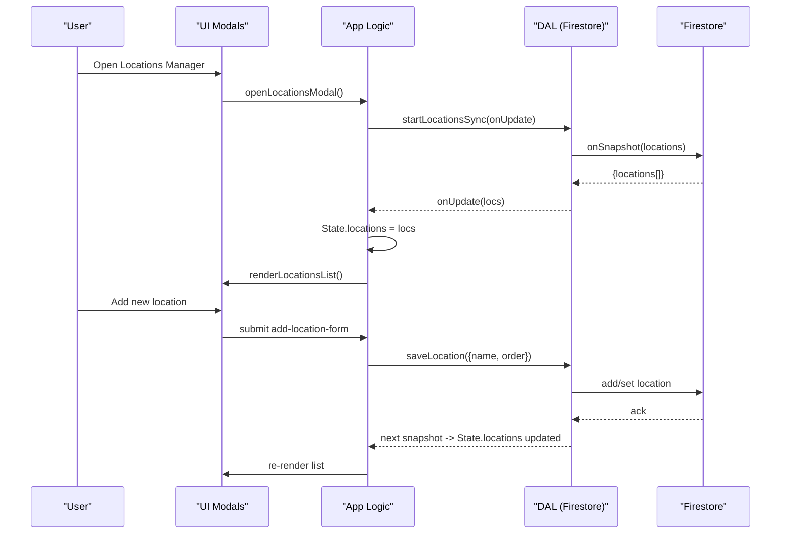
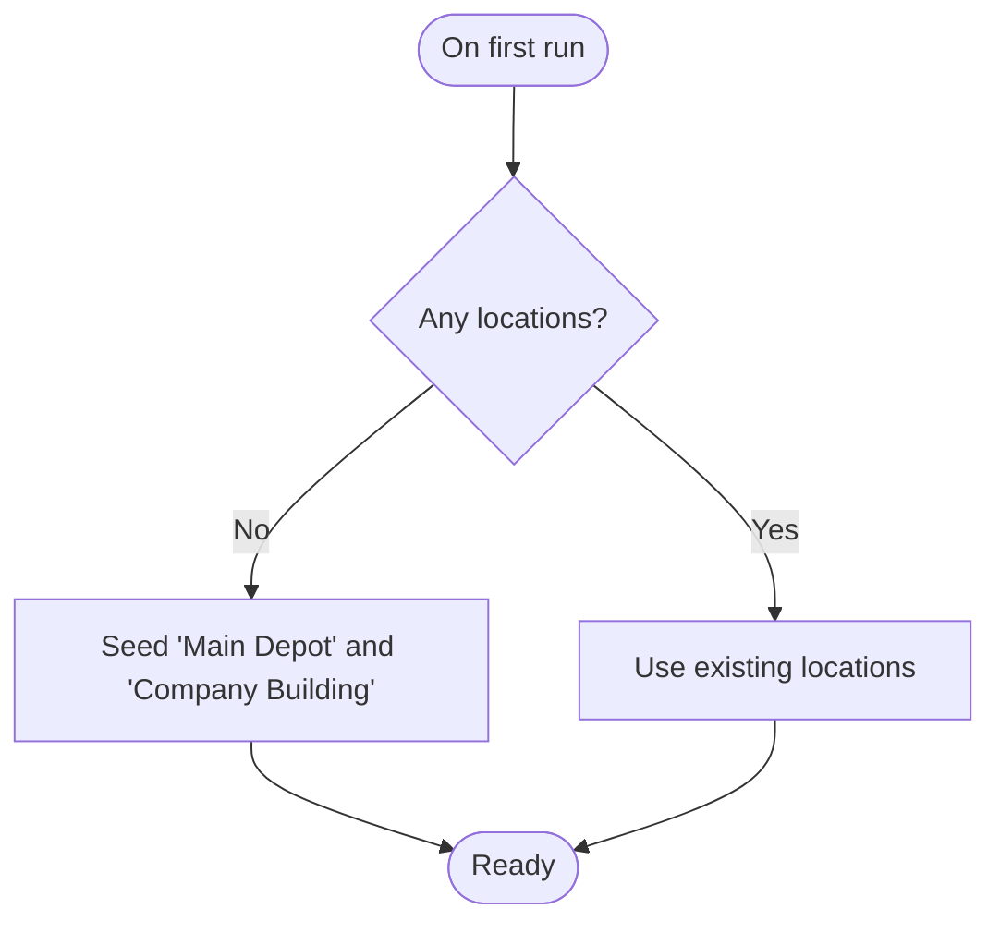
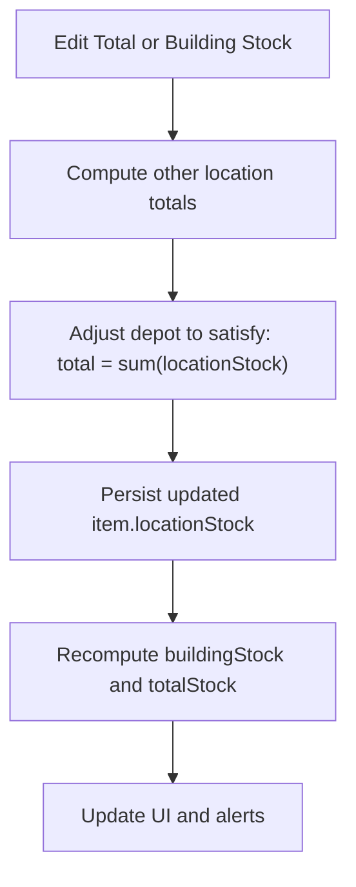
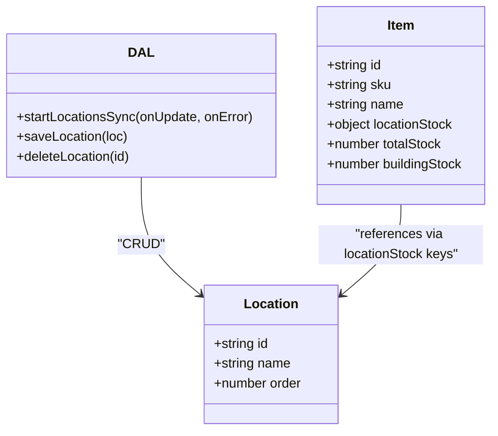
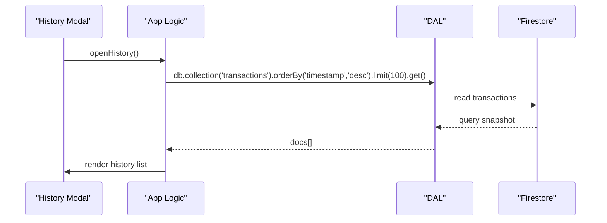
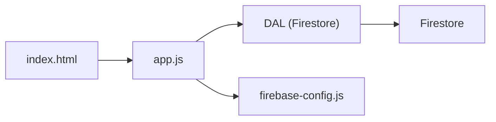

# Location Management

<cite>
**Referenced Files in This Document**
- [app.js](file://app.js)
- [index.html](file://index.html)
- [firebase-config.js](file://firebase-config.js)
- [README.md](file://README.md)
</cite>

## Table of Contents
1. [Introduction](#introduction)
2. [Project Structure](#project-structure)
3. [Core Components](#core-components)
4. [Architecture Overview](#architecture-overview)
5. [Detailed Component Analysis](#detailed-component-analysis)
6. [Dependency Analysis](#dependency-analysis)
7. [Performance Considerations](#performance-considerations)
8. [Troubleshooting Guide](#troubleshooting-guide)
9. [Conclusion](#conclusion)
10. [Appendices](#appendices)

## Introduction
This document explains Shadow Ledger’s multi-location stock management system. It covers the location architecture that supports unlimited locations with core protection for Main Depot and Company Building, per-item stock allocation across locations, automatic depot calculations using the formula: Depot Stock = Total Stock - Building Stock, inter-location transfers with availability validation, transaction logging, and real-time synchronization. It also documents location CRUD operations, order-based display sequencing, bulk operations, relationships between locations and inventory items, stock movement tracking, and reporting capabilities for location-based analytics.

## Project Structure
The application is a single-page web app with Firebase-backed persistence and real-time sync. The key files relevant to location management are:
- Application logic and state management (including DAL, locations, transfers, transactions): app.js
- UI modals and controls for Locations Manager, Transfer modal, History, Scan Out, Labels: index.html
- Firebase initialization and offline persistence: firebase-config.js
- Core business rules summary (depot calculation and alerts): README.md



**Diagram sources**
- [app.js:33-132](file://app.js#L33-L132)
- [app.js:340-380](file://app.js#L340-L380)
- [app.js:421-447](file://app.js#L421-L447)
- [index.html:1141-1207](file://index.html#L1141-L1207)
- [firebase-config.js:14-28](file://firebase-config.js#L14-L28)

**Section sources**
- [app.js:33-132](file://app.js#L33-L132)
- [index.html:1141-1207](file://index.html#L1141-L1207)
- [firebase-config.js:14-28](file://firebase-config.js#L14-L28)
- [README.md:17-23](file://README.md#L17-L23)

## Core Components
- Data Access Layer (DAL): Firestore listeners and batched writes for inventory, locations, and transactions.
- State: In-memory representation of items and locations; includes activeLocation filter and label selection set.
- Location helpers: Migration from legacy fields to per-location map, stock getters/sums, default seeding, and name lookup.
- Transfer workflow: Availability checks, atomic updates, transaction logging, and UI refresh.
- Transaction history: Read-only view of recent movements.
- Label generator and scan-out: Support for QR labels and camera-assisted stock removal.

Key responsibilities:
- Maintain per-item locationStock maps keyed by location id.
- Derive buildingStock and totalStock from locationStock.
- Enforce core location protection (Main Depot, Company Building).
- Provide real-time updates via Firestore onSnapshot.

**Section sources**
- [app.js:14-30](file://app.js#L14-L30)
- [app.js:33-132](file://app.js#L33-L132)
- [app.js:340-380](file://app.js#L340-L380)
- [app.js:358-374](file://app.js#L358-L374)

## Architecture Overview
Shadow Ledger uses a reactive architecture:
- On authentication, it starts real-time listeners for inventory and locations.
- Inventory items include a locationStock map; totals and building stock are derived.
- Locations are ordered and seeded with two core entries.
- Transfers update locationStock atomically and log transactions.
- UI components reactively re-render based on state changes.



**Diagram sources**
- [app.js:104-121](file://app.js#L104-L121)
- [app.js:241-246](file://app.js#L241-L246)
- [app.js:377-380](file://app.js#L377-L380)
- [app.js:2362-2371](file://app.js#L2362-L2371)
- [index.html:1141-1162](file://index.html#L1141-L1162)

## Detailed Component Analysis

### Location Model and Seeding
- Fixed core location ids: depot and building.
- Default locations seeded on first run if none exist.
- Each item maintains a locationStock map keyed by location id.
- Legacy migration ensures backward compatibility by deriving depot/building values into locationStock.



**Diagram sources**
- [app.js:340-341](file://app.js#L340-L341)
- [app.js:377-380](file://app.js#L377-L380)

**Section sources**
- [app.js:340-380](file://app.js#L340-L380)

### Per-Item Stock Allocation and Derived Totals
- locStock(item, locId): returns non-negative integer at a specific location.
- totalStockFromLocs(item): sums all locationStock values; used to compute total stock.
- buildingStock and depotStock are derived from locationStock for UI and alerts.
- Depot calculation rule: Depot Stock = Total Stock - Building Stock (enforced when editing total or building stock).



**Diagram sources**
- [app.js:358-368](file://app.js#L358-L368)
- [app.js:704-728](file://app.js#L704-L728)
- [app.js:778-796](file://app.js#L778-L796)

**Section sources**
- [app.js:358-368](file://app.js#L358-L368)
- [app.js:704-728](file://app.js#L704-L728)
- [app.js:778-796](file://app.js#L778-L796)

### Inter-Location Transfer Operations
- Transfer modal allows selecting source and destination locations.
- Availability validation prevents transferring more than available at source.
- Atomic update of locationStock, then recalculation of buildingStock and totalStock.
- Transaction logged with type 'transfer', including from/to locations and remaining map.
- Real-time sync updates UI immediately.

```mermaid
sequenceDiagram
participant User as "User"
participant UI as "Transfer Modal"
participant App as "App Logic"
participant DAL as "DAL"
participant FS as "Firestore"
User->>UI : Select from/to and qty
UI->>App : updateTransferAvail()
App->>App : validate qty <= source stock
User->>UI : Confirm transfer
UI->>App : confirm click handler
App->>App : newLS[from] -= qty; newLS[to] += qty
App->>DAL : saveOne(item with new locationStock)
DAL->>FS : set inventory doc
DAL->>DAL : logTransaction({type : 'transfer', from, to, ...})
FS-->>DAL : next snapshot
DAL-->>App : State.items updated
App->>UI : re-render table/dashboard
```

**Diagram sources**
- [app.js:1517-1545](file://app.js#L1517-L1545)
- [app.js:2400-2430](file://app.js#L2400-L2430)
- [app.js:124-131](file://app.js#L124-L131)

**Section sources**
- [app.js:1517-1545](file://app.js#L1517-L1545)
- [app.js:2400-2430](file://app.js#L2400-L2430)
- [app.js:124-131](file://app.js#L124-L131)

### Location CRUD Operations
- Create: Add new location via form; persisted with an order timestamp.
- Read: Real-time listener orders locations by order field; UI renders list with totals per location.
- Update: Not exposed directly; order can be adjusted by re-seeding or future enhancement.
- Delete: Non-core locations can be deleted; core locations are protected.



**Diagram sources**
- [app.js:104-121](file://app.js#L104-L121)
- [app.js:340-380](file://app.js#L340-L380)
- [app.js:358-374](file://app.js#L358-L374)

**Section sources**
- [app.js:104-121](file://app.js#L104-L121)
- [app.js:340-380](file://app.js#L340-L380)
- [app.js:358-374](file://app.js#L358-L374)

### Order Management for Display Sequencing
- Locations are stored with an order field and retrieved ordered ascending.
- New locations receive order based on current timestamp, ensuring append ordering.
- UI populates dropdowns and lists using this order.

**Section sources**
- [app.js:104-111](file://app.js#L104-L111)
- [app.js:116-117](file://app.js#L116-L117)
- [app.js:2366-2367](file://app.js#L2366-L2367)

### Bulk Location Operations
- Current implementation provides per-location add/delete.
- No explicit bulk create/update/delete for locations; however, the infrastructure supports batch operations for inventory items.
- Future enhancements could extend bulk operations to locations if needed.

[No sources needed since this section provides general guidance]

### Relationship Between Locations and Inventory Items
- Each item has a locationStock map keyed by location id.
- Summing locationStock yields totalStock; reading buildingStock uses LOC_BUILDING key.
- UI shows per-location availability in transfer dropdowns and totals in the locations manager.

**Section sources**
- [app.js:358-368](file://app.js#L358-L368)
- [app.js:1523-1531](file://app.js#L1523-L1531)
- [app.js:1495-1510](file://app.js#L1495-L1510)

### Stock Movement Tracking and Reporting
- Transactions collection stores scan-out and transfer events with user context and timestamps.
- History modal reads recent transactions ordered by timestamp.
- Reports can be built by querying transactions filtered by itemId, type, date range, or user.



**Diagram sources**
- [app.js:1440-1476](file://app.js#L1440-L1476)
- [app.js:124-131](file://app.js#L124-L131)

**Section sources**
- [app.js:1440-1476](file://app.js#L1440-L1476)
- [app.js:124-131](file://app.js#L124-L131)

### Location-Based Analytics and Alerts
- Dashboard computes carrier and procurement alerts based on thresholds and derived totals.
- Alerts consider buildingStock and totalStock computed from locationStock.
- Manifest generation summarizes required transfers from depot to building.

**Section sources**
- [app.js:421-447](file://app.js#L421-L447)
- [app.js:897-958](file://app.js#L897-L958)
- [README.md:17-23](file://README.md#L17-L23)

## Dependency Analysis
- UI depends on app.js event handlers and DOM elements defined in index.html.
- app.js depends on DAL which interacts with Firestore collections: inventory, locations, transactions.
- firebase-config.js initializes Firebase services and enables offline persistence.



**Diagram sources**
- [index.html:1215-1219](file://index.html#L1215-L1219)
- [app.js:33-132](file://app.js#L33-L132)
- [firebase-config.js:14-28](file://firebase-config.js#L14-L28)

**Section sources**
- [index.html:1215-1219](file://index.html#L1215-L1219)
- [app.js:33-132](file://app.js#L33-L132)
- [firebase-config.js:14-28](file://firebase-config.js#L14-L28)

## Performance Considerations
- Real-time listeners minimize round-trips and keep UI in sync.
- Batch writes for import/export reduce Firestore calls.
- Debounced input handling reduces excessive saves during inline edits.
- Pagination limits rendering cost for large datasets.

[No sources needed since this section provides general guidance]

## Troubleshooting Guide
- Permission denied errors: Ensure Firestore rules allow read/write for inventory, locations, and transactions.
- Unavailable errors: Check internet connectivity and Firebase service status.
- Offline behavior: Persistence is enabled; changes queue and sync when online.
- Core location deletion blocked: Attempting to delete Main Depot or Company Building will show an error toast.

**Section sources**
- [app.js:55-79](file://app.js#L55-L79)
- [app.js:2378-2382](file://app.js#L2378-L2382)
- [firebase-config.js:20-28](file://firebase-config.js#L20-L28)

## Conclusion
Shadow Ledger’s location management system provides a robust, scalable foundation for multi-location stock control. With core location protection, per-item allocation, automatic depot calculations, validated transfers, transaction logging, and real-time synchronization, it supports accurate inventory tracking and actionable analytics. The design is extensible for additional reporting and bulk operations while maintaining simplicity and performance.

## Appendices

### Key Formulas and Rules
- Depot Stock = Total Stock - Building Stock
- Total Stock = sum(locationStock across all locations)
- Carrier Alert triggers when buildingStock ≤ carrierTrigger
- Procurement Alert triggers when totalStock ≤ purchasingTrigger

**Section sources**
- [README.md:17-23](file://README.md#L17-L23)
- [app.js:358-368](file://app.js#L358-L368)
- [app.js:421-447](file://app.js#L421-L447)