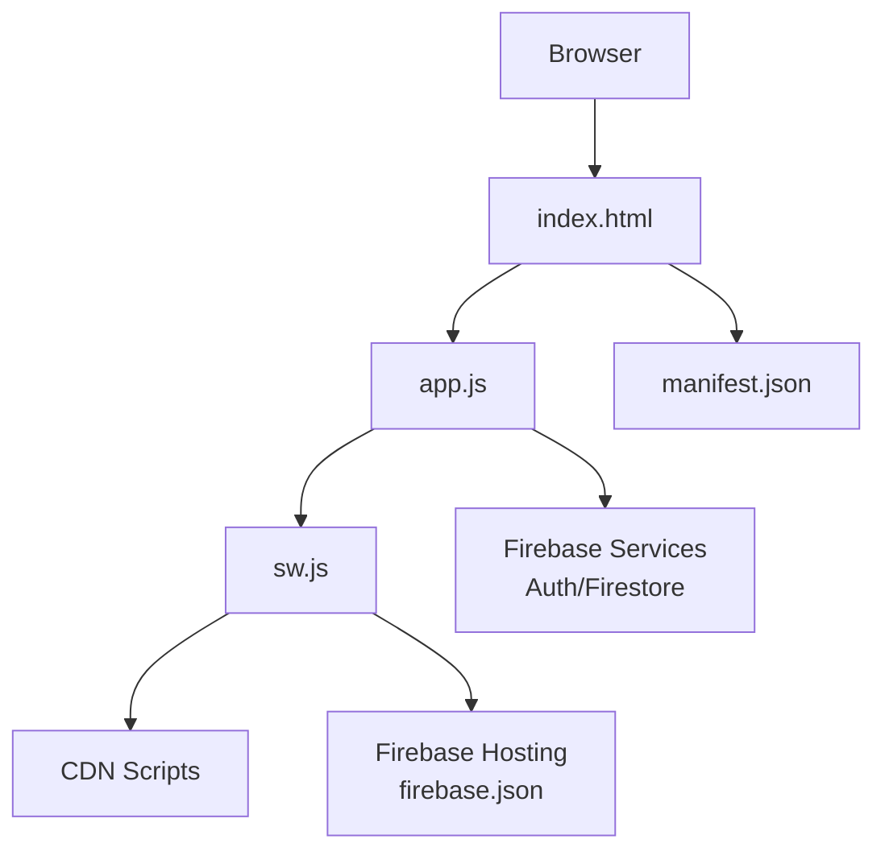
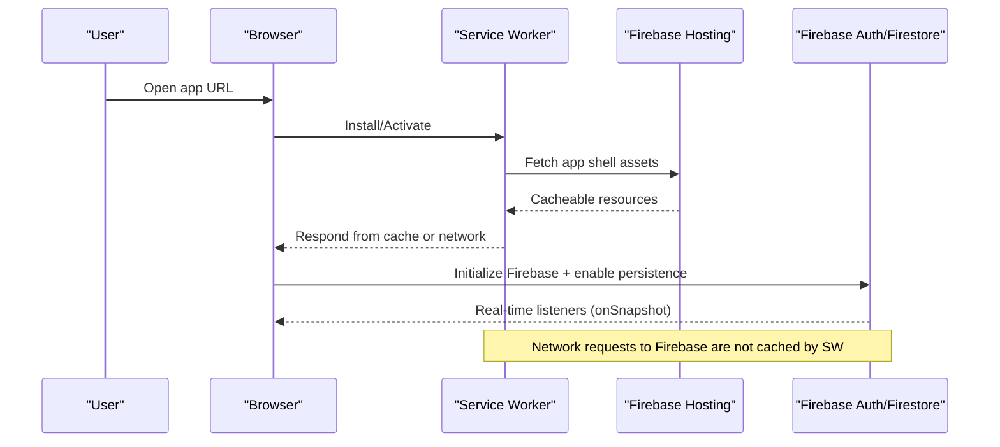
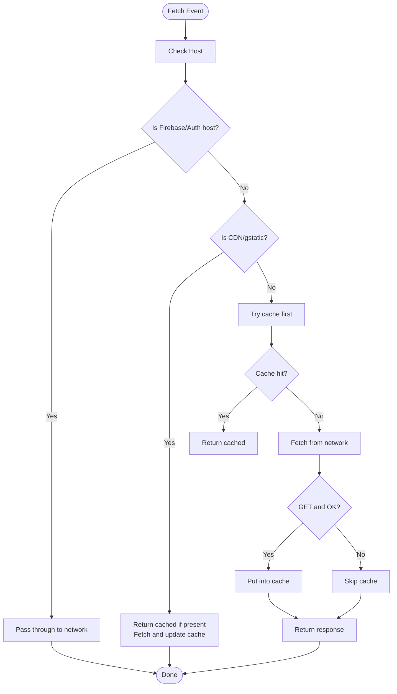
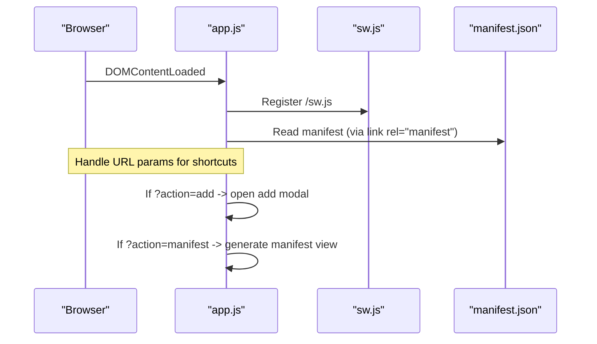
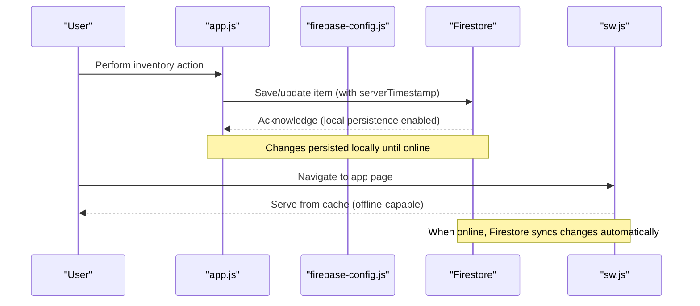
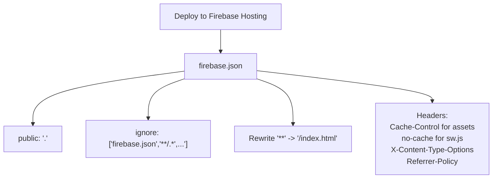
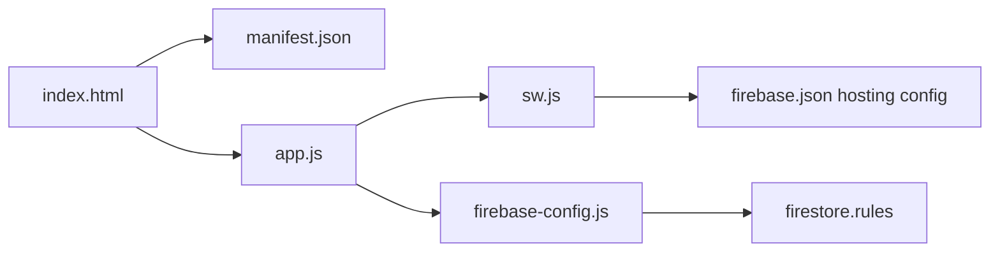

# Progressive Web App Features

<cite>
**Referenced Files in This Document**
- [sw.js](file://sw.js)
- [manifest.json](file://manifest.json)
- [firebase.json](file://firebase.json)
- [index.html](file://index.html)
- [app.js](file://app.js)
- [firebase-config.js](file://firebase-config.js)
- [firestore.rules](file://firestore.rules)
</cite>

## Table of Contents
1. [Introduction](#introduction)
2. [Project Structure](#project-structure)
3. [Core Components](#core-components)
4. [Architecture Overview](#architecture-overview)
5. [Detailed Component Analysis](#detailed-component-analysis)
6. [Dependency Analysis](#dependency-analysis)
7. [Performance Considerations](#performance-considerations)
8. [Troubleshooting Guide](#troubleshooting-guide)
9. [Conclusion](#conclusion)
10. [Appendices](#appendices)

## Introduction
This document explains the Progressive Web App (PWA) implementation for Shadow Ledger, focusing on:
- Service worker caching strategies (cache-first and network-first)
- PWA manifest configuration (icons, shortcuts, installability)
- Offline functionality for inventory access and data synchronization when connectivity is restored
- Performance optimizations and caching strategies for large datasets
- Testing procedures for PWA features
- Deployment configuration in firebase.json with security headers and rewrites

## Project Structure
The repository contains a minimal, single-page PWA with Firebase integration:
- Application shell and UI: index.html
- Client logic and service worker registration: app.js
- Service worker: sw.js
- PWA manifest: manifest.json
- Firebase configuration and offline persistence: firebase-config.js
- Hosting configuration and security headers: firebase.json
- Firestore security rules: firestore.rules

**Diagram sources**
- [index.html:1-120](file://index.html#L1-L120)
- [app.js:2679-2696](file://app.js#L2679-L2696)
- [sw.js:1-88](file://sw.js#L1-L88)
- [manifest.json:1-50](file://manifest.json#L1-L50)
- [firebase.json:1-55](file://firebase.json#L1-L55)

**Section sources**
- [index.html:1-120](file://index.html#L1-L120)
- [app.js:2679-2696](file://app.js#L2679-L2696)
- [sw.js:1-88](file://sw.js#L1-L88)
- [manifest.json:1-50](file://manifest.json#L1-L50)
- [firebase.json:1-55](file://firebase.json#L1-L55)

## Core Components
- Service Worker (sw.js): Implements cache-first for app shell and stale-while-revalidate for CDN assets; excludes Firebase API requests from caching to ensure live auth and data.
- Manifest (manifest.json): Defines app identity, icons, theme colors, display mode, and shortcuts for quick actions.
- Hosting (firebase.json): Configures SPA rewrite, HTTP headers for caching and security, and ignores non-production files.
- App Shell (index.html): Registers the service worker, includes manifest, sets meta tags for mobile/web-app behavior, and defines CSP.
- Application Logic (app.js): Registers the service worker, initializes Firebase, enables offline persistence, and handles real-time sync.
- Firebase Configuration (firebase-config.js): Initializes Firebase and enables Firestore offline persistence across tabs.
- Security Rules (firestore.rules): Enforces per-user ownership and read/write permissions.

**Section sources**
- [sw.js:1-88](file://sw.js#L1-L88)
- [manifest.json:1-50](file://manifest.json#L1-L50)
- [firebase.json:1-55](file://firebase.json#L1-L55)
- [index.html:1-120](file://index.html#L1-L120)
- [app.js:2679-2696](file://app.js#L2679-L2696)
- [firebase-config.js:1-29](file://firebase-config.js#L1-L29)
- [firestore.rules:1-46](file://firestore.rules#L1-L46)

## Architecture Overview
The PWA architecture combines an application shell cached by the service worker with real-time data from Firebase. The service worker ensures fast cold starts and resilience, while Firebase provides live synchronization and offline persistence.

**Diagram sources**
- [sw.js:16-39](file://sw.js#L16-L39)
- [sw.js:41-87](file://sw.js#L41-L87)
- [app.js:2679-2696](file://app.js#L2679-L2696)
- [firebase-config.js:14-28](file://firebase-config.js#L14-L28)

## Detailed Component Analysis

### Service Worker (sw.js)
The service worker implements three key behaviors:
- Install phase: Pre-caches the application shell assets using a versioned cache. If any asset fails, it falls back to adding each resource individually so one failure does not block installation. It then skips waiting to activate immediately.
- Activate phase: Deletes old caches that do not match the current version and claims existing clients to apply the new service worker without requiring a full reload.
- Fetch strategy:
  - Excludes Firebase domains from caching to ensure authentication and data integrity.
  - Applies stale-while-revalidate for CDN scripts: returns cached response immediately if available and updates the cache in the background.
  - Uses cache-first for app shell: serves from cache and fetches from network to update cache for GET responses; provides an offline fallback returning index.html for navigation requests.

**Diagram sources**
- [sw.js:41-87](file://sw.js#L41-L87)

**Section sources**
- [sw.js:16-29](file://sw.js#L16-L29)
- [sw.js:31-39](file://sw.js#L31-L39)
- [sw.js:41-87](file://sw.js#L41-L87)

### PWA Manifest (manifest.json)
The manifest configures:
- App identity: name, short_name, description, start_url, scope, display mode, orientation, language, direction.
- Theme and appearance: background_color, theme_color.
- Icons: multiple sizes and SVG for maskable icons.
- Shortcuts: “Add Item” and “Carrier Manifest” with URLs containing action parameters.
- Installability settings: categories and preference flags.

These settings enable installation prompts and provide quick-launch entry points that integrate with the app’s routing via query parameters.

**Section sources**
- [manifest.json:1-50](file://manifest.json#L1-L50)

### App Shell Registration and Shortcuts (index.html and app.js)
- index.html registers the manifest and includes meta tags for mobile web app capabilities and content security policy.
- app.js registers the service worker during DOMContentLoaded and handles PWA shortcut parameters (?action=add, ?action=manifest) to open specific modals after a short delay.

**Diagram sources**
- [index.html:10-18](file://index.html#L10-L18)
- [app.js:2679-2696](file://app.js#L2679-L2696)
- [manifest.json:34-47](file://manifest.json#L34-L47)

**Section sources**
- [index.html:10-18](file://index.html#L10-L18)
- [app.js:2679-2696](file://app.js#L2679-L2696)

### Offline Functionality and Data Synchronization
- Service worker offline support:
  - Caches app shell for instant load and offline availability.
  - Provides a navigation fallback to index.html when offline.
- Firebase offline persistence:
  - Enables Firestore persistence across tabs, allowing reads/writes when offline and syncing when connectivity is restored.
- Online/offline indicator:
  - The app listens to navigator.onLine events to show/hide an offline indicator.

**Diagram sources**
- [sw.js:70-87](file://sw.js#L70-L87)
- [firebase-config.js:20-28](file://firebase-config.js#L20-L28)
- [app.js:307-316](file://app.js#L307-L316)

**Section sources**
- [sw.js:70-87](file://sw.js#L70-L87)
- [firebase-config.js:20-28](file://firebase-config.js#L20-L28)
- [app.js:307-316](file://app.js#L307-L316)

### Background Sync Capabilities
There is no explicit use of the Background Sync API in this codebase. Offline operations rely on:
- Firestore offline persistence for local writes and automatic synchronization when connectivity is restored.
- Service worker caching for app shell and CDN assets.

If future requirements demand explicit background tasks (e.g., retrying failed uploads), consider implementing the Background Sync API in the service worker.

[No sources needed since this section summarizes current state]

### Deployment Configuration (firebase.json)
- Hosting public directory set to the project root.
- Ignore patterns exclude configuration and test files from deployment.
- Rewrites route all paths to index.html for SPA routing.
- Headers:
  - Static assets (html/js/css) get a 1-hour cache-control.
  - Service worker has no-cache to ensure fresh updates.
  - Global security headers include X-Content-Type-Options and Referrer-Policy.
- Firestore rules file reference included.

**Diagram sources**
- [firebase.json:1-55](file://firebase.json#L1-L55)

**Section sources**
- [firebase.json:1-55](file://firebase.json#L1-L55)

## Dependency Analysis
The following diagram shows how core components depend on each other:

**Diagram sources**
- [index.html:10-18](file://index.html#L10-L18)
- [app.js:2679-2696](file://app.js#L2679-L2696)
- [sw.js:1-88](file://sw.js#L1-L88)
- [firebase-config.js:1-29](file://firebase-config.js#L1-L29)
- [firestore.rules:1-46](file://firestore.rules#L1-L46)
- [firebase.json:1-55](file://firebase.json#L1-L55)

**Section sources**
- [index.html:10-18](file://index.html#L10-L18)
- [app.js:2679-2696](file://app.js#L2679-L2696)
- [sw.js:1-88](file://sw.js#L1-L88)
- [firebase-config.js:1-29](file://firebase-config.js#L1-L29)
- [firestore.rules:1-46](file://firestore.rules#L1-L46)
- [firebase.json:1-55](file://firebase.json#L1-L55)

## Performance Considerations
- Application shell caching:
  - Cache-first strategy ensures fast initial loads and offline availability for core assets.
  - Versioned cache allows clean upgrades and cleanup of old caches.
- CDN assets:
  - Stale-while-revalidate reduces latency by serving cached versions while updating in the background.
- Firebase requests:
  - Excluded from caching to maintain data integrity and authentication state.
- Firestore offline persistence:
  - Reduces network calls and improves responsiveness when offline; syncs automatically when online.
- Large dataset considerations:
  - Pagination in the UI limits DOM size.
  - Consider chunked imports and virtualization for very large inventories.
  - Avoid caching large dynamic JSON payloads in the service worker unless necessary; prefer client-side pagination and Firestore queries.

[No sources needed since this section provides general guidance]

## Troubleshooting Guide
- Service worker not updating:
  - Ensure sw.js is served with no-cache header and that the cache version changes when you deploy.
  - Verify activation cleans up old caches and claims clients.
- Offline navigation fallback:
  - Confirm the service worker returns index.html for navigation requests when offline.
- Firebase offline persistence warnings:
  - Multiple tabs may prevent persistence; check console warnings and adjust usage accordingly.
- CORS and CSP issues:
  - Validate Content-Security-Policy directives in index.html allow required CDNs and Firebase endpoints.
- Hosting headers:
  - Confirm firebase.json headers are applied correctly and that static assets have appropriate cache-control values.

**Section sources**
- [sw.js:31-39](file://sw.js#L31-L39)
- [sw.js:70-87](file://sw.js#L70-L87)
- [firebase-config.js:20-28](file://firebase-config.js#L20-L28)
- [index.html:19-37](file://index.html#L19-L37)
- [firebase.json:17-49](file://firebase.json#L17-L49)

## Conclusion
Shadow Ledger’s PWA leverages a robust service worker strategy to cache the application shell and CDN assets, while relying on Firebase for real-time data and offline persistence. The manifest enables installation and shortcuts, and firebase.json configures secure and performant hosting. Together, these components deliver a responsive, resilient inventory management experience that works well both online and offline.

[No sources needed since this section summarizes without analyzing specific files]

## Appendices

### Testing Procedures for PWA Features
- Service worker caching:
  - Use browser DevTools Application tab to inspect caches and verify cache-first and stale-while-revalidate behavior.
  - Toggle offline mode to confirm navigation fallback and app shell availability.
- Manifest and installability:
  - Check Lighthouse PWA audit for installability criteria (icons, manifest fields, theme color).
  - Test shortcuts by launching from home screen and verifying URL parameters trigger correct modals.
- Offline persistence:
  - Make changes offline and reconnect to verify automatic synchronization.
- Hosting configuration:
  - Inspect network headers to confirm cache-control and security headers are applied.
  - Verify SPA routing via rewrites.

[No sources needed since this section provides general guidance]