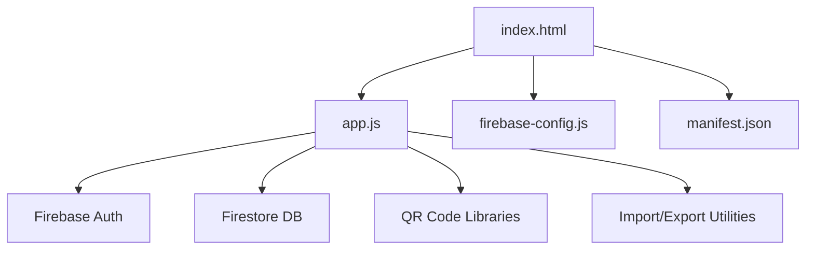
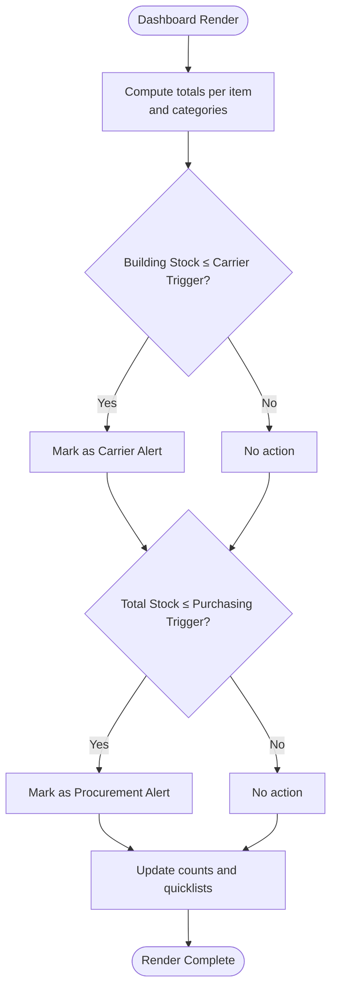
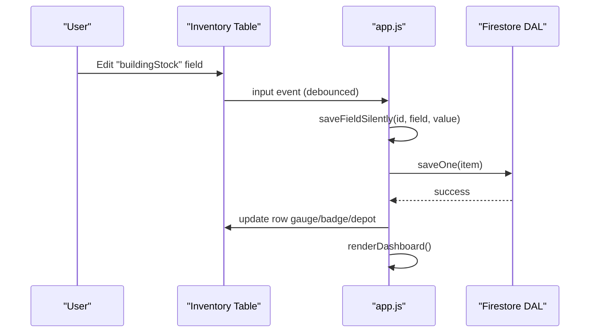
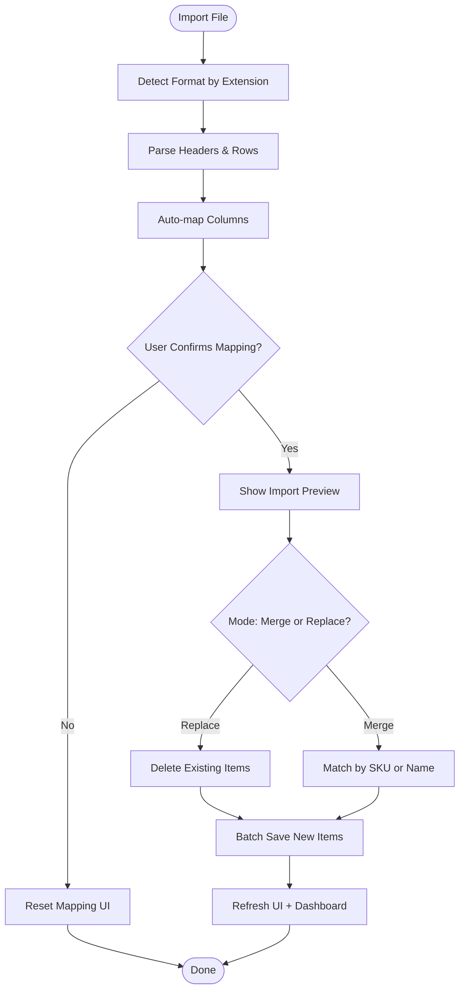
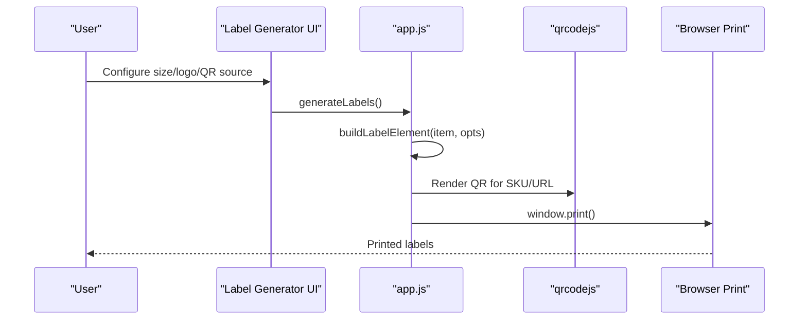
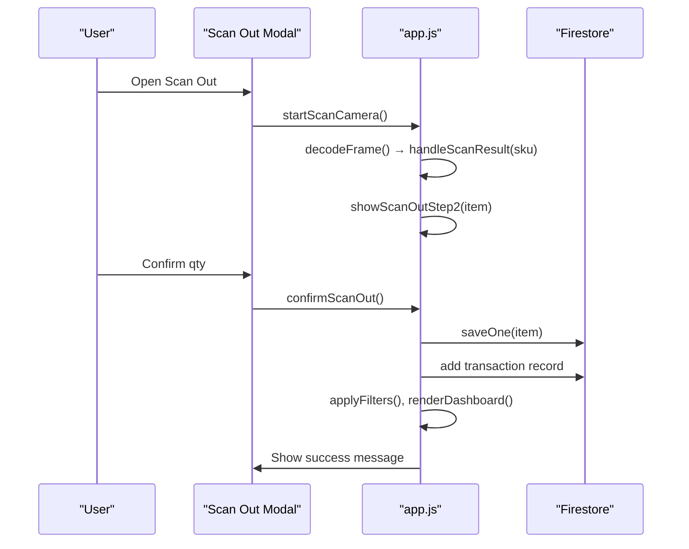
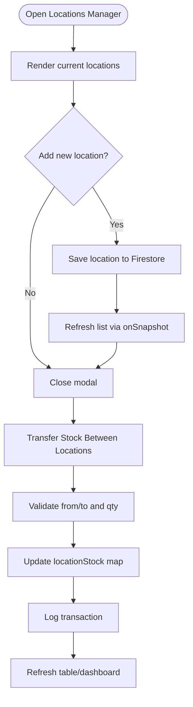
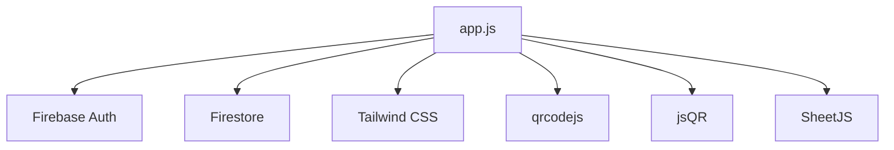

# Project Overview

<cite>
**Referenced Files in This Document**
- [README.md](file://README.md)
- [index.html](file://index.html)
- [app.js](file://app.js)
- [firebase-config.js](file://firebase-config.js)
- [manifest.json](file://manifest.json)
- [test.csv](file://test.csv)
</cite>

## Table of Contents
1. [Introduction](#introduction)
2. [Project Structure](#project-structure)
3. [Core Components](#core-components)
4. [Architecture Overview](#architecture-overview)
5. [Detailed Component Analysis](#detailed-component-analysis)
6. [Dependency Analysis](#dependency-analysis)
7. [Performance Considerations](#performance-considerations)
8. [Troubleshooting Guide](#troubleshooting-guide)
9. [Conclusion](#conclusion)
10. [Appendices](#appendices)

## Introduction
Shadow Ledger (St3s) is a lightweight, mobile-first inventory tracking system designed to manage stock across two primary locations: Main Depot and Company Building. It provides a real-time dashboard with intelligent alerting for carrier transfers and procurement needs, multi-format import/export, QR code integration for labels and scanning, and a responsive interface suitable for desktop and mobile use. The application uses Firebase Authentication and Firestore for secure, synchronized data access, while maintaining an offline-first experience through persistence and local state management.

Key terminology used throughout the application includes:
- Carrier alerts: triggered when building stock falls at or below the carrier trigger threshold, indicating a need to transfer stock from the depot.
- Procurement alerts: triggered when total stock across all locations falls at or below the purchasing trigger threshold, indicating a need to order more stock.
- Depot calculations: derived as the difference between total stock and building stock; represents available stock at the depot.
- Location-based stock tracking: supports multiple named locations beyond the core two, with totals computed as the sum across all locations.

This overview explains both conceptual workflows for beginners and technical details for developers, including practical examples such as daily stock checks, new item onboarding, and label generation workflows.

**Section sources**
- [README.md:1-32](file://README.md#L1-L32)
- [index.html:1-1220](file://index.html#L1-L1220)
- [app.js:1-2699](file://app.js#L1-L2699)
- [firebase-config.js:1-29](file://firebase-config.js#L1-L29)
- [manifest.json:1-50](file://manifest.json#L1-L50)

## Project Structure
The project is organized as a single-page web application with minimal files:
- index.html: UI shell, modals, styles, and script references
- app.js: Application logic, state management, event handling, and integrations
- firebase-config.js: Firebase initialization and global db/auth references
- manifest.json: PWA metadata and shortcuts
- test.csv: Sample CSV file demonstrating import format expectations



**Diagram sources**
- [index.html:1-1220](file://index.html#L1-L1220)
- [app.js:1-2699](file://app.js#L1-L2699)
- [firebase-config.js:1-29](file://firebase-config.js#L1-L29)
- [manifest.json:1-50](file://manifest.json#L1-L50)

**Section sources**
- [index.html:1-1220](file://index.html#L1-L1220)
- [app.js:1-2699](file://app.js#L1-L2699)
- [firebase-config.js:1-29](file://firebase-config.js#L1-L29)
- [manifest.json:1-50](file://manifest.json#L1-L50)

## Core Components
- Real-time Dashboard: Displays summary metrics and quick lists for carrier and procurement alerts.
- Inventory Table: Searchable, sortable, with inline editing and keyboard-friendly inputs.
- Alert System: Intelligent triggers for carrier and procurement based on thresholds.
- Import/Export: Multi-format support (CSV, TSV, JSON, Excel), column mapping, merge/replace modes.
- Label Generator: Print shelf labels with SKU and optional datasheet URL QR codes.
- Scan Out: Camera-based QR scanning to decrement building stock and log transactions.
- Locations Manager: Define and manage multiple stock locations; core defaults seeded automatically.
- Transfer Modal: Move stock between locations with validation and transaction logging.
- Transaction History: View recent scan-out and transfer events.

These components are implemented in app.js and wired up via DOM elements defined in index.html.

**Section sources**
- [app.js:1-2699](file://app.js#L1-L2699)
- [index.html:1-1220](file://index.html#L1-L1220)

## Architecture Overview
Shadow Ledger follows a client-side architecture with Firebase-backed real-time synchronization:
- UI Layer: HTML/CSS/Tailwind with modals and responsive design
- State Management: In-memory state with migration helpers and location-aware stock maps
- Data Access Layer (DAL): Firestore listeners and batch operations
- Integrations: Firebase Auth, Firestore, QR libraries, SheetJS for Excel, jsQR for camera decoding

```mermaid
graph TB
subgraph "UI"
UI["index.html<br/>Modals, Tables, Filters"]
end
subgraph "App Logic"
App["app.js<br/>State, DAL, Events"]
end
subgraph "Backend"
Auth["Firebase Auth"]
DB["Firestore"]
end
subgraph "Libraries"
QR["qrcodejs / jsQR"]
XLSX["SheetJS"]
end
UI --> App
App --> Auth
App --> DB
App --> QR
App --> XLSX
```

**Diagram sources**
- [index.html:1-1220](file://index.html#L1-L1220)
- [app.js:1-2699](file://app.js#L1-L2699)
- [firebase-config.js:1-29](file://firebase-config.js#L1-L29)

## Detailed Component Analysis

### Real-time Dashboard and Alerts
The dashboard summarizes inventory counts and highlights items requiring attention:
- Carrier alerts: Items where building stock is at or below the carrier trigger.
- Procurement alerts: Items where total stock across all locations is at or below the purchasing trigger.

Computed helpers calculate depot stock and alert conditions, updating the UI in real time via Firestore listeners.



**Diagram sources**
- [app.js:421-447](file://app.js#L421-L447)
- [app.js:622-661](file://app.js#L622-L661)

**Section sources**
- [app.js:421-447](file://app.js#L421-L447)
- [app.js:622-661](file://app.js#L622-L661)

### Inventory Table and Inline Editing
The table supports:
- Sorting by columns (SKU, name, category, total, building, depot)
- Filtering by search text, category, alert type, and stock presence
- Inline numeric edits with debounced saves and Enter-key navigation
- Quick ±1 buttons for rapid adjustments

Editing behavior ensures depot recalculates when total stock changes, preserving building stock and other locations.



**Diagram sources**
- [app.js:1968-2010](file://app.js#L1968-L2010)
- [app.js:698-771](file://app.js#L698-L771)
- [app.js:546-617](file://app.js#L546-L617)

**Section sources**
- [app.js:499-617](file://app.js#L499-L617)
- [app.js:698-771](file://app.js#L698-L771)
- [app.js:1968-2010](file://app.js#L1968-L2010)

### Multi-format Import/Export
Supports CSV, TSV, JSON, and Excel (.xlsx/.xls). Features include:
- Auto-detection of format by extension
- Column mapping with auto-mapping heuristics
- Preview before import
- Merge mode (update existing SKUs/names) or replace all data
- CSV export including locationStock map



**Diagram sources**
- [app.js:1642-1708](file://app.js#L1642-L1708)
- [app.js:1722-1778](file://app.js#L1722-L1778)
- [app.js:1780-1826](file://app.js#L1780-L1826)
- [app.js:1844-1863](file://app.js#L1844-L1863)

**Section sources**
- [app.js:1548-1863](file://app.js#L1548-L1863)
- [test.csv:1-4](file://test.csv#L1-L4)

### QR Code Integration and Label Generation
Label generator supports:
- Single-item or bulk selection
- Size presets (4x2, 2x1, A4 grid) and custom dimensions
- Optional logo upload persisted locally
- QR codes encoding SKU or datasheet URL
- Live preview and print-ready output



**Diagram sources**
- [index.html:944-1057](file://index.html#L944-L1057)
- [app.js:1004-1073](file://app.js#L1004-L1073)
- [app.js:1099-1149](file://app.js#L1099-L1149)
- [app.js:1212-1258](file://app.js#L1212-L1258)

**Section sources**
- [index.html:944-1057](file://index.html#L944-L1057)
- [app.js:1004-1073](file://app.js#L1004-L1073)
- [app.js:1099-1149](file://app.js#L1099-L1149)
- [app.js:1212-1258](file://app.js#L1212-L1258)

### Scan Out Workflow
Scan out allows removing stock from the building using camera QR scanning or manual SKU entry:
- Step 1: Start camera, decode QR frames, or type SKU
- Step 2: Confirm quantity to remove
- On confirm: update building stock, recalculate totals, log transaction, refresh UI



**Diagram sources**
- [index.html:1059-1124](file://index.html#L1059-L1124)
- [app.js:1264-1434](file://app.js#L1264-L1434)
- [app.js:1440-1476](file://app.js#L1440-L1476)

**Section sources**
- [index.html:1059-1124](file://index.html#L1059-L1124)
- [app.js:1264-1434](file://app.js#L1264-L1434)
- [app.js:1440-1476](file://app.js#L1440-L1476)

### Locations Manager and Transfers
Locations can be added and managed; core locations (Main Depot, Company Building) are seeded automatically. Transfers move stock between locations with validation and transaction logging.



**Diagram sources**
- [app.js:377-402](file://app.js#L377-L402)
- [app.js:1482-1511](file://app.js#L1482-L1511)
- [app.js:2400-2430](file://app.js#L2400-L2430)

**Section sources**
- [app.js:377-402](file://app.js#L377-L402)
- [app.js:1482-1511](file://app.js#L1482-L1511)
- [app.js:2400-2430](file://app.js#L2400-L2430)

### Practical Use Cases

#### Daily Stock Checks
- Open the dashboard to review carrier and procurement alerts.
- Use filters to focus on items needing attention.
- Adjust building stock quickly with ±1 buttons or inline inputs.

#### New Item Onboarding
- Click “Add Item” to open the item form.
- Fill SKU, name, category, and initial stock values.
- Set carrier trigger, max capacity, and purchasing trigger thresholds.
- Save to persist to Firestore and appear in the dashboard.

#### Label Generation Workflow
- Open “Labels” to configure size, logo, and QR content.
- Choose single item or bulk filtered items.
- Preview live and print labels with SKU and optional datasheet URL QR codes.

**Section sources**
- [index.html:369-474](file://index.html#L369-L474)
- [index.html:543-674](file://index.html#L543-L674)
- [index.html:944-1057](file://index.html#L944-L1057)
- [app.js:879-894](file://app.js#L879-L894)
- [app.js:1194-1203](file://app.js#L1194-L1203)

## Dependency Analysis
Shadow Ledger depends on:
- Firebase SDKs for authentication and Firestore
- Tailwind CSS for styling
- qrcodejs for generating QR codes
- jsQR for decoding QR codes from camera frames
- SheetJS for Excel import



**Diagram sources**
- [index.html:45-92](file://index.html#L45-L92)
- [firebase-config.js:14-29](file://firebase-config.js#L14-L29)
- [app.js:1-2699](file://app.js#L1-L2699)

**Section sources**
- [index.html:45-92](file://index.html#L45-L92)
- [firebase-config.js:14-29](file://firebase-config.js#L14-L29)
- [app.js:1-2699](file://app.js#L1-L2699)

## Performance Considerations
- Debounced inline edits reduce Firestore write frequency during typing.
- Pagination limits rendered rows to improve table performance.
- Offline persistence enabled for Firestore to maintain responsiveness during brief network interruptions.
- Preconnect hints optimize loading of external resources.

[No sources needed since this section provides general guidance]

## Troubleshooting Guide
Common issues and resolutions:
- Permission denied errors: Ensure Firestore rules allow read/write for authenticated users.
- Firebase unavailable: Check internet connectivity and service availability.
- Camera not accessible: Allow camera permissions; fallback to manual SKU entry remains available.
- Import failures: Verify headers match expected fields or use the mapping UI to align columns.

**Section sources**
- [app.js:55-79](file://app.js#L55-L79)
- [app.js:229-238](file://app.js#L229-L238)
- [app.js:1271-1288](file://app.js#L1271-L1288)
- [app.js:1699-1708](file://app.js#L1699-L1708)

## Conclusion
Shadow Ledger delivers a focused, efficient solution for managing inventory across multiple locations with real-time insights and actionable alerts. Its modular architecture, robust import/export capabilities, and integrated QR workflows make it suitable for daily operations and scalable growth. The combination of user-friendly interfaces and developer-oriented features ensures both accessibility and extensibility.

[No sources needed since this section summarizes without analyzing specific files]

## Appendices

### Configuration and Environment
- Firebase configuration is centralized in firebase-config.js and initializes auth and db globals.
- PWA manifest defines app metadata, icons, and shortcuts for quick actions like adding items or generating manifests.

**Section sources**
- [firebase-config.js:1-29](file://firebase-config.js#L1-L29)
- [manifest.json:1-50](file://manifest.json#L1-L50)