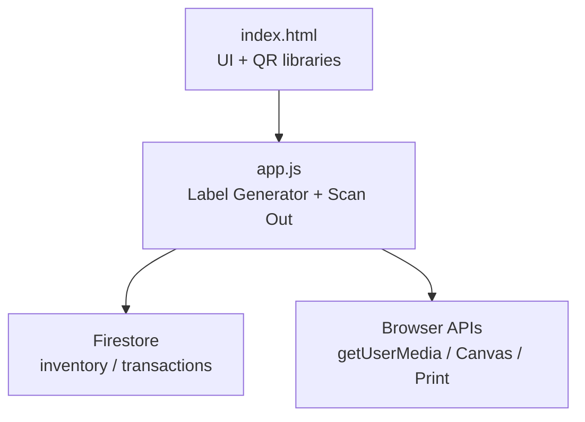
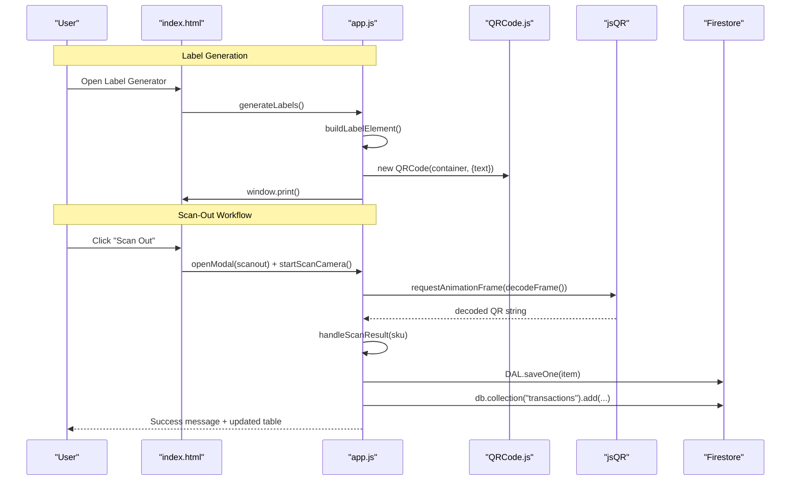
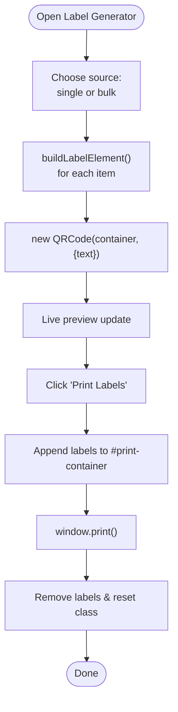
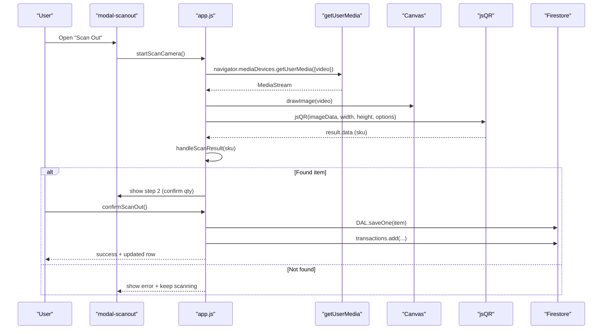
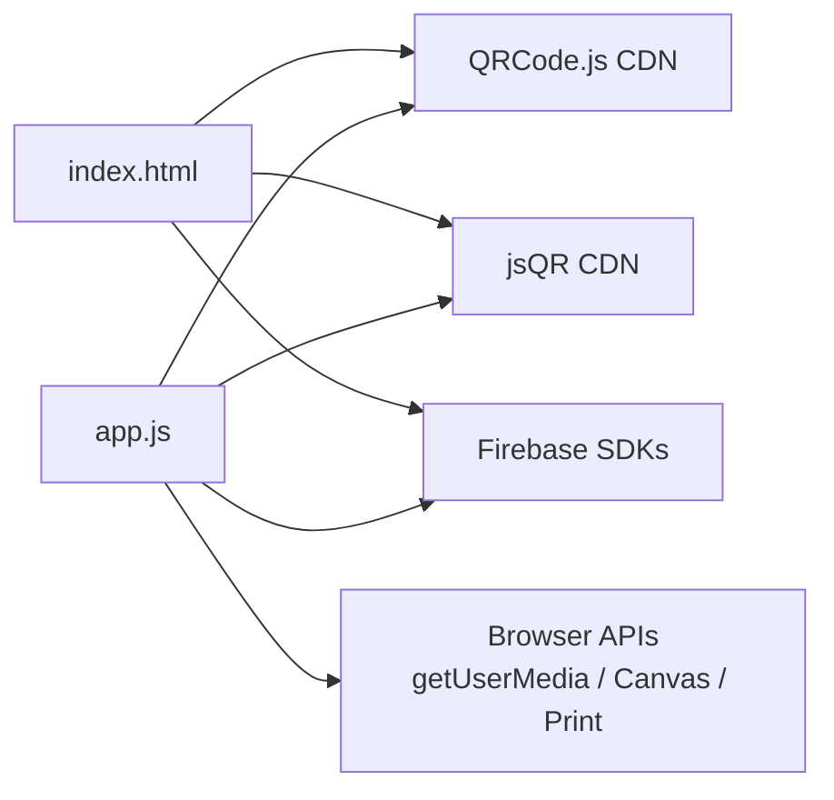

# QR Code Integration

<cite>
**Referenced Files in This Document**
- [index.html](file://index.html)
- [app.js](file://app.js)
</cite>

## Table of Contents
1. [Introduction](#introduction)
2. [Project Structure](#project-structure)
3. [Core Components](#core-components)
4. [Architecture Overview](#architecture-overview)
5. [Detailed Component Analysis](#detailed-component-analysis)
6. [Dependency Analysis](#dependency-analysis)
7. [Performance Considerations](#performance-considerations)
8. [Troubleshooting Guide](#troubleshooting-guide)
9. [Conclusion](#conclusion)

## Introduction
This document explains the QR code integration system in Shadow Ledger, covering:
- QR label generation using QRCode.js for scannable labels that encode SKU data and optional datasheet URLs or custom content.
- Camera-based QR scanning using jsQR to support stock-out operations with real-time decoding, camera permission handling, and manual SKU entry fallback.
- The scan-out workflow that reduces inventory quantities, handles errors for invalid or missing items, and logs transactions for audit trails.
- Browser compatibility considerations, performance optimizations for camera operations, and troubleshooting guidance for challenging lighting conditions.

## Project Structure
The QR features are implemented across two primary files:
- index.html: UI elements (modals, buttons, video/canvas), and CDN imports for QRCode.js and jsQR.
- app.js: Application logic for generating labels, scanning via camera, updating stock, and logging transactions.

**Diagram sources**
- [index.html:53-56](file://index.html#L53-L56)
- [app.js:1004-1073](file://app.js#L1004-L1073)
- [app.js:1264-1434](file://app.js#L1264-L1434)

**Section sources**
- [index.html:53-56](file://index.html#L53-L56)
- [index.html:944-1124](file://index.html#L944-L1124)
- [app.js:1004-1073](file://app.js#L1004-L1073)
- [app.js:1264-1434](file://app.js#L1264-L1434)

## Core Components
- Label Generator: Builds shelf labels with SKU text, optional name/category, and one or more QR codes (SKU, datasheet URL, or custom). Uses QRCode.js to render QR into DOM nodes before printing.
- Scan-Out Scanner: Opens a modal with a live camera feed, decodes QR frames using jsQR, finds the matching item by SKU, confirms quantity, updates building stock, and logs a transaction.
- Transaction History: Reads recent scan-out transactions from Firestore for auditability.

Key responsibilities:
- Generate printable labels with QR codes.
- Capture camera stream, decode QR frames, and handle user input fallback.
- Update inventory state and persist changes.
- Record audit trail entries.

**Section sources**
- [index.html:53-56](file://index.html#L53-L56)
- [index.html:944-1124](file://index.html#L944-L1124)
- [app.js:1004-1073](file://app.js#L1004-L1073)
- [app.js:1264-1434](file://app.js#L1264-L1434)
- [app.js:1440-1476](file://app.js#L1440-L1476)

## Architecture Overview
High-level flow for both label generation and scan-out:

**Diagram sources**
- [index.html:944-1124](file://index.html#L944-L1124)
- [app.js:1004-1073](file://app.js#L1004-L1073)
- [app.js:1264-1434](file://app.js#L1264-L1434)
- [app.js:1440-1476](file://app.js#L1440-L1476)

## Detailed Component Analysis

### Label Generator (QRCode.js)
Responsibilities:
- Build label DOM nodes with SKU, name, category, optional logo, and QR code container.
- Render QR codes for SKU, datasheet URL, or custom text.
- Support single-item or bulk generation and print via browser print dialog.

Implementation highlights:
- Label element creation and sizing: builds a .shelf-label node with dynamic dimensions and font scaling.
- QR rendering: instantiates QRCode with target container, text payload, size, colors, and error correction level.
- Print pipeline: populates a hidden print container, triggers window.print(), then cleans up after printing.

**Diagram sources**
- [app.js:1099-1149](file://app.js#L1099-L1149)
- [app.js:1212-1258](file://app.js#L1212-L1258)
- [app.js:1004-1073](file://app.js#L1004-L1073)

**Section sources**
- [index.html:944-1057](file://index.html#L944-L1057)
- [app.js:1004-1073](file://app.js#L1004-L1073)
- [app.js:1099-1149](file://app.js#L1099-L1149)
- [app.js:1212-1258](file://app.js#L1212-L1258)

### Scan-Out Scanner (jsQR)
Responsibilities:
- Request camera access and display a live video feed.
- Decode QR frames in real time using jsQR on canvas image data.
- Match scanned SKU to an active inventory item.
- Confirm quantity and reduce building stock; log transaction.
- Provide manual SKU entry fallback if camera is unavailable or scanning fails.

Implementation highlights:
- Camera lifecycle: start/stop camera, manage MediaStream tracks, cancel animation frame loop.
- Frame decoding: draw video to canvas, extract ImageData, call jsQR with inversion option, stop loop on first successful decode.
- Item lookup: exact case-insensitive match against non-archived items; show error if not found.
- Stock update: adjust locationStock[building], recalc totals, save to Firestore.
- Audit trail: write a transaction record with user info and timestamp.

**Diagram sources**
- [app.js:1271-1344](file://app.js#L1271-L1344)
- [app.js:1367-1420](file://app.js#L1367-L1420)
- [app.js:1440-1476](file://app.js#L1440-L1476)

**Section sources**
- [index.html:1059-1124](file://index.html#L1059-L1124)
- [app.js:1264-1434](file://app.js#L1264-L1434)
- [app.js:1440-1476](file://app.js#L1440-L1476)

### Transaction Logging
After a successful scan-out, a transaction record is written to Firestore including:
- Item identifiers (id, sku, name)
- Quantity removed
- Remaining building stock
- User identity and server timestamp

A history modal reads the last 100 transactions ordered by timestamp descending.

**Section sources**
- [app.js:1367-1420](file://app.js#L1367-L1420)
- [app.js:1440-1476](file://app.js#L1440-L1476)

## Dependency Analysis
External dependencies and their roles:
- QRCode.js: Client-side QR encoding for label generation.
- jsQR: Pure-JS QR decoding for camera-based scanning.
- Firebase SDKs: Authentication and Firestore persistence for inventory and transactions.
- Browser APIs: getUserMedia for camera, Canvas API for frame capture, window.print for label printing.

**Diagram sources**
- [index.html:48-56](file://index.html#L48-L56)
- [app.js:1271-1323](file://app.js#L1271-L1323)
- [app.js:1004-1073](file://app.js#L1004-L1073)

**Section sources**
- [index.html:48-56](file://index.html#L48-L56)
- [app.js:1271-1323](file://app.js#L1271-L1323)
- [app.js:1004-1073](file://app.js#L1004-L1073)

## Performance Considerations
- Camera decoding loop: Uses requestAnimationFrame to avoid blocking the main thread and stops immediately after a successful decode to minimize CPU usage.
- Canvas sizing: Copies current video resolution to canvas; ensure device has sufficient GPU/CPU headroom for high-resolution streams.
- QR rendering: QRCode.js renders synchronously to canvas/SVG; a short delay before printing ensures rasterization completes.
- Debounced interactions: Search and filter inputs use debounce to reduce re-renders during typing.
- Batch writes: Bulk operations use batched Firestore writes where applicable to reduce network overhead.

Practical tips:
- Prefer rear-facing camera on mobile devices for better focus and lighting.
- Avoid excessive background effects or heavy animations while scanning to keep frame rate stable.
- Use moderate label sizes when generating many labels to prevent long print spool times.

[No sources needed since this section provides general guidance]

## Troubleshooting Guide
Common issues and resolutions:
- Camera permission denied or unavailable:
  - Ensure HTTPS context and allow camera access when prompted.
  - If unavailable, use manual SKU entry fallback in the scan-out modal.
- Poor lighting or glare:
  - Improve ambient light, avoid direct flash reflection on labels.
  - Hold the device slightly further back and steady until the QR is detected.
- Slow or no decoding:
  - Close other apps to free resources.
  - Reduce screen brightness and ensure the QR fills a reasonable portion of the frame.
- Invalid or missing SKU:
  - Verify the label encodes the correct SKU without extra characters.
  - Check that the item exists and is not archived in the inventory.
- Printing artifacts:
  - Allow a brief moment after QR generation before printing.
  - Use standard label sizes and verify printer settings for black-and-white output.

Operational notes:
- Manual SKU entry fallback is available in the scan-out modal if the camera cannot be started or decoding fails.
- Error messages are displayed inline within the scan-out modal to guide users.

**Section sources**
- [index.html:1059-1124](file://index.html#L1059-L1124)
- [app.js:1271-1344](file://app.js#L1271-L1344)
- [app.js:1367-1420](file://app.js#L1367-L1420)

## Conclusion
Shadow Ledger’s QR integration combines client-side QR generation and decoding to streamline inventory labeling and stock-out workflows. QRCode.js produces scannable labels with SKU and optional datasheet URLs or custom payloads, while jsQR enables efficient camera-based scanning with robust fallbacks. The scan-out process updates inventory atomically and records transactions for full auditability. With careful attention to lighting, permissions, and performance practices, the system delivers reliable, fast operations across modern browsers.