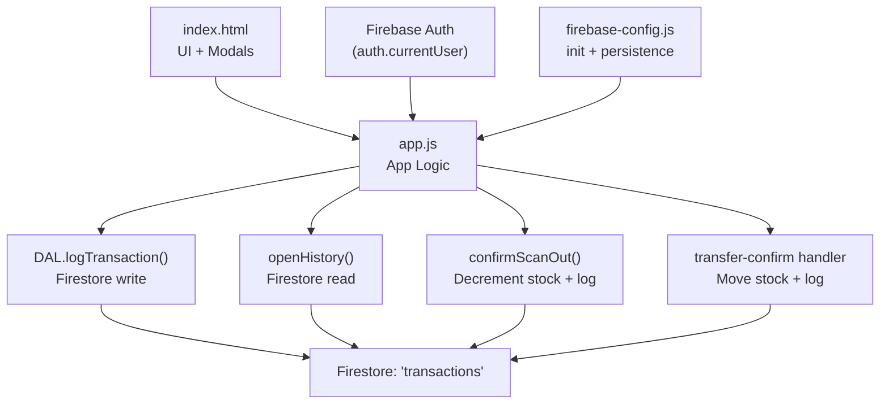
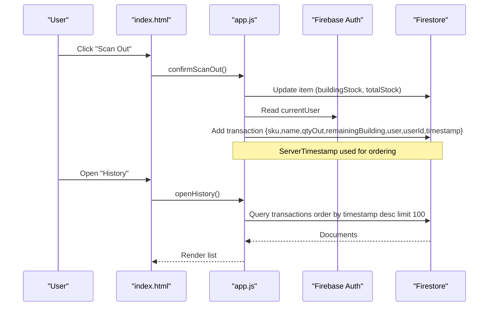
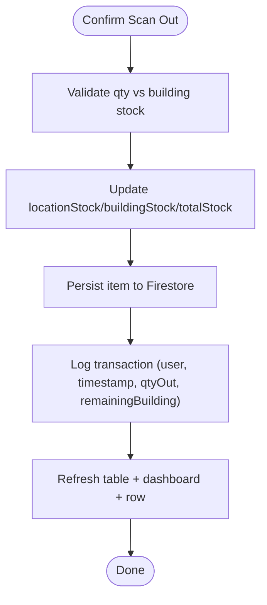
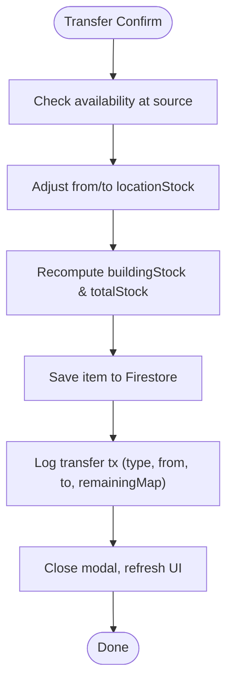
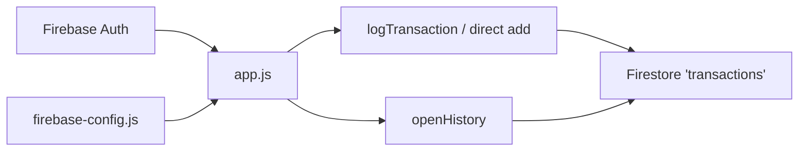

# Transaction History and Audit Trail

<cite>
**Referenced Files in This Document**
- [app.js](file://app.js)
- [index.html](file://index.html)
- [firebase-config.js](file://firebase-config.js)
- [firestore.rules](file://firestore.rules)
</cite>

## Table of Contents
1. [Introduction](#introduction)
2. [Project Structure](#project-structure)
3. [Core Components](#core-components)
4. [Architecture Overview](#architecture-overview)
5. [Detailed Component Analysis](#detailed-component-analysis)
6. [Dependency Analysis](#dependency-analysis)
7. [Performance Considerations](#performance-considerations)
8. [Troubleshooting Guide](#troubleshooting-guide)
9. [Conclusion](#conclusion)
10. [Appendices](#appendices)

## Introduction
This document explains Shadow Ledger’s transaction logging and audit trail system. It covers how stock movements are recorded, who performed them, when they occurred, and what type of operation was executed (scan-outs and transfers). It also documents the history view, data structure, security rules, export capabilities, retention considerations, and the relationship between transactions and inventory changes. The goal is to provide a clear, code-backed reference for compliance, reconciliation, and operational auditing.

## Project Structure
Shadow Ledger is a single-page web app that uses Firebase Authentication and Firestore. Transactions are stored in a dedicated Firestore collection and surfaced via a modal-based history view.

**Diagram sources**
- [app.js:124-131](file://app.js#L124-L131)
- [app.js:1390-1402](file://app.js#L1390-L1402)
- [app.js:1440-1476](file://app.js#L1440-L1476)
- [app.js:2400-2430](file://app.js#L2400-L2430)
- [index.html:1126-1139](file://index.html#L1126-L1139)
- [firebase-config.js:14-28](file://firebase-config.js#L14-L28)

**Section sources**
- [index.html:1126-1139](file://index.html#L1126-L1139)
- [app.js:124-131](file://app.js#L124-L131)
- [app.js:1390-1402](file://app.js#L1390-L1402)
- [app.js:1440-1476](file://app.js#L1440-L1476)
- [app.js:2400-2430](file://app.js#L2400-L2430)
- [firebase-config.js:14-28](file://firebase-config.js#L14-L28)

## Core Components
- Transaction logging entry points:
  - Scan-out flow writes a transaction after decrementing building stock.
  - Transfer flow writes a transaction after moving stock between locations.
- Data Access Layer (DAL):
  - Centralized method to append a transaction with user attribution and server timestamp.
- History view:
  - Modal loads recent transactions ordered by timestamp descending.
- Security:
  - Firestore rules enforce authenticated access and per-user deletion rights.

Key responsibilities:
- Record immutable audit events for stock movements.
- Attribute each event to an authenticated user.
- Provide a concise, time-ordered history for operators and auditors.

**Section sources**
- [app.js:124-131](file://app.js#L124-L131)
- [app.js:1390-1402](file://app.js#L1390-L1402)
- [app.js:1440-1476](file://app.js#L1440-L1476)
- [app.js:2400-2430](file://app.js#L2400-L2430)
- [firestore.rules:31-38](file://firestore.rules#L31-L38)

## Architecture Overview
The transaction subsystem integrates with two primary flows: scan-out and transfer. Both update inventory state first, then record an audit event. The history view reads from the same collection.

**Diagram sources**
- [app.js:1367-1420](file://app.js#L1367-L1420)
- [app.js:1440-1476](file://app.js#L1440-L1476)
- [index.html:1126-1139](file://index.html#L1126-L1139)

## Detailed Component Analysis

### Transaction Data Model
The application records two main types of operations:
- Scan-out: removal of units from building stock.
- Transfer: movement of units between locations.

Common fields captured across both operations:
- Identifier and item context: itemId, sku, name
- Quantity moved out: qtyOut
- Post-operation snapshot: remainingBuilding or remainingMap
- Attribution: user, userId
- Time: timestamp (server-side)

Operational differences:
- Scan-out includes remainingBuilding (on-hand at building).
- Transfer includes type, from, to, and remainingMap (per-location snapshot).

Notes on storage:
- Timestamps use server timestamps for consistent ordering.
- User identity is derived from the current authenticated session.

**Section sources**
- [app.js:1390-1402](file://app.js#L1390-L1402)
- [app.js:2420-2424](file://app.js#L2420-L2424)
- [app.js:124-131](file://app.js#L124-L131)

### Scan-Out Flow and Logging
The scan-out process:
- Validates quantity against available stock.
- Updates locationStock and totals.
- Persists the change.
- Logs a transaction with user attribution and server timestamp.
- Refreshes UI and row rendering.

**Diagram sources**
- [app.js:1367-1420](file://app.js#L1367-L1420)

**Section sources**
- [app.js:1367-1420](file://app.js#L1367-L1420)

### Transfer Flow and Logging
The transfer process:
- Ensures source has sufficient stock.
- Decrements source location and increments destination.
- Recomputes building stock and total.
- Persists the updated item.
- Logs a transfer transaction including from/to and remainingMap.

**Diagram sources**
- [app.js:2400-2430](file://app.js#L2400-L2430)

**Section sources**
- [app.js:2400-2430](file://app.js#L2400-L2430)

### History View Implementation
The history modal:
- Loads up to 100 most recent transactions ordered by timestamp descending.
- Displays SKU, item name, remaining building stock, operator, and formatted timestamp.
- Provides error messaging if the collection cannot be accessed.

Current capabilities:
- Recent listing with time ordering.
- No client-side filtering or sorting beyond default order.

Potential enhancements:
- Client-side filters by date range, user, or operation type.
- Pagination or infinite scroll for large histories.
- Export of filtered results.

**Section sources**
- [app.js:1440-1476](file://app.js#L1440-L1476)
- [index.html:1126-1139](file://index.html#L1126-L1139)

### Security and Access Control
Firestore rules:
- All authenticated users can read and create transactions.
- Only the creator can delete their own transaction entries.
- Inventory items are scoped per owner; transactions are not owner-scoped but include userId for traceability.

Implications:
- Operators can view all transactions once authenticated.
- Deletion is restricted to prevent tampering by non-authors.

**Section sources**
- [firestore.rules:31-38](file://firestore.rules#L31-L38)

### Relationship Between Transactions and Inventory Changes
- Every stock decrement (scan-out) or inter-location move (transfer) is followed by a transaction record.
- The transaction captures a post-change snapshot (remainingBuilding or remainingMap), enabling reconciliation without re-computation.
- Inventory updates occur before logging to ensure consistency between state and audit trail.

Consistency guarantees:
- Atomicity is not enforced across the item update and transaction insert; failures in one step may lead to divergence.
- Error handling logs warnings rather than rolling back inventory changes.

Rollback strategy:
- Not implemented automatically.
- Recommended approach: implement compensating transactions (reverse moves) and corresponding reverse logs to restore consistency.

**Section sources**
- [app.js:1367-1420](file://app.js#L1367-L1420)
- [app.js:2400-2430](file://app.js#L2400-L2430)

### Export Capabilities
- CSV export exists for inventory items, not for transactions.
- For historical analysis, consider exporting transactions directly from Firestore or implementing a client-side export function similar to the existing inventory exporter.

**Section sources**
- [app.js:1844-1863](file://app.js#L1844-L1863)

### Retention Policies
- No automatic retention or archival policy is implemented in the client.
- To manage growth and compliance, implement server-side retention (e.g., Cloud Functions or scheduled jobs) to archive or purge older transactions based on business requirements.

[No sources needed since this section provides general guidance]

## Dependency Analysis
The transaction subsystem depends on:
- Firebase Auth for user identity.
- Firestore for persistence and real-time sync.
- UI components for triggering actions and displaying history.

**Diagram sources**
- [app.js:124-131](file://app.js#L124-L131)
- [app.js:1440-1476](file://app.js#L1440-L1476)
- [firebase-config.js:14-28](file://firebase-config.js#L14-L28)

**Section sources**
- [app.js:124-131](file://app.js#L124-L131)
- [app.js:1440-1476](file://app.js#L1440-L1476)
- [firebase-config.js:14-28](file://firebase-config.js#L14-L28)

## Performance Considerations
- History query limits to 100 records; adequate for recent audits but may need pagination for long-term views.
- Server timestamps avoid client drift and simplify ordering.
- Avoid heavy client-side processing; keep filtering/sorting minimal until necessary.
- Consider indexing strategies in Firestore (e.g., composite indexes) if adding complex queries later.

[No sources needed since this section provides general guidance]

## Troubleshooting Guide
Common issues and resolutions:
- Permission denied on transactions:
  - Ensure the user is authenticated.
  - Verify Firestore rules allow read/create for authenticated users.
- Missing timestamps in history:
  - Confirm server timestamps are being used during writes.
- Inconsistent counts:
  - If a transaction logged but inventory did not update (or vice versa), apply compensating transactions and logs to reconcile.

**Section sources**
- [firestore.rules:31-38](file://firestore.rules#L31-L38)
- [app.js:1390-1402](file://app.js#L1390-L1402)
- [app.js:1440-1476](file://app.js#L1440-L1476)

## Conclusion
Shadow Ledger’s audit trail reliably records stock movements with user attribution and server timestamps. The current implementation supports scan-outs and transfers, with a simple history view for recent activity. For robust compliance and reconciliation, consider adding client-side filtering/export for transactions, server-side retention policies, and compensating transactions to maintain consistency.

[No sources needed since this section summarizes without analyzing specific files]

## Appendices

### API Reference: Transaction Fields
- Common fields:
  - itemId: string
  - sku: string
  - name: string
  - qtyOut: number
  - user: string
  - userId: string
  - timestamp: server timestamp
- Scan-out specific:
  - remainingBuilding: number
- Transfer specific:
  - type: "transfer"
  - from: string (location id)
  - to: string (location id)
  - remainingMap: object (locationId -> quantity)

**Section sources**
- [app.js:1390-1402](file://app.js#L1390-L1402)
- [app.js:2420-2424](file://app.js#L2420-L2424)