# Dashboard Components

<cite>
**Referenced Files in This Document**
- [index.html](file://index.html)
- [app.js](file://app.js)
- [firebase-config.js](file://firebase-config.js)
</cite>

## Table of Contents
1. [Introduction](#introduction)
2. [Project Structure](#project-structure)
3. [Core Components](#core-components)
4. [Architecture Overview](#architecture-overview)
5. [Detailed Component Analysis](#detailed-component-analysis)
6. [Dependency Analysis](#dependency-analysis)
7. [Performance Considerations](#performance-considerations)
8. [Troubleshooting Guide](#troubleshooting-guide)
9. [Conclusion](#conclusion)

## Introduction
This document explains the Shadow Ledger dashboard components and real-time statistics display. It focuses on three primary cards:
- Inventory Overview: total items, categories, and total units
- Carrier Alerts: red indicators with a quick action list and pulse animation
- Procurement Alerts: yellow indicators with purchase recommendations and pulse animation

It also covers real-time data binding to Firestore, alert pulse animations, responsive grid layout using Tailwind CSS, dynamic content updates, click handlers for alert navigation, mobile-responsive behavior, integration with the alerting system, and how dashboard metrics are calculated from inventory data.

## Project Structure
The dashboard is implemented as a single-page application with:
- index.html: UI structure, Tailwind configuration, custom styles, and card markup
- app.js: Application logic, state management, real-time sync, rendering, event handling
- firebase-config.js: Firebase initialization and global references

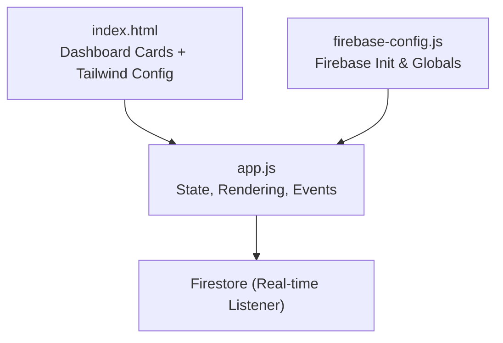

**Diagram sources**
- [index.html:58-84](file://index.html#L58-L84)
- [index.html:369-428](file://index.html#L369-L428)
- [app.js:33-48](file://app.js#L33-L48)
- [firebase-config.js:14-18](file://firebase-config.js#L14-L18)

**Section sources**
- [index.html:58-84](file://index.html#L58-L84)
- [index.html:369-428](file://index.html#L369-L428)
- [app.js:33-48](file://app.js#L33-L48)
- [firebase-config.js:14-18](file://firebase-config.js#L14-L18)

## Core Components
- Inventory Overview Card
  - Displays total items count, number of unique categories, and sum of all units across locations
  - Updated whenever inventory changes via real-time listener
- Carrier Alerts Card
  - Shows count of items needing transfer from depot to building
  - Lists up to five items with current vs max capacity
  - Red border-left accent and animated pulse ring when alerts exist
  - Clickable to open detailed modal
- Procurement Alerts Card
  - Shows count of items below purchasing trigger thresholds
  - Lists up to five items with remaining stock
  - Yellow border-left accent and animated pulse ring when alerts exist
  - Clickable to open detailed modal

Key implementation highlights:
- Real-time data binding through Firestore onSnapshot
- Alert calculations based on per-location stock and thresholds
- Pulse animations controlled by class toggling
- Responsive grid layout via Tailwind classes
- Click handlers open alert detail modals

**Section sources**
- [index.html:369-428](file://index.html#L369-L428)
- [app.js:622-661](file://app.js#L622-L661)
- [app.js:424-447](file://app.js#L424-L447)
- [app.js:2140-2155](file://app.js#L2140-L2155)

## Architecture Overview
The dashboard integrates with Firestore for live updates and renders UI elements dynamically. The flow:
- On authentication success, start real-time listeners for inventory and locations
- When data changes, compute alerts and metrics, then update DOM nodes
- User interactions (clicks, keyboard) open modals or adjust stock values

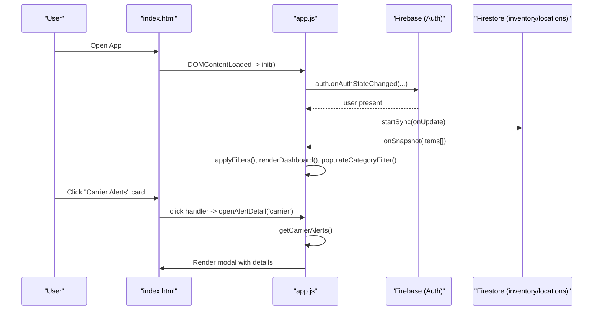

**Diagram sources**
- [app.js:205-265](file://app.js#L205-L265)
- [app.js:214-239](file://app.js#L214-L239)
- [app.js:622-661](file://app.js#L622-L661)
- [app.js:2140-2155](file://app.js#L2140-L2155)
- [firebase-config.js:14-18](file://firebase-config.js#L14-L18)

## Detailed Component Analysis

### Inventory Overview Card
- Purpose: Provide high-level inventory health at a glance
- Metrics:
  - Total Items: count of non-archived items
  - Categories: distinct category names
  - Total Units: sum of stock across all locations
- Calculation Logic:
  - Category extraction uses unique values from item.category
  - Total units computed by summing per-location stock maps
- Update Triggers:
  - Firestore snapshot updates
  - Inline edits that persist to Firestore
- DOM Elements:
  - stat-total-items, stat-categories, stat-total-units

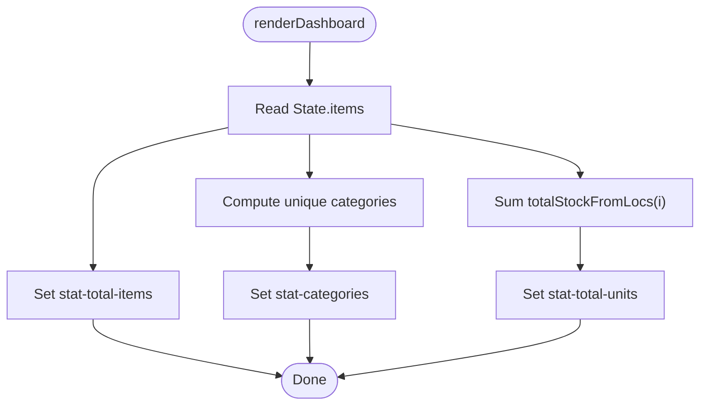

**Diagram sources**
- [app.js:622-633](file://app.js#L622-L633)
- [app.js:445-447](file://app.js#L445-L447)
- [app.js:365-368](file://app.js#L365-L368)

**Section sources**
- [index.html:372-393](file://index.html#L372-L393)
- [app.js:622-633](file://app.js#L622-L633)
- [app.js:445-447](file://app.js#L445-L447)
- [app.js:365-368](file://app.js#L365-L368)

### Carrier Alerts Card
- Purpose: Highlight items requiring transfer from depot to building
- Indicators:
  - Red left border accent
  - Animated pulse ring overlay when alerts exist
- Quick List:
  - Up to five items showing SKU, name, and current/max capacity
  - Additional count if more than five
- Click Behavior:
  - Opens alert detail modal listing all carrier alerts
- Calculation Logic:
  - needsCarrier(item): building stock <= carrierTrigger
  - getCarrierAlerts(): filters non-archived items meeting condition
- DOM Elements:
  - card-carrier, stat-carrier-count, carrier-pulse, carrier-quicklist

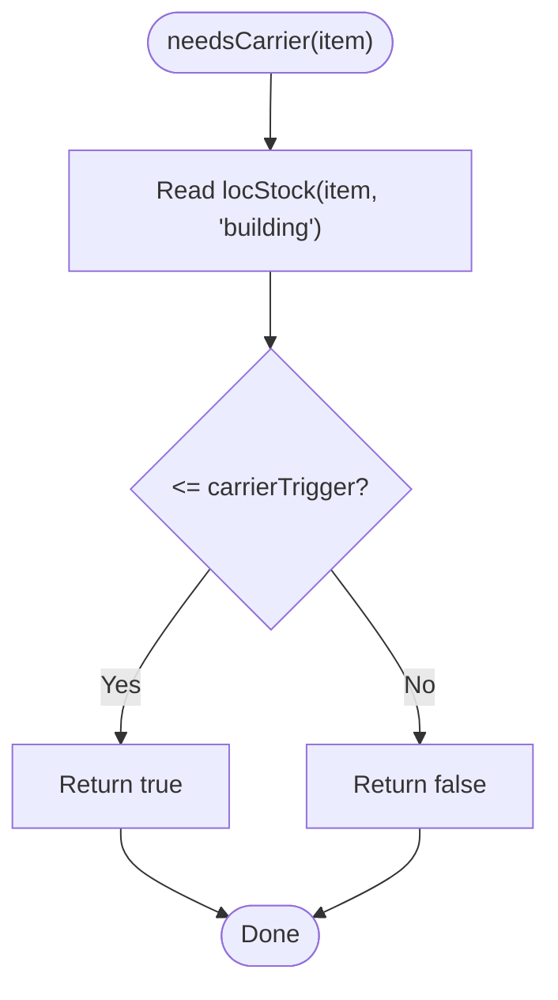

**Diagram sources**
- [app.js:424-427](file://app.js#L424-L427)
- [app.js:436-439](file://app.js#L436-L439)

**Section sources**
- [index.html:395-410](file://index.html#L395-L410)
- [app.js:424-439](file://app.js#L424-L439)
- [app.js:634-646](file://app.js#L634-L646)
- [app.js:2140-2155](file://app.js#L2140-L2155)

### Procurement Alerts Card
- Purpose: Highlight items below purchasing trigger thresholds
- Indicators:
  - Yellow left border accent
  - Animated pulse ring overlay when alerts exist
- Quick List:
  - Up to five items showing SKU, name, and remaining total stock
  - Additional count if more than five
- Click Behavior:
  - Opens alert detail modal listing all procurement alerts
- Calculation Logic:
  - needsProcurement(item): total stock across locations <= purchasingTrigger
  - getProcureAlerts(): filters non-archived items meeting condition
- DOM Elements:
  - card-procure, stat-procure-count, procure-pulse, procure-quicklist

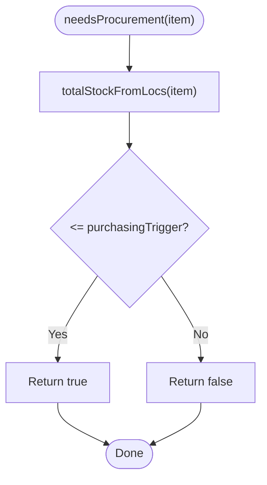

**Diagram sources**
- [app.js:428-431](file://app.js#L428-L431)
- [app.js:440-443](file://app.js#L440-L443)

**Section sources**
- [index.html:412-427](file://index.html#L412-L427)
- [app.js:428-443](file://app.js#L428-L443)
- [app.js:648-661](file://app.js#L648-L661)
- [app.js:2140-2155](file://app.js#L2140-L2155)

### Real-Time Data Binding
- Authentication triggers start of real-time listeners for inventory and locations
- Inventory listener:
  - Maps Firestore documents into State.items
  - Migrates legacy fields to location-based stock map
  - Calls applyFilters and renderDashboard to update UI
- Locations listener:
  - Seeds default locations if none exist
  - Populates location filter dropdowns
- Offline persistence enabled for resilience

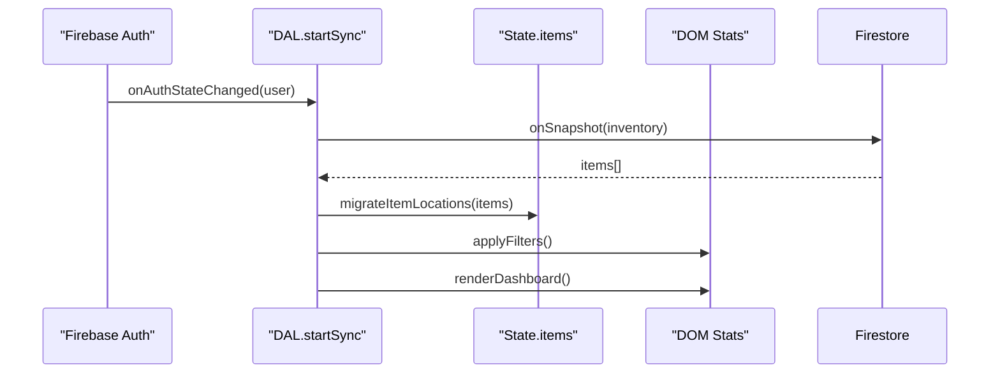

**Diagram sources**
- [app.js:205-265](file://app.js#L205-L265)
- [app.js:214-239](file://app.js#L214-L239)
- [app.js:344-356](file://app.js#L344-L356)
- [firebase-config.js:21-28](file://firebase-config.js#L21-L28)

**Section sources**
- [app.js:205-265](file://app.js#L205-L265)
- [app.js:214-239](file://app.js#L214-L239)
- [app.js:344-356](file://app.js#L344-L356)
- [firebase-config.js:21-28](file://firebase-config.js#L21-L28)

### Alert Pulse Animations
- Tailwind keyframes define pulse-ring animation
- Custom animation class animate-pulse-ring applied to overlay spans
- Visibility toggled based on presence of alerts
- Animation duration and easing configured in Tailwind config

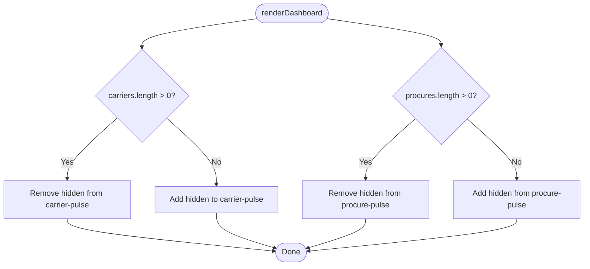

**Diagram sources**
- [index.html:69-80](file://index.html#L69-L80)
- [app.js:634-661](file://app.js#L634-L661)

**Section sources**
- [index.html:69-80](file://index.html#L69-L80)
- [app.js:634-661](file://app.js#L634-L661)

### Responsive Grid Layout (Tailwind CSS)
- Dashboard section uses responsive grid classes:
  - Single column on small screens
  - Three columns on medium+ screens
- Gap spacing and fade-in animation enhance UX
- Mobile-specific behaviors ensure action buttons remain visible

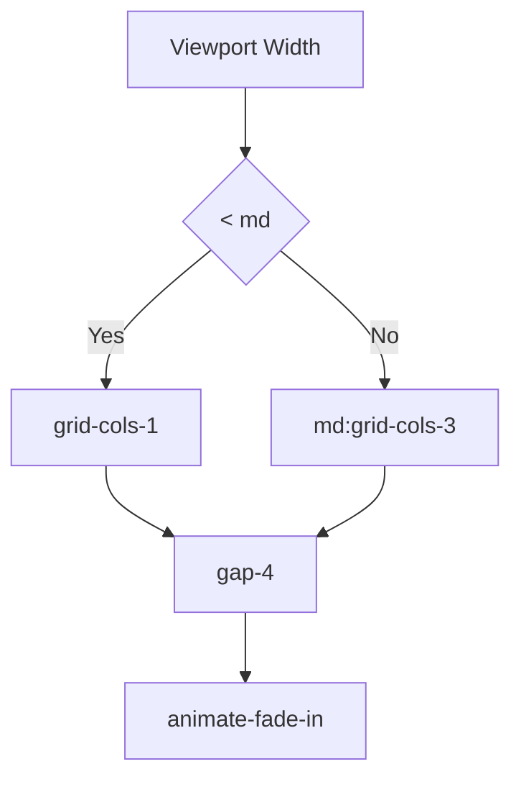

**Diagram sources**
- [index.html:369-370](file://index.html#L369-L370)
- [index.html:239-244](file://index.html#L239-L244)

**Section sources**
- [index.html:369-370](file://index.html#L369-L370)
- [index.html:239-244](file://index.html#L239-L244)

### Dynamic Content Updates
- Inline editing of stock fields persists changes to Firestore without full row re-render
- After save, partial DOM updates refresh gauge bars, depot counts, badges, and totals
- Dashboard stats re-render after each change to reflect new metrics

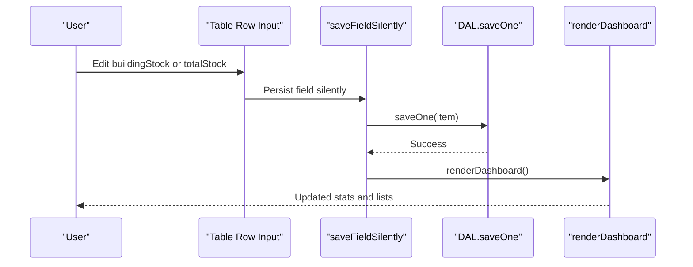

**Diagram sources**
- [app.js:699-771](file://app.js#L699-L771)
- [app.js:622-661](file://app.js#L622-L661)

**Section sources**
- [app.js:699-771](file://app.js#L699-L771)
- [app.js:622-661](file://app.js#L622-L661)

### Click Handlers for Alert Navigation
- Both alert cards are interactive with role="button" and tabindex="0"
- Click handlers open alert detail modal with relevant items
- Keyboard accessibility ensures Enter/Space activation

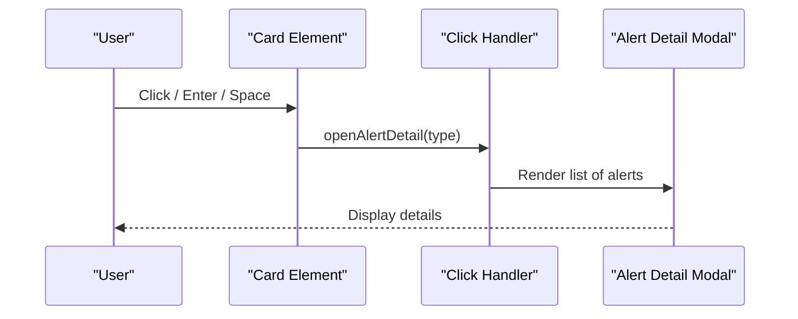

**Diagram sources**
- [index.html:395-427](file://index.html#L395-L427)
- [app.js:2140-2155](file://app.js#L2140-L2155)
- [app.js:973-1002](file://app.js#L973-L1002)

**Section sources**
- [index.html:395-427](file://index.html#L395-L427)
- [app.js:2140-2155](file://app.js#L2140-L2155)
- [app.js:973-1002](file://app.js#L973-L1002)

### Mobile-Responsive Behavior
- Action buttons always visible on smaller screens via media query override
- Grid adapts to single-column layout on mobile
- Scrollbars styled for compact lists within cards

**Section sources**
- [index.html:239-244](file://index.html#L239-L244)
- [index.html:369-370](file://index.html#L369-L370)

### Integration with Alerting System
- Alerting logic is centralized in computed helpers:
  - needsCarrier and needsProcurement determine alert conditions
  - getCarrierAlerts and getProcureAlerts return filtered lists
- Manifest generation leverages carrier alerts to propose transfers
- Transaction logging supports auditability for stock movements

**Section sources**
- [app.js:424-443](file://app.js#L424-L443)
- [app.js:896-958](file://app.js#L896-L958)
- [app.js:124-131](file://app.js#L124-L131)

### How Dashboard Metrics Are Calculated
- Total Items: length of State.items
- Categories: unique values from item.category
- Total Units: sum of totalStockFromLocs across all items
- Carrier Alerts: items where building stock <= carrierTrigger
- Procurement Alerts: items where total stock <= purchasingTrigger

**Section sources**
- [app.js:622-633](file://app.js#L622-L633)
- [app.js:445-447](file://app.js#L445-L447)
- [app.js:365-368](file://app.js#L365-L368)
- [app.js:424-443](file://app.js#L424-L443)

## Dependency Analysis
- UI depends on Tailwind CSS for styling and animations
- Application logic depends on Firebase Auth and Firestore for state synchronization
- DOM references are managed centrally in app.js for efficient updates

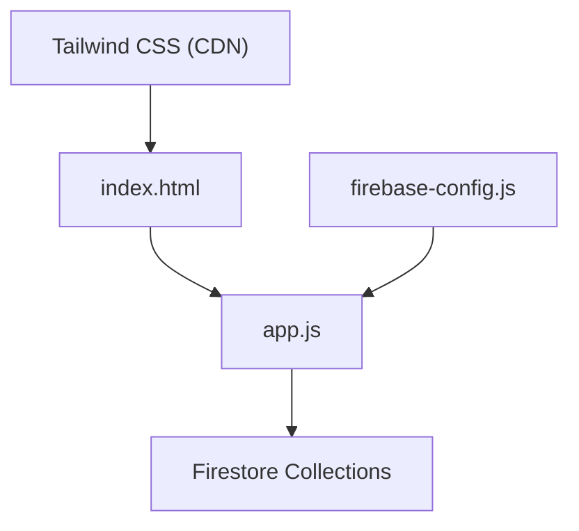

**Diagram sources**
- [index.html:45-52](file://index.html#L45-L52)
- [firebase-config.js:14-18](file://firebase-config.js#L14-L18)
- [app.js:33-48](file://app.js#L33-L48)

**Section sources**
- [index.html:45-52](file://index.html#L45-L52)
- [firebase-config.js:14-18](file://firebase-config.js#L14-L18)
- [app.js:33-48](file://app.js#L33-L48)

## Performance Considerations
- Real-time listeners minimize polling overhead and keep UI synchronized
- Partial DOM updates avoid full table re-renders during inline edits
- Debounced search and input handling reduce unnecessary computations
- Pagination limits rendered rows to improve responsiveness

[No sources needed since this section provides general guidance]

## Troubleshooting Guide
- Permission Denied Errors:
  - Check Firestore rules and ensure authenticated access
- Unavailable Service:
  - Verify internet connectivity and Firebase service status
- Persistence Warnings:
  - Multiple tabs may prevent persistence; consider single-tab usage or adjust settings

**Section sources**
- [app.js:229-238](file://app.js#L229-L238)
- [firebase-config.js:21-28](file://firebase-config.js#L21-L28)

## Conclusion
Shadow Ledger’s dashboard delivers actionable insights through three focused cards, powered by real-time data binding and responsive design. The alerting system computes metrics directly from inventory data, while animations and click handlers provide clear visual cues and navigation paths. The architecture balances simplicity and performance, enabling smooth operations across devices.