# Inventory Table System

<cite>
**Referenced Files in This Document**
- [index.html](file://index.html)
- [app.js](file://app.js)
- [firebase-config.js](file://firebase-config.js)
- [README.md](file://README.md)
</cite>

## Table of Contents
1. [Introduction](#introduction)
2. [Project Structure](#project-structure)
3. [Core Components](#core-components)
4. [Architecture Overview](#architecture-overview)
5. [Detailed Component Analysis](#detailed-component-analysis)
6. [Dependency Analysis](#dependency-analysis)
7. [Performance Considerations](#performance-considerations)
8. [Troubleshooting Guide](#troubleshooting-guide)
9. [Conclusion](#conclusion)

## Introduction
This document explains the inventory table system with sortable columns, inline editing, and bulk selection. It covers the table structure (SKU, name, category, stock levels, thresholds), keyboard-friendly inline editing with +/- buttons, column sorting, search/filtering, row status indicators (carrier alerts in red, procurement alerts in yellow), checkbox-based bulk operations, and pagination controls. It also documents real-time data synchronization via Firestore, cell validation behavior, and responsive design across screen sizes.

## Project Structure
The application is a single-page web app composed of:
- index.html: UI shell, table markup, modals, and Tailwind styles
- app.js: Application logic, state management, event handling, rendering, and persistence
- firebase-config.js: Firebase initialization and global references to auth and firestore

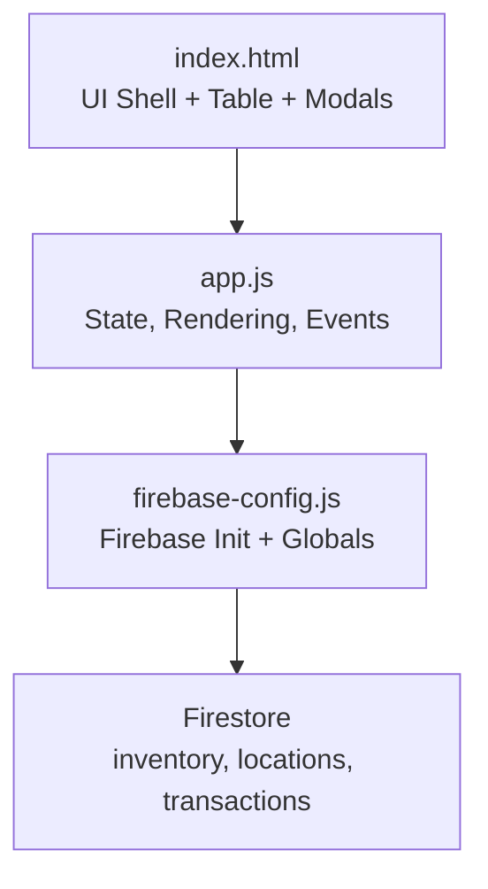

**Diagram sources**
- [index.html:1-1220](file://index.html#L1-L1220)
- [app.js:1-2699](file://app.js#L1-L2699)
- [firebase-config.js:1-29](file://firebase-config.js#L1-L29)

**Section sources**
- [index.html:1-1220](file://index.html#L1-L1220)
- [app.js:1-2699](file://app.js#L1-L2699)
- [firebase-config.js:1-29](file://firebase-config.js#L1-L29)

## Core Components
- State and Data Access Layer (DAL): Centralized state for items, filters, sort, pagination, selections; DAL abstracts Firestore reads/writes and real-time listeners.
- Table Rendering: Generates rows with inline editable fields, quick adjust buttons, status badges, and action buttons.
- Filtering and Sorting: Search by SKU/name/category, alert filter, stock filter, category dropdown, and clickable column headers for ascending/descending sort.
- Bulk Operations: Row checkboxes, “select all” per page, bulk archive/restore/delete/print labels.
- Real-time Sync: onSnapshot listener updates UI automatically when Firestore changes.
- Responsive Design: Tailwind utility classes hide/show columns at breakpoints; mobile-first layout.

Key responsibilities are implemented in:
- State and DAL: [app.js:14-132](file://app.js#L14-L132)
- Table rendering and row template: [app.js:499-617](file://app.js#L499-L617)
- Filters/sort: [app.js:452-494](file://app.js#L452-L494)
- Inline editing and +/- adjustments: [app.js:698-822](file://app.js#L698-L822)
- Event bindings (keyboard, clicks, pagination): [app.js:1868-2036](file://app.js#L1868-L2036)
- Real-time sync: [app.js:33-48](file://app.js#L33-L48)

**Section sources**
- [app.js:14-132](file://app.js#L14-L132)
- [app.js:452-494](file://app.js#L452-L494)
- [app.js:499-617](file://app.js#L499-L617)
- [app.js:698-822](file://app.js#L698-L822)
- [app.js:1868-2036](file://app.js#L1868-L2036)
- [app.js:33-48](file://app.js#L33-L48)

## Architecture Overview
High-level flow from user interaction to persistent storage and back:

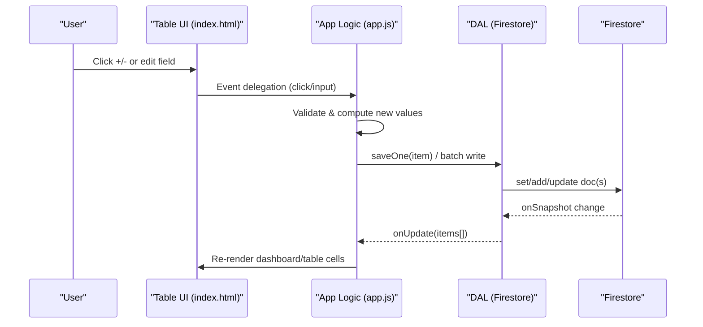

**Diagram sources**
- [app.js:33-48](file://app.js#L33-L48)
- [app.js:698-822](file://app.js#L698-L822)
- [app.js:1868-2036](file://app.js#L1868-L2036)

## Detailed Component Analysis

### Table Structure and Columns
- Columns include:
  - Selection checkbox
  - Status badge (OK, CARRIER, ORDER)
  - SKU (sortable)
  - Item Name (sortable)
  - Category (sortable, hidden on small screens)
  - Datasheet link (hidden on medium screens)
  - Total Stock (editable, reflects sum across locations)
  - Building Stock (editable with +/- buttons and gauge bar)
  - Depot Stock (computed)
  - Carrier Trigger (editable)
  - Max Capacity (editable)
  - Purchasing Trigger (editable)
  - Actions (print label, transfer, edit, delete)

Responsive visibility is controlled via Tailwind classes (e.g., hidden sm:table-cell, hidden lg:table-cell).

**Section sources**
- [index.html:500-540](file://index.html#L500-L540)
- [app.js:546-617](file://app.js#L546-L617)

### Sortable Columns
- Clickable headers with data-sort attributes toggle ascending/descending order.
- Special handling for depotStock computed value during sort.

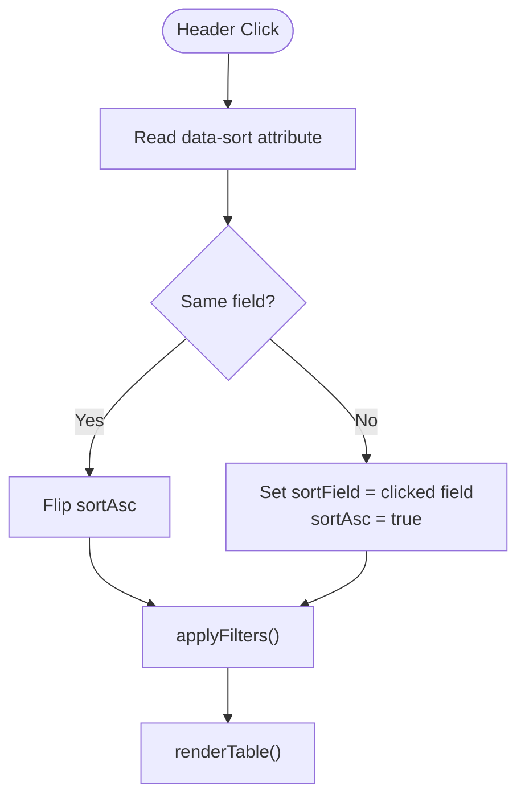

**Diagram sources**
- [app.js:1954-1962](file://app.js#L1954-L1962)
- [app.js:452-494](file://app.js#L452-L494)
- [app.js:499-527](file://app.js#L499-L527)

**Section sources**
- [app.js:1954-1962](file://app.js#L1954-L1962)
- [app.js:452-494](file://app.js#L452-L494)
- [app.js:499-527](file://app.js#L499-L527)

### Search and Filter Capabilities
- Text search across SKU, name, category, and datasheet URL.
- Filters: All Stock, Hide Out of Stock, Hide Empty Building.
- Category dropdown dynamically populated from existing items plus predefined options.
- Alert filter: show only carrier alerts, procurement alerts, or OK items.

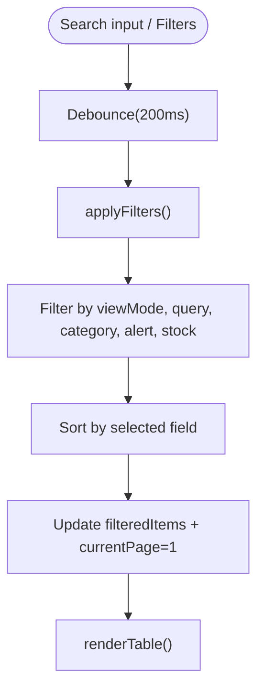

**Diagram sources**
- [app.js:1872-1876](file://app.js#L1872-L1876)
- [app.js:452-494](file://app.js#L452-L494)
- [app.js:499-527](file://app.js#L499-L527)

**Section sources**
- [app.js:1872-1876](file://app.js#L1872-L1876)
- [app.js:452-494](file://app.js#L452-L494)
- [app.js:499-527](file://app.js#L499-L527)

### Keyboard-Friendly Inline Editing and +/- Buttons
- Inline inputs use numeric type with inputmode="numeric".
- Debounced save on input (400ms) preserves focus and cursor position.
- On blur, final commit occurs.
- Enter key navigates to next inline input in the same row or blurs if last.
- Global numpad +/- shortcuts increment/decrement building stock when focused on that field.
- +/- buttons call adjustStock(id, delta) which updates locationStock and persists.

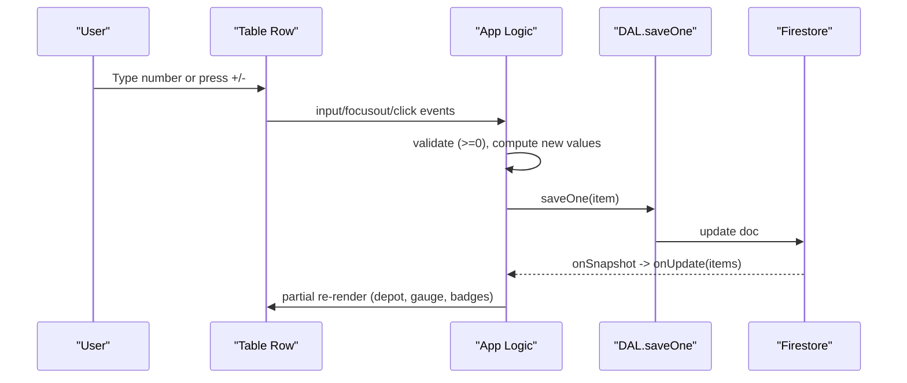

**Diagram sources**
- [app.js:1968-2010](file://app.js#L1968-L2010)
- [app.js:698-771](file://app.js#L698-L771)
- [app.js:808-822](file://app.js#L808-L822)
- [app.js:33-48](file://app.js#L33-L48)

**Section sources**
- [app.js:1968-2010](file://app.js#L1968-L2010)
- [app.js:698-771](file://app.js#L698-L771)
- [app.js:808-822](file://app.js#L808-L822)

### Row Status Indicators
- Carrier alert: Building Stock ≤ Carrier Trigger → row highlighted red with left border and “CARRIER” badge.
- Procurement alert: Total Stock ≤ Purchasing Trigger → row highlighted yellow with left border and “ORDER” badge.
- Both can be active simultaneously; combined styling applies.

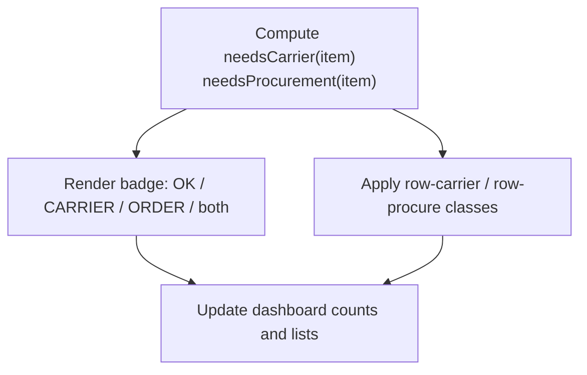

**Diagram sources**
- [app.js:425-443](file://app.js#L425-L443)
- [app.js:546-562](file://app.js#L546-L562)
- [index.html:203-224](file://index.html#L203-L224)

**Section sources**
- [app.js:425-443](file://app.js#L425-L443)
- [app.js:546-562](file://app.js#L546-L562)
- [index.html:203-224](file://index.html#L203-L224)

### Checkbox Selection and Bulk Operations
- Per-row checkboxes update a Set of selected IDs.
- “Select all” toggles selection for current page only.
- Bulk actions bar shows count and exposes:
  - Print Labels
  - Archive
  - Restore (when in archive view)
  - Delete (with confirmation dialog)

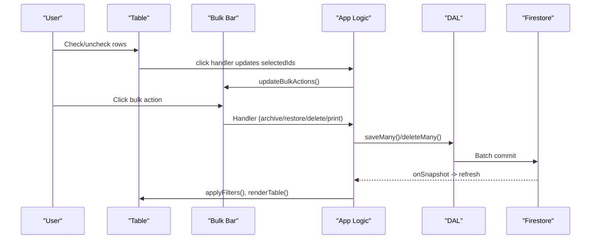

**Diagram sources**
- [app.js:1888-1949](file://app.js#L1888-L1949)
- [app.js:529-544](file://app.js#L529-L544)
- [app.js:82-97](file://app.js#L82-L97)

**Section sources**
- [app.js:1888-1949](file://app.js#L1888-L1949)
- [app.js:529-544](file://app.js#L529-L544)
- [app.js:82-97](file://app.js#L82-L97)

### Pagination Controls
- Fixed page size (PAGE_SIZE = 50).
- Prev/Next buttons update State.currentPage and re-render.
- Displays “Showing X–Y of Z items” and “Page N / M”.

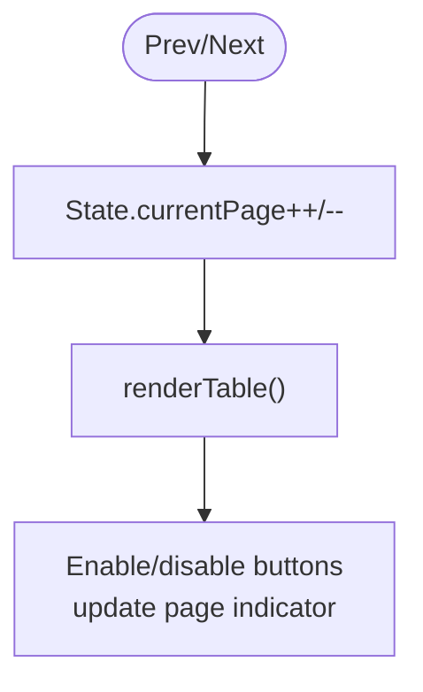

**Diagram sources**
- [app.js:1964-1966](file://app.js#L1964-L1966)
- [app.js:499-527](file://app.js#L499-L527)

**Section sources**
- [app.js:1964-1966](file://app.js#L1964-L1966)
- [app.js:499-527](file://app.js#L499-L527)

### Real-Time Data Synchronization
- Firestore onSnapshot listener streams inventory changes to the app.
- Incoming items are migrated to support per-location stock maps.
- If an inline input is focused, only dashboard stats update to avoid disrupting editing; otherwise full re-render occurs.

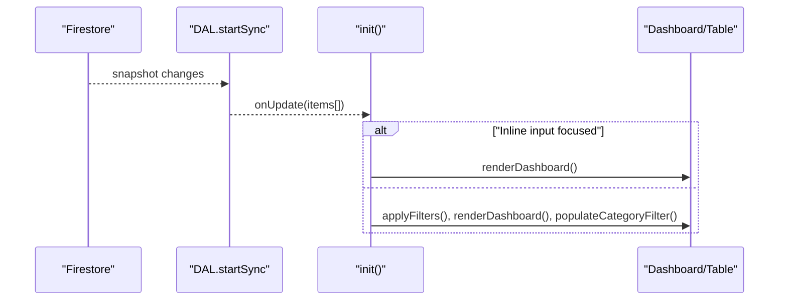

**Diagram sources**
- [app.js:33-48](file://app.js#L33-L48)
- [app.js:214-239](file://app.js#L214-L239)

**Section sources**
- [app.js:33-48](file://app.js#L33-L48)
- [app.js:214-239](file://app.js#L214-L239)

### Cell Validation and Behavior
- Numeric fields enforce non-negative integers (Math.max(0, parseInt(...))).
- Editing totalStock adjusts depot stock to keep building stock stable.
- Editing buildingStock updates locationStock map and recalculates totals.
- Threshold fields (carrierTrigger, maxCapacity, purchasingTrigger) are persisted directly.

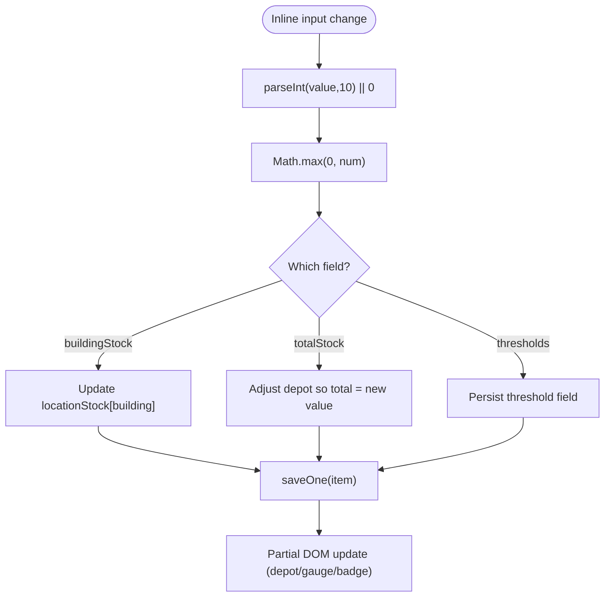

**Diagram sources**
- [app.js:698-771](file://app.js#L698-L771)
- [app.js:773-806](file://app.js#L773-L806)

**Section sources**
- [app.js:698-771](file://app.js#L698-L771)
- [app.js:773-806](file://app.js#L773-L806)

### Responsive Table Behavior
- Tailwind utilities control column visibility:
  - Category hidden below sm breakpoint
  - Datasheet, carrier trigger, max capacity, purchasing trigger hidden below lg
- Mobile-first layout ensures usability on smaller screens.
- Action buttons remain visible on mobile via media query override.

**Section sources**
- [index.html:500-540](file://index.html#L500-L540)
- [index.html:239-244](file://index.html#L239-L244)

## Dependency Analysis
- UI depends on app.js for all interactive behaviors and rendering.
- app.js depends on firebase-config.js for initialized auth and db globals.
- DAL encapsulates Firestore collections: inventory, locations, transactions.
- No circular dependencies observed between modules.

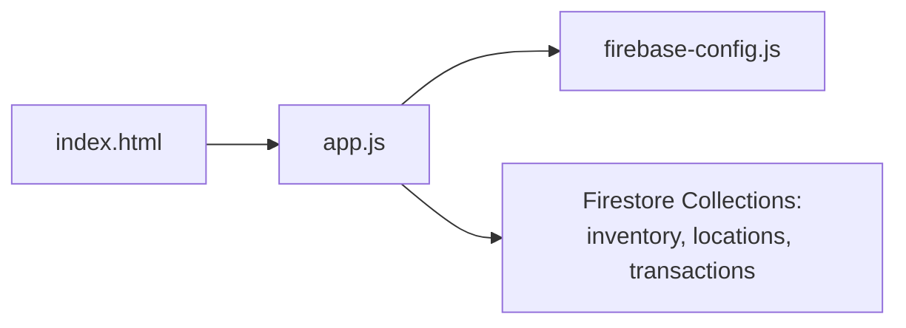

**Diagram sources**
- [index.html:1215-1218](file://index.html#L1215-L1218)
- [app.js:33-132](file://app.js#L33-L132)
- [firebase-config.js:14-29](file://firebase-config.js#L14-L29)

**Section sources**
- [index.html:1215-1218](file://index.html#L1215-L1218)
- [app.js:33-132](file://app.js#L33-L132)
- [firebase-config.js:14-29](file://firebase-config.js#L14-L29)

## Performance Considerations
- Debounced search and inline saves reduce unnecessary writes and re-renders.
- Partial reflows after inline edits minimize DOM churn.
- Page size capped at 50 balances responsiveness and memory usage.
- Firestore offline persistence improves resilience and perceived performance.

[No sources needed since this section provides general guidance]

## Troubleshooting Guide
- Permission denied errors: Ensure Firestore rules allow read/write for authenticated users.
- Unavailable service: Check internet connectivity and Firebase availability.
- Multiple tabs persistence warning: Browser may not support multi-tab persistence; fallback still works.
- Camera scan-out issues: If camera unavailable, manual SKU entry remains functional.

**Section sources**
- [app.js:59-78](file://app.js#L59-L78)
- [app.js:229-239](file://app.js#L229-L239)
- [firebase-config.js:21-28](file://firebase-config.js#L21-L28)
- [app.js:1271-1288](file://app.js#L1271-L1288)

## Conclusion
The inventory table system delivers a robust, keyboard-friendly interface for managing stock across multiple locations. It combines real-time synchronization, intuitive inline editing, powerful filtering and sorting, and efficient bulk operations. The architecture cleanly separates UI, logic, and persistence, enabling maintainability and future enhancements.