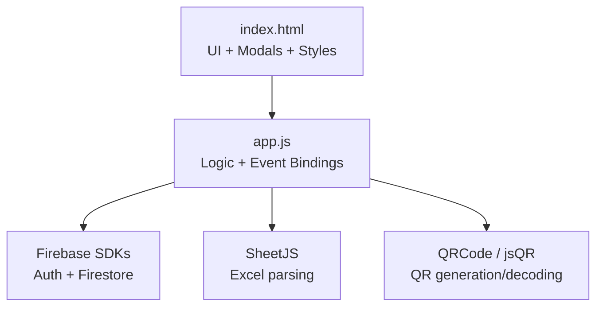
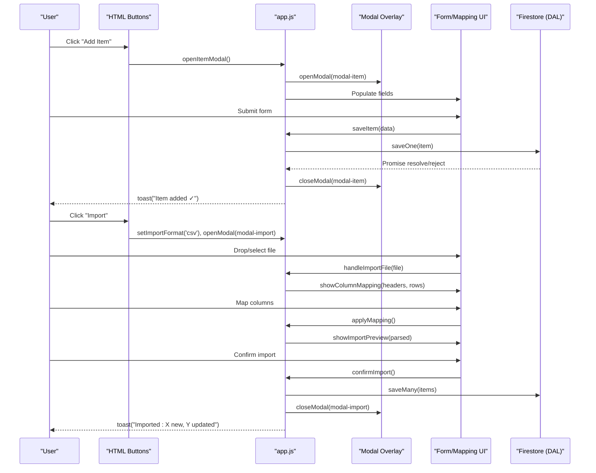
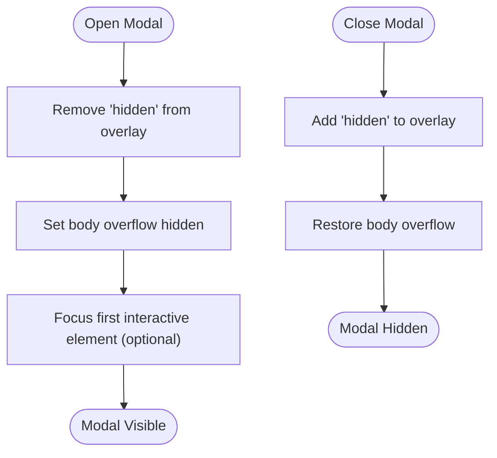
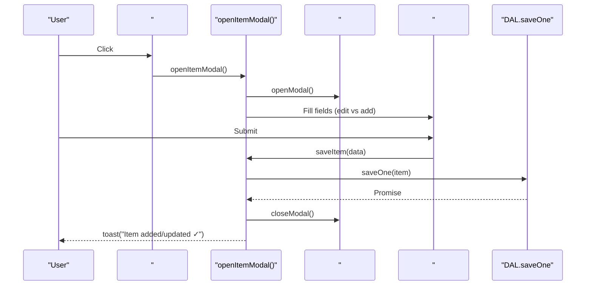
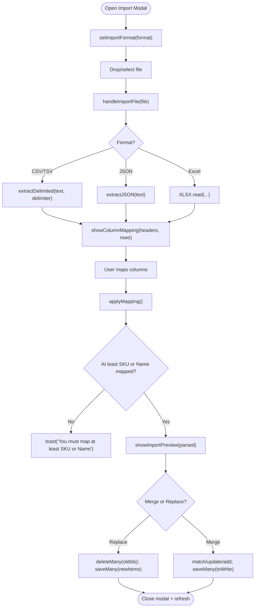
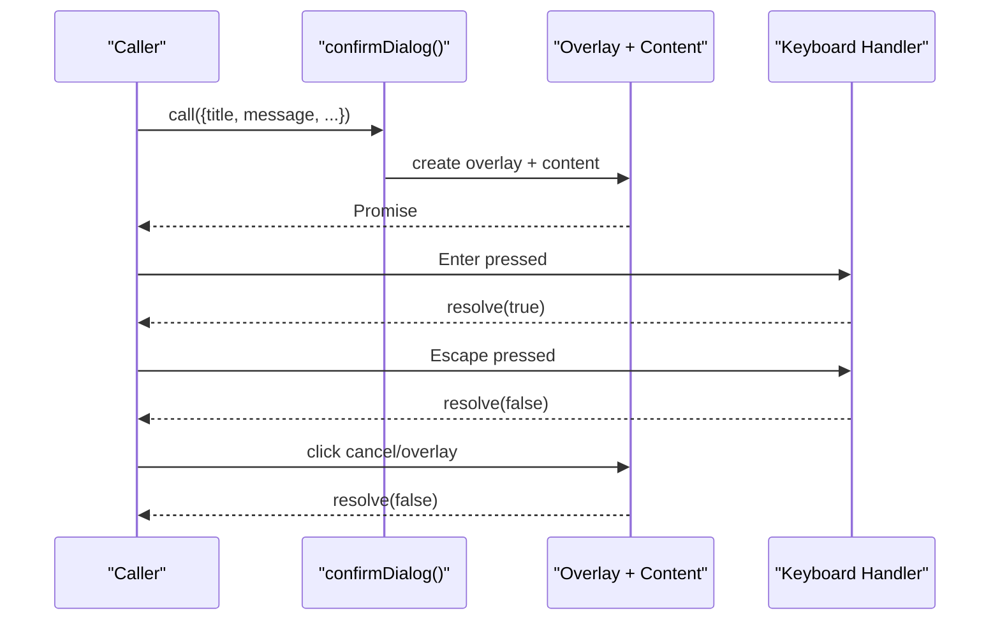
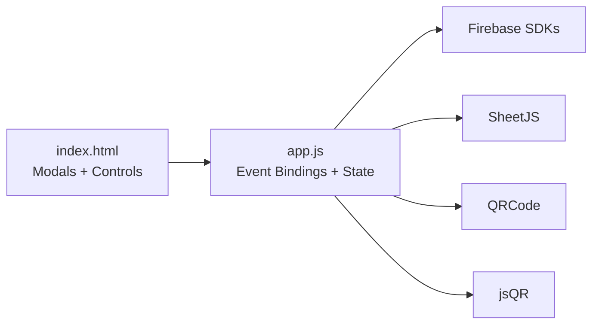

# Modal System and Forms

<cite>
**Referenced Files in This Document**
- [index.html](file://index.html)
- [app.js](file://app.js)
- [README.md](file://README.md)
</cite>

## Table of Contents
1. [Introduction](#introduction)
2. [Project Structure](#project-structure)
3. [Core Components](#core-components)
4. [Architecture Overview](#architecture-overview)
5. [Detailed Component Analysis](#detailed-component-analysis)
6. [Dependency Analysis](#dependency-analysis)
7. [Performance Considerations](#performance-considerations)
8. [Troubleshooting Guide](#troubleshooting-guide)
9. [Conclusion](#conclusion)

## Introduction
This document explains Shadow Ledger’s modal system with a focus on:
- Item add/edit forms
- Import dialogs (CSV, Excel, JSON, TSV)
- Confirmation modals
- Modal overlay behavior including backdrop blur
- Form validation and keyboard accessibility
- Item management modal field groups (basic info, stock levels, thresholds)
- Import modal features (format tabs, file drop zones, column mapping, preview)
- Modal state management, form submission handling, error display
- Responsive design considerations for mobile devices

The implementation is a single-page app using HTML, Tailwind CSS, and vanilla JavaScript with Firebase Firestore integration.

## Project Structure
Shadow Ledger uses a minimal structure:
- index.html: UI markup, modal templates, styles, and script includes
- app.js: Application logic, event bindings, modal orchestration, import/export flows, and confirmation dialog utility
- README.md: High-level overview and quick start

**Diagram sources**
- [index.html:1-120](file://index.html#L1-L120)
- [app.js:1-120](file://app.js#L1-L120)

**Section sources**
- [README.md:1-32](file://README.md#L1-L32)

## Core Components
- Modal Overlay System
  - Shared overlay class with backdrop blur and z-index layering
  - Open/close helpers that manage body scroll lock
- Item Add/Edit Modal
  - Field groups: Basic Info, Stock Levels, Threshold Configuration
  - Validation via native required attributes and numeric constraints
  - Keyboard-friendly inline editing elsewhere in the app; modal fields use standard inputs
- Import Modal
  - Format tabs: CSV, Excel, JSON, TSV
  - Drag-and-drop zone and file input
  - Column mapping interface with auto-mapping heuristics
  - Preview table before confirm
  - Merge or Replace modes
- Confirmation Modal
  - Promise-based confirmDialog utility used for destructive actions
- Toast Notifications
  - Non-blocking feedback for success/error/info states

**Section sources**
- [index.html:187-201](file://index.html#L187-L201)
- [index.html:543-674](file://index.html#L543-L674)
- [index.html:676-816](file://index.html#L676-L816)
- [app.js:876-894](file://app.js#L876-L894)
- [app.js:1657-1708](file://app.js#L1657-L1708)
- [app.js:1722-1778](file://app.js#L1722-L1778)
- [app.js:2618-2659](file://app.js#L2618-L2659)
- [app.js:2608-2616](file://app.js#L2608-L2616)

## Architecture Overview
Modal interactions are orchestrated by event bindings in app.js. The UI elements are defined in index.html. State is centralized in an in-memory object and persisted to Firestore via a Data Access Layer.

**Diagram sources**
- [index.html:354-357](file://index.html#L354-L357)
- [index.html:339-342](file://index.html#L339-L342)
- [index.html:543-674](file://index.html#L543-L674)
- [index.html:676-816](file://index.html#L676-L816)
- [app.js:2039-2062](file://app.js#L2039-L2062)
- [app.js:2102-2119](file://app.js#L2102-L2119)
- [app.js:1668-1708](file://app.js#L1668-L1708)
- [app.js:1722-1778](file://app.js#L1722-L1778)
- [app.js:1780-1826](file://app.js#L1780-L1826)
- [app.js:876-894](file://app.js#L876-L894)

## Detailed Component Analysis

### Modal Overlay System
- Overlay container uses a fixed full-screen wrapper with semi-transparent background and backdrop blur.
- Content container provides rounded corners, shadow, max-height, and scrollable content.
- Open/close helpers toggle visibility and lock/unlock body scrolling.
- Global handlers close modals when clicking the overlay or pressing Escape.

**Diagram sources**
- [index.html:187-201](file://index.html#L187-L201)
- [app.js:876-877](file://app.js#L876-L877)
- [app.js:2078-2099](file://app.js#L2078-L2099)

**Section sources**
- [index.html:187-201](file://index.html#L187-L201)
- [app.js:876-877](file://app.js#L876-L877)
- [app.js:2078-2099](file://app.js#L2078-L2099)

### Item Management Modal (Add/Edit)
- Purpose: Create or update inventory items.
- Field Groups:
  - Basic Info: SKU (required), Category, Name (required), Datasheet URL
  - Stock Levels: Total Stock, Building Stock
  - Threshold Configuration: Carrier Trigger, Max Building Capacity, Purchasing Trigger
- Validation:
  - Native required attributes on SKU and Name
  - Numeric min constraints on quantity/threshold fields
- Submission:
  - Prevent default, build item object, persist via DAL.saveOne
  - On success, close modal and show success toast
  - On error, keep modal open and rely on DAL error toast
- Accessibility:
  - Uses semantic form and labels
  - Focus management after open (SKU field focused)

**Diagram sources**
- [index.html:543-674](file://index.html#L543-L674)
- [app.js:879-894](file://app.js#L879-L894)
- [app.js:2042-2062](file://app.js#L2042-L2062)
- [app.js:824-854](file://app.js#L824-L854)

**Section sources**
- [index.html:543-674](file://index.html#L543-L674)
- [app.js:879-894](file://app.js#L879-L894)
- [app.js:2042-2062](file://app.js#L2042-L2062)
- [app.js:824-854](file://app.js#L824-L854)

### Import Modal (CSV, Excel, JSON, TSV)
- Format Tabs:
  - Switches accepted file types, help text, and active tab styling
- File Input and Drop Zone:
  - Click-to-browse and drag-and-drop support
  - Auto-detects format from extension if mismatched
- Parsing:
  - CSV/TSV: Delimiter detection and quoted field parsing
  - JSON: Array or object containing array
  - Excel: First sheet parsed via SheetJS
- Column Mapping:
  - Auto-maps common header variants to internal fields
  - Dropdowns per target field to map source columns
  - Requires at least SKU or Name mapped
- Preview:
  - Renders up to 10 rows with key fields
- Import Modes:
  - Merge: Update existing by SKU/name match, add new otherwise
  - Replace: Clear current inventory and replace with imported data
- Error Handling:
  - Invalid files or empty datasets show error toast
  - Missing mappings prompt user to fix before proceeding

**Diagram sources**
- [index.html:676-816](file://index.html#L676-L816)
- [app.js:1657-1708](file://app.js#L1657-L1708)
- [app.js:1587-1640](file://app.js#L1587-L1640)
- [app.js:1722-1778](file://app.js#L1722-L1778)
- [app.js:1780-1826](file://app.js#L1780-L1826)

**Section sources**
- [index.html:676-816](file://index.html#L676-L816)
- [app.js:1657-1708](file://app.js#L1657-L1708)
- [app.js:1587-1640](file://app.js#L1587-L1640)
- [app.js:1722-1778](file://app.js#L1722-L1778)
- [app.js:1780-1826](file://app.js#L1780-L1826)

### Confirmation Modal (confirmDialog)
- Replaces native confirm with a Promise-based modal.
- Supports danger styling and custom button labels.
- Handles overlay click and keyboard events (Enter/Escape).
- Used for delete operations and scan-out overages.

**Diagram sources**
- [app.js:2618-2659](file://app.js#L2618-L2659)

**Section sources**
- [app.js:2618-2659](file://app.js#L2618-L2659)

### Keyboard Accessibility and Focus Management
- Modal closing:
  - Escape key closes any visible modal
  - Clicking overlay closes modal
- Focus management:
  - Item modal focuses SKU field after opening
  - Inline table editing supports Tab navigation and Enter to move between fields
- Dashboard cards:
  - role="button" and tabindex enable keyboard activation via Enter/Space

**Section sources**
- [app.js:879-894](file://app.js#L879-L894)
- [app.js:2078-2099](file://app.js#L2078-L2099)
- [app.js:1989-2010](file://app.js#L1989-L2010)
- [index.html:396-427](file://index.html#L396-L427)

### Form Validation and Error Display
- Item form:
  - Required fields enforced by browser
  - Numeric fields constrained with min attributes
  - Errors surfaced via DAL error toasts; modal remains open for correction
- Import flow:
  - Empty or invalid files produce error toasts
  - Mapping requires at least one identifier (SKU or Name)
  - Preview enables verification before committing

**Section sources**
- [index.html:543-674](file://index.html#L543-L674)
- [app.js:2042-2062](file://app.js#L2042-L2062)
- [app.js:1699-1703](file://app.js#L1699-L1703)
- [app.js:1753-1756](file://app.js#L1753-L1756)

### Responsive Design Considerations
- Mobile-first layout with Tailwind responsive utilities
- Action buttons always visible on small screens via media query
- Modal content uses max-width and scrollable containers
- Import mapping grid adapts to two columns on larger screens

**Section sources**
- [index.html:239-244](file://index.html#L239-L244)
- [index.html:733-778](file://index.html#L733-L778)

## Dependency Analysis
- UI components depend on shared modal overlay classes and Tailwind utilities
- app.js orchestrates all modal behaviors and binds events to DOM nodes
- External libraries:
  - Firebase Auth/Firestore for persistence and real-time sync
  - SheetJS for Excel parsing
  - QRCode library for label QR codes
  - jsQR for camera-based barcode scanning

**Diagram sources**
- [index.html:45-92](file://index.html#L45-L92)
- [app.js:1-120](file://app.js#L1-L120)

**Section sources**
- [index.html:45-92](file://index.html#L45-L92)
- [app.js:1-120](file://app.js#L1-L120)

## Performance Considerations
- Debounced search and inline edits reduce unnecessary writes
- Pagination limits render size to improve responsiveness
- Import preview shows only top N rows to avoid heavy rendering
- Modal overlays prevent background scroll to maintain context

[No sources needed since this section provides general guidance]

## Troubleshooting Guide
- Modal does not close on Escape:
  - Ensure global keydown listener is active and modal has no conflicting listeners
- Import fails silently:
  - Check console for parse errors; verify headers match expected names or map manually
- Firestore permission denied:
  - Review database rules and ensure authenticated user has write access
- Camera not available during scan-out:
  - Browser may block camera; allow permissions or fall back to manual SKU entry

**Section sources**
- [app.js:2078-2099](file://app.js#L2078-L2099)
- [app.js:1699-1703](file://app.js#L1699-L1703)
- [app.js:229-238](file://app.js#L229-L238)
- [app.js:1271-1288](file://app.js#L1271-L1288)

## Conclusion
Shadow Ledger’s modal system provides a cohesive, accessible, and responsive experience across item management and data import workflows. The overlay system centralizes presentation concerns, while app.js manages state transitions, validation, and persistence. The import modal’s flexible mapping and preview capabilities streamline bulk operations, and the promise-based confirmation modal ensures consistent UX for destructive actions.