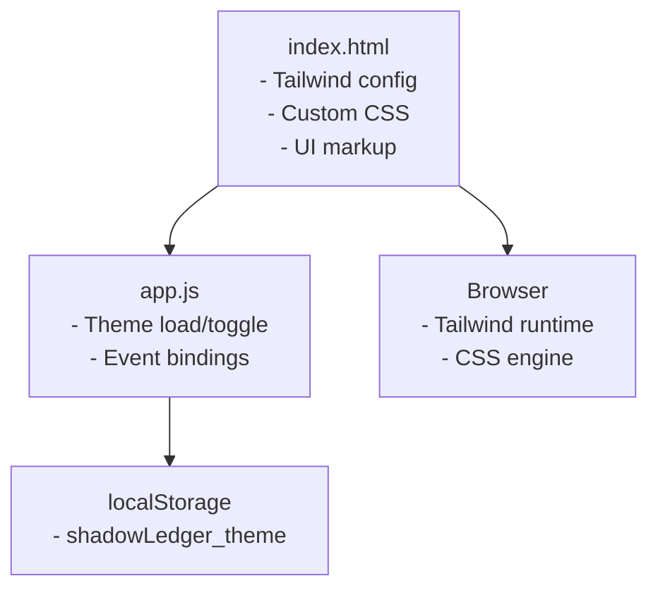
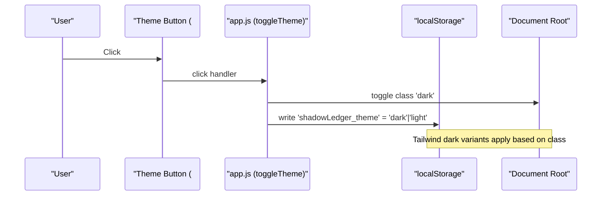
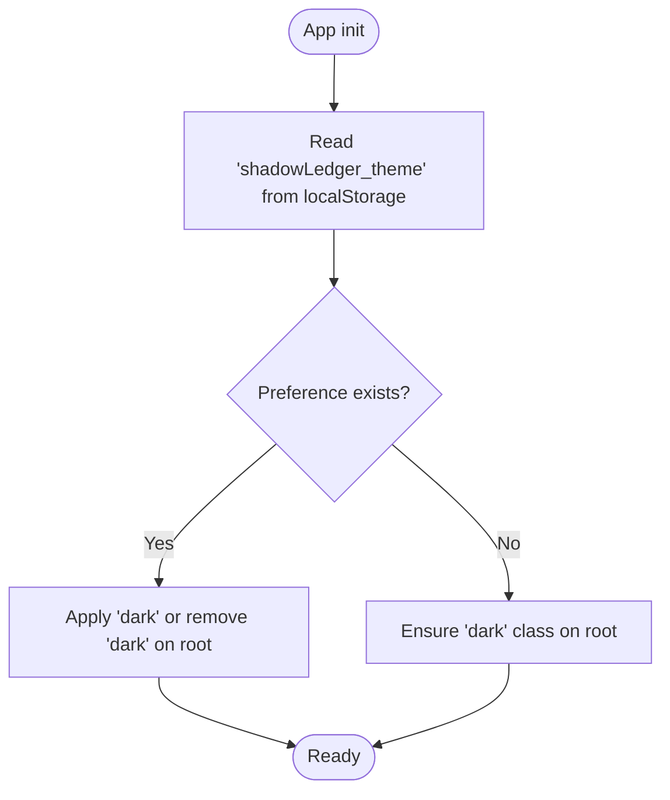
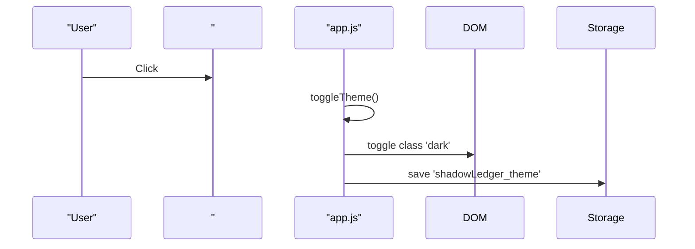
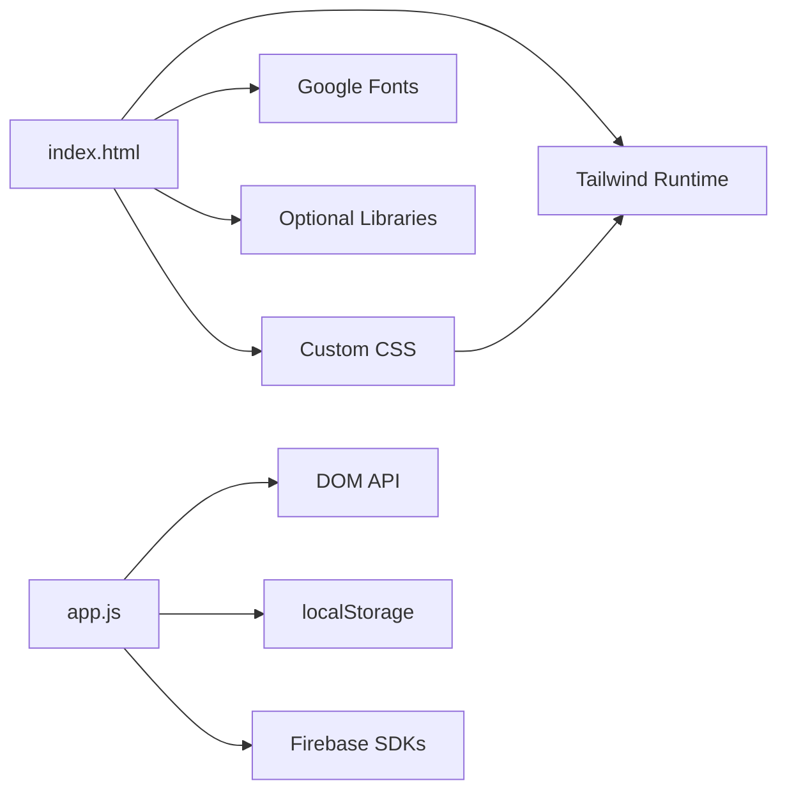

# Theme System and Styling

<cite>
**Referenced Files in This Document**
- [index.html](file://index.html)
- [app.js](file://app.js)
</cite>

## Table of Contents
1. [Introduction](#introduction)
2. [Project Structure](#project-structure)
3. [Core Components](#core-components)
4. [Architecture Overview](#architecture-overview)
5. [Detailed Component Analysis](#detailed-component-analysis)
6. [Dependency Analysis](#dependency-analysis)
7. [Performance Considerations](#performance-considerations)
8. [Troubleshooting Guide](#troubleshooting-guide)
9. [Conclusion](#conclusion)
10. [Appendices](#appendices)

## Introduction
This document explains Shadow Ledger’s theme system and styling approach, including:
- Dark/light mode toggle with persistence via localStorage
- Tailwind CSS configuration for custom colors (surface, accent, carrier, procure), typography, and animations
- Custom CSS classes for cards, inputs, buttons, badges, and toast notifications
- Print styles and mobile-first responsive patterns
- Accessibility considerations such as keyboard navigation, focus management, and modal semantics

The implementation is a single-page application using Tailwind CSS v3 via CDN and inline Tailwind configuration.

## Project Structure
Shadow Ledger’s theme and styling are primarily defined in the HTML file (Tailwind config and custom styles) and the JavaScript file (theme persistence and event binding).

**Diagram sources**
- [index.html:57-84](file://index.html#L57-L84)
- [index.html:94-331](file://index.html#L94-L331)
- [app.js:406-416](file://app.js#L406-L416)
- [app.js:1869-1870](file://app.js#L1869-L1870)

**Section sources**
- [index.html:57-84](file://index.html#L57-L84)
- [index.html:94-331](file://index.html#L94-L331)
- [app.js:406-416](file://app.js#L406-L416)
- [app.js:1869-1870](file://app.js#L1869-L1870)

## Core Components
- Tailwind configuration block defines dark mode strategy, custom color tokens, typography, keyframes, and animation utilities.
- Custom CSS layer provides reusable component classes (cards, inputs, buttons, badges, toasts, modals, row indicators, etc.).
- Theme persistence logic reads/writes localStorage and toggles the root class used by Tailwind’s dark mode.
- Event binding wires the theme toggle button to the persistence logic.

Key responsibilities:
- index.html: Tailwind config, custom CSS, and UI elements that use theme-aware classes.
- app.js: Theme initialization, toggle behavior, and event binding.

**Section sources**
- [index.html:57-84](file://index.html#L57-L84)
- [index.html:94-331](file://index.html#L94-L331)
- [app.js:406-416](file://app.js#L406-L416)
- [app.js:1869-1870](file://app.js#L1869-L1870)

## Architecture Overview
The theme system follows a simple class-based architecture:
- The root element carries either no class or the “dark” class.
- Tailwind’s darkMode set to “class” applies dark variants when the class is present.
- On load, the app checks localStorage and sets the appropriate class.
- Toggling updates both the DOM and localStorage.

**Diagram sources**
- [index.html:385-389](file://index.html#L385-L389)
- [app.js:413-416](file://app.js#L413-L416)
- [app.js:1869-1870](file://app.js#L1869-L1870)

## Detailed Component Analysis

### Tailwind Configuration
- Dark mode strategy: class-based.
- Typography: sans font family extended to Inter with system fallbacks.
- Colors:
  - surface: light and dark scales for backgrounds and surfaces.
  - accent: primary brand color with light/dark variants.
  - carrier: alert color for carrier-related items.
  - procure: alert color for procurement-related items.
- Animations: fade-in, slide-up, pulse-ring, shake; mapped to named animation utilities.

These settings enable consistent theming across components and allow dark-mode variants throughout the UI.

**Section sources**
- [index.html:57-84](file://index.html#L57-L84)

### Custom CSS Classes
Reusable component classes include:
- Card: rounded container with borders and shadows, with dark-mode variants.
- Input fields: consistent padding, border, background, and focus ring styles.
- Buttons: primary (accent gradient) and secondary (outlined) variants with hover/active states.
- Badges: compact status labels with semantic color variants.
- Toasts: transient feedback messages with success/error/info variants.
- Modals: overlay and content containers with backdrop blur and entrance animation.
- Row indicators: left-border highlights for carrier/procurement alerts.
- Gauge bar: small progress indicator for capacity usage.
- Import tabs: tabbed interface for import formats.

These classes leverage Tailwind’s @apply directive and integrate with dark-mode variants.

**Section sources**
- [index.html:94-331](file://index.html#L94-L331)

### Theme Persistence Mechanism
- Initialization:
  - On app start, read the saved theme from localStorage and ensure the root element has the correct class.
- Toggle:
  - On user action, toggle the root class and persist the new preference to localStorage.
- Default behavior:
  - If no preference is found, the default is dark mode (root starts with the dark class).

Note: There is no explicit detection of system preference (e.g., prefers-color-scheme). The app defaults to dark if no stored preference exists.

**Diagram sources**
- [app.js:406-416](file://app.js#L406-L416)
- [index.html:2](file://index.html#L2)

**Section sources**
- [app.js:406-416](file://app.js#L406-L416)
- [index.html:2](file://index.html#L2)

### Theme Toggle Interaction
- The header includes a theme toggle button with sun/moon icons that swap visibility based on the presence of the dark class.
- The click handler calls the toggle function which updates the DOM and persists the choice.

**Diagram sources**
- [index.html:385-389](file://index.html#L385-L389)
- [app.js:413-416](file://app.js#L413-L416)
- [app.js:1869-1870](file://app.js#L1869-L1870)

**Section sources**
- [index.html:385-389](file://index.html#L385-L389)
- [app.js:413-416](file://app.js#L413-L416)
- [app.js:1869-1870](file://app.js#L1869-L1870)

### Responsive Design Patterns
- Mobile-first layout uses Tailwind’s responsive prefixes (sm:, md:, lg:) to progressively enhance layouts.
- Examples include grid columns, hidden/visible columns, and spacing adjustments.
- A media query ensures action buttons remain visible on smaller screens.

**Section sources**
- [index.html:394-567](file://index.html#L394-L567)
- [index.html:239-244](file://index.html#L239-L244)

### Print Styles
- Global print rules hide non-printable UI elements and reset colors for readability.
- Label printing:
  - Adds a body class to isolate label output.
  - Uses a dedicated container for labels and supports an A4 landscape grid layout.
  - Applies page size and margins for label sheets.

**Section sources**
- [index.html:246-331](file://index.html#L246-L331)

### Accessibility Considerations
- Keyboard accessibility:
  - Dashboard cards have role="button" and tabindex="0", with Enter/Space handlers to open details.
  - Inline editing supports Enter to move between fields and Tab to navigate naturally.
  - Focus management selects text on input focus for efficient editing.
- Modal semantics:
  - Modals use role="dialog" and aria-modal="true".
  - Escape key closes active modals.
- Focus rings and outlines:
  - Inputs and interactive elements define focus rings and outline styles for visibility.

**Section sources**
- [index.html:422-444](file://index.html#L422-L444)
- [index.html:571-708](file://index.html#L571-L708)
- [app.js:2144-2156](file://app.js#L2144-L2156)
- [app.js:1989-2011](file://app.js#L1989-L2011)
- [app.js:2090-2100](file://app.js#L2090-L2100)

## Dependency Analysis
- index.html depends on:
  - Tailwind CSS runtime (CDN)
  - Google Fonts (Inter)
  - Optional libraries (SheetJS, QRCode, jsQR)
- app.js depends on:
  - DOM APIs and localStorage
  - Firebase SDKs (auth, firestore) for data operations
- Styling dependencies:
  - Tailwind utility classes and @apply directives
  - Custom CSS built atop Tailwind’s design tokens

**Diagram sources**
- [index.html:45-92](file://index.html#L45-L92)
- [index.html:94-331](file://index.html#L94-L331)
- [app.js:406-416](file://app.js#L406-L416)

**Section sources**
- [index.html:45-92](file://index.html#L45-L92)
- [index.html:94-331](file://index.html#L94-L331)
- [app.js:406-416](file://app.js#L406-L416)

## Performance Considerations
- Using Tailwind via CDN avoids build steps but may increase initial payload; preconnect hints are already configured for external origins.
- Custom CSS leverages @apply to keep styles concise and maintainable.
- Avoid excessive reflows during theme transitions by relying on CSS transitions and class toggles rather than heavy DOM manipulation.

[No sources needed since this section provides general guidance]

## Troubleshooting Guide
- Theme not persisting:
  - Ensure localStorage is available and not blocked by browser policies.
  - Verify the root element has the expected class after load.
- Dark mode not applying:
  - Confirm Tailwind’s darkMode is set to “class”.
  - Check that all components use dark: variants where needed.
- Print layout issues:
  - Ensure the printing-label class is applied before invoking window.print().
  - Validate that print-specific CSS hides unwanted elements and formats labels correctly.

**Section sources**
- [app.js:406-416](file://app.js#L406-L416)
- [index.html:57-84](file://index.html#L57-L84)
- [index.html:246-331](file://index.html#L246-L331)

## Conclusion
Shadow Ledger’s theme system is straightforward and effective:
- Class-based dark mode with Tailwind enables consistent theming across components.
- Custom color tokens and typography provide a cohesive visual identity.
- localStorage persistence ensures user preferences survive reloads.
- Custom CSS layers deliver reusable components and smooth interactions.
- Print styles and responsive utilities support practical workflows.
- Accessibility features improve usability for keyboard users and screen readers.

[No sources needed since this section summarizes without analyzing specific files]

## Appendices

### Custom Color Palette Summary
- surface: light and dark scales for backgrounds and surfaces.
- accent: primary brand color with light/dark variants.
- carrier: red-based alert color for carrier transfers.
- procure: amber-based alert color for procurement needs.

**Section sources**
- [index.html:63-68](file://index.html#L63-L68)

### Animation Definitions Summary
- fade-in: subtle opacity and vertical translation entrance.
- slide-up: larger vertical entrance for sections.
- pulse-ring: pulsing ring effect for alert indicators.
- shake: horizontal shake for emphasis.

**Section sources**
- [index.html:69-80](file://index.html#L69-L80)