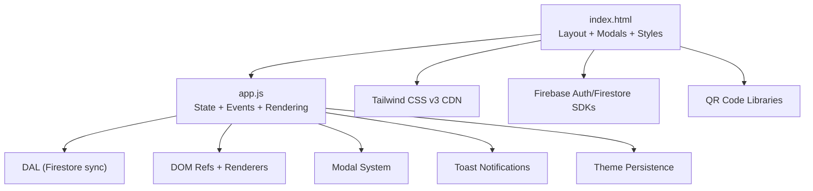
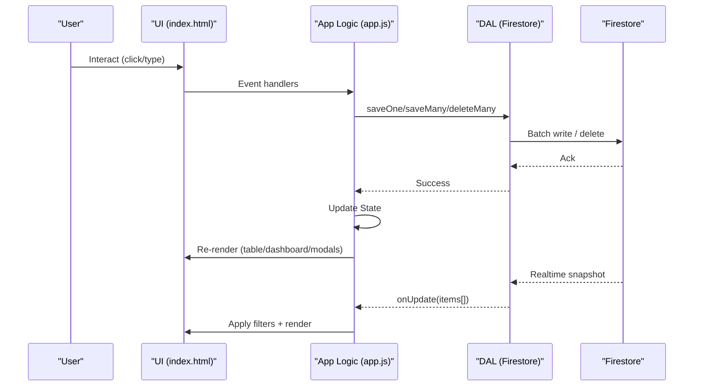
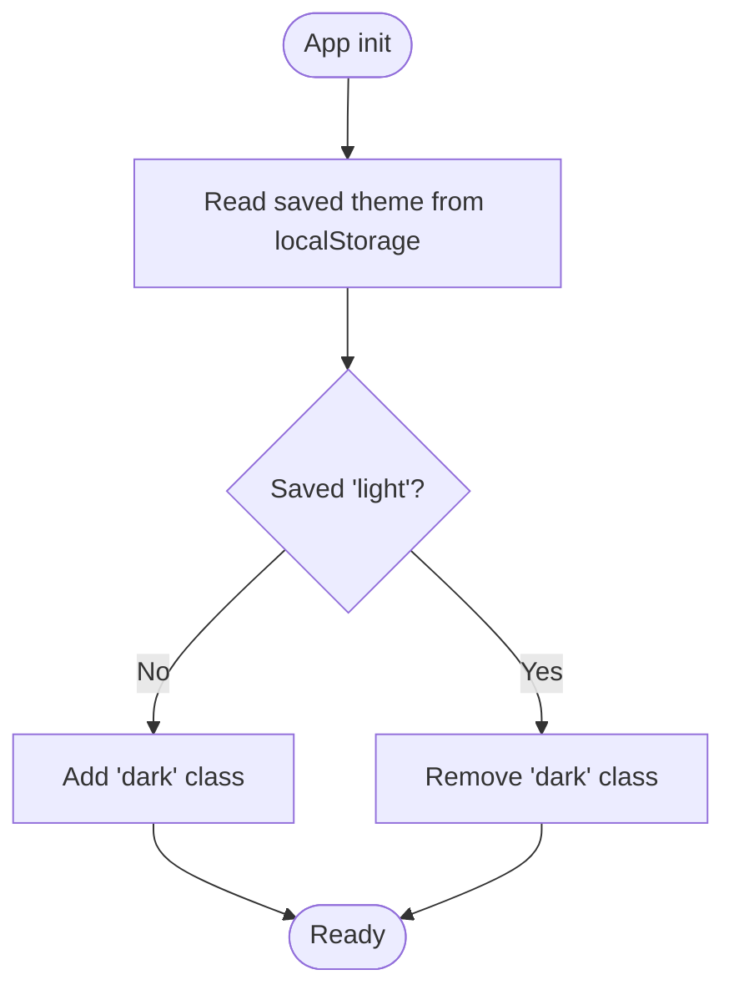
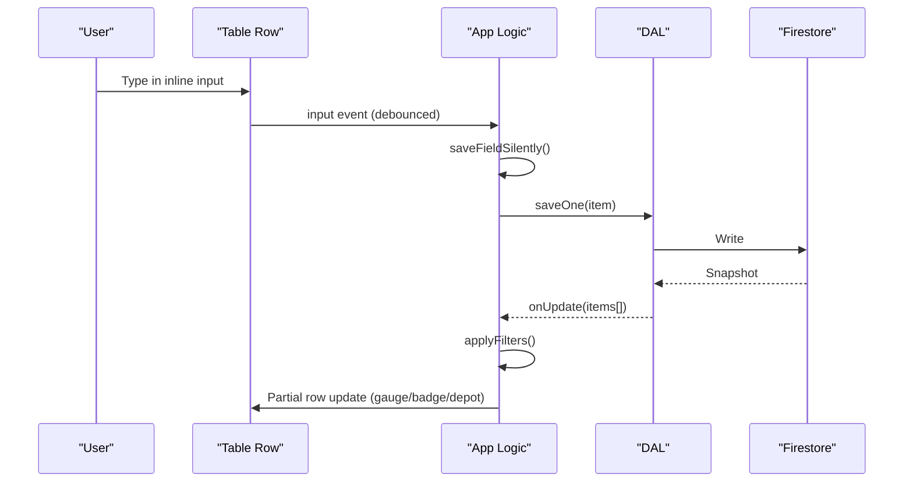
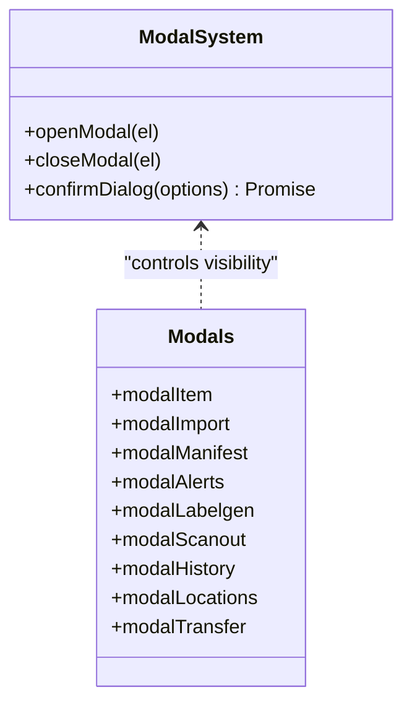
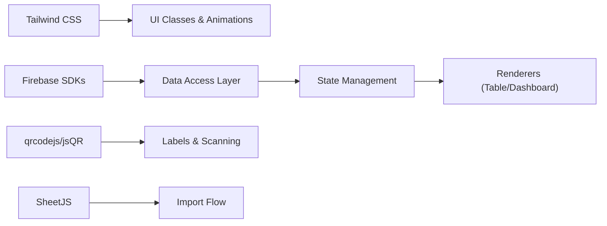

# User Interface Components

<cite>
**Referenced Files in This Document**
- [index.html](file://index.html)
- [app.js](file://app.js)
- [README.md](file://README.md)
- [manifest.json](file://manifest.json)
</cite>

## Table of Contents
1. [Introduction](#introduction)
2. [Project Structure](#project-structure)
3. [Core Components](#core-components)
4. [Architecture Overview](#architecture-overview)
5. [Detailed Component Analysis](#detailed-component-analysis)
6. [Dependency Analysis](#dependency-analysis)
7. [Performance Considerations](#performance-considerations)
8. [Troubleshooting Guide](#troubleshooting-guide)
9. [Conclusion](#conclusion)
10. [Appendices](#appendices)

## Introduction
This document explains Shadow Ledger’s user interface components and design patterns with a focus on warehouse-friendly workflows. It covers the responsive, mobile-first approach using Tailwind CSS; the theme system for dark/light mode with persistence; key UI components (dashboard, inventory table with inline editing, modal system, notifications); accessibility features including keyboard navigation and ARIA attributes; cross-browser considerations; performance optimizations; and guidelines to extend the UI with new components.

## Project Structure
The application is a single-page web app composed of:
- index.html: Shell, layout, modals, styles, and CDN imports
- app.js: Application logic, state management, event bindings, rendering, and integrations
- manifest.json: PWA metadata and shortcuts
- README.md: Feature overview and quick start

**Diagram sources**
- [index.html:45-92](file://index.html#L45-L92)
- [app.js:32-132](file://app.js#L32-L132)
- [app.js:134-196](file://app.js#L134-L196)
- [app.js:200-266](file://app.js#L200-L266)

**Section sources**
- [index.html:1-1220](file://index.html#L1-L1220)
- [app.js:1-2699](file://app.js#L1-L2699)
- [manifest.json:1-50](file://manifest.json#L1-L50)
- [README.md:1-32](file://README.md#L1-L32)

## Core Components
- Dashboard cards: Real-time counts and quick lists for carrier and procurement alerts
- Inventory table: Searchable, sortable, paginated, with inline editable fields and ±1 controls
- Modal system: Add/Edit item, Import data, Manifest, Alerts detail, Label generator, Scan-out, History, Locations, Transfer
- Notification system: Toast messages for success/info/error feedback
- Theme system: Dark/light toggle persisted via localStorage
- Accessibility: Keyboard navigation, ARIA roles/attributes, screen-reader friendly labels
- Cross-browser: Tailwind via CDN, CSP, print styles, PWA support

**Section sources**
- [index.html:307-541](file://index.html#L307-L541)
- [index.html:543-1220](file://index.html#L543-L1220)
- [app.js:622-661](file://app.js#L622-L661)
- [app.js:499-617](file://app.js#L499-L617)
- [app.js:2608-2616](file://app.js#L2608-L2616)
- [app.js:407-416](file://app.js#L407-L416)

## Architecture Overview
Shadow Ledger uses a thin client architecture:
- The browser loads Tailwind CSS and Firebase SDKs from CDNs
- On auth success, Firestore real-time listeners update local State
- UI re-renders based on State changes
- All writes go through a Data Access Layer (DAL) that batches operations and logs transactions

**Diagram sources**
- [app.js:200-266](file://app.js#L200-L266)
- [app.js:32-132](file://app.js#L32-L132)
- [app.js:452-494](file://app.js#L452-L494)
- [app.js:499-527](file://app.js#L499-L527)

## Detailed Component Analysis

### Responsive Design with Tailwind CSS (Mobile-First)
- Mobile-first grid and spacing utilities are used throughout the layout
- Breakpoints hide/show columns and actions for better small-screen ergonomics
- Sticky header, scrollable tables, and touch-friendly buttons improve usability in warehouses

Key implementation highlights:
- Grid layouts adapt from single column on mobile to multi-column on larger screens
- Action buttons always visible on smaller viewports
- Print styles hide non-essential UI and format shelf labels for label printers

**Section sources**
- [index.html:370-474](file://index.html#L370-L474)
- [index.html:497-541](file://index.html#L497-L541)
- [index.html:239-273](file://index.html#L239-L273)

### Theme System (Dark/Light Mode)
- Uses Tailwind’s class-based dark mode
- Default class set on html element; toggled by button click
- Preference persisted in localStorage and restored on load

**Diagram sources**
- [index.html:58-83](file://index.html#L58-L83)
- [app.js:407-416](file://app.js#L407-L416)

**Section sources**
- [index.html:58-83](file://index.html#L58-L83)
- [app.js:407-416](file://app.js#L407-L416)

### Dashboard with Real-Time Statistics
- Displays total items, categories, total units, and alert counts
- Quick lists show top items needing carrier transfer or procurement
- Pulse indicators highlight active alerts

Implementation notes:
- Computed helpers calculate alerts and totals
- Real-time updates come from Firestore snapshots
- Category filter merges predefined options with custom categories

**Section sources**
- [index.html:369-428](file://index.html#L369-L428)
- [app.js:622-661](file://app.js#L622-L661)
- [app.js:425-447](file://app.js#L425-L447)
- [app.js:663-692](file://app.js#L663-L692)

### Inventory Table: Searchable, Sortable, Inline Editing
- Columns include SKU, name, category, stock metrics, triggers, and actions
- Sorting by clicking headers; filtering by search text, category, alert type, and stock status
- Inline numeric inputs debounce saves to preserve focus and cursor position
- ±1 buttons adjust building stock quickly
- Row-level actions: print label, transfer stock, edit, delete
- Pagination reduces DOM size for large datasets

Keyboard and UX enhancements:
- Enter moves focus to next input in row
- Tab order works naturally
- Focus selects content for easy overwrite
- Barcode scanner integration focuses the correct field after matching SKU

**Diagram sources**
- [app.js:1968-2010](file://app.js#L1968-L2010)
- [app.js:699-771](file://app.js#L699-L771)
- [app.js:452-494](file://app.js#L452-L494)
- [app.js:499-527](file://app.js#L499-L527)

**Section sources**
- [index.html:497-541](file://index.html#L497-L541)
- [app.js:499-617](file://app.js#L499-L617)
- [app.js:699-771](file://app.js#L699-L771)
- [app.js:1968-2010](file://app.js#L1968-L2010)
- [app.js:2157-2206](file://app.js#L2157-L2206)

### Modal System for Complex Workflows
Modals provide focused workflows:
- Add/Edit Item: Form with validation and save flow
- Import Data: Multi-format import with mapping and preview
- Carrier Manifest: Generate printable/copyable manifest
- Alert Details: Drill-down into low-stock or procurement needs
- Label Generator: Configure sizes, logo, QR source, and print
- Scan Out: Camera-based QR decode or manual SKU entry to decrement stock
- Transaction History: Read-only list of recent movements
- Locations Manager: CRUD for stock locations
- Transfer Stock: Move quantities between locations

Accessibility and behavior:
- role="dialog" and aria-modal="true" on overlays
- Escape closes modals
- Overlay click closes modals
- Body overflow hidden when modal open

**Diagram sources**
- [app.js:876-877](file://app.js#L876-L877)
- [app.js:2618-2659](file://app.js#L2618-L2659)
- [index.html:543-1220](file://index.html#L543-L1220)

**Section sources**
- [index.html:543-1220](file://index.html#L543-L1220)
- [app.js:876-877](file://app.js#L876-L877)
- [app.js:2618-2659](file://app.js#L2618-L2659)

### Notification System (Toasts)
- Non-blocking messages appear bottom-right
- Types: success, error, info
- Auto-dismiss with fade-out animation

Usage examples across flows:
- Save/import/export confirmations
- Error feedback for permission/network issues
- Barcode scan results

**Section sources**
- [index.html:856-857](file://index.html#L856-L857)
- [app.js:2608-2616](file://app.js#L2608-L2616)

### Accessibility Features
- Keyboard navigation:
  - Dashboard cards respond to Enter/Space
  - Table inline inputs navigate with Enter and Tab
  - Global barcode buffer supports hands-free scanning
- ARIA attributes:
  - Dialogs use role="dialog" and aria-modal="true"
  - Buttons have descriptive titles
- Screen reader compatibility:
  - Semantic headings and labels
  - Clear status messages via toasts

**Section sources**
- [index.html:396-427](file://index.html#L396-L427)
- [index.html:842-854](file://index.html#L842-L854)
- [app.js:2144-2155](file://app.js#L2144-L2155)
- [app.js:1989-2010](file://app.js#L1989-L2010)
- [app.js:2157-2206](file://app.js#L2157-L2206)

### Cross-Browser Compatibility Considerations
- Tailwind CSS loaded via CDN for consistent utility classes
- Content Security Policy restricts external resources to known origins
- Print styles ensure reliable output for manifests and shelf labels
- PWA manifest defines icons, shortcuts, and display mode

**Section sources**
- [index.html:19-43](file://index.html#L19-L43)
- [index.html:246-304](file://index.html#L246-L304)
- [manifest.json:1-50](file://manifest.json#L1-L50)

## Dependency Analysis
External dependencies and their roles:
- Tailwind CSS v3 CDN: Utility-first styling and dark mode
- Firebase Auth/Firestore SDKs: Authentication and real-time data sync
- QR libraries: qrcodejs for generating QR codes; jsQR for decoding camera frames
- SheetJS: Excel import/export support

Internal module relationships:
- DAL abstracts Firestore reads/writes and batching
- State centralizes UI state and computed values
- Event bindings wire UI interactions to app logic

**Diagram sources**
- [index.html:45-92](file://index.html#L45-L92)
- [app.js:32-132](file://app.js#L32-L132)
- [app.js:1642-1708](file://app.js#L1642-L1708)

**Section sources**
- [index.html:45-92](file://index.html#L45-L92)
- [app.js:32-132](file://app.js#L32-L132)
- [app.js:1642-1708](file://app.js#L1642-L1708)

## Performance Considerations
- Debounced input handling for inline edits and search to reduce re-renders and network calls
- Pagination limits DOM nodes per page for large inventories
- Partial row updates avoid full table re-render during inline edits
- Preconnect hints for external CDNs reduce first-load latency
- Efficient batch writes for bulk operations
- Minimal DOM manipulation via targeted updates (e.g., gauge bars, badges)

[No sources needed since this section provides general guidance]

## Troubleshooting Guide
Common issues and resolutions:
- Permission denied errors: Check Firestore rules and authentication state
- Network unavailability: Offline indicator shows status; changes sync when reconnected
- Google sign-in blocked: Allow popups and authorize domain in Firebase Console
- Import failures: Validate file format and headers; use mapping UI to align columns
- QR generation/printing: Ensure QR libraries loaded; allow time for canvas rasterization before printing

**Section sources**
- [app.js:228-239](file://app.js#L228-L239)
- [app.js:2662-2677](file://app.js#L2662-L2677)
- [app.js:1699-1708](file://app.js#L1699-L1708)
- [app.js:1061-1073](file://app.js#L1061-L1073)

## Conclusion
Shadow Ledger’s UI combines a mobile-first, accessible design with robust warehouse workflows. Tailwind CSS powers responsive layouts and theming, while a clear component model (dashboard, table, modals, toasts) keeps the codebase maintainable. Real-time data sync, efficient rendering, and thoughtful keyboard/scan support make it suitable for fast-paced environments. Extending the UI follows established patterns: add markup, bind events, update State, and re-render selectively.

[No sources needed since this section summarizes without analyzing specific files]

## Appendices

### Guidelines for Extending the UI
- Add new components:
  - Create semantic HTML elements in index.html with appropriate ARIA roles
  - Wire up event handlers in app.js within bindEvents
  - Update State and compute derived values as needed
  - Re-render only affected parts to keep performance high
- Follow existing patterns:
  - Use Tailwind utility classes consistently
  - Persist preferences in localStorage if needed
  - Provide keyboard and screen reader support
  - Use toasts for feedback and confirmDialog for destructive actions

[No sources needed since this section provides general guidance]